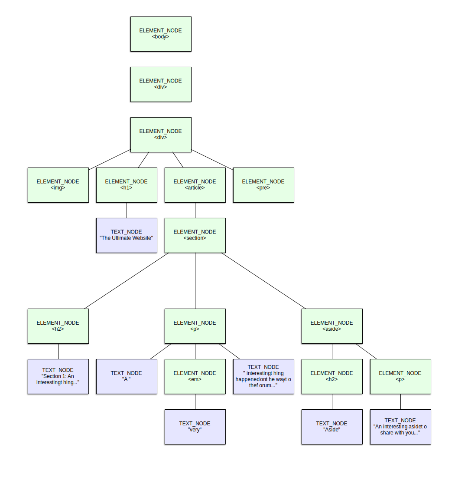
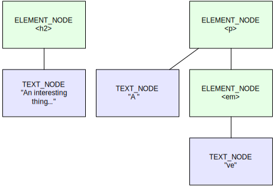

{{APIRef("DOM")}}

Giao diện trừu tượng **`AbstractRange`** là lớp cơ sở mà trên đó mọi kiểu phạm vi {{Glossary("DOM")}} đều được định nghĩa. **Phạm vi** là một đối tượng cho biết điểm bắt đầu và kết thúc của một phần nội dung trong tài liệu.

> [!NOTE]
> Vì là một giao diện trừu tượng, bạn sẽ không trực tiếp khởi tạo một đối tượng kiểu `AbstractRange`. Thay vào đó, bạn sẽ dùng các giao diện {{domxref("Range")}} hoặc {{domxref("StaticRange")}}. Để hiểu sự khác nhau giữa hai giao diện này và cách chọn giao diện phù hợp với nhu cầu của mình, hãy xem tài liệu của từng giao diện.

{{InheritanceDiagram}}

## Thuộc tính thể hiện

- {{domxref("AbstractRange.collapsed", "collapsed")}} {{ReadOnlyInline}}
  - : Một giá trị Boolean có giá trị `true` nếu phạm vi đang ở trạng thái _thu gọn_ (_collapsed_). Phạm vi thu gọn là phạm vi có vị trí bắt đầu và kết thúc trùng nhau, tạo thành một phạm vi dài 0 ký tự.
- {{domxref("AbstractRange.endContainer", "endContainer")}} {{ReadOnlyInline}}
  - : Đối tượng {{domxref("Node")}} chứa điểm kết thúc của phạm vi, như được chỉ định bởi thuộc tính `endOffset`.
- {{domxref("AbstractRange.endOffset", "endOffset")}} {{ReadOnlyInline}}
  - : Một giá trị số nguyên cho biết độ lệch, tính theo ký tự, từ đầu nội dung của nút đến ký tự cuối cùng của phạm vi mà đối tượng phạm vi biểu diễn. Giá trị này phải nhỏ hơn độ dài của nút `endContainer`.
- {{domxref("AbstractRange.startContainer", "startContainer")}} {{ReadOnlyInline}}
  - : {{domxref("Node")}} DOM chứa điểm bắt đầu của phạm vi, như được chỉ định bởi thuộc tính `startOffset`.
- {{domxref("AbstractRange.startOffset", "startOffset")}} {{ReadOnlyInline}}
  - : Một giá trị số nguyên cho biết độ lệch, tính theo ký tự, từ đầu nội dung của nút đến ký tự đầu tiên của nội dung mà đối tượng phạm vi tham chiếu tới. Giá trị này phải nhỏ hơn độ dài của nút được chỉ ra trong `startContainer`.

## Phương thức thể hiện

_Giao diện `AbstractRange` không cung cấp phương thức nào._

## Ghi chú sử dụng

### Các kiểu phạm vi

Mọi phạm vi nội dung trong một {{domxref("Document", "tài liệu")}} đều được mô tả bằng các thể hiện của những giao diện dựa trên `AbstractRange`. Có hai giao diện như vậy:

- {{domxref("Range")}}
  - : Giao diện `Range` đã tồn tại từ lâu và chỉ mới gần đây được định nghĩa lại để dựa trên `AbstractRange`, khi xuất hiện nhu cầu mô tả các dạng dữ liệu phạm vi khác. `Range` cung cấp các phương thức cho phép bạn thay đổi các đầu mút của phạm vi, cũng như các phương thức để so sánh phạm vi, phát hiện giao cắt giữa các phạm vi, v.v.
- {{domxref("StaticRange")}}
  - : `StaticRange` là một phạm vi cơ bản không thể thay đổi sau khi đã được tạo. Cụ thể, khi cây nút thay đổi và biến đổi, phạm vi này cũng không đổi. Điều này hữu ích khi bạn chỉ cần chỉ định một phạm vi để dùng một lần, vì nó tránh được chi phí hiệu năng và tài nguyên của giao diện {{domxref("Range")}} phức tạp hơn.

### Nội dung của phần tử

Khi cố truy cập nội dung của một phần tử, hãy nhớ rằng bản thân phần tử là một nút, nhưng mọi văn bản bên trong nó cũng vậy. Để đặt một đầu mút phạm vi bên trong phần văn bản của một phần tử, hãy chắc chắn rằng bạn tìm đúng nút văn bản bên trong phần tử đó:

```js
const startElem = document.querySelector("p");
const endElem = startElem.querySelector("span");
const range = document.createRange();

range.setStart(startElem, 0);
range.setEnd(endElem, endElem.childNodes[0].length / 2);
const contents = range.cloneContents();

document.body.appendChild(contents);
```

Ví dụ này tạo một phạm vi mới là `range`, rồi đặt điểm bắt đầu của nó tại nút con thứ ba của phần tử đầu tiên. Điểm kết thúc được đặt vào giữa nút con đầu tiên của phần tử `span`, sau đó phạm vi được dùng để sao chép phần nội dung đó.

### Phạm vi và cấu trúc phân cấp của DOM

Để định nghĩa một phạm vi ký tự trong tài liệu theo cách có thể trải qua 0 hoặc nhiều ranh giới nút và chịu được thay đổi của DOM tốt nhất có thể, bạn không thể chỉ định độ lệch tới ký tự đầu tiên và cuối cùng trong {{Glossary("HTML")}}. Có một vài lý do chính đáng cho điều đó.

Thứ nhất, sau khi trang được tải, trình duyệt không còn suy nghĩ theo HTML nữa. Khi đã tải xong, trang trở thành một cây các đối tượng {{domxref("Node")}} DOM, vì vậy bạn cần chỉ định vị trí bắt đầu và kết thúc của một phạm vi theo các nút và các vị trí bên trong nút.

Thứ hai, để hỗ trợ tốt nhất khả năng thay đổi của cây DOM, bạn cần một cách biểu diễn các vị trí tương đối với các nút trong cây thay vì các vị trí toàn cục trong toàn bộ tài liệu. Bằng cách định nghĩa các điểm trong tài liệu là các độ lệch bên trong một nút nhất định, các vị trí đó sẽ nhất quán hơn với nội dung ngay cả khi các nút được thêm vào, xóa đi hoặc di chuyển trong cây DOM, trong giới hạn hợp lý. Tất nhiên vẫn có những giới hạn rõ ràng, chẳng hạn khi một nút bị chuyển ra sau điểm cuối của phạm vi hoặc khi nội dung của một nút bị thay đổi quá nhiều, nhưng cách này vẫn tốt hơn rất nhiều so với việc không làm như vậy.

Thứ ba, dùng các vị trí tương đối với nút để xác định điểm bắt đầu và kết thúc nhìn chung sẽ dễ tối ưu hiệu năng hơn. Thay vì phải duyệt DOM để tìm xem độ lệch toàn cục của bạn đang chỉ tới đâu, {{Glossary("user agent")}} (trình duyệt) có thể đi thẳng tới nút được chỉ định bởi vị trí bắt đầu rồi làm việc từ đó cho tới khi chạm đến độ lệch đã cho trong nút kết thúc.

Để minh họa, hãy xét đoạn HTML dưới đây:

```html
<div class="container">
  <div class="header">
    
    <h1>The Ultimate Website</h1>
  </div>
  <article>
    <section class="entry" id="entry1">
      <h2>Section 1: An interesting thing…</h2>
      <p>A <em>very</em> interesting thing happened on the way to the forum…</p>
      <aside class="callout">
        <h2>Aside</h2>
        <p>An interesting aside to share with you…</p>
      </aside>
    </section>
  </article>
  <pre id="log"></pre>
</div>
```

Sau khi tải HTML và xây dựng biểu diễn DOM của tài liệu, cây DOM thu được sẽ trông như sau:



Trong sơ đồ này, các nút biểu diễn phần tử HTML được hiển thị bằng màu xanh lá. Mỗi hàng bên dưới chúng thể hiện lớp sâu tiếp theo của cây DOM. Các nút màu xanh dương là nút văn bản, chứa phần chữ được hiển thị trên màn hình. Nội dung của mỗi phần tử được liên kết phía dưới nó trong cây và có thể tạo ra thêm nhiều nhánh khi phần tử chứa các phần tử hoặc văn bản khác.

Nếu bạn muốn tạo một phạm vi bao gồm nội dung của phần tử {{HTMLElement("p")}} có nội dung là `"A <em>very</em> interesting thing happened on the way to the forum…"`, bạn có thể làm như sau:

```js
const pRange = document.createRange();
pRange.selectNodeContents(document.querySelector("#entry1 p"));
```

Vì ta muốn chọn toàn bộ nội dung của phần tử `<p>`, bao gồm cả các phần tử hậu duệ của nó, đoạn mã này hoạt động hoàn hảo.

Nếu thay vào đó bạn muốn sao chép phần văn bản `"An interesting thing…"` từ tiêu đề của phần tử {{HTMLElement("section")}} (một phần tử {{HTMLElement("Heading_Elements", "h2")}}) cho tới hết hai chữ cái `"ve"` trong phần tử {{HTMLElement("em")}} của đoạn văn phía dưới, thì đoạn mã sau sẽ hoạt động:

```js
const range = document.createRange();
const startNode = document.querySelector("section h2").childNodes[0];
range.setStart(startNode, 11);

const endNode = document.querySelector("#entry1 p em").childNodes[0];
range.setEnd(endNode, 2);

const fragment = range.cloneContents();
```

Ở đây nảy sinh một vấn đề thú vị: ta đang lấy nội dung từ nhiều nút nằm ở các mức khác nhau trong cấu trúc phân cấp DOM, rồi chỉ lấy một phần của một trong số chúng. Vậy kết quả sẽ trông như thế nào?

Hóa ra đặc tả DOM có đề cập chính xác tới trường hợp này. Ví dụ trong trường hợp trên, ta gọi {{domxref("Range.cloneContents", "cloneContents()")}} trên phạm vi để tạo một đối tượng {{domxref("DocumentFragment")}} mới, cung cấp một cây con DOM sao chép lại nội dung của phạm vi đã chỉ định. Để làm được việc này, `cloneContents()` tạo ra tất cả các nút cần thiết để giữ lại cấu trúc của phạm vi đã chỉ ra, nhưng không tạo nhiều hơn mức cần thiết.

Trong ví dụ này, điểm bắt đầu của phạm vi nằm bên trong nút văn bản dưới tiêu đề của phần, vì vậy `DocumentFragment` mới sẽ cần chứa một phần tử {{HTMLElement("Heading_Elements", "h2")}} và bên dưới nó là một nút văn bản.

Điểm kết thúc của phạm vi nằm bên dưới phần tử {{HTMLElement("p")}}, vì vậy phần tử đó cũng cần có mặt trong mảnh mới. Nút văn bản chứa từ `"A"` cũng vậy, vì nó nằm trong phạm vi. Cuối cùng, một phần tử `<em>` và một nút văn bản bên dưới nó cũng sẽ được thêm vào dưới phần tử `<p>`.

Nội dung của các nút văn bản sau đó được xác định bởi các độ lệch vào những nút văn bản đó được truyền khi gọi {{domxref("Range.setStart", "setStart()")}} và {{domxref("Range.setEnd", "setEnd()")}}. Với độ lệch là `11` vào văn bản của tiêu đề, nút đó sẽ chứa `"An interesting thing…"`. Tương tự, nút văn bản cuối cùng sẽ chứa `"ve"`, theo yêu cầu lấy hai ký tự đầu tiên của nút kết thúc.

Mảnh tài liệu thu được trông như sau:



Hãy đặc biệt lưu ý rằng toàn bộ nội dung của mảnh này đều nằm _bên dưới_ nút cha chung của các nút nằm cao nhất trong nó. Phần tử cha `<section>` không cần thiết để tái tạo phần nội dung đã sao chép, nên nó không được đưa vào.

## Ví dụ

Hãy xét mảnh HTML đơn giản sau.

```html
<p><strong>This</strong> is a paragraph.</p>
```

Hãy tưởng tượng dùng một đối tượng {{domxref("Range")}} để trích xuất từ `"paragraph"` từ đoạn này. Mã thực hiện việc đó như sau:

```js
const paraNode = document.querySelector("p");
const paraTextNode = paraNode.childNodes[1];

const range = document.createRange();
range.setStart(paraTextNode, 6);
range.setEnd(paraTextNode, paraTextNode.length - 1);

const fragment = range.cloneContents();
document.body.appendChild(fragment);
```

Trước tiên ta lấy tham chiếu tới chính nút đoạn văn cũng như nút con _thứ hai_ bên trong đoạn văn đó. Nút con đầu tiên là phần tử {{HTMLElement("strong")}}. Nút con thứ hai là nút văn bản `" is a paragraph."`.

Khi đã có tham chiếu tới nút văn bản, ta tạo một đối tượng `Range` mới bằng cách gọi {{domxref("Document.createRange", "createRange()")}} trên chính `Document`. Ta đặt vị trí bắt đầu của phạm vi tại ký tự thứ sáu trong chuỗi của nút văn bản và đặt vị trí kết thúc tại độ dài chuỗi của nút văn bản trừ đi một. Việc này khiến phạm vi bao trùm từ `"paragraph"`.

Sau đó ta hoàn tất bằng cách gọi {{domxref("Range.cloneContents", "cloneContents()")}} trên `Range` để tạo một đối tượng {{domxref("DocumentFragment")}} mới chứa phần tài liệu nằm trong phạm vi. Cuối cùng, ta dùng {{domxref("Node.appendChild", "appendChild()")}} để thêm mảnh đó vào cuối phần thân của tài liệu, lấy từ {{domxref("document.body")}}.

Kết quả trông như sau:

{{EmbedLiveSample("Example", 600, 80)}}

## Thông số kỹ thuật

{{Specifications}}

## Tương thích trình duyệt

{{Compat}}
