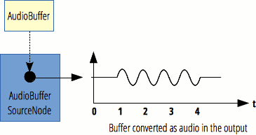

{{APIRef("Web Audio API")}}

Giao diện **`AudioBufferSourceNode`** là một {{domxref("AudioScheduledSourceNode")}} đại diện cho một nguồn âm thanh gồm dữ liệu âm thanh trong bộ nhớ, được lưu trong một {{domxref("AudioBuffer")}}.

Giao diện này đặc biệt hữu ích để phát lại âm thanh có yêu cầu rất khắt khe về độ chính xác thời điểm, chẳng hạn các âm thanh phải khớp với một nhịp điệu cụ thể và có thể được giữ trong bộ nhớ thay vì phát từ đĩa hoặc qua mạng. Để phát các âm thanh cần căn thời gian chính xác nhưng phải được truyền trực tuyến từ mạng hoặc phát từ đĩa, hãy dùng một {{domxref("AudioWorkletNode")}} để triển khai việc phát lại.

{{InheritanceDiagram}}

Một `AudioBufferSourceNode` không có đầu vào và có đúng một đầu ra, với cùng số kênh như `AudioBuffer` được chỉ định bởi thuộc tính {{domxref("AudioBufferSourceNode.buffer", "buffer")}} của nó. Nếu không có bộ đệm nào được đặt, tức là `buffer` là `null`, đầu ra sẽ chứa một kênh im lặng duy nhất (mọi mẫu đều là 0).

Một `AudioBufferSourceNode` chỉ có thể được phát một lần; sau mỗi lần gọi {{domxref("AudioBufferSourceNode.start", "start()")}}, bạn phải tạo một nút mới nếu muốn phát lại cùng âm thanh đó. May mắn là các nút này rất rẻ để tạo, và các `AudioBuffer` thực tế có thể được tái sử dụng cho nhiều lần phát cùng một âm thanh. Thật vậy, bạn có thể dùng các nút này theo kiểu "fire and forget": tạo nút, gọi `start()` để bắt đầu phát âm thanh, rồi thậm chí không cần giữ tham chiếu đến nó. Nó sẽ tự động được thu gom rác vào thời điểm thích hợp, tức là chỉ sau khi âm thanh phát xong được một lúc.

Cho phép gọi {{domxref("AudioScheduledSourceNode/stop", "stop()")}} nhiều lần. Lần gọi mới nhất sẽ thay thế lần trước đó, nếu `AudioBufferSourceNode` chưa đi tới cuối bộ đệm.



<table class="properties">
  <tbody>
    <tr>
      <th scope="row">Số lượng đầu vào</th>
      <td><code>0</code></td>
    </tr>
    <tr>
      <th scope="row">Số lượng đầu ra</th>
      <td><code>1</code></td>
    </tr>
    <tr>
      <th scope="row">Số kênh</th>
      <td>được xác định bởi {{domxref("AudioBuffer")}} liên kết</td>
    </tr>
  </tbody>
</table>

## Constructor

- {{domxref("AudioBufferSourceNode.AudioBufferSourceNode", "AudioBufferSourceNode()")}}
  - : Tạo và trả về một đối tượng `AudioBufferSourceNode` mới. Ngoài ra, bạn có thể dùng phương thức factory {{domxref("BaseAudioContext.createBufferSource()")}}; xem [Tạo một AudioNode](/en-US/docs/Web/API/AudioNode#creating_an_audionode).

## Thuộc tính thể hiện

_Kế thừa các thuộc tính từ đối tượng cha của nó, {{domxref("AudioScheduledSourceNode")}}_.

- {{domxref("AudioBufferSourceNode.buffer")}}
  - : Một {{domxref("AudioBuffer")}} xác định tài nguyên âm thanh sẽ được phát, hoặc khi được đặt thành giá trị `null`, xác định một kênh im lặng duy nhất (trong đó mọi mẫu đều là `0.0`).
- {{domxref("AudioBufferSourceNode.detune")}}
  - : Một {{domxref("AudioParam")}} [k-rate](/en-US/docs/Web/API/AudioParam#k-rate) biểu diễn độ lệch tần trong đơn vị [cent](https://en.wikipedia.org/wiki/Cent_%28music%29). Giá trị này được kết hợp với `playbackRate` để xác định tốc độ phát âm thanh. Giá trị mặc định là `0` (nghĩa là không lệch tần), và phạm vi danh định là từ -∞ đến ∞.
- {{domxref("AudioBufferSourceNode.loop")}}
  - : Một thuộc tính Boolean cho biết tài nguyên âm thanh có phải được phát lại khi chạm tới cuối {{domxref("AudioBuffer")}} hay không. Giá trị mặc định của nó là `false`.
- {{domxref("AudioBufferSourceNode.loopStart")}} {{optional_inline}}
  - : Một giá trị dấu phẩy động cho biết thời điểm, tính bằng giây, mà tại đó việc phát {{domxref("AudioBuffer")}} phải bắt đầu khi `loop` là `true`. Giá trị mặc định của nó là `0` (nghĩa là ở đầu mỗi vòng lặp, việc phát bắt đầu từ đầu bộ đệm âm thanh).
- {{domxref("AudioBufferSourceNode.loopEnd")}} {{optional_inline}}
  - : Một số dấu phẩy động cho biết thời điểm, tính bằng giây, mà tại đó việc phát {{domxref("AudioBuffer")}} dừng lại và lặp trở về thời điểm được chỉ ra bởi `loopStart`, nếu `loop` là `true`. Giá trị mặc định là `0`.
- {{domxref("AudioBufferSourceNode.playbackRate")}}
  - : Một {{domxref("AudioParam")}} [k-rate](/en-US/docs/Web/API/AudioParam#k-rate) xác định hệ số tốc độ mà tại đó tài nguyên âm thanh sẽ được phát, trong đó giá trị 1.0 là tốc độ lấy mẫu tự nhiên của âm thanh. Vì đầu ra không áp dụng hiệu chỉnh cao độ, thuộc tính này có thể được dùng để thay đổi cao độ của mẫu. Giá trị này được kết hợp với `detune` để xác định tốc độ phát cuối cùng.

## Phương thức thể hiện

_Kế thừa các phương thức từ đối tượng cha của nó, {{domxref("AudioScheduledSourceNode")}}, và ghi đè phương thức sau:_.

- {{domxref("AudioBufferSourceNode.start", "start()")}}
  - : Lên lịch phát dữ liệu âm thanh chứa trong bộ đệm, hoặc bắt đầu phát ngay lập tức. Đồng thời cũng cho phép đặt độ lệch bắt đầu và thời lượng phát.

## Ví dụ

Trong ví dụ này, chúng ta tạo một bộ đệm dài hai giây, điền nhiễu trắng vào đó, rồi phát nó bằng `AudioBufferSourceNode`. Các chú thích sẽ giải thích rõ điều gì đang diễn ra.

> [!NOTE]
> Bạn cũng có thể [chạy thử mã trực tiếp](https://mdn.github.io/webaudio-examples/audio-buffer/), hoặc [xem mã nguồn](https://github.com/mdn/webaudio-examples/blob/main/audio-buffer/index.html).

```js
const audioCtx = new AudioContext();

// Create an empty three-second stereo buffer at the sample rate of the AudioContext
const myArrayBuffer = audioCtx.createBuffer(
  2,
  audioCtx.sampleRate * 3,
  audioCtx.sampleRate,
);

// Fill the buffer with white noise;
// just random values between -1.0 and 1.0
for (let channel = 0; channel < myArrayBuffer.numberOfChannels; channel++) {
  // This gives us the actual ArrayBuffer that contains the data
  const nowBuffering = myArrayBuffer.getChannelData(channel);
  for (let i = 0; i < myArrayBuffer.length; i++) {
    // Math.random() is in [0; 1.0]
    // audio needs to be in [-1.0; 1.0]
    nowBuffering[i] = Math.random() * 2 - 1;
  }
}

// Get an AudioBufferSourceNode.
// This is the AudioNode to use when we want to play an AudioBuffer
const source = audioCtx.createBufferSource();
// set the buffer in the AudioBufferSourceNode
source.buffer = myArrayBuffer;
// connect the AudioBufferSourceNode to the
// destination so we can hear the sound
source.connect(audioCtx.destination);
// start the source playing
source.start();
```

> [!NOTE]
> Để xem ví dụ `decodeAudioData()`, hãy xem trang {{domxref("BaseAudioContext/decodeAudioData", "AudioContext.decodeAudioData()")}}.

## Thông số kỹ thuật

{{Specifications}}

## Khả năng tương thích trình duyệt

{{Compat}}

## Xem thêm

- [Sử dụng Web Audio API](/en-US/docs/Web/API/Web_Audio_API/Using_Web_Audio_API)
- [Web Audio API](/en-US/docs/Web/API/Web_Audio_API)
