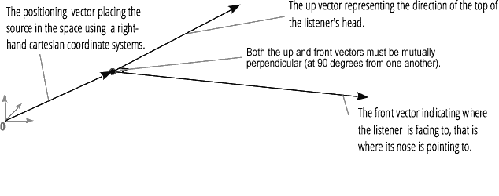

{{ APIRef("Web Audio API") }}

Giao diện `AudioListener` biểu diễn vị trí và hướng của người duy nhất đang nghe cảnh âm thanh, và được dùng trong [âm thanh không gian](/en-US/docs/Web/API/Web_Audio_API/Web_audio_spatialization_basics). Mọi {{domxref("PannerNode")}} đều định vị âm thanh theo `AudioListener` được lưu trong thuộc tính {{domxref("BaseAudioContext.listener")}}.

Cần lưu ý rằng mỗi ngữ cảnh chỉ có một listener và nó không phải là một {{domxref("AudioNode")}}.

## Thuộc tính thực thể

> [!NOTE]
> Các giá trị position, forward và up được thiết lập và truy xuất bằng các cú pháp khác nhau. Việc truy xuất được thực hiện bằng cách truy cập, ví dụ, `AudioListener.positionX`, còn việc thiết lập cùng thuộc tính đó được thực hiện bằng `AudioListener.positionX.value`. Đây là lý do các giá trị này không được đánh dấu là chỉ đọc, như cách chúng xuất hiện trong IDL của đặc tả.

- {{domxref("AudioListener.positionX")}}
  - : Biểu diễn vị trí ngang của listener trong hệ tọa độ Descartes tay phải. Giá trị mặc định là 0.
- {{domxref("AudioListener.positionY")}}
  - : Biểu diễn vị trí dọc của listener trong hệ tọa độ Descartes tay phải. Giá trị mặc định là 0.
- {{domxref("AudioListener.positionZ")}}
  - : Biểu diễn vị trí theo chiều sâu (trước và sau) của listener trong hệ tọa độ Descartes tay phải. Giá trị mặc định là 0.
- {{domxref("AudioListener.forwardX")}}
  - : Biểu diễn vị trí ngang của hướng tiến về phía trước của listener trong cùng hệ tọa độ Descartes như các giá trị vị trí (`positionX`, `positionY` và `positionZ`). Các giá trị forward và up độc lập tuyến tính với nhau. Giá trị mặc định là 0.
- {{domxref("AudioListener.forwardY")}}
  - : Biểu diễn vị trí dọc của hướng tiến về phía trước của listener trong cùng hệ tọa độ Descartes như các giá trị vị trí (`positionX`, `positionY` và `positionZ`). Các giá trị forward và up độc lập tuyến tính với nhau. Giá trị mặc định là 0.
- {{domxref("AudioListener.forwardZ")}}
  - : Biểu diễn vị trí theo chiều sâu (trước và sau) của hướng tiến về phía trước của listener trong cùng hệ tọa độ Descartes như các giá trị vị trí (`positionX`, `positionY` và `positionZ`). Các giá trị forward và up độc lập tuyến tính với nhau. Giá trị mặc định là -1.
- {{domxref("AudioListener.upX")}}
  - : Biểu diễn vị trí ngang của đỉnh đầu listener trong cùng hệ tọa độ Descartes như các giá trị vị trí (`positionX`, `positionY` và `positionZ`). Các giá trị forward và up độc lập tuyến tính với nhau. Giá trị mặc định là 0.
- {{domxref("AudioListener.upY")}}
  - : Biểu diễn vị trí dọc của đỉnh đầu listener trong cùng hệ tọa độ Descartes như các giá trị vị trí (`positionX`, `positionY` và `positionZ`). Các giá trị forward và up độc lập tuyến tính với nhau. Giá trị mặc định là 1.
- {{domxref("AudioListener.upZ")}}
  - : Biểu diễn vị trí theo chiều sâu (trước và sau) của đỉnh đầu listener trong cùng hệ tọa độ Descartes như các giá trị vị trí (`positionX`, `positionY` và `positionZ`). Các giá trị forward và up độc lập tuyến tính với nhau. Giá trị mặc định là 0.

## Phương thức thực thể

- {{domxref("AudioListener.setOrientation()")}} {{deprecated_inline}}
  - : Thiết lập hướng của listener.
- {{domxref("AudioListener.setPosition()")}} {{deprecated_inline}}
  - : Thiết lập vị trí của listener.

> [!NOTE]
> Mặc dù các phương thức này đã bị phản đối sử dụng, hiện chúng vẫn là cách duy nhất để thiết lập hướng và vị trí trong Firefox (xem [lỗi Firefox 1283029](https://bugzil.la/1283029)).

## Tính năng đã phản đối sử dụng

Các phương thức `setOrientation()` và `setPosition()` đã được thay thế bằng cách thiết lập các giá trị thuộc tính tương ứng của chúng. Ví dụ, `setPosition(x, y, z)` có thể được thực hiện bằng cách đặt lần lượt `positionX.value`, `positionY.value` và `positionZ.value`.

## Ví dụ

Xem [`BaseAudioContext.createPanner()`](/en-US/docs/Web/API/BaseAudioContext/createPanner#examples) để có mã ví dụ.

## Thông số kỹ thuật

{{Specifications}}

## Khả năng tương thích với trình duyệt

{{Compat}}

## Xem thêm

- [Sử dụng Web Audio API](/en-US/docs/Web/API/Web_Audio_API/Using_Web_Audio_API)
