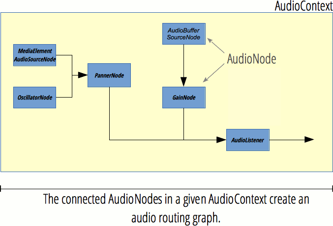

{{APIRef("Web Audio API")}}

Giao diện **`AudioNode`** là một giao diện tổng quát dùng để biểu diễn một mô-đun xử lý âm thanh.

Ví dụ bao gồm:

- một nguồn âm thanh (chẳng hạn phần tử HTML {{HTMLElement("audio")}} hoặc {{HTMLElement("video")}}, một {{domxref("OscillatorNode")}}, v.v.),
- đích âm thanh,
- mô-đun xử lý trung gian (chẳng hạn một bộ lọc như {{domxref("BiquadFilterNode")}} hoặc {{domxref("ConvolverNode")}}), hoặc
- bộ điều khiển âm lượng (như {{domxref("GainNode")}})

{{InheritanceDiagram}}

> [!NOTE]
> `AudioNode` có thể là đích của các sự kiện, do đó nó triển khai giao diện {{domxref("EventTarget")}}.

## Thuộc tính thể hiện

- {{domxref("AudioNode.context")}} {{ReadOnlyInline}}
  - : Trả về {{domxref("BaseAudioContext")}} liên kết, tức đối tượng biểu diễn đồ thị xử lý mà nút này đang tham gia.
- {{domxref("AudioNode.numberOfInputs")}} {{ReadOnlyInline}}
  - : Trả về số lượng đầu vào cấp tín hiệu cho nút. Các nút nguồn được định nghĩa là những nút có thuộc tính `numberOfInputs` bằng `0`.
- {{domxref("AudioNode.numberOfOutputs")}} {{ReadOnlyInline}}
  - : Trả về số lượng đầu ra phát ra từ nút. Các nút đích, như {{ domxref("AudioDestinationNode") }}, có giá trị `0` cho thuộc tính này.
- {{domxref("AudioNode.channelCount")}}
  - : Biểu diễn một số nguyên dùng để xác định có bao nhiêu kênh được dùng khi [up-mixing và down-mixing](/en-US/docs/Web/API/Web_Audio_API/Basic_concepts_behind_Web_Audio_API#up-mixing_and_down-mixing) các kết nối tới bất kỳ đầu vào nào của nút. Cách dùng và định nghĩa chính xác của nó phụ thuộc vào giá trị của {{domxref("AudioNode.channelCountMode")}}.
- {{domxref("AudioNode.channelCountMode")}}
  - : Biểu diễn một giá trị liệt kê mô tả cách các kênh phải được khớp giữa đầu vào và đầu ra của nút.
- {{domxref("AudioNode.channelInterpretation")}}
  - : Biểu diễn một giá trị liệt kê mô tả ý nghĩa của các kênh. Cách diễn giải này sẽ quyết định việc [up-mixing và down-mixing](/en-US/docs/Web/API/Web_Audio_API/Basic_concepts_behind_Web_Audio_API#up-mixing_and_down-mixing) âm thanh diễn ra như thế nào.
    Các giá trị có thể có là `"speakers"` hoặc `"discrete"`.

## Phương thức thể hiện

_Cũng triển khai các phương thức từ giao diện_ {{domxref("EventTarget")}}.

- {{domxref("AudioNode.connect()")}}
  - : Cho phép kết nối đầu ra của nút này để làm đầu vào cho một nút khác, dưới dạng dữ liệu âm thanh hoặc giá trị của một {{domxref("AudioParam")}}.
- {{domxref("AudioNode.disconnect()")}}
  - : Cho phép ngắt kết nối nút hiện tại khỏi một nút khác mà nó đang kết nối tới.

## Mô tả

### Đồ thị định tuyến âm thanh



Mỗi `AudioNode` có các đầu vào và đầu ra, và nhiều nút âm thanh được kết nối với nhau để xây dựng một _đồ thị xử lý_. Đồ thị này được chứa trong một {{domxref("AudioContext")}}, và mỗi nút âm thanh chỉ có thể thuộc về một audio context duy nhất.

Một _nút nguồn_ có không đầu vào nhưng có một hoặc nhiều đầu ra, và có thể dùng để tạo âm thanh. Ngược lại, một _nút đích_ không có đầu ra; thay vào đó, tất cả đầu vào của nó được phát trực tiếp ra loa (hoặc bất kỳ thiết bị đầu ra âm thanh nào mà audio context sử dụng). Ngoài ra còn có các _nút xử lý_ có cả đầu vào lẫn đầu ra. Việc xử lý chính xác được thực hiện sẽ khác nhau giữa các `AudioNode`, nhưng nhìn chung, một nút sẽ đọc đầu vào của nó, thực hiện một số xử lý liên quan đến âm thanh, rồi tạo ra giá trị mới cho các đầu ra của nó, hoặc để âm thanh đi xuyên qua (ví dụ trong {{domxref("AnalyserNode")}}, nơi kết quả xử lý được truy cập riêng biệt).

Càng có nhiều nút trong một đồ thị thì độ trễ càng cao. Ví dụ, nếu đồ thị của bạn có độ trễ 500ms, khi nút nguồn phát âm thanh thì sẽ mất nửa giây trước khi âm thanh đó có thể được nghe thấy trên loa của bạn (hoặc thậm chí lâu hơn do độ trễ của thiết bị âm thanh bên dưới). Vì vậy, nếu bạn cần âm thanh có tính tương tác, hãy giữ đồ thị nhỏ nhất có thể và đặt các nút âm thanh do người dùng điều khiển ở cuối đồ thị. Ví dụ, bộ điều khiển âm lượng (`GainNode`) nên là nút cuối cùng để thay đổi âm lượng có hiệu lực ngay lập tức.

Mỗi đầu vào và đầu ra có một số lượng _kênh_ nhất định. Ví dụ, âm thanh mono có một kênh, còn âm thanh stereo có hai kênh. Web Audio API sẽ thực hiện up-mix hoặc down-mix số lượng kênh khi cần; hãy xem đặc tả Web Audio để biết chi tiết.

Để xem danh sách tất cả các nút âm thanh, hãy xem trang chủ [Web Audio API](/en-US/docs/Web/API/Web_Audio_API).

### Tạo một `AudioNode`

Có hai cách để tạo một `AudioNode`: thông qua _hàm khởi tạo_ và thông qua _phương thức factory_.

```js
// hàm khởi tạo
const analyserNode = new AnalyserNode(audioCtx, {
  fftSize: 2048,
  maxDecibels: -25,
  minDecibels: -60,
  smoothingTimeConstant: 0.5,
});
```

```js
// phương thức factory
const analyserNode = audioCtx.createAnalyser();
analyserNode.fftSize = 2048;
analyserNode.maxDecibels = -25;
analyserNode.minDecibels = -60;
analyserNode.smoothingTimeConstant = 0.5;
```

Bạn có thể tự do dùng hàm khởi tạo hoặc phương thức factory, hoặc trộn cả hai, tuy nhiên việc dùng hàm khởi tạo có một số lợi thế:

- Mọi tham số đều có thể được đặt ngay khi khởi tạo và không cần đặt riêng lẻ từng cái.
- Bạn có thể [tạo lớp con cho một nút âm thanh](https://github.com/WebAudio/web-audio-api/issues/251). Mặc dù quá trình xử lý thực tế được trình duyệt thực hiện nội bộ và không thể thay đổi, bạn vẫn có thể viết một lớp bao quanh nút âm thanh để cung cấp các thuộc tính và phương thức tùy chỉnh.
- Hiệu năng tốt hơn một chút: Trong cả Chrome và Firefox, các phương thức factory gọi nội bộ các hàm khởi tạo.

_Lịch sử ngắn:_ Phiên bản đầu tiên của đặc tả Web Audio chỉ định nghĩa các phương thức factory. Sau một [đợt rà soát thiết kế vào tháng 10 năm 2013](https://github.com/WebAudio/web-audio-api/issues/250), người ta quyết định thêm các hàm khởi tạo vì chúng có nhiều lợi ích hơn các phương thức factory. Các hàm khởi tạo được thêm vào đặc tả từ tháng 8 đến tháng 10 năm 2016. Các phương thức factory vẫn tiếp tục có trong đặc tả và chưa bị ngừng dùng.

## Ví dụ

Đoạn mã đơn giản này cho thấy cách tạo một số nút âm thanh, cũng như cách dùng các thuộc tính và phương thức của `AudioNode`. Bạn có thể tìm thấy các ví dụ sử dụng như vậy trong bất kỳ ví dụ nào được liên kết từ trang đích [Web Audio API](/en-US/docs/Web/API/Web_Audio_API) (ví dụ [Violent Theremin](https://github.com/mdn/webaudio-examples/tree/main/violent-theremin)).

```js
const audioCtx = new AudioContext();

const oscillator = new OscillatorNode(audioCtx);
const gainNode = new GainNode(audioCtx);

oscillator.connect(gainNode).connect(audioCtx.destination);

oscillator.context;
oscillator.numberOfInputs;
oscillator.numberOfOutputs;
oscillator.channelCount;
```

## Thông số kỹ thuật

{{Specifications}}

## Tương thích trình duyệt

{{Compat}}

## Xem thêm

- [Sử dụng Web Audio API](/en-US/docs/Web/API/Web_Audio_API/Using_Web_Audio_API)
