{{securecontext_header}}{{DefaultAPISidebar("Barcode Detection API")}}{{AvailableInWorkers}}{{SeeCompatTable}}

Barcode Detection API phát hiện mã vạch tuyến tính và mã vạch hai chiều trong ảnh.

## Khái niệm và cách sử dụng

Khả năng nhận diện mã vạch trong ứng dụng web mở ra nhiều trường hợp sử dụng khác nhau thông qua các định dạng mã vạch được hỗ trợ. Mã QR có thể được dùng cho thanh toán trực tuyến, điều hướng web hoặc thiết lập kết nối mạng xã hội; mã Aztec có thể được dùng để quét thẻ lên máy bay; và các ứng dụng mua sắm có thể dùng mã vạch EAN hoặc UPC để so sánh giá của hàng hóa vật lý.

Việc phát hiện được thực hiện thông qua phương thức {{domxref('BarcodeDetector.detect()','detect()')}}, phương thức này nhận vào một đối tượng hình ảnh; đó có thể là một trong các đối tượng sau:
một {{domxref("HTMLImageElement")}},
một {{domxref("SVGImageElement")}},
một {{domxref("HTMLVideoElement")}},
một {{domxref("HTMLCanvasElement")}},
một {{domxref("ImageBitmap")}},
một {{domxref("OffscreenCanvas")}},
một {{domxref("VideoFrame")}},
một {{domxref('Blob')}},
hoặc một {{domxref('ImageData')}}.
Bạn có thể truyền các tham số tùy chọn vào hàm tạo {{domxref('BarcodeDetector')}} để gợi ý những định dạng mã vạch cần phát hiện.

### Các định dạng mã vạch được hỗ trợ

Barcode Detection API hỗ trợ các định dạng mã vạch sau:

<table class="no-markdown">
  <thead>
    <tr>
      <th>Định dạng</th>
      <th>Mô tả</th>
      <th>Hình ảnh</th>
    </tr>
  </thead>
  <tbody>
    <tr>
      <td>aztec</td>
      <td>
        Mã ma trận hai chiều hình vuông theo chuẩn iso24778, có hoa văn "mắt
        bò" hình vuông ở chính giữa nên trông giống kim tự tháp Aztec. Không
        yêu cầu vùng trống bao quanh.
      </td>
      <td>
        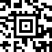
      </td>
    </tr>
    <tr>
      <td>code_128</td>
      <td>
        Mã vạch tuyến tính (một chiều), có thể giải mã theo hai hướng, tự kiểm
        tra lỗi theo chuẩn iso15417 và có thể mã hóa toàn bộ 128 ký tự của
        {{Glossary("ASCII")}} (đó là lý do có tên gọi này).
      </td>
      <td>
        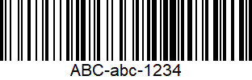
      </td>
    </tr>
    <tr>
      <td>code_39</td>
      <td>
        Mã vạch tuyến tính (một chiều), tự kiểm tra lỗi theo chuẩn iso16388. Đây
        là loại mã vạch rời rạc và có độ dài biến đổi.
      </td>
      <td>
        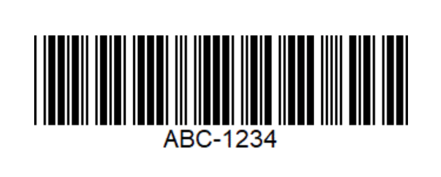
      </td>
    </tr>
    <tr>
      <td>code_93</td>
      <td>
        Hệ ký hiệu tuyến tính liên tục có độ dài biến đổi theo chuẩn bc5. Nó
        cung cấp mật độ thông tin cao hơn Code 128 và Code 39, vốn có hình thức
        tương tự. Code 93 chủ yếu được Canada Post sử dụng để mã hóa thông tin
        giao hàng bổ sung.
      </td>
      <td>
        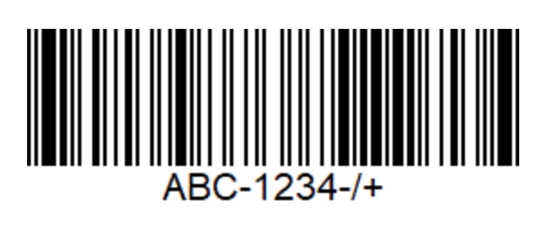
      </td>
    </tr>
    <tr>
      <td>codabar</td>
      <td>
        Mã vạch tuyến tính biểu diễn các ký tự 0-9, A-D và các ký hiệu - . $ / +
      </td>
      <td>
        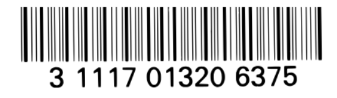
      </td>
    </tr>
    <tr>
      <td>data_matrix</td>
      <td>
        Mã vạch hai chiều không phụ thuộc hướng, được tạo thành từ các mô-đun
        đen trắng sắp xếp theo dạng hình vuông hoặc hình chữ nhật theo chuẩn
        iso16022.
      </td>
      <td>
        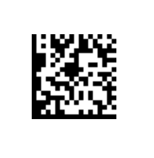
      </td>
    </tr>
    <tr>
      <td>ean_13</td>
      <td>
        Mã vạch tuyến tính dựa trên chuẩn UPC-A và được định nghĩa trong
        iso15420.
      </td>
      <td>
        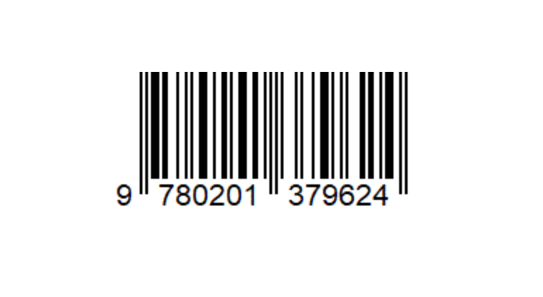
      </td>
    </tr>
    <tr>
      <td>ean_8</td>
      <td>Mã vạch tuyến tính được định nghĩa trong iso15420 và phát triển từ EAN-13.</td>
      <td>
        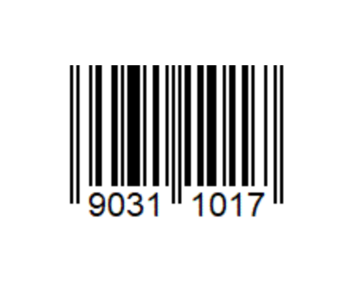
      </td>
    </tr>
    <tr>
      <td>itf</td>
      <td>
        Mã vạch liên tục, tự kiểm tra lỗi, có thể giải mã theo hai hướng. Nó
        luôn mã hóa 14 chữ số.
      </td>
      <td>
        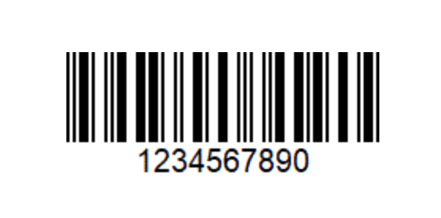
      </td>
    </tr>
    <tr>
      <td>pdf417</td>
      <td>
        Định dạng hệ ký hiệu mã vạch hai chiều liên tục với nhiều hàng và cột.
        Nó có thể giải mã theo hai hướng và dùng chuẩn iso15438.
      </td>
      <td>
        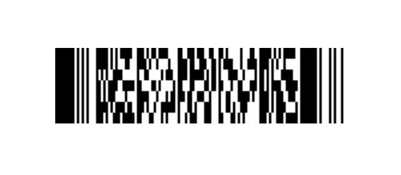
      </td>
    </tr>
    <tr>
      <td>qr_code</td>
      <td>
        Mã vạch hai chiều dùng chuẩn iso18004. Thông tin được mã hóa có thể là
        văn bản, URL hoặc dữ liệu khác.
      </td>
      <td>
        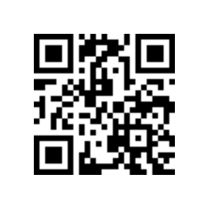
      </td>
    </tr>
    <tr>
      <td>upc_a</td>
      <td>
        Một trong những loại mã vạch tuyến tính phổ biến nhất và được áp dụng
        rộng rãi trong lĩnh vực bán lẻ tại Hoa Kỳ. Được định nghĩa trong
        iso15420, nó biểu diễn các chữ số bằng các vạch và khoảng trắng; mỗi
        chữ số gắn với một mẫu duy nhất gồm 2 vạch và 2 khoảng trắng, đều có độ
        rộng biến đổi. UPC-A có thể mã hóa 12 chữ số được gán duy nhất cho từng
        mặt hàng thương mại, và về mặt kỹ thuật là một tập con của EAN-13 (mã
        UPC-A được biểu diễn trong EAN-13 với ký tự đầu tiên là 0).
      </td>
      <td>
        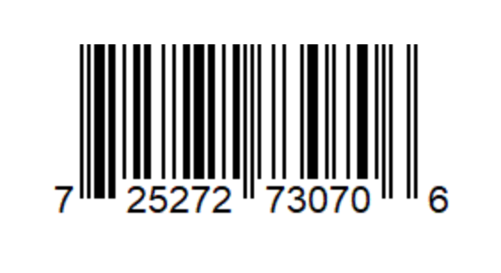
      </td>
    </tr>
    <tr>
      <td>upc_e</td>
      <td>
        Một biến thể của UPC-A được định nghĩa trong iso15420, lược bỏ các số 0
        không cần thiết để tạo mã vạch gọn hơn.
      </td>
      <td>
        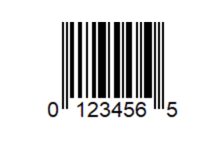
      </td>
    </tr>
    <tr>
      <td>unknown</td>
      <td>
        Giá trị này được nền tảng sử dụng để biểu thị rằng nó không biết hoặc
        không chỉ rõ định dạng mã vạch đang được phát hiện hoặc được hỗ trợ là
        gì.
      </td>
      <td></td>
    </tr>
  </tbody>
</table>

Bạn có thể kiểm tra các định dạng mà user agent hỗ trợ thông qua phương thức {{domxref('BarcodeDetector/getSupportedFormats_static','getSupportedFormats()')}}.

## Giao diện

- {{domxref("BarcodeDetector")}} {{Experimental_Inline}}
  - : Giao diện `BarcodeDetector` của Barcode Detection API cho phép phát hiện mã vạch tuyến tính và mã vạch hai chiều trong ảnh.

## Ví dụ

### Tạo detector

Ví dụ này kiểm tra khả năng tương thích của trình duyệt và tạo một đối tượng phát hiện mã vạch mới với các định dạng hỗ trợ được chỉ định.

```js
// kiểm tra khả năng tương thích
if (!("BarcodeDetector" in globalThis)) {
  console.log("Barcode Detector is not supported by this browser.");
} else {
  console.log("Barcode Detector supported!");

  // tạo detector mới
  const barcodeDetector = new BarcodeDetector({
    formats: ["code_39", "codabar", "ean_13"],
  });
}
```

### Lấy các định dạng được hỗ trợ

Ví dụ sau gọi phương thức `getSupportedFormats()` và ghi kết quả ra bảng điều khiển.

```js
// kiểm tra các loại được hỗ trợ
BarcodeDetector.getSupportedFormats().then((supportedFormats) => {
  supportedFormats.forEach((format) => console.log(format));
});
```

### Phát hiện mã vạch

Ví dụ này dùng phương thức `detect()` để phát hiện mã vạch trong hình ảnh đã cho. Sau đó lặp qua các mã tìm được và ghi dữ liệu mã vạch ra bảng điều khiển.

```js
barcodeDetector
  .detect(imageEl)
  .then((barcodes) => {
    barcodes.forEach((barcode) => console.log(barcode.rawValue));
  })
  .catch((err) => {
    console.log(err);
  });
```

## Thông số kỹ thuật

{{Specifications}}

## Tương thích trình duyệt

{{Compat}}

## Xem thêm

- [barcodefaq.com: Trang web cung cấp thông tin về nhiều loại mã vạch khác nhau cùng ví dụ cho từng loại.](https://www.barcodefaq.com/)
- [Shape Detection API: một hình ảnh đáng giá ngàn lời nói, khuôn mặt và mã vạch](https://developer.chrome.com/docs/capabilities/shape-detection#barcodedetector)
