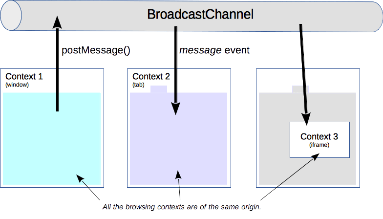

{{DefaultAPISidebar("Broadcast Channel API")}} {{AvailableInWorkers}}

**Broadcast Channel API** cho phép giao tiếp cơ bản giữa các {{glossary("browsing context", "ngữ cảnh duyệt web")}} (tức là _cửa sổ_, _tab_, _frame_ hoặc _iframe_) và worker trên cùng một {{glossary("origin")}}.

> [!NOTE]
> Nói chính xác hơn, việc giao tiếp được cho phép giữa các ngữ cảnh duyệt web dùng cùng một [storage partition](/vi/docs/Web/Privacy/Guides/State_Partitioning). Bộ nhớ trước tiên được phân vùng theo các site cấp cao nhất, nên ví dụ nếu bạn có một trang đang mở tại `a.com` nhúng một iframe từ `b.com`, và một trang khác mở tới `b.com`, thì iframe đó không thể giao tiếp với trang thứ hai mặc dù về mặt kỹ thuật chúng cùng origin. Tuy nhiên, nếu trang đầu tiên cũng nằm trên `b.com`, thì iframe có thể giao tiếp với trang thứ hai.

Bằng cách tạo một đối tượng {{domxref("BroadcastChannel")}}, bạn có thể nhận mọi thông điệp được gửi tới nó. Bạn không cần giữ tham chiếu tới các frame hoặc worker mà mình muốn giao tiếp: chúng có thể "đăng ký" vào một kênh cụ thể bằng cách tự tạo {{domxref("BroadcastChannel")}} của riêng chúng với cùng tên, và có giao tiếp hai chiều giữa tất cả các bên đó.



## Giao diện Broadcast Channel

### Tạo hoặc tham gia một kênh

Một client tham gia kênh phát bằng cách tạo một đối tượng {{domxref("BroadcastChannel")}}. [Hàm tạo](/vi/docs/Web/API/BroadcastChannel/BroadcastChannel) của nó nhận một tham số duy nhất: _tên_ của kênh. Nếu đây là kết nối đầu tiên tới tên kênh phát đó, kênh nền tảng sẽ được tạo ra.

```js
// Kết nối tới một kênh phát
const bc = new BroadcastChannel("test_channel");
```

### Gửi một thông điệp

Chỉ cần gọi phương thức {{domxref("BroadcastChannel.postMessage", "postMessage()")}} trên đối tượng `BroadcastChannel` đã tạo; phương thức này nhận bất kỳ đối tượng nào làm đối số. Ví dụ với một thông điệp chuỗi:

```js
// Ví dụ gửi một thông điệp rất đơn giản
bc.postMessage("This is a test message.");
```

Dữ liệu gửi tới kênh được tuần tự hóa bằng [structured clone algorithm](/vi/docs/Web/API/Web_Workers_API/Structured_clone_algorithm). Điều đó có nghĩa là bạn có thể gửi an toàn rất nhiều loại đối tượng dữ liệu mà không cần tự tuần tự hóa chúng.

API này không gắn bất kỳ ngữ nghĩa nào cho thông điệp, nên mã nguồn phải tự biết cần chờ loại thông điệp nào và phải xử lý chúng ra sao.

### Nhận một thông điệp

Khi một thông điệp được gửi đi, sự kiện [`message`](/vi/docs/Web/API/BroadcastChannel/message_event) sẽ được phát tới từng đối tượng {{domxref("BroadcastChannel")}} đang kết nối với kênh này. Có thể chạy một hàm cho sự kiện đó bằng trình xử lý sự kiện {{domxref("BroadcastChannel/message_event", "onmessage")}}:

```js
// Một trình xử lý chỉ ghi log sự kiện ra console:
bc.onmessage = (event) => {
  console.log(event);
};
```

### Ngắt kết nối khỏi một kênh

Để rời một kênh, hãy gọi phương thức {{domxref("BroadcastChannel.close", "close()")}} trên đối tượng. Việc này ngắt đối tượng khỏi kênh nền tảng, cho phép thu gom rác.

```js
// Ngắt kết nối kênh
bc.close();
```

## Kết luận

Giao diện tự chứa của Broadcast Channel API cho phép giao tiếp xuyên ngữ cảnh. Nó có thể được dùng để phát hiện hành động của người dùng trên các tab khác trong cùng một origin, chẳng hạn khi người dùng đăng nhập hoặc đăng xuất.

Giao thức truyền thông điệp không được định nghĩa và các ngữ cảnh duyệt web khác nhau phải tự triển khai nó; đặc tả không đưa ra cơ chế thương lượng hay yêu cầu nào cho phần này.

## Giao diện

- {{domxref("BroadcastChannel")}}
  - : Biểu diễn một kênh có tên mà bất kỳ {{glossary("browsing context", "ngữ cảnh duyệt web")}} nào của một {{glossary("origin")}} nhất định cũng có thể đăng ký.

## Đặc tả

{{Specifications}}

## Tính tương thích của trình duyệt

{{Compat}}

## Xem thêm

- {{domxref("BroadcastChannel")}}, giao diện hiện thực API này.
