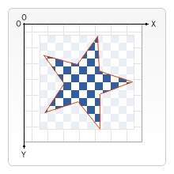

{{DefaultAPISidebar("Canvas API")}} {{PreviousNext("Web/API/Canvas_API/Tutorial/Transformations", "Web/API/Canvas_API/Tutorial/Basic_animations")}}

Trong tất cả [ví dụ trước](/en-US/docs/Web/API/Canvas_API/Tutorial/Transformations) của chúng tôi, các hình dạng luôn được vẽ chồng lên nhau. Điều này là quá đủ cho hầu hết các tình huống, nhưng nó hạn chế thứ tự xây dựng các hình dạng tổng hợp. Tuy nhiên, chúng ta có thể thay đổi hành vi này bằng cách đặt thuộc tính `globalCompositeOperation`. Ngoài ra, thuộc tính `clip` cho phép chúng ta ẩn những phần không mong muốn của hình dạng.

## `globalCompositeOperation`

Chúng ta không chỉ có thể vẽ các hình dạng mới đằng sau các hình dạng hiện có mà còn có thể sử dụng nó để che đi các khu vực nhất định, xóa các phần khỏi canvas (không giới hạn ở các hình chữ nhật như phương pháp {{domxref("CanvasRenderingContext2D.clearRect", "clearRect()")}}), v.v.

- {{domxref("CanvasRenderingContext2D.globalCompositeOperation", "globalCompositeOperation = type")}}
  - : Điều này đặt loại thao tác tổng hợp sẽ áp dụng khi vẽ các hình dạng mới, trong đó loại là một chuỗi xác định thao tác tổng hợp nào trong số mười hai thao tác tổng hợp sẽ sử dụng.

## Cắt đường dẫn

Đường cắt giống như một hình dạng canvas bình thường nhưng nó hoạt động như một mặt nạ để ẩn những phần không mong muốn của hình dạng. Điều này được hiển thị trong hình ảnh dưới đây. Hình ngôi sao màu đỏ là đường cắt của chúng ta. Mọi thứ nằm ngoài đường dẫn này sẽ không được vẽ trên canvas.



Nếu chúng ta so sánh các đường dẫn cắt với thuộc tính `globalCompositeOperation` mà chúng ta đã thấy ở trên, thì chúng ta sẽ thấy hai chế độ tổng hợp đạt được hiệu ứng ít nhiều giống nhau trong `source-in` và `source-atop`. Sự khác biệt quan trọng nhất giữa hai đường này là các đường cắt không bao giờ thực sự được vẽ vào canvas và đường cắt không bao giờ bị ảnh hưởng khi thêm các hình dạng mới. Điều này làm cho các đường cắt trở nên lý tưởng để vẽ nhiều hình dạng trong một khu vực hạn chế.

Trong chương về [vẽ hình](/en-US/docs/Web/API/Canvas_API/Tutorial/Drawing_shapes), tôi chỉ đề cập đến các phương pháp `stroke()` và `fill()`, nhưng có một phương pháp thứ ba mà chúng ta có thể sử dụng với các đường dẫn, được gọi là `clip()`.

- {{domxref("CanvasRenderingContext2D.clip", "clip()")}}
  - : Biến đường dẫn hiện đang được xây dựng thành đường cắt hiện tại.

Bạn sử dụng `clip()` thay vì `closePath()` để đóng một đường dẫn và biến nó thành một đường cắt thay vì vuốt hoặc lấp đầy đường dẫn.

Theo mặc định, phần tử {{HTMLElement("canvas")}} có đường cắt có cùng kích thước với chính canvas. Nói cách khác, không có sự cắt xén nào xảy ra.

### Ví dụ về `clip`

Trong ví dụ này, chúng tôi sẽ sử dụng đường cắt hình tròn để hạn chế việc vẽ một tập hợp các ngôi sao ngẫu nhiên ở một vùng cụ thể.

```js
function draw() {
  const ctx = document.getElementById("canvas").getContext("2d");
  ctx.fillRect(0, 0, 150, 150);
  ctx.translate(75, 75);

  // Create a circular clipping path
  ctx.beginPath();
  ctx.arc(0, 0, 60, 0, Math.PI * 2, true);
  ctx.clip();

  // Draw background
  const linGrad = ctx.createLinearGradient(0, -75, 0, 75);
  linGrad.addColorStop(0, "#232256");
  linGrad.addColorStop(1, "#143778");

  ctx.fillStyle = linGrad;
  ctx.fillRect(-75, -75, 150, 150);

  generateStars(ctx);
}

function generateStars(ctx) {
  for (let j = 1; j < 50; j++) {
    ctx.save();
    ctx.fillStyle = "white";
    ctx.translate(
      75 - Math.floor(Math.random() * 150),
      75 - Math.floor(Math.random() * 150),
    );
    drawStar(ctx, Math.floor(Math.random() * 4) + 2);
    ctx.restore();
  }
}

function drawStar(ctx, r) {
  ctx.save();
  ctx.beginPath();
  ctx.moveTo(r, 0);
  for (let i = 0; i < 9; i++) {
    ctx.rotate(Math.PI / 5);
    if (i % 2 === 0) {
      ctx.lineTo((r / 0.525731) * 0.200811, 0);
    } else {
      ctx.lineTo(r, 0);
    }
  }
  ctx.closePath();
  ctx.fill();
  ctx.restore();
}
```

```html hidden
<canvas id="canvas" width="150" height="150"></canvas>
```

```js hidden
draw();
```

Trong một vài dòng mã đầu tiên, chúng ta vẽ một hình chữ nhật màu đen có kích thước bằng canvas làm phông nền, sau đó dịch điểm gốc về giữa. Tiếp theo, chúng ta tạo đường cắt hình tròn bằng cách vẽ một cung và gọi `clip()`. Đường dẫn cắt cũng là một phần của trạng thái lưu canvas. Nếu chúng ta muốn giữ lại đường cắt ban đầu, chúng ta có thể lưu trạng thái canvas trước khi tạo đường dẫn mới.

Mọi thứ được vẽ sau khi tạo đường cắt sẽ chỉ xuất hiện bên trong đường dẫn đó. Bạn có thể thấy rõ điều này trong gradient tuyến tính được vẽ tiếp theo. Sau đó, một tập hợp gồm 50 ngôi sao được định vị và chia tỷ lệ ngẫu nhiên sẽ được rút ra bằng cách sử dụng chức năng `drawStar()` tùy chỉnh. Một lần nữa các ngôi sao chỉ xuất hiện bên trong đường cắt đã xác định.

{{EmbedLiveSample("A_clip_example", "", "160")}}

### Đường cắt ngược

Không có cái gọi là mặt nạ cắt ngược. Tuy nhiên, chúng ta có thể xác định một mặt nạ lấp đầy toàn bộ canvas bằng một hình chữ nhật và có một lỗ trên đó dành cho những phần mà bạn muốn bỏ qua. Khi [vẽ hình có lỗ](/en-US/docs/Web/API/Canvas_API/Tutorial/Drawing_shapes#shapes_with_holes), chúng ta cần vẽ lỗ theo hướng ngược lại với hình bên ngoài. Trong ví dụ dưới đây, chúng ta đục một lỗ trên bầu trời.

Hình chữ nhật không có hướng vẽ nhưng nó hoạt động như thể chúng ta vẽ theo chiều kim đồng hồ. Theo mặc định, lệnh cung cũng đi theo chiều kim đồng hồ, nhưng chúng ta có thể thay đổi hướng của nó bằng đối số cuối cùng.

```html hidden
<canvas id="canvas" width="150" height="150"></canvas>
```

```js
function draw() {
  const canvas = document.getElementById("canvas");
  const ctx = canvas.getContext("2d");
  ctx.translate(75, 75);

  // Clipping path
  ctx.beginPath();
  ctx.rect(-75, -75, 150, 150); // Outer rectangle
  ctx.arc(0, 0, 60, 0, Math.PI * 2, true); // Hole anticlockwise
  ctx.clip();

  // Draw background
  const linGrad = ctx.createLinearGradient(0, -75, 0, 75);
  linGrad.addColorStop(0, "#232256");
  linGrad.addColorStop(1, "#143778");

  ctx.fillStyle = linGrad;
  ctx.fillRect(-75, -75, 150, 150);

  generateStars(ctx);
}
```

```js hidden
function generateStars(ctx) {
  for (let j = 1; j < 50; j++) {
    ctx.save();
    ctx.fillStyle = "white";
    ctx.translate(
      75 - Math.floor(Math.random() * 150),
      75 - Math.floor(Math.random() * 150),
    );
    drawStar(ctx, Math.floor(Math.random() * 4) + 2);
    ctx.restore();
  }
}

function drawStar(ctx, r) {
  ctx.save();
  ctx.beginPath();
  ctx.moveTo(r, 0);
  for (let i = 0; i < 9; i++) {
    ctx.rotate(Math.PI / 5);
    if (i % 2 === 0) {
      ctx.lineTo((r / 0.525731) * 0.200811, 0);
    } else {
      ctx.lineTo(r, 0);
    }
  }
  ctx.closePath();
  ctx.fill();
  ctx.restore();
}

draw();
```

{{EmbedLiveSample("Hole_in_rectangle", "", "160")}}

{{PreviousNext("Web/API/Canvas_API/Tutorial/Transformations", "Web/API/Canvas_API/Tutorial/Basic_animations")}}
