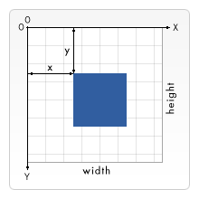
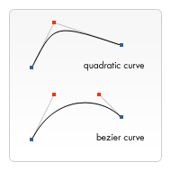

{{DefaultAPISidebar("Canvas API")}} {{PreviousNext("Web/API/Canvas_API/Tutorial/Basic_usage", "Web/API/Canvas_API/Tutorial/Applying_styles_and_colors")}}

Bây giờ chúng ta đã thiết lập [môi trường canvas](/en-US/docs/Web/API/Canvas_API/Tutorial/Basic_usage) của mình, chúng ta có thể tìm hiểu chi tiết về cách vẽ trên canvas. Đến cuối bài viết này, bạn sẽ học cách vẽ hình chữ nhật, hình tam giác, đường thẳng, hình cung và đường cong, làm quen với một số hình dạng cơ bản. Làm việc với các đường dẫn là điều cần thiết khi vẽ các đối tượng lên canvas và chúng ta sẽ xem cách thực hiện điều đó.

## Lưới

Trước khi có thể bắt đầu vẽ, chúng ta cần nói về lưới canvas hoặc **không gian tọa độ**. Bộ xương HTML của chúng tôi từ trang trước có phần tử canvas rộng 150 pixel và cao 150 pixel.



Thông thường 1 đơn vị trong lưới tương ứng với 1 pixel trên canvas. Điểm gốc của lưới này được định vị ở góc _trên cùng bên trái_ tại tọa độ (0,0). Tất cả các phần tử được đặt tương ứng với điểm gốc này. Vì vậy, vị trí của góc trên cùng bên trái của hình vuông màu xanh lam sẽ trở thành x pixel từ bên trái và y pixel từ trên cùng, tại tọa độ (x, y). Ở phần sau của hướng dẫn này, chúng ta sẽ xem cách chúng ta có thể dịch điểm gốc sang một vị trí khác, xoay lưới và thậm chí chia tỷ lệ cho nó, nhưng bây giờ chúng ta sẽ giữ nguyên mặc định.

## Vẽ hình chữ nhật

Không giống như {{Glossary("SVG")}}, {{HTMLElement("canvas")}} chỉ hỗ trợ hai hình dạng nguyên thủy: hình chữ nhật và đường dẫn (danh sách các điểm được kết nối bằng đường thẳng). Tất cả các hình dạng khác phải được tạo bằng cách kết hợp một hoặc nhiều đường dẫn. May mắn thay, chúng tôi có nhiều chức năng vẽ đường dẫn giúp bạn có thể tạo ra các hình dạng rất phức tạp.

Đầu tiên chúng ta hãy nhìn vào hình chữ nhật. Có ba hàm vẽ hình chữ nhật trên canvas:

- {{domxref("CanvasRenderingContext2D.fillRect", "fillRect(x, y, width, height)")}}
  - : Vẽ một hình chữ nhật đầy.
- {{domxref("CanvasRenderingContext2D.strokeRect", "strokeRect(x, y, width, height)")}}
  - : Vẽ đường viền hình chữ nhật.
- {{domxref("CanvasRenderingContext2D.clearRect", "clearRect(x, y, width, height)")}}
  - : Xóa vùng hình chữ nhật được chỉ định, làm cho nó hoàn toàn trong suốt.

Mỗi hàm trong số ba hàm này đều có cùng tham số. `x` và `y` chỉ định vị trí trên canvas (so với điểm gốc) của góc trên cùng bên trái của hình chữ nhật. `width` và `height` cung cấp kích thước của hình chữ nhật.

Dưới đây là chức năng `draw()` từ trang trước, nhưng hiện tại nó đang sử dụng ba chức năng này.

### Ví dụ về hình chữ nhật

```html hidden
<canvas id="canvas" width="150" height="150"></canvas>
```

```js
function draw() {
  const canvas = document.getElementById("canvas");
  const ctx = canvas.getContext("2d");

  ctx.fillRect(25, 25, 100, 100);
  ctx.clearRect(45, 45, 60, 60);
  ctx.strokeRect(50, 50, 50, 50);
}
```

```js hidden
draw();
```

Đầu ra của ví dụ này được hiển thị dưới đây.

{{EmbedLiveSample("Rectangular_shape_example", "", "160")}}

Hàm `fillRect()` vẽ một hình vuông lớn màu đen 100 pixel mỗi cạnh. Sau đó, hàm `clearRect()` sẽ xóa một hình vuông 60x60 pixel ở giữa, sau đó `strokeRect()` được gọi để tạo đường viền hình chữ nhật 50x50 pixel bên trong hình vuông đã xóa (_conceptually_ 50x50; trên thực tế, nó là 52x52, như phần tiếp theo sẽ giải thích).

Trong các trang sắp tới, chúng ta sẽ thấy hai phương pháp thay thế cho `clearRect()` và chúng ta cũng sẽ xem cách thay đổi màu sắc và kiểu nét của các hình dạng được hiển thị.

Không giống như các hàm đường dẫn mà chúng ta sẽ thấy trong phần tiếp theo, cả ba hàm hình chữ nhật đều vẽ ngay lập tức vào canvas.

## Thấy viền mờ?

Trong ví dụ về hình chữ nhật ở trên và trong tất cả các ví dụ sắp tới, bạn có thể nhận thấy rằng các cạnh của hình có thể mờ hơn so với các hình tương đương được vẽ bằng SVG hoặc CSS. Điều này không phải do API canvas không có khả năng vẽ các cạnh sắc nét mà là do cách lưới canvas ánh xạ tới các pixel thực tế trên màn hình và trong một số trường hợp nhất định, do cách trình duyệt chia tỷ lệ canvas. Nếu ví dụ trên chưa đủ rõ ràng, hãy phóng to canvas bằng CSS:

```html live-sample___seeing_blurry_edges live-sample___seeing_blurry_edges_2 live-sample___seeing_blurry_edges_3
<canvas id="canvas" width="15" height="15"></canvas>
```

```css live-sample___seeing_blurry_edges live-sample___seeing_blurry_edges_2 live-sample___seeing_blurry_edges_3
#canvas {
  width: 300px;
  height: 300px;
}
```

```js live-sample___seeing_blurry_edges live-sample___seeing_blurry_edges_2
function draw() {
  const canvas = document.getElementById("canvas");
  const ctx = canvas.getContext("2d");
  ctx.strokeRect(2, 2, 10, 10);
  ctx.fillRect(7, 7, 1, 1);
}
```

```js hidden live-sample___seeing_blurry_edges live-sample___seeing_blurry_edges_2 live-sample___seeing_blurry_edges_3
draw();
```

{{EmbedLiveSample("Seeing blurry edges", "", "350")}}

Trong ví dụ này, chúng tôi tạo canvas thực sự nhỏ (15x15), nhưng sau đó sử dụng CSS để chia tỷ lệ lên tới 300x300 pixel. Kết quả là mỗi pixel canvas hiện được biểu thị bằng một khối pixel CSS 20x20. Chúng ta vẽ một hình chữ nhật có nét từ (2,2) đến (12,12) và một hình chữ nhật được tô từ (7,7) đến (8,8). Nó có vẻ _thực sự_ mờ. Điều này là do theo mặc định, khi trình duyệt chia tỷ lệ hình ảnh raster, nó sẽ sử dụng thuật toán làm mịn để nội suy các pixel phụ. Điều này rất tốt cho các bức ảnh hoặc đồ họa canvas có các cạnh cong, nhưng không quá tuyệt vời cho các hình dạng có cạnh thẳng. Để khắc phục điều này, chúng ta có thể đặt {{cssxref("image-rendering")}} thành `pixelated`:

```css live-sample___seeing_blurry_edges_2 live-sample___seeing_blurry_edges_3
#canvas {
  image-rendering: pixelated;
}
```

{{EmbedLiveSample("Seeing blurry edges 2", "", "350")}}

Bây giờ, khi trình duyệt chia tỷ lệ canvas, nó sẽ bảo toàn pixel của bản gốc nhiều nhất có thể.

> [!NOTE]
> `image-rendering: pixelated` không phải là không có vấn đề về kỹ thuật bảo quản cạnh sắc nét. Khi các pixel CSS không thẳng hàng với các pixel của thiết bị (nếu {{domxref("Window/devicePixelRatio", "devicePixelRatio")}} không phải là số nguyên), một số pixel nhất định có thể được vẽ lớn hơn các pixel khác, dẫn đến giao diện không đồng nhất. Tuy nhiên, đây không phải là một vấn đề dễ giải quyết vì không thể lấp đầy chính xác các pixel của thiết bị khi các pixel CSS không thể ánh xạ chính xác tới chúng.

Nhưng bây giờ, một vấn đề khác trở nên rõ ràng, một vấn đề mà bạn thực sự có thể quan sát thấy trong ví dụ hình chữ nhật ban đầu: hình chữ nhật có nét không chỉ rộng 2 pixel thay vì 1 mà còn xuất hiện màu xám thay vì màu đen mặc định. Điều này là do cách tọa độ được hiểu là ranh giới hình dạng.

Nếu bạn nhìn lại sơ đồ [grid](#the_grid) ở trên, bạn có thể thấy rằng các tọa độ như `2` hoặc `12` không xác định một pixel mà là cạnh giữa hai pixel. Trong các hình ảnh bên dưới, lưới đại diện cho lưới tọa độ canvas. Các ô vuông giữa các đường lưới là các pixel thực tế trên màn hình. Trong ảnh lưới đầu tiên bên dưới, một hình chữ nhật từ (2,1) đến (5,5) được tô đầy. Toàn bộ khu vực giữa chúng (màu đỏ nhạt) nằm trên ranh giới pixel, do đó hình chữ nhật được lấp đầy sẽ có các cạnh sắc nét.

![Ba lưới tọa độ. Các đường lưới là các pixel thực tế trên màn hình. Góc trên cùng bên trái của mỗi lưới được dán nhãn (0,0). Trong lưới đầu tiên, một hình chữ nhật từ (2,1) đến (5,5) được tô màu đỏ nhạt. Trong lưới thứ hai, (3,1) đến (3,5) được nối bằng đường màu xanh hoàng gia dày 1 pixel. Đường màu xanh hoàng gia nằm ở giữa một đường lưới, kéo dài từ 2,5 đến 3,5 trên truy cập x, nằm ở giữa các pixel ở hai bên của đường biểu đồ, với nền màu xanh nhạt ở hai bên kéo dài từ 2 đến 4 trên truy cập x. Để tránh phần mở rộng mờ màu xanh lam nhạt của đường trong lưới tọa độ thứ hai, đường dẫn trong, lưới tọa độ thứ ba có màu xanh hoàng gia từ đường (3,5,1) đến (3,5,5). Chiều rộng đường 1 pixel sẽ lấp đầy hoàn toàn và chính xác một đường dọc pixel đơn.](canvas-grid.png)

Nếu bạn xem xét một đường dẫn từ (3,1) đến (3,5) có độ dày đường thẳng là `1.0`, bạn sẽ gặp phải tình huống trong hình ảnh thứ hai. Vùng thực tế cần lấp đầy (màu xanh đậm) chỉ mở rộng một nửa số pixel ở hai bên của đường dẫn. Một giá trị gần đúng của điều này phải được hiển thị, có nghĩa là những pixel đó chỉ được tô bóng một phần và dẫn đến toàn bộ khu vực (xanh nhạt và xanh đậm) được tô bằng màu chỉ tối bằng một nửa màu nét vẽ thực tế. Đây là những gì xảy ra với đường chiều rộng `1.0` trong lệnh gọi `strokeRect()` trong ví dụ hình chữ nhật ở trên.

Để khắc phục điều này, bạn phải rất chính xác trong việc tạo đường dẫn của mình. Biết rằng đường chiều rộng `1.0` sẽ kéo dài nửa đơn vị sang hai bên của đường dẫn, việc tạo đường dẫn từ _centers_ pixel dẫn đến tình huống trong hình ảnh thứ ba—chiều rộng đường `1.0` kết thúc hoàn toàn và lấp đầy chính xác một đường dọc pixel đơn.

> [!NOTE]
> Xin lưu ý rằng trong ví dụ về đường thẳng đứng của chúng tôi, vị trí Y vẫn tham chiếu vị trí đường lưới số nguyên—nếu không, chúng tôi sẽ thấy các pixel có độ che phủ một nửa ở các điểm cuối.

Vì vậy, đây là lý do tại sao chúng tôi đã nói trước đó rằng lệnh gọi `strokeRect(50, 50, 50, 50)` trong ví dụ hình chữ nhật có _về mặt khái niệm_ 50x50, nhưng trên thực tế nó là 52x52. Vùng được lấp đầy thực tế cho đường viền bắt đầu từ (49,5, 49,5) và kết thúc ở (100,5, 100,5) và do các pixel được lấp đầy một phần nên vùng được lấp đầy thực sự là từ (49,49) đến (101.101), tức là 52x52 và các cạnh rộng 2 pixel. Để có được đường viền cố định rộng 1 pixel có kích thước chính xác là 50x50, bạn cần _thu nhỏ_ hình chữ nhật theo độ dày của đường viền (1px) và di chuyển nó đi một nửa độ dày (0,5px):

```js live-sample___seeing_blurry_edges_3
function draw() {
  const canvas = document.getElementById("canvas");
  const ctx = canvas.getContext("2d");
  ctx.strokeRect(2.5, 2.5, 9, 9);
  ctx.fillRect(7, 7, 1, 1);
}
```

{{EmbedLiveSample("Seeing blurry edges 3", "", "350")}}

Đối với các dòng có chiều rộng chẵn, mỗi nửa kết thúc bằng một lượng pixel nguyên, do đó bạn muốn có một đường dẫn nằm giữa các pixel (nghĩa là (3,1) đến (3,5)), thay vì đi xuống giữa các pixel.

Mặc dù hơi khó khăn khi ban đầu làm việc với đồ họa 2D có thể mở rộng, nhưng việc chú ý đến lưới pixel và vị trí của các đường dẫn sẽ đảm bảo rằng bản vẽ của bạn sẽ trông chính xác bất kể tỷ lệ hoặc bất kỳ phép biến đổi nào khác có liên quan. Đường thẳng đứng có chiều rộng 1,0 được vẽ ở đúng vị trí sẽ trở thành đường 2 pixel sắc nét khi được tăng tỷ lệ lên 2 và sẽ xuất hiện ở đúng vị trí.

Hiện tượng pixel được lấp đầy một phần này cũng mở rộng sang các hình dạng không thẳng hàng với lưới pixel. Ví dụ: hãy xem xét một hình chữ nhật xoay (bạn sẽ tìm hiểu về cách vẽ nó trong phần tiếp theo). Để xem nó trông như thế nào khi có và không có `image-rendering: pixelated`, chúng tôi có hai canvas cạnh nhau và canvas thứ ba được vẽ ở tỷ lệ đầy đủ, với các đường lưới:

```html hidden live-sample___seeing_blurry_edges_4
<canvas id="canvas1" width="12" height="12"></canvas>
<canvas id="canvas2" width="12" height="12"></canvas>
<canvas id="canvas3" width="240" height="240"></canvas>
```

```css hidden live-sample___seeing_blurry_edges_4
html,
body {
  width: 800px;
  overflow-x: scroll;
}

@media (width < 500px) {
  html,
  body {
    width: 300px;
  }
}

#canvas1,
#canvas2 {
  width: 240px;
  height: 240px;
}
#canvas2 {
  image-rendering: pixelated;
}
```

```js live-sample___seeing_blurry_edges_4
function draw(canvasId) {
  const canvas = document.getElementById(canvasId);
  const ctx = canvas.getContext("2d");
  ctx.beginPath();
  ctx.moveTo(3, 2);
  ctx.lineTo(9, 4.5);
  ctx.lineTo(6.5, 10.5);
  ctx.lineTo(0.5, 8);
  ctx.closePath();
  ctx.fill();
}

function drawFullScale() {
  const canvas = document.getElementById("canvas3");
  const ctx = canvas.getContext("2d");
  ctx.beginPath();
  ctx.moveTo(60, 40);
  ctx.lineTo(180, 90);
  ctx.lineTo(130, 210);
  ctx.lineTo(10, 160);
  ctx.closePath();
  ctx.fill();
  ctx.strokeStyle = "lightgray";
  for (let i = 0; i < 16; i++) {
    ctx.moveTo(i * 20, 0);
    ctx.lineTo(i * 20, 300);
    ctx.moveTo(0, i * 20);
    ctx.lineTo(300, i * 20);
    ctx.stroke();
  }
}
```

```js hidden live-sample___seeing_blurry_edges_4
draw("canvas1");
draw("canvas2");
drawFullScale();
```

{{EmbedLiveSample("Seeing blurry edges 4", "", "350")}}

Nếu việc chia tỷ lệ _up_ một hình ảnh làm cho nó trông mờ hơn dự định, thì việc chia tỷ lệ _down_ một hình ảnh sẽ làm cho nó trông _sắc nét hơn_. Ví dụ: nếu bạn muốn canvas xuất hiện ở dạng 300x150 pixel trên màn hình, bạn có thể tạo canvas ở kích thước 600x300 pixel rồi sử dụng CSS để thu nhỏ kích thước đó. Điều này đặc biệt hữu ích trên màn hình có độ phân giải cao (chẳng hạn như màn hình Retina của Apple), trong đó pixel CSS được biểu thị bằng nhiều pixel màn hình, vì vậy nếu bạn vẽ một cách trung thực canvas 300x150 pixel, nó sẽ không có cùng độ phân giải pixel như các thành phần khác trên trang.

## Vẽ đường dẫn

Bây giờ chúng ta hãy nhìn vào các đường dẫn. Đường dẫn là một danh sách các điểm, được kết nối bởi các đoạn đường có thể có hình dạng khác nhau, cong hoặc không cong, có chiều rộng khác nhau và màu sắc khác nhau. Một đường dẫn hoặc thậm chí một đường dẫn phụ có thể bị đóng. Để tạo hình bằng đường dẫn, chúng tôi thực hiện một số bước bổ sung:

1. Đầu tiên, bạn tạo đường dẫn.
2. Sau đó bạn sử dụng [lệnh vẽ](/en-US/docs/Web/API/CanvasRenderingContext2D#paths) để vẽ vào đường path.
3. Khi đường dẫn đã được tạo, bạn có thể vuốt hoặc tô màu đường dẫn để hiển thị nó.

Dưới đây là các chức năng được sử dụng để thực hiện các bước này:

- {{domxref("CanvasRenderingContext2D.beginPath", "beginPath()")}}
  - : Tạo một đường dẫn mới. Sau khi được tạo, các lệnh vẽ trong tương lai sẽ được hướng vào đường dẫn và được sử dụng để xây dựng đường dẫn lên trên.
- [Phương thức đường dẫn](/en-US/docs/Web/API/CanvasRenderingContext2D#paths)
  - : Phương thức thiết lập đường dẫn khác nhau cho các đối tượng.
- {{domxref("CanvasRenderingContext2D.closePath", "closePath()")}}
  - : Thêm một đường thẳng vào đường dẫn, đi đến điểm bắt đầu của đường dẫn phụ hiện tại.
- {{domxref("CanvasRenderingContext2D.stroke", "stroke()")}}
  - : Vẽ hình bằng cách vuốt đường viền của nó.
- {{domxref("CanvasRenderingContext2D.fill", "fill()")}}
  - : Vẽ một hình khối bằng cách lấp đầy vùng nội dung của đường dẫn.

Bước đầu tiên để tạo đường dẫn là gọi `beginPath()`. Bên trong, các đường dẫn được lưu trữ dưới dạng danh sách các đường dẫn phụ (đường thẳng, vòng cung, v.v.) cùng nhau tạo thành một hình dạng. Mỗi khi phương thức này được gọi, danh sách sẽ được đặt lại và chúng ta có thể bắt đầu vẽ các hình dạng mới.

> [!NOTE]
> Khi đường dẫn hiện tại trống, chẳng hạn như ngay sau khi gọi `beginPath()` hoặc trên canvas mới được tạo, lệnh xây dựng đường dẫn đầu tiên luôn được coi là `moveTo()`, bất kể nó thực sự là gì. Vì lý do đó, bạn hầu như luôn muốn đặt cụ thể vị trí bắt đầu của mình sau khi đặt lại đường dẫn.

Bước thứ hai là gọi các phương thức thực sự chỉ định các đường dẫn được vẽ. Chúng ta sẽ sớm thấy những điều này.

Bước thứ ba và là bước tùy chọn là gọi `closePath()`. Phương thức này cố gắng đóng hình bằng cách vẽ một đường thẳng từ điểm hiện tại đến điểm bắt đầu. Nếu hình đã được đóng hoặc chỉ có một điểm trong danh sách thì hàm này sẽ không thực hiện gì.

> [!NOTE]
> Khi bạn gọi `fill()`, mọi hình dạng đang mở sẽ tự động đóng lại, do đó bạn không cần phải gọi `closePath()`. Đây **không** là trường hợp khi bạn gọi `stroke()`.

### Vẽ hình tam giác

Ví dụ: mã để vẽ một hình tam giác sẽ trông giống như sau:

```html hidden
<canvas id="canvas" width="100" height="100"></canvas>
```

```js
function draw() {
  const canvas = document.getElementById("canvas");
  const ctx = canvas.getContext("2d");

  ctx.beginPath();
  ctx.moveTo(75, 50);
  ctx.lineTo(100, 75);
  ctx.lineTo(100, 25);
  ctx.fill();
}
```

```js hidden
draw();
```

Kết quả trông như thế này:

{{EmbedLiveSample("Drawing_a_triangle", "", "110")}}

### Di chuyển bút

Một hàm rất hữu ích, thực ra không vẽ bất cứ thứ gì mà trở thành một phần của danh sách đường dẫn được mô tả ở trên, là hàm `moveTo()`. Bạn có thể nghĩ tốt nhất về điều này như nhấc một cây bút hoặc bút chì từ một vị trí trên một tờ giấy và đặt nó lên vị trí tiếp theo.

- {{domxref("CanvasRenderingContext2D.moveTo", "moveTo(x, y)")}}
  - : Di chuyển bút đến tọa độ được chỉ định bởi `x` và `y`.

Khi canvas được khởi tạo hoặc `beginPath()` được gọi, bạn thường muốn sử dụng hàm `moveTo()` để đặt điểm bắt đầu ở một nơi khác. Chúng ta cũng có thể sử dụng `moveTo()` để vẽ các đường dẫn không được kết nối. Hãy nhìn vào khuôn mặt cười dưới đây.

Để tự mình thử điều này, bạn có thể sử dụng đoạn mã bên dưới. Chỉ cần dán nó vào hàm `draw()` mà chúng ta đã thấy trước đó.

```html hidden
<canvas id="canvas" width="150" height="150"></canvas>
```

```js
function draw() {
  const canvas = document.getElementById("canvas");
  const ctx = canvas.getContext("2d");

  ctx.beginPath();
  ctx.arc(75, 75, 50, 0, Math.PI * 2, true); // Outer circle
  ctx.moveTo(110, 75);
  ctx.arc(75, 75, 35, 0, Math.PI, false); // Mouth (clockwise)
  ctx.moveTo(65, 65);
  ctx.arc(60, 65, 5, 0, Math.PI * 2, true); // Left eye
  ctx.moveTo(95, 65);
  ctx.arc(90, 65, 5, 0, Math.PI * 2, true); // Right eye
  ctx.stroke();
}
```

```js hidden
draw();
```

Kết quả trông như thế này:

{{EmbedLiveSample("Moving_the_pen", "", "160")}}

Nếu bạn muốn xem các đường kết nối, bạn có thể xóa các đường gọi `moveTo()`.

> [!NOTE]
> Để tìm hiểu thêm về chức năng `arc()`, hãy xem phần [Arcs](#arcs) bên dưới.

### dòng

Để vẽ các đường thẳng, hãy sử dụng phương pháp `lineTo()`.

- {{domxref("CanvasRenderingContext2D.lineTo", "lineTo(x, y)")}}
  - : Vẽ một đường thẳng từ vị trí vẽ hiện tại đến vị trí được chỉ định bởi `x` và `y`.

Phương thức này nhận hai đối số, `x` và `y`, là tọa độ của điểm cuối của đường. Điểm bắt đầu phụ thuộc vào các đường dẫn đã vẽ trước đó, trong đó điểm cuối của đường dẫn trước là điểm bắt đầu cho đường dẫn tiếp theo, v.v. Điểm bắt đầu cũng có thể được thay đổi bằng cách sử dụng phương pháp `moveTo()`.

Ví dụ dưới đây vẽ hai hình tam giác, một hình đầy và một hình có đường viền.

```html hidden
<canvas id="canvas" width="150" height="150"></canvas>
```

```js
function draw() {
  const canvas = document.getElementById("canvas");
  const ctx = canvas.getContext("2d");

  // Filled triangle
  ctx.beginPath();
  ctx.moveTo(25, 25);
  ctx.lineTo(105, 25);
  ctx.lineTo(25, 105);
  ctx.fill();

  // Stroked triangle
  ctx.beginPath();
  ctx.moveTo(125, 125);
  ctx.lineTo(125, 45);
  ctx.lineTo(45, 125);
  ctx.closePath();
  ctx.stroke();
}
```

```js hidden
draw();
```

Việc này bắt đầu bằng cách gọi `beginPath()` để bắt đầu một đường dẫn hình dạng mới. Sau đó chúng tôi sử dụng phương pháp `moveTo()` để di chuyển điểm bắt đầu đến vị trí mong muốn. Bên dưới vẽ hai đường thẳng tạo thành hai cạnh của tam giác.

{{EmbedLiveSample("Lines", "", "160")}}

Bạn sẽ nhận thấy sự khác biệt giữa hình tam giác đầy màu sắc và hình tam giác có nét vẽ. Điều này, như đã đề cập ở trên, bởi vì các hình dạng sẽ tự động được đóng lại khi đường dẫn được lấp đầy chứ không phải khi chúng được vuốt. Nếu chúng ta bỏ `closePath()` cho hình tam giác có nét thì chỉ có hai đường thẳng được vẽ chứ không phải là một hình tam giác hoàn chỉnh.

### Vòng cung

Để vẽ vòng cung hoặc vòng tròn, chúng tôi sử dụng phương pháp `arc()` hoặc `arcTo()`.

- {{domxref("CanvasRenderingContext2D.arc", "arc(x, y, radius, startAngle, endAngle, counterclockwise)")}}
  - : Vẽ một cung có tâm tại vị trí _(x, y)_ với bán kính _r_ bắt đầu tại _startAngle_ và kết thúc tại _endAngle_ đi theo hướng cho trước được chỉ định bởi _ngược chiều kim đồng hồ_ (mặc định theo chiều kim đồng hồ).
- {{domxref("CanvasRenderingContext2D.arcTo", "arcTo(x1, y1, x2, y2, radius)")}}
  - : Vẽ một cung tròn với các điểm điều khiển và bán kính cho trước, nối với điểm trước đó bằng một đường thẳng.

Chúng ta hãy xem xét chi tiết hơn về phương pháp `arc`, phương pháp này có sáu tham số: `x` và `y` là tọa độ tâm của đường tròn mà cung sẽ được vẽ trên đó. `radius` là tự giải thích. Các tham số `startAngle` và `endAngle` xác định điểm bắt đầu và điểm kết thúc của cung tính bằng radian, dọc theo đường cong của đường tròn. Chúng được đo từ trục x. Tham số `counterclockwise` là một giá trị Boolean mà khi `true` vẽ cung ngược chiều kim đồng hồ; mặt khác, cung được vẽ theo chiều kim đồng hồ.

> [!NOTE]
> Các góc trong hàm `arc` được đo bằng radian, không phải độ. Để chuyển đổi độ sang radian, bạn có thể sử dụng biểu thức JavaScript sau: `radians = (Math.PI/180)*degrees`.

Ví dụ sau đây phức tạp hơn một chút so với những ví dụ chúng ta đã thấy ở trên. Nó vẽ 12 cung khác nhau, tất cả đều có góc và màu tô khác nhau.

Hai vòng lặp [`for`](/en-US/docs/Web/JavaScript/Reference/Statements/for) dùng để lặp qua các hàng và cột của cung tròn. Đối với mỗi cung, chúng ta bắt đầu một đường dẫn mới bằng cách gọi `beginPath()`. Trong mã, mỗi tham số cho cung đều có một biến để làm rõ ràng, nhưng bạn không nhất thiết phải làm điều đó trong đời thực.

Tọa độ `x` và `y` phải đủ rõ ràng. `radius` và `startAngle` đã được sửa. `endAngle` bắt đầu ở 180 độ (nửa vòng tròn) ở cột đầu tiên và tăng dần theo từng bước 90 độ, đạt đến đỉnh điểm là một vòng tròn hoàn chỉnh ở cột cuối cùng.

Câu lệnh cho tham số `clockwise` dẫn đến hàng thứ nhất và thứ ba được vẽ dưới dạng vòng cung theo chiều kim đồng hồ và hàng thứ hai và thứ tư dưới dạng vòng cung ngược chiều kim đồng hồ. Cuối cùng, câu lệnh `if` tạo các cung tròn được vuốt ở nửa trên và các cung được lấp đầy ở nửa dưới.

> [!NOTE]
> Ví dụ này yêu cầu canvas lớn hơn một chút so với các canvas khác trên trang này: 150 x 200 pixel.

```html hidden
<canvas id="canvas" width="150" height="200"></canvas>
```

```js
function draw() {
  const canvas = document.getElementById("canvas");
  const ctx = canvas.getContext("2d");

  for (let i = 0; i < 4; i++) {
    for (let j = 0; j < 3; j++) {
      ctx.beginPath();
      const x = 25 + j * 50; // x coordinate
      const y = 25 + i * 50; // y coordinate
      const radius = 20; // Arc radius
      const startAngle = 0; // Starting point on circle
      const endAngle = Math.PI + (Math.PI * j) / 2; // End point on circle
      const counterclockwise = i % 2 !== 0; // clockwise or counterclockwise

      ctx.arc(x, y, radius, startAngle, endAngle, counterclockwise);

      if (i > 1) {
        ctx.fill();
      } else {
        ctx.stroke();
      }
    }
  }
}
```

```js hidden
draw();
```

{{EmbedLiveSample("Arcs", "", "210")}}

### Đường cong Bezier và bậc hai

Loại đường dẫn tiếp theo có sẵn là [Bézier Curves](/en-US/docs/Glossary/Bezier_curve), có sẵn ở cả dạng bậc ba và bậc hai. Chúng thường được sử dụng để vẽ các hình dạng hữu cơ phức tạp.

- {{domxref("CanvasRenderingContext2D.quadraticCurveTo", "quadraticCurveTo(cp1x, cp1y, x, y)")}}
  - : Vẽ đường cong Bézier bậc hai từ vị trí bút hiện tại đến điểm cuối được chỉ định bởi `x` và `y`, sử dụng điểm điều khiển được chỉ định bởi `cp1x` và `cp1y`.
- {{domxref("CanvasRenderingContext2D.bezierCurveTo", "bezierCurveTo(cp1x, cp1y, cp2x, cp2y, x, y)")}}
  - : Vẽ đường cong Bézier hình khối từ vị trí bút hiện tại đến điểm cuối được chỉ định bởi `x` và `y`, sử dụng các điểm kiểm soát được chỉ định bởi (`cp1x`, `cp1y`) và (`cp2x`, `cp2y`).

Sự khác biệt giữa những điều này là đường cong Bézier bậc hai có điểm bắt đầu và điểm kết thúc (các chấm màu xanh) và chỉ một **điểm kiểm soát** (được biểu thị bằng dấu chấm màu đỏ) trong khi đường cong Bézier bậc ba sử dụng hai điểm kiểm soát.


Các tham số `x` và `y` trong cả hai phương pháp này đều là tọa độ của điểm cuối. `cp1x` và `cp1y` là tọa độ của điểm điều khiển thứ nhất, `cp2x` và `cp2y` là tọa độ của điểm điều khiển thứ hai.

Việc sử dụng đường cong Bézier bậc hai và bậc ba có thể khá khó khăn vì không giống như phần mềm vẽ vector như Adobe Illustrator, chúng ta không có phản hồi trực quan về những gì chúng ta đang làm. Điều này làm cho việc vẽ các hình dạng phức tạp trở nên khá khó khăn. Trong ví dụ sau, chúng ta sẽ vẽ một số hình dạng hữu cơ đơn giản, nhưng nếu bạn có thời gian và trên hết là sự kiên nhẫn, bạn có thể tạo ra những hình dạng phức tạp hơn nhiều.

Không có gì quá khó khăn trong những ví dụ này. Trong cả hai trường hợp, chúng ta thấy một loạt các đường cong được vẽ và cuối cùng tạo thành một hình dạng hoàn chỉnh.

#### Đường cong Bezier bậc hai

Ví dụ này sử dụng nhiều đường cong Bézier bậc hai để hiển thị một bong bóng lời thoại.

```html hidden
<canvas id="canvas" width="150" height="150"></canvas>
```

```js
function draw() {
  const canvas = document.getElementById("canvas");
  const ctx = canvas.getContext("2d");

  // Quadratic curves example
  ctx.beginPath();
  ctx.moveTo(75, 25);
  ctx.quadraticCurveTo(25, 25, 25, 62.5);
  ctx.quadraticCurveTo(25, 100, 50, 100);
  ctx.quadraticCurveTo(50, 120, 30, 125);
  ctx.quadraticCurveTo(60, 120, 65, 100);
  ctx.quadraticCurveTo(125, 100, 125, 62.5);
  ctx.quadraticCurveTo(125, 25, 75, 25);
  ctx.stroke();
}
```

```js hidden
draw();
```

{{EmbedLiveSample("Quadratic_Bezier_curves", "", "160")}}

#### Đường cong khối Bezier

Ví dụ này vẽ một trái tim bằng cách sử dụng các đường cong Bézier hình khối.

```html hidden
<canvas id="canvas" width="150" height="150"></canvas>
```

```js
function draw() {
  const canvas = document.getElementById("canvas");
  const ctx = canvas.getContext("2d");

  // Cubic curves example
  ctx.beginPath();
  ctx.moveTo(75, 40);
  ctx.bezierCurveTo(75, 37, 70, 25, 50, 25);
  ctx.bezierCurveTo(20, 25, 20, 62.5, 20, 62.5);
  ctx.bezierCurveTo(20, 80, 40, 102, 75, 120);
  ctx.bezierCurveTo(110, 102, 130, 80, 130, 62.5);
  ctx.bezierCurveTo(130, 62.5, 130, 25, 100, 25);
  ctx.bezierCurveTo(85, 25, 75, 37, 75, 40);
  ctx.fill();
}
```

```js hidden
draw();
```

{{EmbedLiveSample("Cubic_Bezier_curves", "", "160")}}

### Hình chữ nhật

Ngoài ba phương pháp chúng ta đã thấy trong [Vẽ hình chữ nhật](#drawing_rectangles), vẽ các hình chữ nhật trực tiếp lên canvas, còn có phương pháp `rect()`, thêm đường dẫn hình chữ nhật vào đường dẫn hiện đang mở.

- {{domxref("CanvasRenderingContext2D.rect", "rect(x, y, width, height)")}}
  - : Vẽ một hình chữ nhật có góc trên bên trái được xác định bởi (`x`, `y`) với `width` và `height` được chỉ định.

Trước khi phương thức này được thực thi, phương thức `moveTo()` được gọi tự động với các tham số (x,y). Nói cách khác, vị trí bút hiện tại sẽ tự động được đặt lại về tọa độ mặc định.

### Tạo sự kết hợp

Cho đến nay, mỗi ví dụ trên trang này chỉ sử dụng một loại hàm đường dẫn cho mỗi hình. Tuy nhiên, không có giới hạn về số lượng hoặc loại đường dẫn bạn có thể sử dụng để tạo hình. Vì vậy, trong ví dụ cuối cùng này, hãy kết hợp tất cả các hàm đường dẫn để tạo thành một tập hợp các nhân vật trò chơi rất nổi tiếng.

```html hidden
<canvas id="canvas" width="200" height="185"></canvas>
```

```js
function draw() {
  const canvas = document.getElementById("canvas");
  const ctx = canvas.getContext("2d");

  roundedRect(ctx, 12, 12, 184, 168, 15);
  roundedRect(ctx, 19, 19, 170, 154, 9);
  roundedRect(ctx, 53, 53, 49, 33, 10);
  roundedRect(ctx, 53, 119, 49, 16, 6);
  roundedRect(ctx, 135, 53, 49, 33, 10);
  roundedRect(ctx, 135, 119, 25, 49, 10);

  ctx.beginPath();
  ctx.arc(37, 37, 13, Math.PI / 7, -Math.PI / 7, false);
  ctx.lineTo(31, 37);
  ctx.fill();

  for (let i = 0; i < 8; i++) {
    ctx.fillRect(51 + i * 16, 35, 4, 4);
  }

  for (let i = 0; i < 6; i++) {
    ctx.fillRect(115, 51 + i * 16, 4, 4);
  }

  for (let i = 0; i < 8; i++) {
    ctx.fillRect(51 + i * 16, 99, 4, 4);
  }

  ctx.beginPath();
  ctx.moveTo(83, 116);
  ctx.lineTo(83, 102);
  ctx.bezierCurveTo(83, 94, 89, 88, 97, 88);
  ctx.bezierCurveTo(105, 88, 111, 94, 111, 102);
  ctx.lineTo(111, 116);
  ctx.lineTo(106.333, 111.333);
  ctx.lineTo(101.666, 116);
  ctx.lineTo(97, 111.333);
  ctx.lineTo(92.333, 116);
  ctx.lineTo(87.666, 111.333);
  ctx.lineTo(83, 116);
  ctx.fill();

  ctx.fillStyle = "white";
  ctx.beginPath();
  ctx.moveTo(91, 96);
  ctx.bezierCurveTo(88, 96, 87, 99, 87, 101);
  ctx.bezierCurveTo(87, 103, 88, 106, 91, 106);
  ctx.bezierCurveTo(94, 106, 95, 103, 95, 101);
  ctx.bezierCurveTo(95, 99, 94, 96, 91, 96);
  ctx.moveTo(103, 96);
  ctx.bezierCurveTo(100, 96, 99, 99, 99, 101);
  ctx.bezierCurveTo(99, 103, 100, 106, 103, 106);
  ctx.bezierCurveTo(106, 106, 107, 103, 107, 101);
  ctx.bezierCurveTo(107, 99, 106, 96, 103, 96);
  ctx.fill();

  ctx.fillStyle = "black";
  ctx.beginPath();
  ctx.arc(101, 102, 2, 0, Math.PI * 2, true);
  ctx.fill();

  ctx.beginPath();
  ctx.arc(89, 102, 2, 0, Math.PI * 2, true);
  ctx.fill();
}

// A utility function to draw a rectangle with rounded corners.

function roundedRect(ctx, x, y, width, height, radius) {
  ctx.beginPath();
  ctx.moveTo(x, y + radius);
  ctx.arcTo(x, y + height, x + radius, y + height, radius);
  ctx.arcTo(x + width, y + height, x + width, y + height - radius, radius);
  ctx.arcTo(x + width, y, x + width - radius, y, radius);
  ctx.arcTo(x, y, x, y + radius, radius);
  ctx.stroke();
}
```

```js hidden
draw();
```

Hình ảnh kết quả trông như thế này:

{{EmbedLiveSample("Making_combinations", "", "200")}}

Chúng ta sẽ không đi sâu vào vấn đề này một cách chi tiết vì nó thực sự đơn giản một cách đáng ngạc nhiên. Điều quan trọng nhất cần lưu ý là việc sử dụng thuộc tính `fillStyle` trong bối cảnh vẽ và việc sử dụng hàm tiện ích (trong trường hợp này là `roundedRect()`). Việc sử dụng các hàm tiện ích cho các phần vẽ mà bạn thường thực hiện có thể rất hữu ích và giảm số lượng mã bạn cần cũng như độ phức tạp của nó.

Chúng ta sẽ xem xét chi tiết hơn về `fillStyle` ở phần sau của hướng dẫn này. Ở đây, tất cả những gì chúng ta đang làm là sử dụng nó để thay đổi màu tô cho các đường dẫn từ màu mặc định là đen sang trắng, sau đó quay lại.

### Hình dạng có lỗ

Để vẽ một hình có lỗ bên trong, chúng ta cần vẽ lỗ theo các hướng đồng hồ khác nhau khi vẽ hình bên ngoài. Chúng ta vẽ hình bên ngoài theo chiều kim đồng hồ và hình bên trong ngược chiều kim đồng hồ hoặc hình bên ngoài ngược chiều kim đồng hồ và hình bên trong theo chiều kim đồng hồ.

```html hidden
<canvas id="canvas" width="150" height="150"></canvas>
```

```js
function draw() {
  const canvas = document.getElementById("canvas");
  const ctx = canvas.getContext("2d");

  ctx.beginPath();

  // Outer shape clockwise ⟳
  ctx.moveTo(0, 0);
  ctx.lineTo(150, 0);
  ctx.lineTo(75, 129.9);

  // Inner shape anticlockwise ↺
  ctx.moveTo(75, 20);
  ctx.lineTo(50, 60);
  ctx.lineTo(100, 60);

  ctx.fill();
}
```

```js hidden
draw();
```

{{EmbedLiveSample("Shapes_with_holes", "", "160")}}

Trong ví dụ trên, hình tam giác bên ngoài đi theo chiều kim đồng hồ (di chuyển đến góc trên cùng bên trái, sau đó vẽ một đường thẳng đến góc trên bên phải và kết thúc ở dưới cùng) và hình tam giác bên trong đi ngược chiều kim đồng hồ (di chuyển lên trên cùng, sau đó vẽ một đường đến góc dưới cùng bên trái và kết thúc ở dưới cùng bên phải).

## Đối tượng Path2D

Như chúng ta đã thấy trong ví dụ trước, có thể có một loạt đường dẫn và lệnh vẽ để vẽ các đối tượng lên canvas của bạn. Để đơn giản hóa mã và cải thiện hiệu suất, đối tượng {{domxref("Path2D")}}, có sẵn trong các phiên bản trình duyệt gần đây, cho phép bạn lưu vào bộ đệm hoặc ghi lại các lệnh vẽ này. Bạn có thể phát lại đường đi của mình một cách nhanh chóng.
Hãy xem cách chúng ta có thể xây dựng một đối tượng `Path2D`:

- {{domxref("Path2D.Path2D", "Path2D()")}}
  - : Hàm tạo **`Path2D()`** trả về một đối tượng `Path2D` mới được khởi tạo, tùy chọn với một đường dẫn khác làm đối số (tạo một bản sao) hoặc tùy chọn với một chuỗi bao gồm [dữ liệu SVG path](/en-US/docs/Web/SVG/Tutorials/SVG_from_scratch/Paths).

```js
new Path2D(); // empty path object
new Path2D(path); // copy from another Path2D object
new Path2D(d); // path from SVG path data
```

Tất cả [các phương thức đường dẫn](/en-US/docs/Web/API/CanvasRenderingContext2D#paths) như `moveTo`, `rect`, `arc` hoặc `quadraticCurveTo`, v.v., mà chúng ta đã biết ở trên, đều có sẵn trên các đối tượng `Path2D`.

API `Path2D` cũng bổ sung thêm cách kết hợp các đường dẫn bằng phương pháp `addPath`. Điều này có thể hữu ích khi bạn muốn xây dựng các đối tượng từ một số thành phần chẳng hạn.

- {{domxref("Path2D.addPath", "Path2D.addPath(path [, transform])")}}
  - : Thêm đường dẫn vào đường dẫn hiện tại bằng ma trận chuyển đổi tùy chọn.

### Ví dụ về Path2D

Trong ví dụ này, chúng ta tạo một hình chữ nhật và một hình tròn. Cả hai đều được lưu trữ dưới dạng đối tượng `Path2D` để có thể sử dụng sau này. Với API `Path2D` mới, một số phương thức đã được cập nhật để tùy chọn chấp nhận đối tượng `Path2D` để sử dụng thay vì đường dẫn hiện tại. Ví dụ: ở đây, `stroke` và `fill` được sử dụng với đối số đường dẫn để vẽ cả hai đối tượng lên canvas.

```html hidden
<canvas id="canvas" width="130" height="100"></canvas>
```

```js
function draw() {
  const canvas = document.getElementById("canvas");
  const ctx = canvas.getContext("2d");

  const rectangle = new Path2D();
  rectangle.rect(10, 10, 50, 50);

  const circle = new Path2D();
  circle.arc(100, 35, 25, 0, 2 * Math.PI);

  ctx.stroke(rectangle);
  ctx.fill(circle);
}
```

```js hidden
draw();
```

{{EmbedLiveSample("Path2D_example", "", "110")}}

### Sử dụng đường dẫn SVG

Một tính năng mạnh mẽ khác của API `Path2D` canvas mới là sử dụng [dữ liệu đường dẫn SVG](/en-US/docs/Web/SVG/Tutorials/SVG_from_scratch/Paths) để khởi tạo các đường dẫn trên canvas của bạn. Điều này có thể cho phép bạn chuyển dữ liệu đường dẫn và sử dụng lại chúng trong cả SVG và canvas.

Đường đi sẽ di chuyển đến điểm (`M10 10`) rồi di chuyển theo chiều ngang 80 điểm sang phải (`h 80`), sau đó xuống 80 điểm (`v 80`), sau đó 80 điểm sang trái (`h -80`), rồi quay lại điểm bắt đầu (`z`). Bạn có thể xem ví dụ này trên trang [`Path2D` constructor](/en-US/docs/Web/API/Path2D/Path2D#using_svg_paths).

```js
const p = new Path2D("M10 10 h 80 v 80 h -80 Z");
```

{{PreviousNext("Web/API/Canvas_API/Tutorial/Basic_usage", "Web/API/Canvas_API/Tutorial/Applying_styles_and_colors")}}
