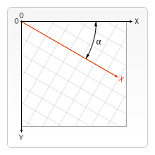

{{DefaultAPISidebar("Canvas API")}} {{PreviousNext("Web/API/Canvas_API/Tutorial/Using_images", "Web/API/Canvas_API/Tutorial/Compositing")}}

Trước đó trong hướng dẫn này, chúng ta đã tìm hiểu về [khung canvas](/en-US/docs/Web/API/Canvas_API/Tutorial/Drawing_shapes) và **không gian tọa độ**. Cho đến thời điểm hiện tại, chúng tôi chỉ sử dụng lưới mặc định và thay đổi kích thước của canvas tổng thể theo nhu cầu của mình. Với các phép biến đổi, có nhiều cách mạnh mẽ hơn để dịch gốc sang một vị trí khác, xoay lưới và thậm chí chia tỷ lệ.

## Lưu và khôi phục trạng thái

Trước khi xem xét các phương pháp chuyển đổi, chúng ta hãy xem xét hai phương pháp khác không thể thiếu khi bạn bắt đầu tạo các bản vẽ phức tạp hơn bao giờ hết.

- {{domxref("CanvasRenderingContext2D.save", "save()")}}
  - : Lưu toàn bộ trạng thái của canvas.
- {{domxref("CanvasRenderingContext2D.restore", "restore()")}}
  - : Khôi phục trạng thái canvas được lưu gần đây nhất.

Trạng thái canvas được lưu trữ trên một ngăn xếp. Mỗi khi phương thức `save()` được gọi, trạng thái vẽ hiện tại sẽ được đẩy lên ngăn xếp. Trạng thái vẽ bao gồm

- Các phép biến đổi đã được áp dụng (ví dụ: `translate`, `rotate` và `scale` – xem bên dưới).
- Giá trị hiện tại của các thuộc tính sau:
  - {{domxref("CanvasRenderingContext2D.strokeStyle", "strokeStyle")}}
  - {{domxref("CanvasRenderingContext2D.fillStyle", "fillStyle")}}
  - {{domxref("CanvasRenderingContext2D.globalAlpha", "globalAlpha")}}
  - {{domxref("CanvasRenderingContext2D.lineWidth", "lineWidth")}}
  - {{domxref("CanvasRenderingContext2D.lineCap", "lineCap")}}
  - {{domxref("CanvasRenderingContext2D.lineJoin", "lineJoin")}}
  - {{domxref("CanvasRenderingContext2D.miterLimit", "miterLimit")}}
  - {{domxref("CanvasRenderingContext2D.lineDashOffset", "lineDashOffset")}}
  - {{domxref("CanvasRenderingContext2D.shadowOffsetX", "shadowOffsetX")}}
  - {{domxref("CanvasRenderingContext2D.shadowOffsetY", "shadowOffsetY")}}
  - {{domxref("CanvasRenderingContext2D.shadowBlur", "shadowBlur")}}
  - {{domxref("CanvasRenderingContext2D.shadowColor", "shadowColor")}} -{{domxref("CanvasRenderingContext2D.globalCompositeOperation", "globalCompositeOperation")}}
  - {{domxref("CanvasRenderingContext2D.font", "font")}}
  - {{domxref("CanvasRenderingContext2D.textAlign", "textAlign")}}
- {{domxref("CanvasRenderingContext2D.textBaseline", "textBaseline")}}
  - {{domxref("CanvasRenderingContext2D.direction", "direction")}}
  - {{domxref("CanvasRenderingContext2D.imageSmoothingEnabled", "imageSmoothingEnabled")}}.
- [cutping path](/en-US/docs/Web/API/Canvas_API/Tutorial/Compositing#clipping_paths) hiện tại, chúng ta sẽ thấy trong phần tiếp theo.

Bạn có thể gọi phương thức `save()` bao nhiêu lần tùy thích. Mỗi lần phương thức `restore()` được gọi, trạng thái đã lưu cuối cùng sẽ được bật ra khỏi ngăn xếp và tất cả các cài đặt đã lưu sẽ được khôi phục.

### Ví dụ về trạng thái canvas `save` và `restore`

```js
function draw() {
  const ctx = document.getElementById("canvas").getContext("2d");

  ctx.fillRect(0, 0, 150, 150); // Draw a Black rectangle with default settings
  ctx.save(); // Save the original default state

  ctx.fillStyle = "#0099ff"; // Make changes to saved settings
  ctx.fillRect(15, 15, 120, 120); // Draw a Blue rectangle with new settings
  ctx.save(); // Save the current state

  ctx.fillStyle = "white"; // Make changes to saved settings
  ctx.globalAlpha = 0.5;
  ctx.fillRect(30, 30, 90, 90); // Draw a 50%-White rectangle with newest settings

  ctx.restore(); // Restore to previous state
  ctx.fillRect(45, 45, 60, 60); // Draw a rectangle with restored Blue setting

  ctx.restore(); // Restore to original state
  ctx.fillRect(60, 60, 30, 30); // Draw a rectangle with restored Black setting
}
```

```html hidden
<canvas id="canvas" width="150" height="150"></canvas>
```

```js hidden
draw();
```

Bước đầu tiên là vẽ một hình chữ nhật lớn với các cài đặt mặc định. Tiếp theo, chúng ta lưu trạng thái này và thực hiện các thay đổi đối với màu tô. Sau đó chúng ta vẽ hình chữ nhật màu xanh thứ hai và nhỏ hơn và lưu trạng thái. Một lần nữa chúng ta thay đổi một số cài đặt vẽ và vẽ hình chữ nhật màu trắng bán trong suốt thứ ba.

Cho đến nay điều này khá giống với những gì chúng ta đã làm trong các phần trước. Tuy nhiên, khi chúng ta gọi câu lệnh `restore()` đầu tiên, trạng thái bản vẽ trên cùng sẽ bị xóa khỏi ngăn xếp và các cài đặt sẽ được khôi phục. Nếu chúng tôi chưa lưu trạng thái bằng `save()`, chúng tôi sẽ cần thay đổi màu tô và độ trong suốt theo cách thủ công để quay lại trạng thái trước đó. Điều này sẽ dễ dàng đối với hai thuộc tính, nhưng nếu chúng ta có nhiều hơn thế, mã của chúng ta sẽ trở nên rất dài, rất nhanh.

Khi câu lệnh `restore()` thứ hai được gọi, trạng thái ban đầu (trạng thái chúng ta thiết lập trước lệnh gọi đầu tiên tới `save`) sẽ được khôi phục và hình chữ nhật cuối cùng một lần nữa được vẽ bằng màu đen.

{{EmbedLiveSample("A_save_and_restore_canvas_state_example", "", "160")}}

## Dịch

Phương thức chuyển đổi đầu tiên chúng ta sẽ xem xét là `translate()`. Phương thức này được sử dụng để di chuyển canvas và điểm gốc của nó đến một điểm khác trong lưới.

- {{domxref("CanvasRenderingContext2D.translate", "translate(x, y)")}}
  - : Di chuyển canvas và nguồn gốc của nó trên lưới. `x` cho biết khoảng cách di chuyển theo chiều ngang và `y` cho biết khoảng cách di chuyển lưới theo chiều dọc.


Bạn nên lưu trạng thái canvas trước khi thực hiện bất kỳ chuyển đổi nào. Trong hầu hết các trường hợp, việc gọi phương thức `restore` sẽ dễ dàng hơn là phải thực hiện dịch ngược lại để trở về trạng thái ban đầu. Ngoài ra, nếu bạn đang dịch bên trong một vòng lặp và không lưu và khôi phục trạng thái canvas, bạn có thể sẽ thiếu một phần bản vẽ của mình vì nó được vẽ bên ngoài mép canvas.

### Ví dụ về `translate`

Ví dụ này thể hiện một số lợi ích của việc dịch nguồn gốc canvas. Nếu không có phương pháp `translate()`, tất cả các hình chữ nhật sẽ được vẽ ở cùng một vị trí (0,0). Phương thức `translate()` cũng cho phép chúng ta tự do đặt hình chữ nhật ở bất kỳ đâu trên canvas mà không cần phải điều chỉnh tọa độ theo cách thủ công trong hàm `fillRect()`. Điều này làm cho nó dễ hiểu và dễ sử dụng hơn một chút.

Trong hàm `draw()`, chúng tôi gọi hàm `fillRect()` chín lần bằng cách sử dụng hai vòng lặp `for`. Trong mỗi vòng lặp, canvas được dịch, hình chữ nhật được vẽ và canvas được đưa trở lại trạng thái ban đầu. Lưu ý cách gọi tới `fillRect()` sử dụng cùng tọa độ mỗi lần, dựa vào `translate()` để điều chỉnh vị trí vẽ.

```js
function draw() {
  const ctx = document.getElementById("canvas").getContext("2d");
  for (let i = 0; i < 3; i++) {
    for (let j = 0; j < 3; j++) {
      ctx.save();
      ctx.fillStyle = `rgb(${51 * i} ${255 - 51 * i} 255)`;
      ctx.translate(10 + j * 50, 10 + i * 50);
      ctx.fillRect(0, 0, 25, 25);
      ctx.restore();
    }
  }
}
```

```html hidden
<canvas id="canvas" width="150" height="150"></canvas>
```

```js hidden
draw();
```

{{EmbedLiveSample("A_translate_example", "", "160")}}

## Xoay

Phương thức chuyển đổi thứ hai là `rotate()`. Chúng tôi sử dụng nó để xoay canvas xung quanh điểm gốc hiện tại.

- {{domxref("CanvasRenderingContext2D.rotate", "rotate(angle)")}}
  - : Xoay canvas theo chiều kim đồng hồ quanh điểm gốc hiện tại theo số radian `angle`.



Điểm trung tâm xoay luôn là gốc canvas. Để thay đổi điểm trung tâm, chúng ta sẽ cần di chuyển canvas bằng phương pháp `translate()`.

### Ví dụ về `rotate`

Trong ví dụ này, chúng ta sẽ sử dụng phương pháp `rotate()` để xoay hình chữ nhật trước tiên từ gốc canvas, sau đó từ tâm của hình chữ nhật với sự trợ giúp của `translate()`.

> [!NOTE]
> Góc được tính bằng radian, không phải độ. Để chuyển đổi, chúng tôi đang sử dụng: `radians = (Math.PI/180)*degrees`.

```js
function draw() {
  const ctx = document.getElementById("canvas").getContext("2d");

  // left rectangles, rotate from canvas origin
  ctx.save();
  // blue rect
  ctx.fillStyle = "#0095DD";
  ctx.fillRect(30, 30, 100, 100);
  ctx.rotate((Math.PI / 180) * 25);
  // grey rect
  ctx.fillStyle = "#4D4E53";
  ctx.fillRect(30, 30, 100, 100);
  ctx.restore();

  // right rectangles, rotate from rectangle center
  // draw blue rect
  ctx.fillStyle = "#0095DD";
  ctx.fillRect(150, 30, 100, 100);

  ctx.translate(200, 80); // translate to rectangle center
  // x = x + 0.5 * width
  // y = y + 0.5 * height
  ctx.rotate((Math.PI / 180) * 25); // rotate
  ctx.translate(-200, -80); // translate back

  // draw grey rect
  ctx.fillStyle = "#4D4E53";
  ctx.fillRect(150, 30, 100, 100);
}
```

Để xoay hình chữ nhật xung quanh tâm của chính nó, chúng ta dịch canvas vào giữa hình chữ nhật, sau đó xoay canvas, sau đó dịch canvas về 0,0, rồi vẽ hình chữ nhật.

```html hidden
<canvas id="canvas" width="300" height="200"></canvas>
```

```js hidden
draw();
```

{{EmbedLiveSample("A_rotate_example", "", "220")}}

## Chia tỷ lệ

Phương thức chuyển đổi tiếp theo là chia tỷ lệ. Chúng tôi sử dụng nó để tăng hoặc giảm các đơn vị trong lưới canvas của mình. Điều này có thể được sử dụng để vẽ các hình dạng và bitmap được thu nhỏ hoặc phóng to.

- {{domxref("CanvasRenderingContext2D.scale", "scale(x, y)")}}
  - : Chia tỷ lệ các đơn vị canvas theo x theo chiều ngang và theo y theo chiều dọc. Cả hai tham số đều là số thực. Các giá trị nhỏ hơn 1,0 sẽ làm giảm kích thước đơn vị và các giá trị trên 1,0 sẽ làm tăng kích thước đơn vị. Giá trị 1,0 để các đơn vị có cùng kích thước.

Sử dụng số âm, bạn có thể thực hiện phản chiếu trục (ví dụ: sử dụng `translate(0,canvas.height); scale(1,-1);`, bạn sẽ có hệ tọa độ Descartes nổi tiếng, với gốc tọa độ ở góc dưới bên trái).

Theo mặc định, một đơn vị trên canvas chính xác là một pixel. Ví dụ: nếu chúng ta áp dụng hệ số tỷ lệ là 0,5 thì đơn vị kết quả sẽ là 0,5 pixel và do đó các hình dạng sẽ được vẽ ở kích thước bằng một nửa. Theo cách tương tự, việc đặt hệ số tỷ lệ thành 2.0 sẽ tăng kích thước đơn vị và một đơn vị giờ đây sẽ trở thành hai pixel. Điều này dẫn đến hình dạng được vẽ lớn gấp đôi.

### Ví dụ về `scale`

Trong ví dụ cuối cùng này, chúng ta sẽ vẽ các hình có hệ số tỷ lệ khác nhau.

```js
function draw() {
  const ctx = document.getElementById("canvas").getContext("2d");

  // draw a simple rectangle, but scale it.
  ctx.save();
  ctx.scale(10, 3);
  ctx.fillRect(1, 10, 10, 10);
  ctx.restore();

  // mirror horizontally
  ctx.scale(-1, 1);
  ctx.font = "48px serif";
  ctx.fillText("MDN", -135, 120);
}
```

```html hidden
<canvas id="canvas" width="150" height="150"></canvas>
```

```js hidden
draw();
```

{{EmbedLiveSample("A_scale_example", "", "160")}}

## Biến đổi

Cuối cùng, các phương pháp chuyển đổi sau đây cho phép sửa đổi trực tiếp ma trận chuyển đổi.

- {{domxref("CanvasRenderingContext2D.transform", "transform(a, b, c, d, e, f)")}}
  - : Nhân ma trận biến đổi hiện tại với ma trận được mô tả bởi các đối số của nó. Ma trận biến đổi được mô tả bởi:

<!-- prettier-ignore-start -->

<math display="block">
      <semantics><mrow><mo>[</mo><mtable columnalign="center center center" rowspacing="0.5ex"><mtr><mtd><mi>a</mi></mtd><mtd><mi>c</mi></mtd> <mtd><mi>e</mi></mtd></mtr><mtr><mtd><mi>b</mi></mtd><mtd><mi>dZZPH27Z Z</mtd><mtd><mi>f</mi></mtd></mtr><mtr><mtd><mn>0</mn></mtd><mtd>ZZPH40Z Z0</mn></mtd><mtd><mn>1</mn></mtd></mtr></mtable><mo>]</mo></mrow><annotation encoding="TeX">\left[ \begin{array}{ccc} a & c & e \\ b & d & f \\ 0 & 0 & 1 \end{array} \right]</annotation></semantics>
    </math>
    <!-- prettier-ignore-end -->

Nếu bất kỳ đối số nào là [`Infinity`](/en-US/docs/Web/JavaScript/Reference/Global_Objects/Infinity) thì ma trận biến đổi phải được đánh dấu là vô hạn thay vì phương thức đưa ra một ngoại lệ.

Các tham số của chức năng này là:

-`a` (`m11`)

- : Tỉ lệ theo chiều ngang. -`b` (`m12`)
- : Độ lệch ngang. -`c` (`m21`)
- : Nghiêng dọc. -`d` (`m22`)
- : Tỉ lệ theo chiều dọc. -`e` (`dx`)
- : Di chuyển ngang. -`f` (`dy`)
- : Di chuyển theo chiều dọc.
- {{domxref("CanvasRenderingContext2D.setTransform", "setTransform(a, b, c, d, e, f)")}}
  - : Đặt lại phép biến đổi hiện tại thành ma trận nhận dạng, sau đó gọi phương thức `transform()` với cùng các đối số. Về cơ bản, điều này sẽ hoàn tác phép biến đổi hiện tại, sau đó thiết lập phép biến đổi đã chỉ định, tất cả chỉ trong một bước.
- {{domxref("CanvasRenderingContext2D.resetTransform", "resetTransform()")}}
  - : Đặt lại phép biến đổi hiện tại thành ma trận nhận dạng. Điều này cũng giống như cách gọi: `ctx.setTransform(1, 0, 0, 1, 0, 0);`

### Ví dụ cho `transform` và `setTransform`

```js
function draw() {
  const ctx = document.getElementById("canvas").getContext("2d");

  const sin = Math.sin(Math.PI / 6);
  const cos = Math.cos(Math.PI / 6);
  ctx.translate(100, 100);
  let c = 0;
  for (let i = 0; i <= 12; i++) {
    c = Math.floor((255 / 12) * i);
    ctx.fillStyle = `rgb(${c} ${c} ${c})`;
    ctx.fillRect(0, 0, 100, 10);
    ctx.transform(cos, sin, -sin, cos, 0, 0);
  }

  ctx.setTransform(-1, 0, 0, 1, 100, 100);
  ctx.fillStyle = "rgb(255 128 255 / 50%)";
  ctx.fillRect(0, 50, 100, 100);
}
```

```html hidden
<canvas id="canvas" width="200" height="250"></canvas>
```

```js hidden
draw();
```

{{EmbedLiveSample("Example_for_transform_and_setTransform", "", "260")}}

{{PreviousNext("Web/API/Canvas_API/Tutorial/Using_images", "Web/API/Canvas_API/Tutorial/Compositing")}}
