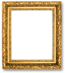
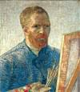
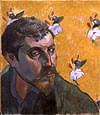
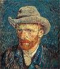
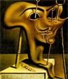
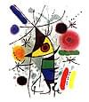

{{DefaultAPISidebar("Canvas API")}} {{PreviousNext("Web/API/Canvas_API/Tutorial/Drawing_text", "Web/API/Canvas_API/Tutorial/Transformations" )}}

Cho đến bây giờ chúng tôi đã tạo [shapes](/en-US/docs/Web/API/Canvas_API/Tutorial/Drawing_shapes) của riêng mình và [áp dụng styles](/en-US/docs/Web/API/Canvas_API/Tutorial/Applying_styles_and_colors) cho chúng. Một trong những tính năng thú vị hơn của {{HTMLElement("canvas")}} là khả năng sử dụng hình ảnh. Chúng có thể được sử dụng để thực hiện việc tổng hợp ảnh động hoặc làm phông nền cho đồ thị, cho các họa tiết trong trò chơi, v.v. Hình ảnh bên ngoài có thể được sử dụng ở bất kỳ định dạng nào được trình duyệt hỗ trợ, chẳng hạn như PNG, GIF hoặc JPEG. Bạn thậm chí có thể sử dụng hình ảnh được tạo bởi các phần tử canvas khác trên cùng một trang với nguồn!

Nhập hình ảnh vào canvas về cơ bản là một quá trình gồm hai bước:

1. Lấy tham chiếu đến đối tượng {{domxref("HTMLImageElement")}} hoặc đến phần tử canvas khác làm nguồn. Cũng có thể sử dụng hình ảnh bằng cách cung cấp URL.
2. Vẽ hình ảnh trên canvas bằng chức năng `drawImage()`.

Chúng ta hãy xem làm thế nào để làm điều này.

## Lấy hình ảnh để vẽ

API canvas có thể sử dụng bất kỳ loại dữ liệu nào sau đây làm nguồn hình ảnh:

- {{domxref("HTMLImageElement")}}
  - : Đây là những hình ảnh được tạo bằng cách sử dụng hàm tạo `Image()`, cũng như bất kỳ phần tử {{HTMLElement("img")}} nào.
- {{domxref("SVGImageElement")}}
  - : Đây là những hình ảnh được nhúng bằng phần tử {{SVGElement("image")}}.
- {{domxref("HTMLVideoElement")}}
  - : Sử dụng phần tử HTML {{HTMLElement("video")}} làm nguồn hình ảnh của bạn lấy khung hình hiện tại từ video và sử dụng nó làm hình ảnh.
- {{domxref("HTMLCanvasElement")}}
  - : Bạn có thể sử dụng phần tử {{HTMLElement("canvas")}} khác làm nguồn hình ảnh của mình.
- {{domxref("ImageBitmap")}}
  - : Một hình ảnh bitmap, cuối cùng đã được cắt xén. Loại như vậy được sử dụng để trích xuất một phần hình ảnh, _sprite_, từ hình ảnh lớn hơn
- {{domxref("OffscreenCanvas")}}
  - : Một loại `<canvas>` đặc biệt không được hiển thị và được chuẩn bị mà không được hiển thị. Việc sử dụng nguồn hình ảnh như vậy cho phép chuyển sang nguồn hình ảnh đó mà người dùng không thể nhìn thấy thành phần nội dung.
- {{domxref("VideoFrame")}}
  - : Một hình ảnh đại diện cho một khung hình duy nhất của video.

Có một số cách để lấy hình ảnh để sử dụng trên canvas.

### Sử dụng hình ảnh từ cùng một trang

Chúng ta có thể lấy tham chiếu đến hình ảnh trên cùng một trang với canvas bằng cách sử dụng một trong:

- Bộ sưu tập {{domxref("document.images")}}
- Phương thức {{domxref("document.getElementsByTagName()")}}
- Nếu bạn biết ID của hình ảnh cụ thể mà bạn muốn sử dụng, bạn có thể sử dụng {{domxref("document.getElementById()")}} để truy xuất hình ảnh cụ thể đó

Nếu bạn muốn sử dụng nhiều hình ảnh hoặc [tài nguyên tải chậm](/en-US/docs/Web/Performance/Guides/Lazy_loading), bạn có thể phải đợi tất cả các tệp có sẵn trước khi vẽ lên canvas.
Ví dụ bên dưới xử lý nhiều hình ảnh bằng chức năng không đồng bộ và [`Promise.all`](/en-US/docs/Web/JavaScript/Reference/Global_Objects/Promise/all) để đợi tất cả hình ảnh tải trước khi gọi `drawImage()`:

```js
async function draw() {
  // Wait for all images to be loaded:
  await Promise.all(
    Array.from(document.images).map(
      (image) =>
        new Promise((resolve) => image.addEventListener("load", resolve)),
    ),
  );

  const ctx = document.getElementById("canvas").getContext("2d");
  // call drawImage() as usual
}
draw();
```

### Tạo hình ảnh từ đầu

Một tùy chọn khác là tạo các đối tượng {{domxref("HTMLImageElement")}} mới trong tập lệnh của chúng tôi. Để làm điều này, chúng ta có sự tiện lợi của hàm tạo `Image()`:

```js
const img = new Image(); // Create new img element
img.src = "myImage.png"; // Set source path
```

Khi tập lệnh này được thực thi, hình ảnh sẽ bắt đầu tải, nhưng nếu bạn cố gọi `drawImage()` trước khi hình ảnh tải xong, nó sẽ không làm gì cả.
Các trình duyệt cũ hơn thậm chí có thể đưa ra một ngoại lệ, vì vậy bạn cần đảm bảo sử dụng [load event](/en-US/docs/Web/API/HTMLElement/load_event) để không vẽ hình ảnh lên canvas trước khi nó sẵn sàng:

```js
const ctx = document.getElementById("canvas").getContext("2d");
const img = new Image();

img.addEventListener("load", () => {
  ctx.drawImage(img, 0, 0);
});

img.src = "myImage.png";
```

Cho dù bạn có các phần tử `` trong đánh dấu của mình hay bạn tạo chúng theo chương trình bằng JavaScript, hình ảnh bên ngoài có thể có [các hạn chế CORS](/en-US/docs/Web/HTTP/Guides/CORS). Theo mặc định, hình ảnh được tìm nạp bên ngoài [làm hỏng canvas](/en-US/docs/Web/HTML/How_to/CORS_enabled_image#security_and_tainted_canvases), ngăn trang web của bạn đọc dữ liệu có nguồn gốc chéo. Sử dụng thuộc tính [`crossorigin`](/en-US/docs/Web/HTML/Reference/Elements/img#crossorigin) của phần tử {{HTMLElement("img")}} (được phản ánh bởi thuộc tính {{domxref("HTMLImageElement.crossOrigin")}}), bạn có thể yêu cầu quyền tải hình ảnh từ một miền khác bằng CORS. Nếu miền lưu trữ cho phép truy cập vào hình ảnh trên nhiều miền thì hình ảnh đó có thể được sử dụng trong canvas của bạn mà không làm hỏng nó.

### Nhúng hình ảnh qua dữ liệu: URL

Một cách khả thi khác để đưa hình ảnh vào là thông qua [dữ liệu: URL](/en-US/docs/Web/URI/Reference/Schemes/data). URL dữ liệu cho phép bạn xác định hoàn toàn hình ảnh dưới dạng chuỗi ký tự được mã hóa Base64 trực tiếp trong mã của bạn.

```js
const img = new Image(); // Create new img element
img.src =
  "data:image/gif;base64,R0lGODlhCwALAIAAAAAA3pn/ZiH5BAEAAAEALAAAAAALAAsAAAIUhA+hkcuO4lmNVindo7qyrIXiGBYAOw==";
```

Một ưu điểm của URL dữ liệu là hình ảnh thu được sẽ có sẵn ngay lập tức mà không cần phải quay lại máy chủ. Một lợi thế tiềm năng khác là nó cũng có thể gói gọn trong một tệp tất cả [CSS](/en-US/docs/Web/CSS), [JavaScript](/en-US/docs/Web/JavaScript), [HTML](/en-US/docs/Web/HTML) và hình ảnh] của bạn, giúp nó dễ di chuyển đến các vị trí khác hơn.

Một số nhược điểm của phương pháp này là hình ảnh của bạn không được lưu vào bộ nhớ đệm và đối với những hình ảnh lớn hơn, URL được mã hóa có thể trở nên khá dài.

### Sử dụng các phần tử canvas khác

Cũng giống như hình ảnh thông thường, chúng tôi truy cập các phần tử canvas khác bằng phương pháp {{domxref("document.getElementsByTagName()")}} hoặc {{domxref("document.getElementById()")}}. Hãy chắc chắn rằng bạn đã vẽ thứ gì đó vào canvas nguồn trước khi sử dụng nó trong canvas mục tiêu của mình.

Một trong những cách sử dụng thực tế hơn của tính năng này là sử dụng phần tử canvas thứ hai làm chế độ xem hình thu nhỏ của canvas lớn hơn khác.

### Sử dụng khung hình từ video

Bạn cũng có thể sử dụng các khung hình từ video được trình bày bởi phần tử {{HTMLElement("video")}} (ngay cả khi video không hiển thị). Ví dụ: nếu bạn có phần tử {{HTMLElement("video")}} có ID "myVideo", bạn có thể thực hiện việc này:

```js
const video = document.getElementById("myVideo");
video.currentTime = 10; // Seek to 10 seconds into the video
video.pause(); // Pause the video to freeze the frame
```

Bây giờ {{domxref("HTMLVideoElement")}} ở mốc 10 giây và bạn có thể vẽ khung hiện tại vào canvas của mình. Để đảm bảo rằng khung có sẵn khi bạn gọi `drawImage()`, hãy gọi `drawImage()` trong [`requestVideoFrameCallback()`](/en-US/docs/Web/API/HTMLVideoElement/requestVideoFrameCallback#drawing_video_frames_on_a_canvas).

## Vẽ hình ảnh

Khi chúng ta có tham chiếu đến đối tượng hình ảnh nguồn, chúng ta có thể sử dụng phương thức `drawImage()` để hiển thị nó trên canvas. Như chúng ta sẽ thấy sau, phương thức `drawImage()` bị quá tải và có một số biến thể. Ở dạng cơ bản nhất, nó trông như thế này:

- {{domxref("CanvasRenderingContext2D.drawImage", "drawImage(image, x, y)")}}
  - : Vẽ hình ảnh được chỉ định bởi tham số `image` tại tọa độ (`x`, `y`).

> [!NOTE]
> Hình ảnh SVG phải chỉ định chiều rộng và chiều cao trong phần tử \<svg> gốc.

### Ví dụ: Biểu đồ đường nhỏ

Trong ví dụ sau, chúng ta sẽ sử dụng hình ảnh bên ngoài làm nền cho biểu đồ đường nhỏ. Việc sử dụng phông nền có thể làm cho tập lệnh của bạn nhỏ hơn đáng kể vì chúng ta có thể tránh được việc phải sử dụng mã để tạo nền. Trong ví dụ này, chúng tôi chỉ sử dụng một hình ảnh, vì vậy tôi sử dụng trình xử lý sự kiện `load` của đối tượng hình ảnh để thực thi các câu lệnh vẽ. Phương thức `drawImage()` đặt phông nền ở tọa độ (0, 0), là góc trên cùng bên trái của canvas.

```html hidden
<canvas id="canvas" width="180" height="150"></canvas>
```

```js
function draw() {
  const ctx = document.getElementById("canvas").getContext("2d");
  const img = new Image();
  img.onload = () => {
    ctx.drawImage(img, 0, 0);
    ctx.beginPath();
    ctx.moveTo(30, 96);
    ctx.lineTo(70, 66);
    ctx.lineTo(103, 76);
    ctx.lineTo(170, 15);
    ctx.stroke();
  };
  img.src = "backdrop.png";
}

draw();
```

Biểu đồ kết quả trông như thế này:

{{EmbedLiveSample("Example_A_simple_line_graph", "", "160")}}

## Chia tỷ lệ

Biến thể thứ hai của phương pháp `drawImage()` thêm hai tham số mới và cho phép chúng tôi đặt các hình ảnh được chia tỷ lệ trên canvas.

- {{domxref("CanvasRenderingContext2D.drawImage", "drawImage(image, x, y, width, height)")}}
  - : Điều này thêm các tham số `width` và `height`, cho biết kích thước để chia tỷ lệ hình ảnh khi vẽ nó lên canvas.

### Ví dụ: Xếp lát một hình ảnh

Trong ví dụ này, chúng tôi sẽ sử dụng hình ảnh làm hình nền và lặp lại hình ảnh đó nhiều lần trên canvas. Điều này được thực hiện bằng cách lặp lại và đặt các hình ảnh được chia tỷ lệ ở các vị trí khác nhau. Trong mã bên dưới, vòng lặp `for` đầu tiên lặp qua các hàng. Vòng lặp `for` thứ hai lặp qua các cột. Hình ảnh được chia tỷ lệ thành một phần ba kích thước ban đầu của nó, là 50x38 pixel.

> [!NOTE]
> Hình ảnh có thể bị mờ khi tăng tỷ lệ hoặc bị nhiễu hạt nếu giảm tỷ lệ quá nhiều. Việc chia tỷ lệ có lẽ tốt nhất là không nên thực hiện nếu bạn có một số văn bản trong đó cần phải rõ ràng.

```html hidden
<canvas id="canvas" width="150" height="150"></canvas>
```

```js
function draw() {
  const ctx = document.getElementById("canvas").getContext("2d");
  const img = new Image();
  img.onload = () => {
    for (let i = 0; i < 4; i++) {
      for (let j = 0; j < 3; j++) {
        ctx.drawImage(img, j * 50, i * 38, 50, 38);
      }
    }
  };
  img.src = "https://mdn.github.io/shared-assets/images/examples/rhino.jpg";
}

draw();
```

Canvas kết quả trông như thế này:

{{EmbedLiveSample("Example_Tiling_an_image", "", "160")}}

## Cắt lát

Biến thể thứ ba và cuối cùng của phương pháp `drawImage()` có tám tham số ngoài nguồn hình ảnh. Nó cho phép chúng ta cắt một phần của hình ảnh nguồn, sau đó chia tỷ lệ và vẽ nó trên canvas của mình.

- {{domxref("CanvasRenderingContext2D.drawImage", "drawImage(image, sx, sy, sWidth, sHeight, dx, dy, dWidth, dHeight)")}}
  - : Với `image`, hàm này lấy vùng của hình ảnh nguồn được chỉ định bởi hình chữ nhật có góc trên cùng bên trái là (`sx`, `sy`) và có chiều rộng và chiều cao là `sWidth` và `sHeight` rồi vẽ nó vào canvas, đặt nó trên canvas tại (`dx`, `dy`) và chia tỷ lệ theo kích thước được chỉ định bởi `dWidth` và `dHeight`, duy trì nó {{glossary("aspect ratio")}}.

Để thực sự hiểu điều này làm gì, có thể hữu ích khi nhìn vào hình ảnh này:


Bốn tham số đầu tiên xác định vị trí và kích thước của lát cắt trên ảnh nguồn. Bốn tham số cuối cùng xác định hình chữ nhật để vẽ hình ảnh trên canvas đích.

Cắt lát có thể là một công cụ hữu ích khi bạn muốn tạo bố cục. Bạn có thể có tất cả các phần tử trong một tệp hình ảnh duy nhất và sử dụng phương pháp này để tổng hợp một bản vẽ hoàn chỉnh. Ví dụ: nếu bạn muốn tạo biểu đồ, bạn có thể có hình ảnh PNG chứa tất cả văn bản cần thiết trong một tệp duy nhất và tùy thuộc vào dữ liệu của bạn, bạn có thể thay đổi tỷ lệ biểu đồ của mình khá dễ dàng. Một ưu điểm khác là bạn không cần tải từng hình ảnh riêng lẻ, điều này có thể cải thiện hiệu suất tải.

### Ví dụ: Đóng khung hình ảnh

Trong ví dụ này, chúng ta sẽ sử dụng cùng một con tê giác như trong ví dụ trước, nhưng chúng ta sẽ cắt phần đầu của nó và ghép nó vào một khung ảnh. Hình ảnh khung ảnh là PNG 24 bit bao gồm bóng đổ. Bởi vì hình ảnh PNG 24 bit bao gồm kênh alpha 8 bit đầy đủ, không giống như hình ảnh GIF và PNG 8 bit, nó có thể được đặt trên bất kỳ nền nào mà không phải lo lắng về màu mờ.

```html
<canvas id="canvas" width="150" height="150"></canvas>
<div class="hidden">
  
  
</div>
```

```css hidden
.hidden {
  display: none;
}
```

```js
async function draw() {
  // Wait for all images to be loaded.
  await Promise.all(
    Array.from(document.images).map(
      (image) =>
        new Promise((resolve) => image.addEventListener("load", resolve)),
    ),
  );

  const canvas = document.getElementById("canvas");
  const ctx = canvas.getContext("2d");

  // Draw slice
  ctx.drawImage(
    document.getElementById("source"),
    33,
    71,
    104,
    124,
    21,
    20,
    87,
    104,
  );

  // Draw frame
  ctx.drawImage(document.getElementById("frame"), 0, 0);
}

draw();
```

Lần này chúng tôi đã thực hiện một cách tiếp cận khác để tải hình ảnh. Thay vì tải chúng bằng cách tạo đối tượng {{domxref("HTMLImageElement")}} mới, chúng tôi đã đưa chúng dưới dạng thẻ {{HTMLElement("img")}} vào nguồn HTML của mình và truy xuất hình ảnh từ những hình ảnh đó khi vẽ lên canvas. Hình ảnh được ẩn khỏi trang bằng cách đặt thuộc tính CSS {{cssxref("display")}} thành `none` cho những hình ảnh đó.

{{EmbedLiveSample("example_framing_an_image", "", "160")}}

Mỗi {{HTMLElement("img")}} được gán một thuộc tính ID, vì vậy chúng tôi có một thuộc tính cho `source` và một cho `frame`, giúp dễ dàng chọn chúng bằng {{domxref("document.getElementById()")}}.
Chúng tôi đang sử dụng [Promise.all](/en-US/docs/Web/JavaScript/Reference/Global_Objects/Promise/all) để đợi tất cả hình ảnh tải trước khi gọi `drawImage()`.
`drawImage()` cắt con tê giác ra khỏi hình ảnh đầu tiên và chia tỷ lệ nó trên canvas.
Cuối cùng, chúng tôi vẽ khung ảnh bằng lệnh gọi `drawImage()` thứ hai.

## Ví dụ về phòng trưng bày nghệ thuật

Trong ví dụ cuối cùng của chương này, chúng ta sẽ xây dựng một phòng trưng bày nghệ thuật nhỏ. Thư viện bao gồm một bảng chứa một số hình ảnh. Khi trang được tải, phần tử {{HTMLElement("canvas")}} sẽ được chèn vào mỗi hình ảnh và một khung được vẽ xung quanh nó.

Trong trường hợp này, mọi hình ảnh đều có chiều rộng và chiều cao cố định, cũng như khung được vẽ xung quanh chúng. Bạn có thể nâng cao tập lệnh để tập lệnh sử dụng chiều rộng và chiều cao của hình ảnh để làm cho khung vừa vặn hoàn hảo xung quanh nó.

Trong mã bên dưới, chúng tôi đang sử dụng [Promise.all](/en-US/docs/Web/JavaScript/Reference/Global_Objects/Promise/all) để đợi tất cả hình ảnh tải trước khi vẽ bất kỳ hình ảnh nào lên canvas.
Chúng tôi lặp qua vùng chứa {{domxref("document.images")}} và thêm các phần tử canvas mới cho mỗi vùng chứa. Một điều khác cần lưu ý là việc sử dụng phương pháp {{domxref("Node.insertBefore")}}. `insertBefore()` là một phương thức của nút cha (ô bảng) của phần tử (hình ảnh) mà chúng ta muốn chèn nút mới (phần tử canvas) trước đó.

```html
<table>
  <tbody>
    <tr>
      <td></td>
      <td></td>
      <td></td>
      <td></td>
    </tr>
    <tr>
      <td></td>
      <td></td>
      <td></td>
      <td></td>
    </tr>
  </tbody>
</table>

```

Và đây là một số CSS để làm cho mọi thứ trông đẹp hơn:

```css
body {
  background: 0 -100px repeat-x url("bg_gallery.png") #4f191a;
  margin: 10px;
}

img {
  display: none;
}

table {
  margin: 0 auto;
}

td {
  padding: 15px;
}
```

Kết hợp tất cả lại với nhau là JavaScript để vẽ các hình ảnh được đóng khung của chúng tôi:

```js
async function draw() {
  // Wait for all images to be loaded.
  await Promise.all(
    Array.from(document.images).map(
      (image) =>
        new Promise((resolve) => image.addEventListener("load", resolve)),
    ),
  );

  // Loop through all images.
  for (const image of document.images) {
    // Don't add a canvas for the frame image
    if (image.getAttribute("id") !== "frame") {
      // Create canvas element
      const canvas = document.createElement("canvas");
      canvas.setAttribute("width", 132);
      canvas.setAttribute("height", 150);

      // Insert before the image
      image.parentNode.insertBefore(canvas, image);

      ctx = canvas.getContext("2d");

      // Draw image to canvas
      ctx.drawImage(image, 15, 20);

      // Add frame
      ctx.drawImage(document.getElementById("frame"), 0, 0);
    }
  }
}

draw();
```

{{EmbedLiveSample("Art_gallery_example", 725, 400)}}

## Kiểm soát hành vi chia tỷ lệ hình ảnh

Như đã đề cập trước đây, việc chia tỷ lệ hình ảnh có thể dẫn đến hiện tượng mờ hoặc tạo khối do quá trình chia tỷ lệ. Bạn có thể sử dụng thuộc tính {{domxref("CanvasRenderingContext2D.imageSmoothingEnabled", "imageSmoothingEnabled")}} của ngữ cảnh vẽ để kiểm soát việc sử dụng các thuật toán làm mịn hình ảnh khi chia tỷ lệ hình ảnh trong ngữ cảnh của bạn. Theo mặc định, đây là `true`, nghĩa là hình ảnh sẽ được làm mịn khi thu nhỏ.

{{PreviousNext("Web/API/Canvas_API/Tutorial/Drawing_text", "Web/API/Canvas_API/Tutorial/Transformations")}}
