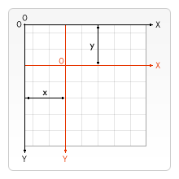

{{APIRef("Canvas API")}}

Phương thức **`CanvasRenderingContext2D.translate()`** của API Canvas 2D thêm phép biến đổi dịch vào ma trận hiện tại.

## Cú pháp

```js-nolint
translate(x, y)
```

Phương thức`translate()`thêm phép chuyển đổi dịch sang ma trận hiện tại bằng cách di chuyển khung vẽ và các đơn vị`x`gốc của nó theo chiều ngang và các đơn vị`y`theo chiều dọc trên lưới.



### Tham số

- `x`
  - : Khoảng cách di chuyển theo hướng ngang. Các giá trị dương ở bên phải và
    âm sang trái.
- `y`
  - : Khoảng cách di chuyển theo hướng thẳng đứng. Giá trị dương giảm và giá trị âm
    đang lên.

### Giá trị trả về

Không có ({{jsxref("undefined")}}).

## Ví dụ

### Di chuyển một hình dạng

Ví dụ này vẽ một hình vuông được di chuyển từ vị trí mặc định của nó bằng phương thức`translate()`. Sau đó, một hình vuông không di chuyển có cùng kích thước sẽ được rút ra để so sánh.

#### HTML

```html
<canvas id="canvas"></canvas>
```

#### JavaScript

Phương thức`translate()`dịch ngữ cảnh theo chiều ngang 110 và chiều dọc 30. Hình vuông đầu tiên được dịch chuyển một lượng so với vị trí mặc định của nó.

```js
const canvas = document.getElementById("canvas");
const ctx = canvas.getContext("2d");

// Moved square
ctx.translate(110, 30);
ctx.fillStyle = "red";
ctx.fillRect(0, 0, 80, 80);

// Reset current transformation matrix to the identity matrix
ctx.setTransform(1, 0, 0, 1, 0, 0);

// Unmoved square
ctx.fillStyle = "gray";
ctx.fillRect(0, 0, 80, 80);
```

#### Kết quả

Hình vuông đã di chuyển có màu đỏ và hình vuông không di chuyển có màu xám.

{{ EmbedLiveSample('Moving_a_shape', 700, 180) }}

## Thông số kỹ thuật

{{Specifications}}

## Tương thích trình duyệt

{{Compat}}

## Xem thêm

- Giao diện xác định phương thức này:{{domxref("CanvasRenderingContext2D")}}
