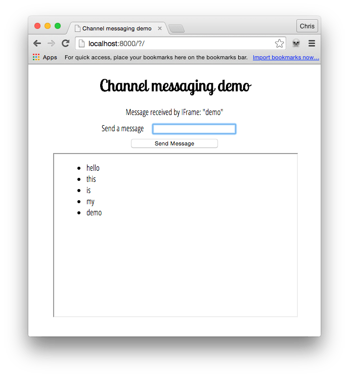

{{DefaultAPISidebar("Channel Messaging API")}} {{AvailableInWorkers}}

[Channel Messaging API](/vi/docs/Web/API/Channel_Messaging_API) cho phép hai script riêng biệt đang chạy trong các ngữ cảnh duyệt khác nhau được gắn với cùng một tài liệu (ví dụ: hai phần tử {{HTMLElement("iframe")}}, tài liệu chính và một {{HTMLElement("iframe")}}, hoặc hai tài liệu thông qua một {{domxref("SharedWorker")}}) giao tiếp trực tiếp, truyền thông điệp qua lại với nhau thông qua các kênh hai chiều (hoặc pipe) với một cổng ở mỗi đầu.

Trong bài viết này, chúng ta sẽ tìm hiểu những điều cơ bản về cách dùng công nghệ này.

## Trường hợp sử dụng

Channel messaging chủ yếu hữu ích trong các trường hợp bạn có một trang web xã hội nhúng các khả năng từ những trang web khác vào giao diện chính thông qua iframe, chẳng hạn như trò chơi, sổ địa chỉ hoặc trình phát âm thanh với các lựa chọn nhạc được cá nhân hóa. Khi các thành phần này hoạt động như những đơn vị độc lập thì mọi thứ đều ổn, nhưng khó khăn xuất hiện khi bạn muốn có sự tương tác giữa trang chính và các phần tử {{HTMLElement("iframe")}}, hoặc giữa các phần tử {{HTMLElement("iframe")}} khác nhau. Ví dụ, nếu bạn muốn thêm một liên hệ vào sổ địa chỉ từ trang chính, thêm điểm cao từ trò chơi vào hồ sơ chính, hoặc thêm các lựa chọn nhạc nền mới từ trình phát âm thanh vào trò chơi thì sao? Những việc như vậy không dễ thực hiện bằng công nghệ web thông thường, vì các mô hình bảo mật mà web sử dụng. Bạn phải cân nhắc xem các origin có tin cậy lẫn nhau hay không, và thông điệp sẽ được truyền như thế nào.

Ngược lại, các kênh thông điệp có thể cung cấp một kênh an toàn cho phép bạn truyền dữ liệu giữa các ngữ cảnh duyệt khác nhau.

> [!NOTE]
> Để biết thêm thông tin và ý tưởng, phần [Ports as the basis of an object-capability model on the Web](https://html.spec.whatwg.org/multipage/comms.html#ports-as-the-basis-of-an-object-capability-model-on-the-web) trong đặc tả là một tài liệu đáng đọc.

## Ví dụ đơn giản

Để giúp bạn bắt đầu, chúng tôi đã phát hành một vài bản demo trên GitHub. Trước hết, hãy xem [demo cơ bản về channel messaging](https://github.com/mdn/dom-examples/tree/main/channel-messaging-basic) ([chạy thử trực tiếp](https://mdn.github.io/dom-examples/channel-messaging-basic/)), minh họa một lần truyền thông điệp rất đơn giản giữa một trang và một {{htmlelement("iframe")}} được nhúng.

Tiếp theo, hãy xem [demo gửi nhiều thông điệp](https://github.com/mdn/dom-examples/tree/main/channel-messaging-multimessage) ([chạy trực tiếp tại đây](https://mdn.github.io/dom-examples/channel-messaging-multimessage/)), minh họa một thiết lập phức tạp hơn một chút có thể gửi nhiều thông điệp giữa trang chính và một IFrame.

Chúng ta sẽ tập trung vào ví dụ thứ hai trong bài viết này, trông như sau:



## Tạo kênh

Trong trang chính của bản demo, chúng ta có một biểu mẫu đơn giản với trường nhập văn bản để nhập các thông điệp sẽ được gửi tới một {{htmlelement("iframe")}}. Chúng ta cũng có một đoạn văn mà sau này sẽ dùng để hiển thị các thông điệp xác nhận mà chúng ta nhận lại từ {{htmlelement("iframe")}}.

```js
const input = document.getElementById("message-input");
const output = document.getElementById("message-output");
const button = document.querySelector("button");
const iframe = document.querySelector("iframe");

const channel = new MessageChannel();
const port1 = channel.port1;

// Wait for the iframe to load
iframe.addEventListener("load", onLoad);

function onLoad() {
  // Listen for button clicks
  button.addEventListener("click", onClick);

  // Listen for messages on port1
  port1.onmessage = onMessage;

  // Transfer port2 to the iframe
  iframe.contentWindow.postMessage("init", "*", [channel.port2]);
}

// Post a message on port1 when the button is clicked
function onClick(e) {
  e.preventDefault();
  port1.postMessage(input.value);
}

// Handle messages received on port1
function onMessage(e) {
  output.innerHTML = e.data;
  input.value = "";
}
```

Trước tiên, chúng ta tạo một kênh thông điệp mới bằng hàm khởi tạo {{domxref("MessageChannel.MessageChannel","MessageChannel()")}}.

Khi IFrame đã tải xong, chúng ta đăng ký một bộ xử lý `onclick` cho nút và một bộ xử lý `onmessage` cho {{domxref("MessageChannel.port1")}}. Cuối cùng, chúng ta chuyển {{domxref("MessageChannel.port2")}} sang IFrame bằng phương thức {{domxref("window.postMessage")}}.

Hãy xem kỹ hơn cách dòng `iframe.contentWindow.postMessage` hoạt động. Nó nhận ba đối số:

1. Thông điệp được gửi đi. Với lần truyền cổng ban đầu này, thông điệp có thể là một chuỗi rỗng, nhưng trong ví dụ này nó được đặt là `'init'`.
2. Origin mà thông điệp sẽ được gửi tới. `*` có nghĩa là "bất kỳ origin nào".
3. Một đối tượng mà quyền sở hữu của nó được chuyển sang ngữ cảnh duyệt nhận. Trong trường hợp này, chúng ta đang chuyển {{domxref("MessageChannel.port2")}} sang IFrame để nó có thể được dùng để giao tiếp với trang chính.

Khi nút được nhấn, chúng ta ngăn biểu mẫu gửi đi theo cách thông thường rồi gửi giá trị đã nhập trong trường văn bản tới IFrame thông qua {{domxref("MessageChannel")}}.

## Nhận cổng và thông điệp trong IFrame

Trong các phần tử {{HTMLElement("iframe")}}, chúng ta có đoạn JavaScript sau:

```js
const list = document.querySelector("ul");
let port2;

// Listen for the initial port transfer message
window.addEventListener("message", initPort);

// Setup the transferred port
function initPort(e) {
  port2 = e.ports[0];
  port2.onmessage = onMessage;
}

// Handle messages received on port2
function onMessage(e) {
  const listItem = document.createElement("li");
  listItem.textContent = e.data;
  list.appendChild(listItem);
  port2.postMessage(`Message received by IFrame: "${e.data}"`);
}
```

Khi thông điệp ban đầu được nhận từ trang chính thông qua phương thức {{domxref("window.postMessage")}}, chúng ta chạy hàm `initPort`. Hàm này lưu cổng đã được chuyển giao và đăng ký một bộ xử lý `onmessage`, bộ xử lý này sẽ được gọi mỗi khi một thông điệp được truyền qua {{domxref("MessageChannel")}} của chúng ta.

Khi một thông điệp được nhận từ trang chính, chúng ta tạo một mục danh sách và chèn nó vào danh sách không thứ tự, đặt {{domxref("Node.textContent","textContent")}} của mục danh sách bằng thuộc tính `data` của sự kiện (thuộc tính này chứa thông điệp thực tế).

Tiếp theo, chúng ta gửi một thông điệp xác nhận trở lại trang chính thông qua kênh thông điệp bằng cách gọi {{domxref("MessagePort.postMessage")}} trên {{domxref("MessageChannel.port2")}} đã được chuyển ban đầu sang iframe.

## Nhận xác nhận trong trang chính

Quay lại trang chính, bây giờ hãy xem hàm xử lý `onmessage`.

```js
// Handle messages received on port1
function onMessage(e) {
  output.innerHTML = e.data;
  input.value = "";
}
```

Khi một thông điệp được nhận lại từ IFrame để xác nhận rằng thông điệp gốc đã được nhận thành công, đoạn mã này sẽ đưa thông điệp xác nhận vào một đoạn văn và xóa trường nhập văn bản để sẵn sàng cho thông điệp tiếp theo được gửi đi.

## Thông số kỹ thuật

{{Specifications}}

## Tương thích trình duyệt

{{Compat}}

## Xem thêm

- [Channel Messaging API](/vi/docs/Web/API/Channel_Messaging_API)
- [Web Workers API](/en-US/docs/Web/API/Web_Workers_API)
- [Broadcast Channel API](/en-US/docs/Web/API/Broadcast_Channel_API)
