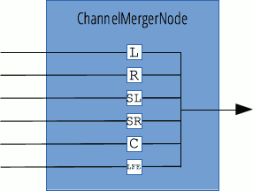

{{APIRef("Web Audio API")}}

Giao diện `ChannelMergerNode`, thường được dùng cùng với đối tượng ngược lại của nó là {{domxref("ChannelSplitterNode")}}, sẽ hợp nhất nhiều đầu vào mono khác nhau thành một đầu ra duy nhất. Mỗi đầu vào được dùng để lấp đầy một kênh của đầu ra. Điều này hữu ích khi cần truy cập riêng từng kênh, chẳng hạn để thực hiện trộn kênh khi mức gain phải được điều khiển độc lập trên từng kênh.

`ChannelMergerNode` có một đầu ra duy nhất, nhưng có số lượng đầu vào bằng với số kênh cần hợp nhất; số đầu vào được xác định như một tham số của hàm tạo và lời gọi tới {{domxref("BaseAudioContext/createChannelMerger", "AudioContext.createChannelMerger()")}}. Nếu không cung cấp giá trị nào, giá trị mặc định sẽ là `6`.

Khi dùng `ChannelMergerNode`, có thể tạo ra đầu ra có nhiều kênh hơn số kênh mà phần cứng kết xuất có thể xử lý. Trong trường hợp đó, khi tín hiệu được gửi tới đối tượng {{domxref("BaseAudioContext/listener", "AudioContext.listener")}}, các kênh dư ra sẽ bị bỏ qua.

{{InheritanceDiagram}}

<table class="properties">
  <tbody>
    <tr>
      <th scope="row">Số lượng đầu vào</th>
      <td>biến thiên; mặc định là <code>6</code>.</td>
    </tr>
    <tr>
      <th scope="row">Số lượng đầu ra</th>
      <td><code>1</code></td>
    </tr>
    <tr>
      <th scope="row">Chế độ số lượng kênh</th>
      <td><code>"explicit"</code></td>
    </tr>
    <tr>
      <th scope="row">Số lượng kênh</th>
      <td><code>2</code> (không dùng trong chế độ đếm mặc định)</td>
    </tr>
    <tr>
      <th scope="row">Cách diễn giải kênh</th>
      <td><code>"speakers"</code></td>
    </tr>
  </tbody>
</table>

## Hàm tạo

- {{domxref("ChannelMergerNode.ChannelMergerNode()", "ChannelMergerNode()")}}
  - : Tạo một thực thể đối tượng `ChannelMergerNode` mới.

## Thuộc tính thể hiện

_Không có thuộc tính riêng; kế thừa các thuộc tính từ đối tượng cha của nó là {{domxref("AudioNode")}}_.

## Phương thức thể hiện

_Không có phương thức riêng; kế thừa các phương thức từ đối tượng cha của nó là {{domxref("AudioNode")}}_.

## Ví dụ

Xem [`BaseAudioContext.createChannelMerger()`](/en-US/docs/Web/API/BaseAudioContext/createChannelMerger#examples) để xem mã ví dụ.

## Thông số kỹ thuật

{{Specifications}}

## Khả năng tương thích với trình duyệt

{{Compat}}

## Xem thêm

- [Sử dụng Web Audio API](/en-US/docs/Web/API/Web_Audio_API/Using_Web_Audio_API)
