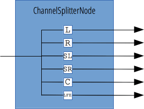

{{APIRef("Web Audio API")}}

Giao diện `ChannelSplitterNode`, thường được dùng cùng với đối tượng ngược lại của nó là {{domxref("ChannelMergerNode")}}, tách các kênh khác nhau của một nguồn âm thanh thành một tập hợp các đầu ra mono. Điều này hữu ích khi cần truy cập riêng từng kênh, ví dụ để thực hiện trộn kênh trong đó mức gain phải được điều khiển riêng trên từng kênh.

Nếu `ChannelSplitterNode` của bạn luôn chỉ có một đầu vào duy nhất, số lượng đầu ra được xác định bởi một tham số trong hàm tạo của nó và lời gọi tới {{domxref("BaseAudioContext/createChannelSplitter", "AudioContext.createChannelSplitter()")}}. Nếu không cung cấp giá trị nào, mặc định sẽ là `6`. Nếu đầu vào có ít kênh hơn số đầu ra, các đầu ra dư ra sẽ im lặng.

{{InheritanceDiagram}}

<table class="properties">
  <tbody>
    <tr>
      <th scope="row">Số lượng đầu vào</th>
      <td><code>1</code></td>
    </tr>
    <tr>
      <th scope="row">Số lượng đầu ra</th>
      <td>biến thiên; mặc định là <code>6</code>.</td>
    </tr>
    <tr>
      <th scope="row">Chế độ số lượng kênh</th>
      <td>
        <code>"explicit"</code>. Các cách triển khai cũ hơn, theo những phiên bản
        trước của đặc tả, dùng <code>"max"</code>.
      </td>
    </tr>
    <tr>
      <th scope="row">Số lượng kênh</th>
      <td>
        Cố định bằng số lượng đầu ra. Các cách triển khai cũ hơn, theo những phiên bản
        trước của đặc tả, dùng <code>2</code> (không dùng trong chế độ đếm mặc định).
      </td>
    </tr>
    <tr>
      <th scope="row">Cách diễn giải kênh</th>
      <td><code>"discrete"</code></td>
    </tr>
  </tbody>
</table>

## Hàm tạo

- {{domxref("ChannelSplitterNode.ChannelSplitterNode()", "ChannelSplitterNode()")}}
  - : Tạo một thực thể đối tượng `ChannelSplitterNode` mới.

## Thuộc tính thể hiện

_Không có thuộc tính riêng; kế thừa các thuộc tính từ đối tượng cha của nó là {{domxref("AudioNode")}}_.

## Phương thức thể hiện

_Không có phương thức riêng; kế thừa các phương thức từ đối tượng cha của nó là {{domxref("AudioNode")}}_.

## Ví dụ

Xem [`BaseAudioContext.createChannelSplitter()`](/en-US/docs/Web/API/BaseAudioContext/createChannelSplitter#examples) để xem mã ví dụ.

## Thông số kỹ thuật

{{Specifications}}

## Khả năng tương thích với trình duyệt

{{Compat}}

## Xem thêm

- [Sử dụng Web Audio API](/en-US/docs/Web/API/Web_Audio_API/Using_Web_Audio_API)
