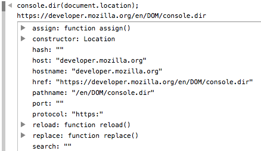

{{APIRef("Console API")}} {{AvailableInWorkers}}

Phương thức tĩnh **`console.dir()`** hiển thị danh sách các thuộc tính của đối tượng JavaScript được chỉ định. Trong console của trình duyệt, đầu ra được trình bày dưới dạng danh sách phân cấp với các tam giác bung/gập để bạn xem nội dung của các đối tượng con.

Khác với các phương thức ghi log khác, `console.dir()` không cố gắng "pretty-print" đối tượng. Ví dụ, nếu bạn truyền một phần tử DOM vào `console.dir()`, nó sẽ không được hiển thị như trong trình kiểm tra phần tử, mà thay vào đó sẽ hiển thị một danh sách thuộc tính.



Trong các môi trường chạy như {{glossary("Node.js", "Node")}} và {{glossary("Deno")}}, nơi đầu ra console đi tới terminal và do đó không có tính tương tác, tham số `options` cung cấp cách tùy biến cách đối tượng được trình bày.

## Cú pháp

```js-nolint
console.dir(object)
console.dir(object, options)
```

### Tham số

- `object`
  - : Đối tượng JavaScript có các thuộc tính cần được in ra.
- `options` {{optional_inline}}
  - : Một đối tượng có các thuộc tính sau, tất cả đều là tùy chọn:
    - `colors` {{non-standard_inline}} {{optional_inline}}
      - : Giá trị boolean: nếu là `true`, tạo kiểu các thuộc tính của đối tượng theo kiểu dữ liệu của chúng. Mặc định là `true`.
    - `depth` {{non-standard_inline}} {{optional_inline}}
      - : Số biểu thị số cấp lồng nhau cần in khi một đối tượng chứa các đối tượng hoặc mảng khác. Giá trị `null` có nghĩa là: in tất cả các cấp. Mặc định là 2.
    - `showHidden` {{non-standard_inline}} {{optional_inline}}
      - : Giá trị boolean: nếu là `true`, in các thuộc tính không enumerable và các thuộc tính symbol của đối tượng. Mặc định là `false`.

### Giá trị trả về

Không có ({{jsxref("undefined")}}).

## Thông số kỹ thuật

{{Specifications}}

## Tương thích trình duyệt

{{Compat}}

## Xem thêm

- [Tài liệu của Microsoft Edge về `console.dir()`](https://learn.microsoft.com/en-us/microsoft-edge/devtools/console/api#dir)
- [Tài liệu của Node.js về `console.dir()`](https://nodejs.org/docs/latest/api/console.html#consoledirobj-options)
- [Tài liệu của Google Chrome về `console.dir()`](https://developer.chrome.com/docs/devtools/console/api/#dir)
