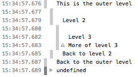

{{APIRef("Console API")}} {{AvailableInWorkers}}

Phương thức tĩnh **`console.group()`** tạo một nhóm nội tuyến mới trong nhật ký của [Web console](https://firefox-source-docs.mozilla.org/devtools-user/web_console/index.html), khiến mọi thông báo console tiếp theo bị thụt vào thêm một cấp cho đến khi {{domxref("console/groupEnd_static", "console.groupEnd()")}} được gọi.

## Cú pháp

```js-nolint
console.group()
console.group(label)
```

### Tham số

- `label` {{optional_inline}}
  - : Nhãn cho nhóm.

### Giá trị trả về

Không có ({{jsxref("undefined")}}).

## Ví dụ

Bạn có thể dùng các nhóm lồng nhau để giúp tổ chức đầu ra bằng cách liên kết trực quan các thông báo có liên quan. Để tạo một khối lồng mới, hãy gọi `console.group()`. Phương thức `console.groupCollapsed()` tương tự, nhưng khối mới sẽ được thu gọn và cần nhấp vào nút bung/gập để đọc nó.

Để thoát khỏi nhóm hiện tại, hãy gọi `console.groupEnd()`. Ví dụ, với đoạn mã sau:

```js
console.log("Đây là mức ngoài cùng");
console.group();
console.log("Mức 2");
console.group();
console.log("Mức 3");
console.warn("Thêm nội dung của mức 3");
console.groupEnd();
console.log("Quay lại mức 2");
console.groupEnd();
console.log("Quay lại mức ngoài cùng");
```

Đầu ra trông như sau:



Xem [Sử dụng nhóm trong console](/en-US/docs/Web/API/console#using_groups_in_the_console) trong tài liệu của {{domxref("console")}} để biết thêm chi tiết.

## Thông số kỹ thuật

{{Specifications}}

## Tương thích trình duyệt

{{Compat}}

## Xem thêm

- {{domxref("console/groupEnd_static", "console.groupEnd()")}}
- {{domxref("console/groupCollapsed_static", "console.groupCollapsed()")}}
- [Tài liệu của Microsoft Edge về `console.group()`](https://learn.microsoft.com/en-us/microsoft-edge/devtools/console/api#group)
- [Tài liệu của Node.js về `console.group()`](https://nodejs.org/docs/latest/api/console.html#consolegrouplabel)
- [Tài liệu của Google Chrome về `console.group()`](https://developer.chrome.com/docs/devtools/console/api/#group)
