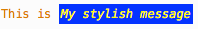
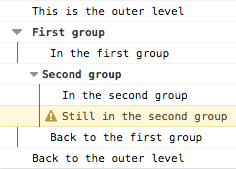
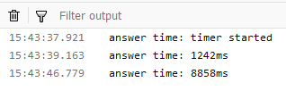
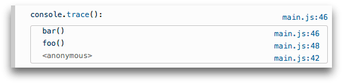

{{APIRef("Console API")}} {{AvailableInWorkers}}

Đối tượng **`console`** cung cấp quyền truy cập vào bảng điều khiển gỡ lỗi (ví dụ: [Web console](https://firefox-source-docs.mozilla.org/devtools-user/web_console/index.html) trong Firefox).

Các cách triển khai Console API có thể khác nhau giữa các môi trường chạy. Cụ thể, một số phương thức của console có thể hoạt động khác đi hoặc hoàn toàn không hoạt động trong một số trình soạn thảo trực tuyến và IDE. Để xem hành vi được mô tả trong tài liệu này, hãy thử các phương thức trong công cụ dành cho nhà phát triển của trình duyệt, dù ngay cả ở đây vẫn có một số khác biệt giữa các trình duyệt.

Đối tượng `console` khả dụng trong mọi phạm vi toàn cục. Ví dụ:

```js
console.log("Không mở được liên kết đã chỉ định");
```

## Phương thức thể hiện

- {{domxref("console/assert_static", "console.assert()")}}
  - : Ghi thông báo lỗi vào console nếu đối số đầu tiên là `false`.
- {{domxref("console/clear_static", "console.clear()")}}
  - : Xóa console.
- {{domxref("console/count_static", "console.count()")}}
  - : Ghi số lần dòng này được gọi với nhãn đã cho.
- {{domxref("console/countReset_static", "console.countReset()")}}
  - : Đặt lại giá trị của bộ đếm với nhãn đã cho.
- {{domxref("console/debug_static", "console.debug()")}}
  - : Xuất thông báo ra console ở mức nhật ký debug.
- {{domxref("console/dir_static", "console.dir()")}}
  - : Hiển thị danh sách tương tác các thuộc tính của một đối tượng JavaScript được chỉ định. Danh sách này cho phép bạn dùng các tam giác bung/gập để xem nội dung của các đối tượng con.
- {{domxref("console/dirxml_static", "console.dirxml()")}}
  - : Hiển thị biểu diễn Element XML/HTML của đối tượng được chỉ định nếu có thể, hoặc hiển thị dạng xem đối tượng JavaScript nếu không thể.
- {{domxref("console/error_static", "console.error()")}}
  - : Xuất thông báo ra console ở mức nhật ký error.
- `console.exception()` {{Non-standard_inline}} {{deprecated_inline}}
  - : Bí danh của `console.error()`.
- {{domxref("console/group_static", "console.group()")}}
  - : Tạo một [nhóm](#su_dung_nhom_trong_console) nội tuyến mới, thụt lề toàn bộ đầu ra theo sau thêm một cấp. Để quay lại một cấp, gọi `console.groupEnd()`.
- {{domxref("console/groupCollapsed_static", "console.groupCollapsed()")}}
  - : Tạo một [nhóm](#su_dung_nhom_trong_console) nội tuyến mới, thụt lề toàn bộ đầu ra theo sau thêm một cấp. Tuy nhiên, khác với `console.group()`, nhóm này bắt đầu ở trạng thái thu gọn và cần dùng nút bung/gập để mở ra. Để quay lại một cấp, gọi `console.groupEnd()`.
- {{domxref("console/groupEnd_static", "console.groupEnd()")}}
  - : Thoát khỏi [nhóm](#su_dung_nhom_trong_console) nội tuyến hiện tại.
- {{domxref("console/info_static", "console.info()")}}
  - : Xuất thông báo ra console ở mức nhật ký info.
- {{domxref("console/log_static", "console.log()")}}
  - : Xuất thông báo ra console.
- {{domxref("console/profile_static", "console.profile()")}} {{Non-standard_inline}}
  - : Khởi động công cụ profiler tích hợp của trình duyệt (ví dụ: [công cụ hiệu năng của Firefox](https://firefox-source-docs.mozilla.org/devtools-user/performance/index.html)). Bạn có thể chỉ định tên tùy chọn cho profile.
- {{domxref("console/profileEnd_static", "console.profileEnd()")}} {{Non-standard_inline}}
  - : Dừng profiler. Bạn có thể xem profile thu được trong công cụ hiệu năng của trình duyệt (ví dụ: [công cụ hiệu năng của Firefox](https://firefox-source-docs.mozilla.org/devtools-user/performance/index.html)).
- {{domxref("console/table_static", "console.table()")}}
  - : Hiển thị dữ liệu dạng bảng thành một bảng.
- {{domxref("console/time_static", "console.time()")}}
  - : Khởi động một [bộ đếm thời gian](#bo_dem_thoi_gian) với tên được chỉ định làm tham số đầu vào. Tối đa 10.000 bộ đếm thời gian có thể chạy đồng thời trên một trang.
- {{domxref("console/timeEnd_static", "console.timeEnd()")}}
  - : Dừng [bộ đếm thời gian](#bo_dem_thoi_gian) được chỉ định và ghi thời gian đã trôi qua tính bằng mili giây kể từ lúc nó bắt đầu.
- {{domxref("console/timeLog_static", "console.timeLog()")}}
  - : Ghi giá trị của [bộ đếm thời gian](#bo_dem_thoi_gian) được chỉ định ra console.
- {{domxref("console/timeStamp_static", "console.timeStamp()")}} {{Non-standard_inline}}
  - : Thêm một dấu mốc vào dòng thời gian của công cụ hiệu năng của trình duyệt ([Chrome](https://developer.chrome.com/docs/devtools/performance/reference) hoặc [Firefox](https://profiler.firefox.com/docs/#/./guide-ui-tour-timeline)).
- {{domxref("console/trace_static", "console.trace()")}}
  - : Xuất một [dấu vết ngăn xếp](#dau_vet_ngan_xep).
- {{domxref("console/warn_static", "console.warn()")}}
  - : Xuất thông báo ra console ở mức nhật ký warning.

## Ví dụ

### Xuất văn bản ra console

Tính năng được dùng thường xuyên nhất của console là ghi văn bản và dữ liệu khác. Có một số loại đầu ra mà bạn có thể tạo bằng các phương thức {{domxref("console/log_static", "console.log()")}}, {{domxref("console/info_static", "console.info()")}}, {{domxref("console/warn_static", "console.warn()")}}, {{domxref("console/error_static", "console.error()")}}, hoặc {{domxref("console/debug_static", "console.debug()")}}. Mỗi loại sẽ tạo đầu ra có kiểu hiển thị khác nhau trong nhật ký, và bạn có thể dùng các điều khiển lọc do trình duyệt cung cấp để chỉ xem những loại đầu ra mà bạn quan tâm.

Có hai cách để dùng mỗi phương thức đầu ra:

- Truyền vào một số lượng biến thiên các đối số có biểu diễn chuỗi sẽ được nối lại thành một chuỗi, rồi xuất ra console.
- Truyền vào một chuỗi chứa không hoặc nhiều chuỗi thay thế, theo sau là một số lượng biến thiên các đối số để thay thế chúng.

#### Xuất một đối tượng đơn lẻ

Cách đơn giản nhất để dùng các phương thức ghi log là xuất một đối tượng đơn lẻ:

```js
const someObject = { str: "Some text", id: 5 };
console.log(someObject);
```

Đầu ra trông sẽ giống như sau:

```plain
{str:"Some text", id:5}
```

Trình duyệt sẽ hiển thị nhiều thông tin về đối tượng nhất có thể và nó muốn hiển thị. Ví dụ, trạng thái riêng tư của đối tượng cũng có thể được hiển thị. Một số loại đối tượng, chẳng hạn như phần tử DOM hoặc hàm, cũng có thể được hiển thị theo cách đặc biệt.

#### Chụp nhanh đối tượng

Thông tin về một đối tượng được truy xuất một cách trì hoãn. Điều này có nghĩa là thông báo log hiển thị nội dung của đối tượng tại thời điểm nó được xem lần đầu, chứ không phải lúc nó được ghi log. Ví dụ:

```js
const obj = {};
console.log(obj);
obj.prop = 123;
```

Điều này sẽ xuất ra `{}`. Tuy nhiên, nếu bạn mở rộng chi tiết của đối tượng, bạn sẽ thấy `prop: 123`.

Nếu bạn định thay đổi đối tượng của mình và muốn ngăn thông tin đã ghi log bị cập nhật, bạn có thể [sao chép sâu](/en-US/docs/Glossary/Deep_copy) đối tượng trước khi ghi log. Một cách phổ biến là dùng {{jsxref("JSON.stringify()")}} rồi {{jsxref("JSON.parse()")}}:

```js
console.log(JSON.parse(JSON.stringify(obj)));
```

Cũng có những lựa chọn khác hoạt động trong trình duyệt, chẳng hạn như {{DOMxRef("Window.structuredClone", "structuredClone()")}}, hiệu quả hơn trong việc sao chép các kiểu đối tượng khác nhau.

#### Xuất nhiều đối tượng

Bạn cũng có thể xuất nhiều đối tượng bằng cách liệt kê chúng khi gọi phương thức ghi log, như sau:

```js
const car = "Dodge Charger";
const someObject = { str: "Some text", id: 5 };
console.info(
  "Chiếc xe đầu tiên của tôi là",
  car,
  ". Đối tượng là:",
  someObject,
);
```

Đầu ra sẽ trông như sau:

```plain
Chiếc xe đầu tiên của tôi là Dodge Charger . Đối tượng là: {str:"Some text", id:5}
```

#### Dùng chuỗi thay thế

Tham số đầu tiên của các phương thức ghi log có thể là một chuỗi chứa không hoặc nhiều chuỗi thay thế. Mỗi chuỗi thay thế sẽ được thay bằng giá trị đối số tương ứng.

- `%o`
  - : Xuất một đối tượng JavaScript theo kiểu "định dạng hữu ích tối ưu"; ví dụ, các phần tử DOM có thể được hiển thị giống như trong trình kiểm tra phần tử.
- `%O`
  - : Xuất một đối tượng JavaScript theo kiểu "định dạng đối tượng JavaScript chung", thường ở dạng cây có thể bung ra. Cách này tương tự {{domxref("console/dir_static", "console.dir()")}}.
- `%d` hoặc `%i`
  - : Xuất một số nguyên.
- `%s`
  - : Xuất một chuỗi.
- `%f`
  - : Xuất một giá trị dấu chấm động.
- `%c`
  - : Áp dụng quy tắc kiểu CSS cho toàn bộ văn bản theo sau. Xem [Tạo kiểu đầu ra console](#tao_kieu_dau_ra_console).

Một số trình duyệt có thể triển khai thêm các ký hiệu định dạng khác. Ví dụ, Safari và Firefox hỗ trợ định dạng độ chính xác kiểu C `%.<precision>f`. Ví dụ `console.log("Foo %.2f", 1.1)` sẽ xuất số với 2 chữ số thập phân: `Foo 1.10`, còn `console.log("Foo %.2d", 1.1)` sẽ xuất số dưới dạng hai chữ số có nghĩa với số 0 ở đầu: `Foo 01`.

Mỗi ký hiệu này sẽ lấy đối số kế tiếp sau chuỗi định dạng trong danh sách tham số. Ví dụ:

```js
for (let i = 0; i < 5; i++) {
  console.log("Xin chào, %s. Bạn đã gọi tôi %d lần.", "Bob", i + 1);
}
```

Đầu ra trông như sau:

```plain
Xin chào, Bob. Bạn đã gọi tôi 1 lần.
Xin chào, Bob. Bạn đã gọi tôi 2 lần.
Xin chào, Bob. Bạn đã gọi tôi 3 lần.
Xin chào, Bob. Bạn đã gọi tôi 4 lần.
Xin chào, Bob. Bạn đã gọi tôi 5 lần.
```

#### Tạo kiểu đầu ra console

Bạn có thể dùng chỉ thị `%c` để áp dụng kiểu CSS cho đầu ra console:

```js
console.log(
  "Đây là %cThông báo được tạo kiểu của tôi",
  "color: yellow; font-style: italic; background-color: blue;padding: 2px",
);
```

Văn bản trước chỉ thị sẽ không bị ảnh hưởng, nhưng văn bản sau chỉ thị sẽ được tạo kiểu bằng các khai báo CSS trong tham số.



Bạn có thể dùng `%c` nhiều lần:

<!-- cSpell:ignore corange cred -->

```js
console.log(
  "Nhiều kiểu: %cred %corange",
  "color: red",
  "color: orange",
  "Thông báo bổ sung không định dạng",
);
```

Các thuộc tính có thể dùng cùng cú pháp `%c` như sau (ít nhất là trong Firefox, có thể khác ở trình duyệt khác):

- {{cssxref("background")}} và các thuộc tính viết đầy đủ tương đương
- {{cssxref("border")}} và các thuộc tính viết đầy đủ tương đương
- {{cssxref("border-radius")}}
- {{cssxref("box-decoration-break")}}
- {{cssxref("box-shadow")}}
- {{cssxref("clear")}} và {{cssxref("float")}}
- {{cssxref("color")}}
- {{cssxref("cursor")}}
- {{cssxref("display")}}
- {{cssxref("font")}} và các thuộc tính viết đầy đủ tương đương
- {{cssxref("line-height")}}
- {{cssxref("margin")}}
- {{cssxref("outline")}} và các thuộc tính viết đầy đủ tương đương
- {{cssxref("padding")}}
- Các thuộc tính `text-*` như {{cssxref("text-transform")}}
- {{cssxref("white-space")}}
- {{cssxref("word-spacing")}} và {{cssxref("word-break")}}
- {{cssxref("writing-mode")}}

> [!NOTE]
> Mỗi thông báo console mặc định hoạt động như một phần tử nội tuyến. Nếu bạn muốn các thuộc tính như `padding`, `margin`, v.v. có hiệu lực, bạn có thể đặt thuộc tính `display` thành `display: inline-block`.

> [!NOTE]
> Để hỗ trợ cả giao diện sáng và tối, có thể dùng {{cssxref("color_value/light-dark")}} khi chỉ định màu; ví dụ: `color: light-dark(#D00000, #FF4040);`

### Sử dụng nhóm trong console

Bạn có thể dùng các nhóm lồng nhau để giúp tổ chức đầu ra bằng cách kết hợp trực quan các nội dung liên quan. Để tạo một khối lồng mới, hãy gọi `console.group()`. Phương thức `console.groupCollapsed()` cũng tương tự nhưng tạo khối mới ở trạng thái thu gọn, cần dùng nút bung/gập để mở ra đọc.

Để thoát khỏi nhóm hiện tại, hãy gọi `console.groupEnd()`. Ví dụ, với đoạn mã sau:

```js
console.log("Đây là mức ngoài cùng");
console.group("Nhóm đầu tiên");
console.log("Trong nhóm đầu tiên");
console.group("Nhóm thứ hai");
console.log("Trong nhóm thứ hai");
console.warn("Vẫn trong nhóm thứ hai");
console.groupEnd();
console.log("Quay lại nhóm đầu tiên");
console.groupEnd();
console.debug("Quay lại mức ngoài cùng");
```

Đầu ra trông như sau:



### Bộ đếm thời gian

Bạn có thể bắt đầu một bộ đếm thời gian để tính thời lượng của một thao tác cụ thể. Để bắt đầu, hãy gọi phương thức `console.time()` và truyền tên của nó làm tham số duy nhất. Để dừng bộ đếm thời gian và lấy thời gian đã trôi qua tính bằng mili giây, chỉ cần gọi phương thức `console.timeEnd()` và truyền lại tên bộ đếm thời gian làm tham số. Tối đa 10.000 bộ đếm thời gian có thể chạy đồng thời trên một trang.

Ví dụ, với đoạn mã sau:

```js
console.time("answer time");
alert("Nhấp để tiếp tục");
console.timeLog("answer time");
alert("Làm thêm một loạt việc khác...");
console.timeEnd("answer time");
```

Sẽ ghi thời gian người dùng cần để đóng hộp thoại cảnh báo, ghi thời gian đó ra console, đợi người dùng đóng cảnh báo thứ hai, rồi ghi thời điểm kết thúc ra console:



Lưu ý rằng tên của bộ đếm thời gian được hiển thị cả khi giá trị bộ đếm được ghi log và khi nó bị dừng.

### Dấu vết ngăn xếp

Đối tượng console cũng hỗ trợ xuất dấu vết ngăn xếp; điều này cho bạn thấy đường dẫn lời gọi đã được thực hiện để đi đến điểm mà bạn gọi {{domxref("console/trace_static", "console.trace()")}}. Với đoạn mã như sau:

```js
function foo() {
  function bar() {
    console.trace();
  }
  bar();
}

foo();
```

Đầu ra trong console sẽ trông giống như sau:



## Thông số kỹ thuật

{{Specifications}}

## Tương thích trình duyệt

{{Compat}}

## Xem thêm

- [Firefox Developer Tools](https://firefox-source-docs.mozilla.org/devtools-user/index.html)
- [Web console](https://firefox-source-docs.mozilla.org/devtools-user/web_console/index.html) — cách Web console trong Firefox xử lý các lời gọi Console API
- [about:debugging](https://firefox-source-docs.mozilla.org/devtools-user/about_colon_debugging/index.html) — cách xem đầu ra console khi mục tiêu gỡ lỗi là thiết bị di động
- [Google Chrome DevTools](https://developer.chrome.com/docs/devtools/console/api/)
- [Microsoft Edge DevTools](https://learn.microsoft.com/en-us/archive/microsoft-edge/legacy/developer/)
- [Safari Web Inspector](https://developer.apple.com/library/archive/documentation/AppleApplications/Conceptual/Safari_Developer_Guide/Console/Console.html)
