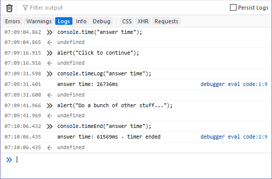

{{APIRef("Console API")}} {{AvailableInWorkers}}

Phương thức tĩnh **`console.timeEnd()`** dừng một bộ đếm thời gian đã được bắt đầu trước đó bằng cách gọi {{domxref("console/time_static", "console.time()")}}.

Xem [Bộ đếm thời gian](/en-US/docs/Web/API/console#timers) trong tài liệu để biết chi tiết và ví dụ.

## Cú pháp

```js-nolint
console.timeEnd()
console.timeEnd(label)
```

### Tham số

- `label` {{optional_inline}}
  - : Một chuỗi biểu diễn tên của bộ đếm thời gian cần dừng. Sau khi bị dừng, thời gian đã trôi qua sẽ tự động được hiển thị trong console cùng với chỉ báo rằng bộ đếm thời gian đã kết thúc. Nếu bị bỏ qua, nhãn `"default"` sẽ được dùng.

### Giá trị trả về

Không có ({{jsxref("undefined")}}).

## Ví dụ

```js
console.time("answer time");
alert("Click to continue");
console.timeLog("answer time");
alert("Do a bunch of other stuff…");
console.timeEnd("answer time");
```

Đầu ra từ ví dụ trên cho thấy thời gian người dùng cần để đóng hộp thoại cảnh báo đầu tiên, sau đó là tổng thời gian người dùng cần để đóng cả hai hộp thoại cảnh báo:



Lưu ý rằng tên của bộ đếm thời gian được hiển thị khi giá trị bộ đếm được ghi bằng `console.timeLog()` và một lần nữa khi nó bị dừng. Ngoài ra, lời gọi `console.timeEnd()` có thêm thông tin "timer ended" để cho thấy rõ rằng bộ đếm thời gian không còn tiếp tục đo thời gian nữa.

## Thông số kỹ thuật

{{Specifications}}

## Tương thích trình duyệt

{{Compat}}

## Xem thêm

- Xem {{domxref("console/timeLog_static", "console.timeLog()")}} để biết thêm ví dụ
- {{domxref("console/time_static", "console.time()")}}
- [Tài liệu của Microsoft Edge về `console.timeEnd()`](https://learn.microsoft.com/en-us/microsoft-edge/devtools/console/api#timeend)
- [Tài liệu của Node.js về `console.timeEnd()`](https://nodejs.org/docs/latest/api/console.html#consoletimeendlabel)
- [Tài liệu của Google Chrome về `console.timeEnd()`](https://developer.chrome.com/docs/devtools/console/api/#timeend)
