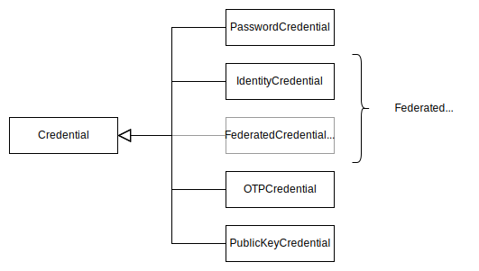
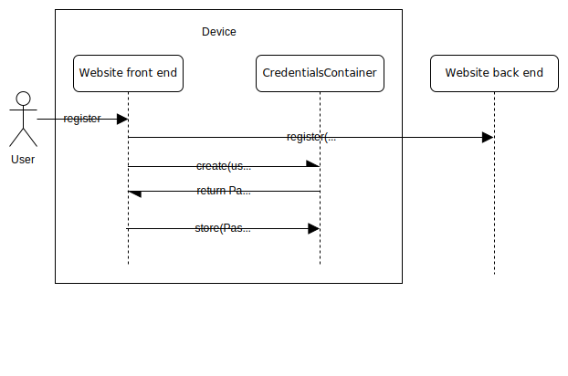
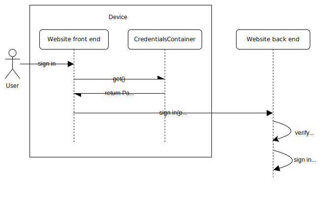
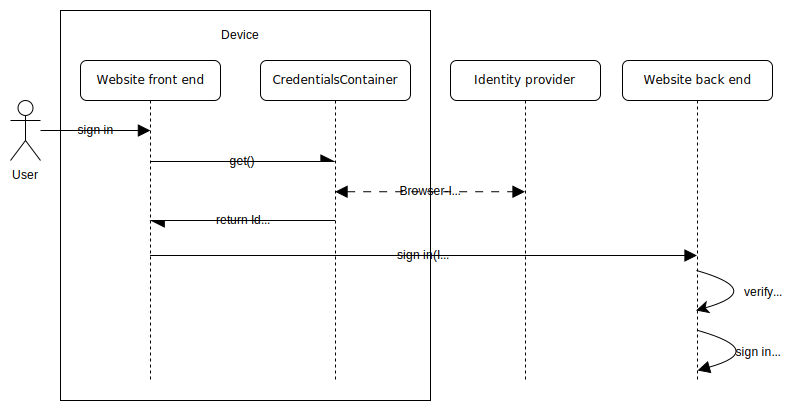
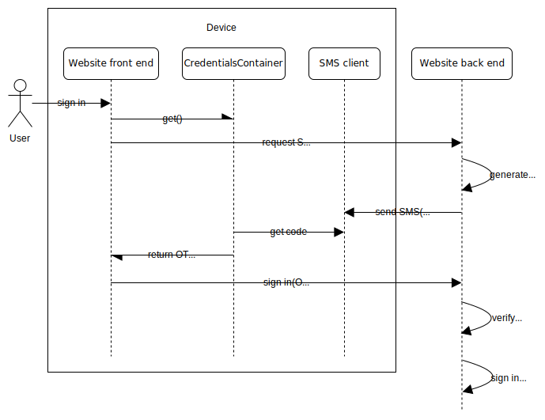
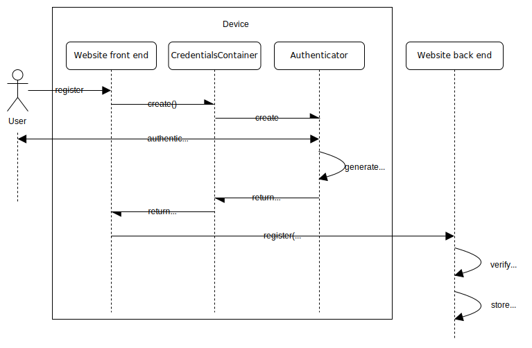
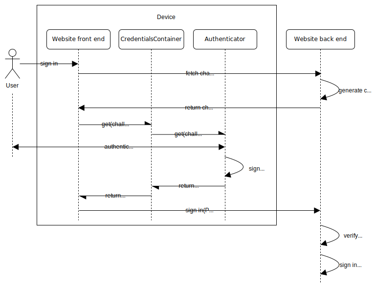

{{DefaultAPISidebar("Credential Management API")}}

Credential Management API cho phép một trang web tạo, lưu trữ và truy xuất {{glossary("credential", "thông tin xác thực")}} giúp người dùng đăng nhập an toàn. API này hỗ trợ bốn loại thông tin xác thực khác nhau:

| Loại                        | Giao diện                                                                                          |
| --------------------------- | -------------------------------------------------------------------------------------------------- |
| Mật khẩu                    | {{domxref("PasswordCredential")}}                                                                  |
| Danh tính liên kết          | {{domxref("IdentityCredential")}}, {{domxref("FederatedCredential")}} (không còn được khuyến nghị) |
| Mật khẩu dùng một lần (OTP) | {{domxref("OTPCredential")}}                                                                       |
| Xác thực Web                | {{domxref("PublicKeyCredential")}}                                                                 |

Các loại thông tin xác thực đều được biểu diễn dưới dạng lớp con của giao diện {{domxref("Credential")}}:

Trong hướng dẫn này, chúng ta sẽ giới thiệu các loại thông tin xác thực khác nhau và giải thích khái quát cách chúng được sử dụng.

> [!NOTE]
> Mặc dù ở đây chúng tôi mô tả tất cả các loại thông tin xác thực cùng nhau, các loại này thực ra được định nghĩa trong một số đặc tả khác nhau, là các phần mở rộng của đặc tả Credential Management API chính.
>
> - [Credential Management API](https://w3c.github.io/webappsec-credential-management/) định nghĩa mật khẩu và thông tin xác thực liên kết kiểu cũ.
> - [Federated Credential Management API](https://w3c-fedid.github.io/FedCM/) định nghĩa các thông tin xác thực liên kết mới.
> - [WebOTP API](https://wicg.github.io/web-otp/) định nghĩa thông tin xác thực OTP.
> - [Web Authentication API](https://w3c.github.io/webauthn/) định nghĩa các assertion Xác thực Web.

## Mật khẩu

> [!NOTE]
> Hầu hết các trình duyệt không hỗ trợ loại thông tin xác thực này và nó không được dùng rộng rãi trên web. Thay vào đó, trình duyệt tự động đề nghị lưu mật khẩu trong trình quản lý mật khẩu và có thể tự động lấy các mật khẩu đã lưu để tự điền vào [phần tử nhập mật khẩu](/vi/docs/Web/HTML/Reference/Elements/input/password).

Các trình duyệt hiện đại cung cấp cho người dùng một trình quản lý mật khẩu, giúp họ lưu những mật khẩu đã nhập trên các trang web và truy xuất lại khi cần đăng nhập lần nữa. Trình quản lý mật khẩu có thể cải thiện độ an toàn của mật khẩu bằng cách ghi nhớ mật khẩu thay cho người dùng và tự điền chúng, nhờ đó người dùng có thể chọn các mật khẩu mạnh hơn.

Trong Credential Management API, một mật khẩu được biểu diễn bằng giao diện {{domxref("PasswordCredential")}}. Khi người dùng đăng ký hoặc đăng nhập thành công vào trang của bạn, bạn có thể gọi hàm khởi tạo {{domxref("PasswordCredential.PasswordCredential()", "PasswordCredential()")}} hoặc {{domxref("CredentialsContainer.create", "navigator.credentials.create()")}} để tạo một đối tượng `PasswordCredential` từ thông tin xác thực mà người dùng đã nhập. Sau đó bạn có thể truyền đối tượng này vào {{domxref("CredentialsContainer.store", "navigator.credentials.store()")}}, và trình duyệt sẽ hỏi người dùng xem họ có muốn lưu mật khẩu vào trình quản lý mật khẩu hay không.

Khi người dùng truy cập trang của bạn, bạn có thể gọi {{domxref("CredentialsContainer.get", "navigator.credentials.get()")}} để truy xuất một mật khẩu đã lưu cho trang đó và dùng nó để đăng nhập người dùng. Tùy tình huống, bạn có thể đăng nhập im lặng hoặc dùng mật khẩu được trả về để tự điền vào một trường biểu mẫu.

## Thông tin xác thực danh tính liên kết

Trong một hệ thống {{glossary("federated identity", "danh tính liên kết")}}, một thực thể riêng biệt đóng vai trò trung gian giữa người dùng và trang web mà họ đang cố đăng nhập. Thực thể này, gọi là {{glossary("identity provider", "nhà cung cấp danh tính")}} (IdP), quản lý thông tin xác thực của người dùng, có thể xác thực người dùng, và được trang web tin tưởng để đưa ra các khẳng định về danh tính của họ.

Người dùng có một tài khoản với IdP: khi cần đăng nhập vào trang web, họ sẽ xác thực với IdP. Sau đó IdP trả về một mã thông báo cho trình duyệt của người dùng, và trình duyệt chuyển nó cho trang web. Trang web xác minh mã thông báo và nếu việc xác minh thành công thì sẽ đăng nhập người dùng.

Danh tính liên kết thường được các công ty cung cấp dưới dạng dịch vụ: ví dụ, người dùng có tài khoản Google, Microsoft hoặc Facebook có thể dùng các tài khoản này để đăng nhập vào các trang web hỗ trợ chúng.

[Federated Credential Management API](/vi/docs/Web/API/FedCM_API) định nghĩa một cơ chế bảo vệ quyền riêng tư cho danh tính liên kết trên web. Bạn bắt đầu bằng cách gọi {{domxref("CredentialsContainer.get", "navigator.credentials.get()")}} để yêu cầu một thông tin xác thực danh tính liên kết, thao tác này sẽ kích hoạt một quá trình trao đổi giao thức giữa trình duyệt và IdP.

Nếu trong quá trình trao đổi này người dùng có thể được xác thực với IdP, trình duyệt sẽ trả về một đối tượng {{domxref("IdentityCredential")}} khi `Promise` mà `get()` trả về được hoàn thành. Mã giao diện người dùng phía trang web có thể gửi đối tượng này tới máy chủ để xác minh.

Lưu ý rằng {{domxref("CredentialsContainer.create", "create()")}} và {{domxref("CredentialsContainer.store", "store()")}} không được dùng khi làm việc với Federated Credential Management API.

> [!NOTE]
> Việc hỗ trợ danh tính liên kết trong Credential Management API ban đầu được cung cấp qua giao diện {{domxref("FederatedCredential")}}. Tuy nhiên, cơ chế này phụ thuộc vào các công nghệ như [cookie của bên thứ ba](/vi/docs/Web/Privacy/Guides/Third-party_cookies), vốn xâm phạm quyền riêng tư về bản chất. Các công nghệ này đã [bị trình duyệt ngừng khuyến nghị](/en-US/blog/goodbye-third-party-cookies/), do đó cần một cách tiếp cận mới.

## Mật khẩu dùng một lần

Mật khẩu dùng một lần (OTP) là một kỹ thuật xác thực trong đó trang web gửi một mã duy nhất cho người dùng thông qua một hệ thống nhắn tin như email hoặc SMS. Sau đó người dùng phải nhập mã đó trên trang để chứng minh họ kiểm soát đầu mối liên lạc này. Các trang web đôi khi dùng cách này làm yếu tố xác thực thứ hai ngoài mật khẩu.

[WebOTP API](/vi/docs/Web/API/WebOTP_API) định nghĩa giao diện {{domxref("OTPCredential")}}, giải quyết một vấn đề về tính tiện dụng trong quy trình này: khi người dùng nhận được mã, họ phải mở một ứng dụng khác, tìm tin nhắn, rồi sao chép mã vào biểu mẫu trên trang web. Việc này khá bất tiện, đặc biệt trên thiết bị di động, và càng bất tiện hơn khi thiết bị nhận tin nhắn cũng chính là thiết bị đang được dùng để đăng nhập vào trang.

Trong các trình duyệt hỗ trợ kiểu `OTPCredential`, giao diện người dùng phía trang web có thể gọi {{domxref("CredentialsContainer.get", "navigator.credentials.get()")}}, yêu cầu một thông tin xác thực OTP, sau đó yêu cầu phần phụ trợ tạo mã và gửi tin nhắn chứa mã đó (chỉ SMS được hỗ trợ làm phương thức truyền tải). Phần phụ trợ phải gửi một tin nhắn SMS có định dạng đặc biệt mà trình duyệt có thể đọc.

Khi đó trình duyệt sẽ trả về một đối tượng `OTPCredential` khi `Promise` mà `get()` trả về được hoàn thành, và đối tượng này chứa mã. Giao diện người dùng phía trang web có thể dùng mã để tự điền vào một phần tử nhập liệu trên trang hoặc tự động gửi mã tới máy chủ.

Lưu ý rằng {{domxref("CredentialsContainer.create", "create()")}} và {{domxref("CredentialsContainer.store", "store()")}} không được dùng khi làm việc với thông tin xác thực OTP.

## Assertion Xác thực Web

[Web Authentication API](/vi/docs/Web/API/Web_Authentication_API) (WebAuthn) cho phép người dùng đăng nhập vào trang web bằng cách yêu cầu một _authenticator_ tạo ra các assertion được ký số về danh tính của người dùng.

_Authenticator_ là một thực thể nằm trong hoặc gắn với thiết bị của người dùng, có thể thực hiện các phép toán mật mã cần thiết để đăng ký và xác thực người dùng, đồng thời lưu trữ an toàn các khóa mật mã được dùng trong các thao tác này. Authenticator có thể được tích hợp trong thiết bị, như hệ thống [Touch ID](https://en.wikipedia.org/wiki/Touch_ID) trên các thiết bị Apple hoặc hệ thống [Windows Hello](https://en.wikipedia.org/wiki/Windows_10#System_security), hoặc có thể là một mô-đun tháo rời như [YubiKey](https://en.wikipedia.org/wiki/YubiKey).

Thay vì dùng mật khẩu, WebAuthn sử dụng {{glossary("public-key cryptography", "mật mã khóa công khai")}} để xác thực người dùng.

Để đăng ký một người dùng trên trang web bằng WebAuthn, hãy gọi {{domxref("CredentialsContainer.create", "navigator.credentials.create()")}}, cung cấp mọi thông tin cần thiết để tạo một cặp khóa. Authenticator có thể trước tiên yêu cầu người dùng tự xác thực, ví dụ bằng thiết bị đọc sinh trắc học. Sau đó nó sẽ tạo một cặp khóa và trả về khóa công khai. Cặp khóa này là duy nhất cho người dùng và trang web đó. Authenticator cũng có thể tạo và trả về một _attestation_ đã được ký: đây là một tuyên bố rằng chính authenticator đó là, ví dụ, một YubiKey chính hãng.

Giao diện người dùng phía trang web gửi khóa công khai và attestation tới máy chủ, nơi máy chủ xác minh attestation và lưu khóa công khai cùng với các thông tin khác của tài khoản người dùng mới.

Để đăng nhập người dùng vào trang web, mã giao diện trước tiên lấy một số ngẫu nhiên từ máy chủ, gọi là _challenge_. Sau đó nó gọi {{domxref("CredentialsContainer.get", "navigator.credentials.get()")}}, truyền vào challenge và một số tùy chọn khác. Authenticator có thể một lần nữa yêu cầu người dùng tự xác thực, rồi sẽ ký challenge bằng khóa riêng.

Khi đó trình duyệt trả về một đối tượng `PublicKeyCredential` khi `Promise` mà `get()` trả về được hoàn thành, và đối tượng này chứa challenge đã được ký, được gọi là một _assertion_. Giao diện người dùng phía trang web sau đó gửi assertion tới máy chủ, nơi máy chủ kiểm tra chữ ký bằng khóa công khai đã lưu và quyết định có đăng nhập người dùng hay không.

Lưu ý rằng {{domxref("CredentialsContainer.store", "store()")}} không được dùng khi làm việc với WebAuthn: cặp khóa được tạo trong authenticator và khóa riêng không bao giờ rời khỏi đó.

## Xem thêm

- [Web Authentication API](/vi/docs/Web/API/Web_Authentication_API)
- [WebOTP API](/vi/docs/Web/API/WebOTP_API)
- [Federated Credential Management (FedCM) API](/vi/docs/Web/API/FedCM_API)
