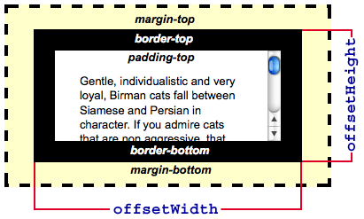
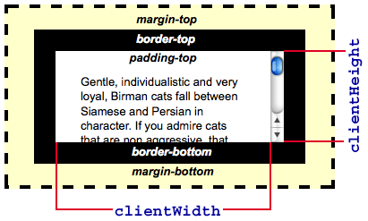

{{DefaultAPISidebar("CSSOM")}}

Có nhiều thuộc tính bạn có thể xem để xác định chiều rộng và chiều cao của phần tử, và việc chọn đúng thuộc tính cho nhu cầu của bạn có thể khá khó. Bài viết này được thiết kế để giúp bạn đưa ra quyết định đó. Lưu ý rằng tất cả các thuộc tính này đều chỉ đọc. Nếu bạn muốn đặt chiều rộng và chiều cao của một phần tử, hãy dùng {{CSSxRef("width")}} và {{CSSxRef("height")}} hoặc các thuộc tính ghi đè {{CSSxRef("min-width")}} và {{CSSxRef("max-width")}}, cùng {{CSSxRef("min-height")}} và {{CSSxRef("max-height")}}.

## Nó chiếm bao nhiêu không gian?

Nếu bạn cần biết tổng không gian mà một phần tử chiếm, bao gồm chiều rộng của nội dung hiển thị, thanh cuộn (nếu có), padding và border, hãy dùng các thuộc tính {{DOMxRef("HTMLElement.offsetWidth")}} và {{DOMxRef("HTMLElement.offsetHeight")}}. Phần lớn thời gian, chúng giống với chiều rộng và chiều cao của {{DOMxRef("Element.getBoundingClientRect()")}} khi không có biến đổi nào được áp dụng cho phần tử. Trong trường hợp có biến đổi, `offsetWidth` và `offsetHeight` trả về chiều rộng và chiều cao bố cục của phần tử, còn `getBoundingClientRect()` trả về chiều rộng và chiều cao hiển thị. Ví dụ, nếu phần tử có `width: 100px;` và `transform: scale(0.5);` thì `getBoundingClientRect()` sẽ trả về 50 cho chiều rộng, trong khi `offsetWidth` sẽ trả về 100. Một khác biệt nữa là `offsetWidth` và `offsetHeight` làm tròn giá trị thành số nguyên, trong khi `getBoundingClientRect()` cung cấp các giá trị thập phân chính xác hơn.

## Kích thước của nội dung hiển thị là bao nhiêu?

Nếu bạn cần biết nội dung hiển thị thực tế chiếm bao nhiêu không gian, bao gồm padding nhưng không gồm border, margin, hay thanh cuộn, hãy dùng các thuộc tính {{DOMxRef("Element.clientWidth")}} và {{DOMxRef("Element.clientHeight")}}:

## Nội dung lớn đến mức nào?

Nếu bạn cần biết kích thước thực sự của nội dung, bất kể hiện tại nó đang hiển thị bao nhiêu phần, bạn cần dùng các thuộc tính {{DOMxRef("Element.scrollWidth")}} và {{DOMxRef("Element.scrollHeight")}}. Chúng trả về chiều rộng và chiều cao của toàn bộ nội dung của phần tử, ngay cả khi chỉ một phần đang hiển thị do có thanh cuộn.

Ví dụ, nếu một phần tử 600x400 pixel đang được hiển thị bên trong một vùng cuộn 300x300 pixel, `scrollWidth` sẽ trả về 600 còn `scrollHeight` sẽ trả về 400.

## Xem thêm

- [Đặc tả The CSSOM View Module](https://drafts.csswg.org/cssom-view/)
- [MSDN: Measuring Element Dimension and Location](<https://learn.microsoft.com/en-us/previous-versions/hh781509(v=vs.85)>)
