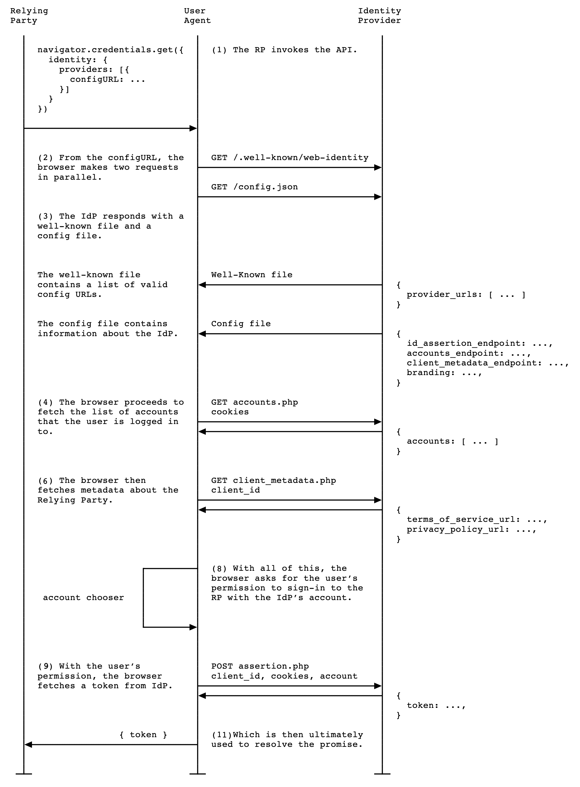

{{DefaultAPISidebar("FedCM API")}}

Bài viết này mô tả quá trình mà {{glossary("Relying party", "bên dựa vào")}} (RP) có thể sử dụng [Federated Credential Management (FedCM) API](/vi/docs/Web/API/FedCM_API) để thực hiện đăng nhập liên danh thông qua {{glossary("Identity provider", "nhà cung cấp danh tính")}} (IdP).

## Gọi phương thức `get()`

RP có thể gọi {{domxref("CredentialsContainer.get", "navigator.credentials.get()")}} với tùy chọn `identity` để yêu cầu người dùng được cho tùy chọn đăng nhập vào RP bằng các tài khoản IdP hiện có. Các IdP nhận diện RP thông qua `clientId`, được cấp bởi mỗi IdP cho RP trong một quy trình riêng cụ thể cho IdP. IdP được chọn xác định người dùng cụ thể đang cố gắng đăng nhập với thông tin xác thực (cookie) được cung cấp cho trình duyệt trong [luồng đăng nhập](#fedcm_sign-in_flow).

Nếu người dùng chưa bao giờ đăng nhập vào IdP hoặc đã đăng xuất, `CredentialsContainer.get()` sẽ từ chối với lỗi và RP có thể chuyển hướng người dùng đến trang IdP để đăng nhập hoặc tạo tài khoản.

Ngược lại, nếu danh tính người dùng được xác thực thành công bởi IdP được chọn, `CredentialsContainer.get()` trả về một promise thỏa mãn với đối tượng {{domxref("IdentityCredential")}}.

### Đối tượng `IdentityCredential.token`

`IdentityCredential` bao gồm thuộc tính `token` mà RP có thể sử dụng để đăng nhập người dùng.

FedCM API không định nghĩa cấu trúc của đối tượng `token` hoặc RP nên làm gì với nó: điều này hoàn toàn phụ thuộc vào giao thức danh tính liên danh mà IdP triển khai.

Ví dụ: trong cấu hình [FedCM cho OAuth](https://github.com/aaronpk/oauth-fedcm-profile), mô tả cách giao thức [OpenID Connect (OIDC)](/vi/docs/Web/Security/Authentication/Federated_identity#openid_connect) có thể được triển khai bằng FedCM, token trả về bởi `CredentialsContainer.get()` là mã ủy quyền OAuth. RP sử dụng mã này để truy xuất token danh tính từ điểm cuối token của IdP.

Khi RP chọn làm việc với một IdP cụ thể, IdP sẽ cung cấp hướng dẫn về cách sử dụng giá trị `token` trả về.

### Ví dụ yêu cầu

Một yêu cầu điển hình có thể trông như sau:

```js
async function signIn() {
  const identityCredential = await navigator.credentials.get({
    identity: {
      context: "signup",
      providers: [
        {
          configURL: "https://accounts.idp.example/config.json",
          clientId: "********",
          params: {
            /* các tham số cụ thể của IdP */
          },
          loginHint: "user1@example.com",
        },
        {
          // ...
        },
      ],
    },
  });
}
```

Thuộc tính `identity.providers` nhận một mảng chứa một hoặc nhiều đối tượng chỉ định đường dẫn đến tệp cấu hình của mỗi IdP (`configURL`) và định danh client của RP (`clientId`) do IdP cấp.

Ví dụ trước cũng bao gồm một số tính năng tùy chọn:

- `identity.context` chỉ định ngữ cảnh mà người dùng đang xác thực với FedCM. Ví dụ: đây là lần đăng ký đầu tiên cho tài khoản này, hay là đăng nhập bằng tài khoản hiện có? Trình duyệt sử dụng thông tin này để thay đổi văn bản trong UI FedCM cho phù hợp với ngữ cảnh.
- Thuộc tính `params` chứa bất kỳ tham số nào mà IdP này cần. Cấu trúc và nội dung của nó được xác định bởi IdP cụ thể.
- Thuộc tính `loginHint` cung cấp gợi ý về (các) tùy chọn tài khoản mà trình duyệt nên hiển thị cho người dùng đăng nhập. Gợi ý này được đối chiếu với các giá trị `login_hints` mà IdP cung cấp tại [điểm cuối danh sách tài khoản](/vi/docs/Web/API/FedCM_API/IDP_integration#the_accounts_list_endpoint).

Trình duyệt yêu cầu các tệp cấu hình IdP và thực hiện luồng đăng nhập được chi tiết bên dưới. Để biết thêm thông tin về loại tương tác mà người dùng có thể mong đợi từ UI do trình duyệt cung cấp, xem [Triển khai giải pháp danh tính với FedCM ở phía Bên dựa vào](https://developer.chrome.com/docs/identity/fedcm/implement/relying-party).

## Luồng đăng nhập FedCM

Có ba bên tham gia vào luồng đăng nhập — ứng dụng RP, bản thân trình duyệt và IdP. Sơ đồ sau tóm tắt những gì đang xảy ra trực quan.



Luồng như sau:

1. RP gọi {{domxref("CredentialsContainer.get", "navigator.credentials.get()")}} để bắt đầu luồng đăng nhập.

2. Từ `configURL` được cung cấp cho mỗi IdP, trình duyệt yêu cầu hai tệp:
   1. Tệp well-known (`/.well-known/web-identity`), khả dụng từ `/.well-known/web-identity` tại {{glossary("registrable domain")} của `configURL`.
   2. [Tệp cấu hình IdP](/vi/docs/Web/API/FedCM_API/IDP_integration#provide_a_config_file_and_endpoints) (`/config.json`), khả dụng tại `configURL`.

   Đây đều là các yêu cầu [`GET`](/vi/docs/Web/HTTP/Reference/Methods/GET), không có cookie và không theo chuyển hướng. Điều này ngăn chặn hiệu quả việc IdP biết ai đã gửi yêu cầu và RP nào đang cố gắng kết nối.

   Tất cả yêu cầu gửi từ trình duyệt thông qua FedCM đều bao gồm tiêu đề `{{httpheader("Sec-Fetch-Dest")}}: webidentity` để ngăn chặn các cuộc tấn công {{glossary("CSRF")}}. Tất cả các điểm cuối IdP phải xác nhận tiêu đề này được bao gồm.

3. Các IdP phản hồi với tệp well-known và tệp `config.json` được yêu cầu. Trình duyệt xác thực URL tệp cấu hình trong yêu cầu `get()` so với danh sách các URL cấu hình hợp lệ bên trong tệp well-known.

4. Nếu trình duyệt có [trạng thái đăng nhập của IdP](/vi/docs/Web/API/FedCM_API/IDP_integration#update_login_status_using_the_login_status_api) được đặt thành `"logged-in"`, nó sẽ gửi yêu cầu có thông tin xác thực (tức là với cookie xác định người dùng đã đăng nhập) đến [`accounts_endpoint`](/vi/docs/Web/API/FedCM_API/IDP_integration#the_accounts_list_endpoint) bên trong tệp cấu hình IdP để lấy chi tiết tài khoản người dùng. Đây là yêu cầu `GET` với cookie, nhưng không có tham số `client_id` hoặc tiêu đề {{httpheader("Origin")}}. Điều này ngăn chặn hiệu quả việc IdP biết RP nào người dùng đang cố gắng đăng nhập. Do đó, danh sách tài khoản trả về không phụ thuộc vào RP.

   > [!NOTE]
   > Nếu tất cả trạng thái đăng nhập của IdP đều là `"logged-out"`, lệnh gọi `get()` sẽ từ chối với {{domxref("DOMException")}} `NetworkError` và không gửi yêu cầu đến bất kỳ `accounts_endpoint` nào của IdP. Trong trường hợp này, nhà phát triển cần xử lý luồng, ví dụ: nhắc người dùng đi đăng nhập vào một IdP phù hợp. Lưu ý rằng có thể có một số độ trễ trong việc từ chối để tránh rò rỉ trạng thái đăng nhập IdP cho RP.

5. Các IdP phản hồi với thông tin tài khoản được yêu cầu từ `accounts_endpoint` của họ. Đây là các mảng của tất cả tài khoản liên kết với cookie IdP của người dùng cho bất kỳ RP nào liên kết với IdP.

6. {{optional_inline}} Nếu được bao gồm trong tệp cấu hình IdP, trình duyệt sẽ gửi yêu cầu không có thông tin xác thực đến [`client_metadata_endpoint`](/vi/docs/Web/API/FedCM_API/IDP_integration#the_client_metadata_endpoint) để lấy vị trí trang điều khoản dịch vụ và chính sách riêng tư của RP. Đây là yêu cầu `GET` được gửi với `clientId` được truyền vào lệnh gọi `get()` làm tham số, không có cookie.

7. {{optional_inline}} Các IdP phản hồi với các URL được yêu cầu từ `client_metadata_endpoint`.

8. Trình duyệt sử dụng thông tin thu được bởi hai bộ yêu cầu trước đó để tạo UI yêu cầu người dùng chọn IdP (nếu có nhiều hơn một đã đăng nhập) và tài khoản để đăng nhập vào RP. UI cũng yêu cầu người dùng cho phép đăng nhập vào RP bằng tài khoản IdP liên danh đã chọn.

   > [!NOTE]
   > Ở giai đoạn này, nếu người dùng trước đó đã xác thực bằng tài khoản RP liên danh trong phiên trình duyệt hiện tại (nghĩa là đã tạo tài khoản mới với RP hoặc đăng nhập vào trang web của RP bằng tài khoản hiện có), họ có thể **tự động xác thực lại**, tùy thuộc vào tùy chọn [`mediation`](/vi/docs/Web/API/CredentialsContainer/get#mediation) được đặt trong lệnh gọi `get()`. Nếu vậy, người dùng sẽ được đăng nhập tự động mà không cần nhập thông tin xác thực, ngay khi `get()` được gọi. Xem phần [Tự động xác thực lại](#auto-reauthentication) để biết thêm chi tiết.

9. Nếu người dùng cấp quyền, trình duyệt sẽ gửi yêu cầu có thông tin xác thực đến [`id_assertion_endpoint`](/vi/docs/Web/API/FedCM_API/IDP_integration#the_id_assertion_endpoint) để yêu cầu mã thông báo xác thực từ IdP đã chọn cho tài khoản đã chọn.

   Thông tin xác thực được gửi trong yêu cầu HTTP [`POST`](/vi/docs/Web/HTTP/Reference/Methods/POST) với cookie và loại nội dung là `application/x-www-form-urlencoded`.

   Nếu lệnh gọi thất bại, payload lỗi được trả về như giải thích trong [Phản hồi lỗi xác nhận ID](/vi/docs/Web/API/FedCM_API/IDP_integration#id_assertion_error_responses) và promise trả về bởi `get()` sẽ từ chối với lỗi.

10. IdP được chọn kiểm tra rằng ID tài khoản do RP gửi khớp với ID của tài khoản đã đăng nhập, và rằng `Origin` khớp với nguồn gốc của RP, nguồn gốc này sẽ được đăng ký trước với IdP. Nếu mọi thứ đều ổn, nó sẽ phản hồi với mã thông báo xác thực được yêu cầu.

    > [!NOTE]
    > Nguồn gốc của RP sẽ được đăng ký với IdP trong một quy trình hoàn toàn riêng biệt khi RP lần đầu tích hợp với IdP. Quy trình này sẽ cụ thể cho từng IdP.

11. Khi luồng hoàn tất, promise `get()` sẽ phân giải với đối tượng {{domxref("IdentityCredential")}}, cung cấp chức năng RP tiếp theo. Đáng chú ý nhất, đối tượng này chứa một mã thông báo mà RP có thể xác minh đến từ IdP (sử dụng chứng chỉ) và chứa thông tin đáng tin cậy về người dùng đã đăng nhập. Sau khi RP xác thực mã thông báo, họ có thể sử dụng thông tin chứa trong đó để đăng nhập người dùng và bắt đầu phiên mới, đăng ký dịch vụ của họ, v.v. Định dạng và cấu trúc của mã thông báo phụ thuộc vào IdP và không liên quan gì đến FedCM API (RP cần tuân theo hướng dẫn của IdP).

## Chế độ hoạt động so với thụ động

Có hai chế độ UI khác nhau mà trình duyệt có thể cung cấp cho người dùng RP khi họ đăng nhập thông qua FedCM API, chế độ **`active`** (hoạt động) và **`passive`** (thụ động). Chế độ nào được sử dụng để đăng nhập được kiểm soát bởi tùy chọn [`mode`](/vi/docs/Web/API/IdentityCredentialRequestOptions#mode) của đối tượng `identity`:

```js
async function signIn() {
  const identityCredential = await navigator.credentials.get({
    identity: {
      mode: active,
      providers: [
        {
          configURL: "https://accounts.idp.example/config.json",
          clientId: "********",
        },
      ],
    },
  });
}
```

Giá trị mặc định cho `mode` là `passive`. Nếu `mode` không được đặt hoặc được đặt rõ ràng thành `passive`, trình duyệt có thể khởi tạo luồng đăng nhập thông qua lệnh gọi `get()` mà không cần tương tác trực tiếp của người dùng. Ví dụ: bạn có thể muốn khởi tạo luồng đăng nhập ngay khi người dùng điều hướng đến trang đăng nhập, miễn là họ có tài khoản IdP để đăng nhập. Ở chế độ này, trình duyệt thường hiển thị cho người dùng một hộp thoại đăng nhập chứa tất cả các tùy chọn đăng nhập khác nhau được chỉ định trong đối tượng `providers`, và họ có thể chọn bất kỳ tùy chọn nào phù hợp nhất và sau đó nhập thông tin xác thực phù hợp.

Nếu `mode` được đặt thành `active`, trình duyệt yêu cầu luồng đăng nhập được khởi tạo thông qua hành động của người dùng như nhấp vào nút (yêu cầu {{glossary("transient activation")}}), và đối tượng `providers` chỉ có thể có độ dài là `1`, nếu không promise `get()` sẽ từ chối. Chế độ này thường được sử dụng khi RP muốn cung cấp một nút riêng cho mỗi lựa chọn IdP. Khi người dùng nhấp vào một trong những nút đó, một hộp thoại đơn giản hóa xuất hiện chỉ yêu cầu họ nhập thông tin xác thực cho tài khoản đó.

Xem [FedCM UI modes](https://developer.chrome.com/docs/identity/fedcm/overview#fedcm_ui_modes) trên developer.chrome.com để biết ví dụ về cách các chế độ UI khác nhau được hiển thị trong Google Chrome.

## Tự động xác thực lại

Tự động xác thực lại FedCM cho phép người dùng tự động xác thực lại khi họ cố gắng đăng nhập vào RP một lần nữa sau lần xác thực ban đầu bằng FedCM. "Xác thực ban đầu" đề cập đến khi người dùng tạo tài khoản hoặc đăng nhập vào trang web của RP thông qua hộp thoại đăng nhập FedCM lần đầu tiên trên trang RP, trên cùng một phiên trình duyệt.

Sau lần xác thực ban đầu, tự động xác thực lại có thể được sử dụng để đăng nhập vào trang web RP một cách tự động, mà không cần hiển thị cho người dùng lời nhắc xác nhận "Tiếp tục với...". Nếu người dùng gần đây đã cấp quyền cho phép đăng nhập liên danh xảy ra với một tài khoản cụ thể, không có lợi ích về riêng tư hoặc bảo mật nào khi ngay lập tức bắt buộc xác nhận rõ ràng khác của người dùng.

Hành vi tự động xác thực lại được kiểm soát bởi tùy chọn [`mediation`](/vi/docs/Web/API/CredentialsContainer/get#mediation) trong lệnh gọi `get()`:

```js
async function signIn() {
  const identityCredential = await navigator.credentials.get({
    identity: {
      providers: [
        {
          configURL: "https://accounts.idp.example/config.json",
          clientId: "********",
        },
      ],
    },
    mediation: "optional", // đây là mặc định
  });

  // isAutoSelected là true nếu đã xảy ra tự động xác thực lại.
  const isAutoSelected = identityCredential.isAutoSelected;
}
```

Tự động xác thực lại có thể xảy ra nếu `mediation` được đặt thành `optional` hoặc `silent`.

Với các tùy chọn `mediation` này, tự động xác thực lại sẽ xảy ra trong các điều kiện sau:

- FedCM khả dụng để sử dụng. Ví dụ: người dùng chưa tắt FedCM either toàn cục hoặc trong cài đặt của RP.
- Người dùng chỉ sử dụng một tài khoản để đăng nhập vào trang web RP trên trình duyệt này thông qua FedCM. Nếu tồn tại tài khoản cho nhiều IdP, người dùng sẽ không được tự động xác thực lại.
- Người dùng đã đăng nhập vào IdP bằng tài khoản đó.
- Tự động xác thực lại không xảy ra trong vòng 10 phút qua. Hạn chế này được đưa ra để ngăn người dùng bị tự động xác thực lại ngay sau khi họ đăng xuất — điều này sẽ tạo ra trải nghiệm người dùng khá khó hiểu.
- RP chưa gọi {{domxref("CredentialsContainer.preventSilentAccess", "preventSilentAccess()")}} sau lần đăng nhập trước đó. RP có thể sử dụng phương thức này để tắt rõ ràng tự động xác thực lại nếu muốn.
- Chế độ UI là [passive]().

Khi các điều kiện này được đáp ứng, nỗ lực tự động xác thực lại người dùng bắt đầu ngay khi `get()` được gọi. Nếu tự động xác thực lại thành công, người dùng sẽ đăng nhập vào trang web RP một lần nữa, mà không được hiển thị lời nhắc xác nhận, bằng cùng tài khoản IdP và mã thông báo đã xác thực như trước đó.

Nếu tự động xác thực lại thất bại, hành vi phụ thuộc vào giá trị `mediation` đã chọn:

- `optional`: người dùng _sẽ_ được hiển thị hộp thoại và được yêu cầu xác nhận lại. Do đó, tùy chọn này có ý nghĩa sử dụng trên trang mà hành trình người dùng không đang diễn ra, chẳng hạn như trang đăng nhập RP.
- `silent`: Promise `get()` sẽ từ chối và nhà phát triển sẽ cần xử lý việc hướng dẫn người dùng quay lại trang đăng nhập để bắt đầu quá trình lại. Tùy chọn này phù hợp trên các trang mà hành trình người dùng đang diễn ra và bạn cần giữ họ đăng nhập cho đến khi hoàn tất, ví dụ: các trang của luồng thanh toán trên trang web thương mại điện tử.

> [!NOTE]
> Thuộc tính {{domxref("IdentityCredential.isAutoSelected")}} cung cấp thông tin về việc đăng nhập liên danh có được thực hiện bằng tự động xác thực lại hay không. Điều này hữu ích để đánh giá hiệu suất API và cải thiện UX cho phù hợp. Ngoài ra, khi không khả dụng, người dùng có thể được nhắc đăng nhập với sự tham gia rõ ràng của người dùng, đó là lệnh gọi `get()` với `mediation: required`.

## Ngắt kết nối đăng nhập liên danh

RP có thể ngắt kết nối một tài khoản đăng nhập liên danh cụ thể khỏi IdP liên kết bằng cách gọi {{domxref("IdentityCredential.disconnect_static", "IdentityCredential.disconnect()")}}. Hàm này có thể được gọi từ khung RP cấp cao nhất.

```js
IdentityCredential.disconnect({
  configURL: "https://idp.example.com/config.json",
  clientId: "rp123",
  accountHint: "account456",
});
```

Để lệnh gọi `disconnect()` hoạt động, IdP phải bao gồm [`disconnect_endpoint`](/vi/docs/Web/API/FedCM_API/IDP_integration#disconnect_endpoint) trong tệp cấu hình của nó. Xem [Điểm cuối ngắt kết nối](/vi/docs/Web/API/FedCM_API/IDP_integration#the_disconnect_endpoint) để biết thêm chi tiết về giao tiếp HTTP cơ bản.

## Xem thêm

- [Federated Credential Management API](https://developer.chrome.com/docs/identity/fedcm/overview) trên developer.chrome.com (2023)
