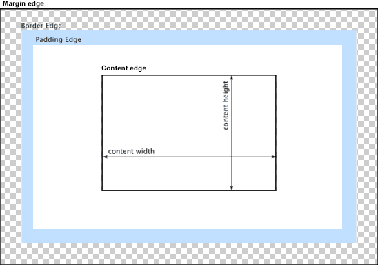

{{APIRef("HTML DOM")}}

Thuộc tính **`y`** chỉ đọc của giao diện {{domxref("HTMLImageElement")}} biểu thị tọa độ y của cạnh viền trên cùng của phần tử {{HTMLElement("img")}} so với gốc của phần tử gốc.

Thuộc tính {{domxref("HTMLImageElement.x", "x")}} và `y` chỉ hợp lệ cho một hình ảnh nếu thuộc tính {{cssxref("display")}} của nó có giá trị được tính toán `table-column` hoặc `table-column-group`. Nói cách khác: nó có một trong những giá trị đó được đặt rõ ràng trên đó hoặc nó đã kế thừa nó từ một phần tử chứa hoặc bằng cách nằm trong một cột được mô tả bởi {{HTMLElement("col")}} hoặc {{HTMLElement("colgroup")}}.

## Giá trị

Một giá trị số nguyên biểu thị khoảng cách tính bằng pixel từ cạnh trên của phần tử gốc gần nhất của phần tử đến cạnh trên của hộp viền của phần tử {{HTMLElement("img")}}. Phần tử gốc gần nhất là phần tử {{HTMLElement("html")}} ngoài cùng có chứa hình ảnh. Nếu hình ảnh nằm trong {{HTMLElement("iframe")}} thì `y` của nó sẽ tương ứng với khung hình đó.

Trong sơ đồ bên dưới, cạnh viền trên là cạnh trên của vùng đệm màu xanh. Vì vậy giá trị được trả về bởi `y` sẽ là khoảng cách từ điểm đó đến cạnh trên của vùng nội dung.

## Ví dụ

Xem [`HTMLImageElement.x`](/en-US/docs/Web/API/HTMLImageElement/x#example) để biết mã ví dụ minh họa việc sử dụng `HTMLImageElement.y` (và `HTMLImageElement.x`).

## Thông số kỹ thuật

{{Specifications}}

## Khả năng tương thích của trình duyệt

{{Compat}}

## Xem thêm

- {{cssxref("display")}}
- {{HTMLElement("col")}}
- {{HTMLElement("colgroup")}}
- {{domxref("HTMLImageElement.x")}}
