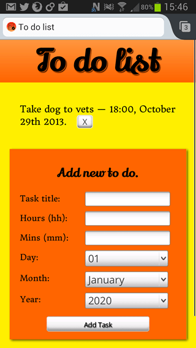
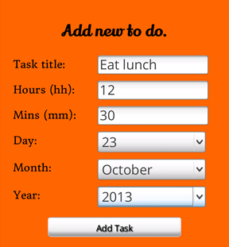

{{DefaultAPISidebar("IndexedDB")}}

Trong bài viết này, chúng ta xem xét một ví dụ phức tạp hơn: so sánh thời gian và ngày hiện tại với một hạn chót được lưu bằng IndexedDB. Phần khó nhất ở đây là đối chiếu thông tin hạn chót đã lưu, như tháng, giờ, ngày, với thời gian hiện tại lấy từ đối tượng [Date](/en-US/docs/Web/JavaScript/Reference/Global_Objects/Date).



Ứng dụng ví dụ chính được nhắc đến trong bài là **To-do list notifications**: một ứng dụng danh sách việc cần làm đơn giản lưu tiêu đề tác vụ cùng thời gian, ngày đến hạn bằng [IndexedDB](/en-US/docs/Web/API/IndexedDB_API), sau đó gửi thông báo cho người dùng khi đến hạn bằng các API [Notification](/en-US/docs/Web/API/Notification) và [Vibration](/en-US/docs/Web/API/Vibration_API). Bạn có thể [tải ứng dụng này từ GitHub](https://github.com/mdn/dom-examples/tree/main/to-do-notifications) để thử với mã nguồn hoặc [xem bản chạy trực tiếp](https://mdn.github.io/dom-examples/to-do-notifications/).

## Bài toán cơ bản

Trong ứng dụng việc cần làm, mục tiêu là:

1. Ghi lại thông tin ngày giờ theo định dạng vừa dễ hiển thị cho con người vừa dễ xử lý cho máy.
2. So sánh từng hạn chót đã lưu với thời gian hiện tại.
3. Khi có một hạn chót trùng khớp với thời điểm hiện tại, hiển thị thông báo cho người dùng.

Nếu chỉ cần so sánh hai đối tượng {{jsxref("Date")}} thì việc này khá đơn giản. Nhưng người dùng không muốn nhập dữ liệu theo đúng định dạng mà JavaScript hiểu, nên ứng dụng phải chuyển đổi dữ liệu nhập từ biểu mẫu sang dạng có thể xử lý được.

## Ghi lại thông tin ngày giờ

Để có trải nghiệm hợp lý hơn trên thiết bị di động và giảm mơ hồ khi nhập liệu, biểu mẫu HTML của ví dụ được chia thành nhiều trường riêng biệt:



- Một ô nhập văn bản cho tiêu đề tác vụ.
- Các ô nhập số cho giờ và phút.
- Các phần tử {{HTMLElement("select")}} cho ngày, tháng và năm để tránh nhập liệu mơ hồ.

Khi ứng dụng khởi tạo, danh sách năm được điền tự động từ năm hiện tại và lưu lại để dùng về sau:

```js
const currentYear = new Date().getFullYear();
for (let i = 0; i <= 12; i++) {
  const option = document.createElement("option");
  const yearValue = currentYear + i;
  option.value = yearValue;
  option.textContent = yearValue;
  year.appendChild(option);
}
year.value = currentYear;
```

Khi người dùng gửi biểu mẫu, hàm `addData()` trước hết xác minh mọi trường đều đã được điền:

```js
function addData(e) {
  e.preventDefault();

  if (
    !title.value ||
    !hours.value ||
    !minutes.value ||
    !day.value ||
    !month.value ||
    !year.value
  ) {
    note.appendChild(document.createElement("li")).textContent =
      "Data not submitted — form incomplete.";
    return;
  }
}
```

Sau đó dữ liệu được đóng gói thành một object phù hợp để thêm vào IndexedDB:

```js
const newItem = [
  {
    taskTitle: title.value,
    hours: hours.value,
    minutes: minutes.value,
    day: day.value,
    month: month.value,
    year: year.value,
    notified: "no",
  },
];
```

Tiếp theo, mã mở một transaction đọc-ghi, lấy object store, rồi thêm mục mới vào cơ sở dữ liệu:

```js
const transaction = db.transaction(["toDoList"], "readwrite");
const objectStore = transaction.objectStore("toDoList");
const request = objectStore.add(newItem[0]);
```

Thuộc tính `notified` được dùng để theo dõi liệu người dùng đã được thông báo về tác vụ đó hay chưa.

## Kiểm tra xem đã đến hạn hay chưa

Sau khi dữ liệu đã nằm trong cơ sở dữ liệu, bước tiếp theo là duyệt qua từng mục đã lưu và so sánh với thời gian hiện tại. Hàm `checkDeadlines()` lấy các thành phần ngày giờ hiện tại từ một đối tượng `Date`:

```js
function checkDeadlines() {
  const now = new Date();
  const minuteCheck = now.getMinutes();
  const hourCheck = now.getHours();
  const dayCheck = now.getDate();
  const monthCheck = now.getMonth();
  const yearCheck = now.getFullYear();
}
```

Tiếp đó, mã mở một cursor trong IndexedDB để duyệt mọi tác vụ:

```js
const objectStore = db
  .transaction(["toDoList"], "readwrite")
  .objectStore("toDoList");

objectStore.openCursor().onsuccess = (event) => {
  const cursor = event.target.result;
  if (!cursor) return;

  // xử lý mục hiện tại
  cursor.continue();
};
```

Với mỗi mục, tháng đã lưu dưới dạng chữ sẽ được chuyển về số để JavaScript có thể so sánh chính xác:

```js
const { hours, minutes, day, month, year, notified, taskTitle } = cursor.value;
const monthNumber = MONTHS.indexOf(month);
if (monthNumber === -1) throw new Error("Incorrect month entered in database.");
```

Sau đó, từng thành phần ngày giờ được đối chiếu với giá trị hiện tại:

```js
let matched = parseInt(hours, 10) === hourCheck;
matched &&= parseInt(minutes, 10) === minuteCheck;
matched &&= parseInt(day, 10) === dayCheck;
matched &&= monthNumber === monthCheck;
matched &&= parseInt(year, 10) === yearCheck;

if (matched && notified === "no") {
  if (Notification.permission === "granted") {
    createNotification(taskTitle);
  }
}
```

Điều kiện `notified === "no"` bảo đảm mỗi tác vụ chỉ tạo thông báo một lần.

## Cập nhật trạng thái sau khi gửi thông báo

Khi một thông báo được tạo, object tương ứng trong IndexedDB sẽ được cập nhật để `notified` trở thành `"yes"`. Nhờ đó, ở lần duyệt tiếp theo mục đó sẽ không kích hoạt thông báo lần nữa.

```js
const objectStore = db
  .transaction(["toDoList"], "readwrite")
  .objectStore("toDoList");

const objectStoreTitleRequest = objectStore.get(title);

objectStoreTitleRequest.onsuccess = () => {
  const data = objectStoreTitleRequest.result;
  data.notified = "yes";
};
```

## Tóm tắt

Ví dụ này cho thấy một mô hình thực tế khi dùng IndexedDB:

- Thu thập dữ liệu ngày giờ từ biểu mẫu theo định dạng thân thiện với người dùng.
- Chuyển dữ liệu đó sang định dạng dễ xử lý.
- Duyệt dữ liệu bằng cursor trong IndexedDB.
- So sánh từng mục với thời gian hiện tại.
- Kích hoạt thông báo và cập nhật trạng thái để tránh thông báo lặp.

Kết hợp IndexedDB với các API như Notification và Vibration cho phép xây dựng các ứng dụng web có khả năng lưu trạng thái bền vững và phản ứng theo thời gian.

## Xem thêm

- [Dùng IndexedDB](/en-US/docs/Web/API/IndexedDB_API/Using_IndexedDB)
- [IndexedDB API](/en-US/docs/Web/API/IndexedDB_API)
