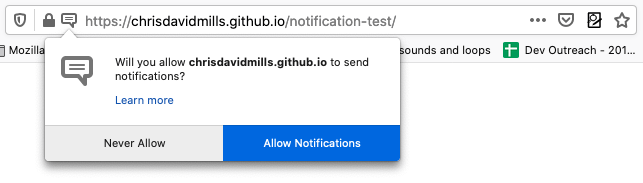

{{DefaultAPISidebar("Web Notifications")}}{{securecontext_header}} {{AvailableInWorkers}}

Notifications API cho phép các trang web điều khiển việc hiển thị thông báo hệ thống cho người dùng cuối.
Các thông báo này nằm ngoài khung nhìn của ngữ cảnh duyệt web cấp cao nhất, vì vậy vẫn có thể hiển thị ngay cả khi người dùng đã chuyển sang tab khác hoặc sang ứng dụng khác.
API này được thiết kế để tương thích với các hệ thống thông báo sẵn có trên nhiều nền tảng khác nhau.

## Khái niệm và cách dùng

Việc hiển thị một thông báo hệ thống thường bắt đầu bằng việc yêu cầu quyền dùng tính năng này, sau đó mới tạo thông báo.

### Thông báo cần quyền của người dùng

Để dùng thông báo, người dùng cần cấp cho origin hiện tại quyền hiển thị thông báo hệ thống.
Việc này thường được thực hiện khi ứng dụng hoặc trang khởi tạo, bằng phương thức {{domxref("Notification.requestPermission_static", "Notification.requestPermission()")}}.
Phương thức này chỉ nên được gọi khi đang xử lý một thao tác người dùng, chẳng hạn một cú nhấp chuột.
Ví dụ:

```js
btn.addEventListener("click", () => {
  let promise = Notification.requestPermission();
  // chờ quyền được phản hồi
});
```

Thao tác này sẽ mở một hộp thoại yêu cầu quyền như sau:



Người dùng có thể chọn cho phép thông báo từ origin này hoặc chặn chúng.
Sau khi đã chọn, thiết lập này thường sẽ được giữ nguyên trong phiên hiện tại.

### Hiển thị và xử lý thông báo

Thông báo được tạo bằng constructor {{domxref("Notification.Notification","Notification()")}}.
Constructor này phải nhận một đối số tiêu đề, và có thể nhận thêm tham số tùy chọn để chỉ định các thiết lập như hướng văn bản, nội dung thân thông báo, biểu tượng hiển thị, âm thanh thông báo, v.v.

Ví dụ, đoạn mã sau cho thấy cách tạo một thông báo đặt tùy chọn [`navigate`](/en-US/docs/Web/API/Notification/Notification#navigate), chỉ định một URL sẽ được mở nếu thông báo được chấp nhận. Bạn cũng có thể định nghĩa trình xử lý click để xử lý các hành động của thông báo.

```js
if (Notification.permission === "granted") {
  const notification = new Notification("New message from Alice", {
    body: "Hey, are you free for lunch?",
    navigate: "/messages/alice",
  });
}
```

Xem thêm [Dùng Notifications API](/en-US/docs/Web/API/Notifications_API/Using_the_Notifications_API) để biết thêm ví dụ sử dụng.

### Thông báo tạm thời và thông báo bền vững

Notifications API hỗ trợ hai loại thông báo:

- **Thông báo không bền vững** được tạo trong một ngữ cảnh duyệt web, chẳng hạn một trang web hoặc một tab.
  Thời gian tồn tại của chúng gắn với vòng đời của trang. Nếu trang bị đóng, thông báo sẽ không còn tương tác được nữa.

  Chúng được tạo bằng constructor {{domxref("Notification.Notification","Notification()")}} và kích hoạt các sự kiện như {{domxref("Notification/click_event", "click")}} trực tiếp trên thể hiện `Notification`.

- **Thông báo bền vững** được tạo từ một service worker và có thể vẫn tương tác được sau khi một trang riêng lẻ đã kết thúc vòng đời.

  Chúng được tạo bằng {{domxref("ServiceWorkerRegistration.showNotification()")}} từ một service worker và kích hoạt các sự kiện {{domxref("ServiceWorkerGlobalScope/notificationclick_event", "notificationclick")}} và {{domxref("ServiceWorkerGlobalScope/notificationclose_event", "notificationclose")}} trên {{domxref("ServiceWorkerGlobalScope")}}.

## Giao diện

- {{domxref("Notification")}}
  - : Định nghĩa một đối tượng thông báo.
    Khi được kích hoạt, một thông báo không bền vững sẽ phát sự kiện {{domxref("Notification.click_event", "click")}}, trừ khi có đặt URL {{domxref("Notification.navigate", "navigate")}}; trong trường hợp đó, user agent sẽ điều hướng tới URL đó.
- {{domxref("NotificationEvent")}}
  - : Đại diện cho một sự kiện thông báo được phát trên {{domxref("ServiceWorkerGlobalScope")}} của một {{domxref("ServiceWorker")}}.

### Phần mở rộng cho các giao diện khác

- Sự kiện {{domxref("ServiceWorkerGlobalScope/notificationclick_event", "notificationclick")}}
  - : Xảy ra khi người dùng nhấp vào một thông báo bền vững đang hiển thị, trừ khi có đặt URL {{domxref("Notification.navigate", "navigate")}}.
- Sự kiện {{domxref("ServiceWorkerGlobalScope/notificationclose_event", "notificationclose")}}
  - : Xảy ra khi người dùng đóng một thông báo đang hiển thị.
- {{domxref("ServiceWorkerRegistration.getNotifications()")}}
  - : Trả về danh sách các thông báo theo đúng thứ tự chúng được tạo từ origin hiện tại thông qua đăng ký service worker hiện tại.
- {{domxref("ServiceWorkerRegistration.showNotification()")}}
  - : Hiển thị thông báo với tiêu đề đã yêu cầu.

## Thông số kỹ thuật

{{Specifications}}

## Tương thích trình duyệt

{{Compat}}

## Xem thêm

- [Dùng Notifications API](/en-US/docs/Web/API/Notifications_API/Using_the_Notifications_API)
