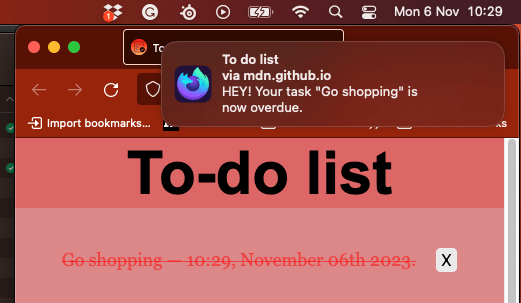

{{DefaultAPISidebar("Web Notifications")}}

[Notifications API](/en-US/docs/Web/API/Notifications_API) cho phép một trang web hoặc ứng dụng gửi các thông báo được hiển thị bên ngoài trang ở cấp hệ thống. Điều này giúp ứng dụng web có thể gửi thông tin tới người dùng ngay cả khi ứng dụng đang rảnh hoặc chạy nền.
Bài viết này sẽ xem qua những điều cơ bản khi dùng API này trong ứng dụng của bạn.

Thông thường, thông báo hệ thống là cơ chế thông báo chuẩn của hệ điều hành: hãy nghĩ đến cách một máy tính để bàn hoặc thiết bị di động tiêu chuẩn phát thông báo.



Tất nhiên, hệ thống thông báo của từng nền tảng và trình duyệt sẽ khác nhau, nhưng điều này là bình thường. Notifications API được viết đủ tổng quát để tương thích với hầu hết các hệ thống thông báo.

## Ví dụ

Một trong những trường hợp sử dụng rõ ràng nhất của thông báo web là ứng dụng thư hoặc IRC dựa trên web, cần báo cho người dùng khi có tin nhắn mới, kể cả khi họ đang làm việc khác trong một ứng dụng khác.
Hiện nay đã có nhiều ví dụ như vậy, chẳng hạn [Slack](https://slack.com/).

Chúng tôi đã viết một ví dụ thực tế, một ứng dụng danh sách việc cần làm, để minh họa rõ hơn cách dùng thông báo web.
Ứng dụng này lưu dữ liệu cục bộ bằng [IndexedDB](/en-US/docs/Web/API/IndexedDB_API) và thông báo cho người dùng khi tác vụ đến hạn bằng thông báo hệ thống.
[Tải mã nguồn ứng dụng To-do list](https://github.com/mdn/dom-examples/tree/main/to-do-notifications) hoặc [xem ứng dụng chạy trực tiếp](https://mdn.github.io/dom-examples/to-do-notifications/).

## Yêu cầu quyền

Trước khi ứng dụng có thể gửi thông báo, người dùng phải cấp quyền cho ứng dụng làm việc đó.
Đây là yêu cầu phổ biến khi một API cố tương tác với thứ gì đó ngoài trang web. Ít nhất một lần, người dùng cần cấp quyền rõ ràng cho ứng dụng đó để hiển thị thông báo, qua đó kiểm soát ứng dụng/trang nào được phép hiển thị thông báo.

Do tình trạng lạm dụng push notification trước đây, trình duyệt web và nhà phát triển đã bắt đầu áp dụng các chiến lược để giảm thiểu vấn đề này.
Bạn chỉ nên yêu cầu người dùng đồng ý hiển thị thông báo khi có một thao tác rõ ràng từ họ, chẳng hạn nhấp nút.
Đây không chỉ là thực hành tốt mà còn là điều nên làm để không làm phiền người dùng bằng những thông báo họ chưa đồng ý. Trong tương lai, trình duyệt sẽ từ chối rõ ràng các yêu cầu quyền thông báo không xuất phát từ một thao tác người dùng.
Firefox đã làm điều này từ phiên bản 72, và Safari cũng đã làm như vậy từ lâu.

Ngoài ra, trong Chrome và Firefox bạn không thể yêu cầu thông báo nếu trang không phải là secure context, tức HTTPS, và bạn cũng không còn có thể xin quyền thông báo từ các {{htmlelement("iframe")}} khác origin.

> [!NOTE]
> Các ví dụ trong bài này dùng constructor {{domxref("Notification/Notification", "Notification()")}} để tạo thông báo.
> Điều này ổn trên máy tính để bàn, nhưng trên hầu hết trình duyệt di động nó sẽ ném ra {{jsxref("TypeError")}}.
> Nếu bạn nhắm tới thiết bị di động, bạn nên đăng ký một service worker và dùng {{domxref("ServiceWorkerRegistration.showNotification()")}} thay thế.

### Kiểm tra trạng thái quyền hiện tại

Bạn có thể kiểm tra xem mình đã có quyền hay chưa bằng cách đọc thuộc tính chỉ đọc {{domxref("Notification.permission_static", "Notification.permission")}}.
Thuộc tính này có thể có một trong ba giá trị:

- `default`
  - : Người dùng chưa được hỏi quyền, nên thông báo sẽ không được hiển thị.
- `granted`
  - : Người dùng đã cấp quyền hiển thị thông báo sau khi được hỏi trước đó.
- `denied`
  - : Người dùng đã từ chối rõ ràng quyền hiển thị thông báo.

### Xin quyền

Nếu quyền hiển thị thông báo chưa được cấp, ứng dụng cần dùng phương thức {{domxref("Notification.requestPermission_static", "Notification.requestPermission()")}} để yêu cầu từ người dùng.
Ở dạng đơn giản nhất, ta chỉ cần:

```js
Notification.requestPermission().then((result) => {
  console.log(result);
});
```

Đây là phiên bản của phương thức dựa trên promise.
Nếu bạn cần hỗ trợ các phiên bản cũ hơn, có thể phải dùng phiên bản callback cũ như sau:

```js
Notification.requestPermission((result) => {
  console.log(result);
});
```

Phiên bản callback có thể nhận một hàm callback tùy chọn, được gọi sau khi người dùng phản hồi yêu cầu cấp quyền hiển thị thông báo.

> [!NOTE]
> Không có cách nào đáng tin cậy để kiểm tra tính năng xem `Notification.requestPermission` có hỗ trợ phiên bản promise hay không.
> Nếu bạn cần hỗ trợ trình duyệt cũ, hãy dùng phiên bản callback. Dù đã lỗi thời, nó vẫn hoạt động trên các trình duyệt mới.
> Xem [bảng tương thích trình duyệt](/en-US/docs/Web/API/Notification/requestPermission_static#browser_compatibility) để biết thêm chi tiết.

### Ví dụ

Trong bản demo danh sách việc cần làm của chúng tôi, có một nút "Enable notifications". Khi được nhấn, nó sẽ yêu cầu quyền thông báo cho ứng dụng.

```html
<button id="enable">Enable notifications</button>
```

Khi nhấp vào nút này, hàm `askNotificationPermission()` sẽ được gọi:

```js
function askNotificationPermission() {
  // Kiểm tra xem trình duyệt có hỗ trợ thông báo hay không
  if (!("Notification" in window)) {
    console.log("This browser does not support notifications.");
    return;
  }
  Notification.requestPermission().then((permission) => {
    // đặt nút hiển thị hoặc ẩn, tùy theo phản hồi của người dùng
    notificationBtn.style.display = permission === "granted" ? "none" : "block";
  });
}
```

Nhìn vào khối chính thứ hai trước, bạn sẽ thấy đầu tiên ta kiểm tra xem Notifications có được hỗ trợ hay không.
Nếu có, ta chạy phiên bản dựa trên promise của `Notification.requestPermission()`. Nếu không, ta ghi một thông báo vào console.

Trong phần xử lý promise được truyền vào `then`, ta hiện hoặc ẩn nút tùy theo lựa chọn của người dùng trong hộp thoại quyền.
Ta không muốn hiển thị nút này nếu quyền đã được cấp, nhưng nếu người dùng từ chối quyền, ta muốn cho họ cơ hội đổi ý sau.

## Tạo thông báo

Tạo thông báo rất dễ. Chỉ cần dùng constructor {{domxref("Notification")}}.
Constructor này mong đợi một tiêu đề sẽ hiển thị trong thông báo và một số tùy chọn để làm phong phú thông báo, như {{domxref("Notification.icon","icon")}} hoặc nội dung văn bản {{domxref("Notification.body","body")}}.

Ví dụ, trong bản demo to-do list, chúng tôi dùng đoạn mã sau để tạo thông báo khi cần, nằm trong hàm `createNotification()`:

```js
const img = "/to-do-notifications/img/icon-128.png";
const text = `HEY! Your task "${title}" is now overdue.`;
const notification = new Notification("To do list", { body: text, icon: img });
```

## Đóng thông báo

Hãy dùng {{domxref("Notification.close", "close()")}} để gỡ bỏ một thông báo không còn liên quan tới người dùng.
Ví dụ, người dùng đã đọc thông báo trên trang web trong một ứng dụng nhắn tin, hoặc bài hát kế tiếp đã phát trong một ứng dụng âm nhạc thông báo khi bài đổi.
Hầu hết trình duyệt hiện đại sẽ tự động đóng thông báo sau vài giây (khoảng bốn giây), nhưng đây thường không phải điều bạn cần bận tâm vì nó phụ thuộc vào người dùng và user agent.
Việc đóng này cũng có thể diễn ra ở cấp hệ điều hành, và người dùng vẫn nên giữ quyền kiểm soát điều đó.
Các phiên bản Chrome cũ không tự động xóa thông báo, nên bạn có thể làm việc đó sau một {{domxref("Window.setTimeout", "setTimeout()")}} chỉ để hỗ trợ các phiên bản cũ đó, tránh xóa thông báo khỏi khay thông báo trên các trình duyệt khác.

```js
const n = new Notification("My Great Song");
document.addEventListener("visibilitychange", () => {
  if (document.visibilityState === "visible") {
    // Tab đã trở nên hiển thị nên xóa thông báo cũ.
    n.close();
  }
});
```

> [!NOTE]
> Không nên dùng API này chỉ để xóa thông báo khỏi màn hình sau một khoảng trễ cố định, vì trên các trình duyệt hiện đại phương thức này còn xóa thông báo khỏi mọi notification tray, khiến người dùng không thể tương tác với nó sau khi nó xuất hiện.

> [!NOTE]
> Khi bạn nhận một sự kiện "close", không có gì đảm bảo chính người dùng đã đóng thông báo.
> Điều này phù hợp với đặc tả, vốn quy định: "Khi một thông báo bị đóng, dù bởi nền tảng thông báo cơ sở hay bởi người dùng, các bước đóng của nó phải được thực thi."

## Sự kiện thông báo

Có bốn sự kiện được kích hoạt trên thể hiện {{domxref("Notification")}}:

- `click`
  - : Kích hoạt khi người dùng nhấp vào thông báo.
- `close`
  - : Kích hoạt khi thông báo bị đóng.
- `error`
  - : Kích hoạt nếu có sự cố xảy ra với thông báo; thường là vì thông báo không thể được hiển thị vì một lý do nào đó.
- `show`
  - : Kích hoạt khi thông báo được hiển thị cho người dùng.

Bạn có thể theo dõi các sự kiện này bằng các handler {{domxref("Notification.click_event","onclick")}}, {{domxref("Notification.close_event","onclose")}}, {{domxref("Notification.error_event","onerror")}} và {{domxref("Notification.show_event","onshow")}}.
Vì {{domxref("Notification")}} cũng kế thừa từ {{domxref("EventTarget")}}, bạn có thể dùng phương thức {{domxref("EventTarget.addEventListener","addEventListener()")}} trên nó.

> [!NOTE]
> Các sự kiện liệt kê ở trên áp dụng cho [thông báo không bền vững](/en-US/docs/Web/API/Notifications_API#persistent_and_non-persistent_notifications) được tạo bằng constructor {{domxref("Notification.Notification", "Notification()")}}.
> Thông báo bền vững được tạo qua {{domxref("ServiceWorkerRegistration.showNotification()")}} sẽ kích hoạt các sự kiện {{domxref("ServiceWorkerGlobalScope.notificationclick_event", "notificationclick")}} và {{domxref("ServiceWorkerGlobalScope.notificationclose_event", "notificationclose")}} trên {{domxref("ServiceWorkerGlobalScope")}}.

### Điều hướng khi kích hoạt

Thay vì xử lý sự kiện click, bạn có thể đặt tùy chọn {{domxref("Notification.navigate", "navigate")}} để tự động mở một URL khi người dùng kích hoạt thông báo.
Điều này bỏ qua cả sự kiện `click` và `notificationclick`.
Xem {{domxref("Notification.navigate")}} để biết chi tiết.

## Thay thế thông báo hiện có

Thông thường không nên để người dùng nhận quá nhiều thông báo trong thời gian ngắn. Ví dụ, nếu một ứng dụng nhắn tin thông báo cho người dùng mỗi khi có tin nhắn tới, và rất nhiều tin nhắn được gửi đến cùng lúc thì sao?
Để tránh làm phiền người dùng bằng quá nhiều thông báo, có thể sửa hàng đợi thông báo đang chờ, thay một hoặc nhiều thông báo đang chờ bằng một thông báo mới.

Để làm điều đó, bạn có thể thêm một tag cho bất kỳ thông báo mới nào.
Nếu một thông báo đã có cùng tag và vẫn chưa được hiển thị, thông báo mới sẽ thay thế thông báo cũ đó.
Nếu thông báo có cùng tag đã được hiển thị rồi, thông báo cũ sẽ bị đóng và thông báo mới sẽ được hiển thị.

### Ví dụ về tag

Giả sử HTML cơ bản sau:

```html
<button id="notify">Notify me!</button>
<section id="demo-logs"></section>
```

```css hidden
#demo-logs {
  width: 90%;
  height: 100px;
  background-color: #dddddd;
  overflow-x: auto;
  padding: 10px;
  margin-top: 10px;
}
```

Bạn có thể xử lý nhiều thông báo theo cách này:

```js
const demoLogs = document.querySelector("#demo-logs");

const button = document.querySelector("#notify");

button.addEventListener("click", () => {
  if (Notification?.permission === "granted") {
    demoLogs.innerText += `The site has permission to show notifications. Showing notifications.\n`;
    // Nếu người dùng đồng ý nhận thông báo
    // Hãy thử gửi mười thông báo
    let i = 0;
    // Dùng interval vì một số trình duyệt (bao gồm Firefox) sẽ chặn thông báo nếu có quá nhiều trong một khoảng thời gian.
    const interval = setInterval(() => {
      // Nhờ tag, ta chỉ nên thấy thông báo "Hi no 9 from MDN."
      const n = new Notification(`Hi no ${i} from MDN.`, {
        tag: "soManyNotification",
      });
      if (i === 9) {
        clearInterval(interval);
      }
      i++;
    }, 200);
  } else if (Notification?.permission !== "denied") {
    demoLogs.innerText += "Requesting notification permission.\n";
    // Nếu người dùng chưa nói họ có muốn được thông báo hay không
    // Lưu ý: do Chrome, ta không chắc thuộc tính permission đã được đặt hay chưa,
    // nên không an toàn nếu kiểm tra giá trị "default".
    Notification.requestPermission().then((status) => {
      // Nếu người dùng đồng ý
      if (status === "granted") {
        demoLogs.innerText +=
          "User granted the permission. Sending notifications.\n";
        let i = 0;
        // Dùng interval vì một số trình duyệt (bao gồm Firefox) sẽ chặn thông báo nếu có quá nhiều trong một khoảng thời gian.
        const interval = setInterval(() => {
          // Nhờ tag, ta chỉ nên thấy thông báo "Message no 9 from MDN."
          const n = new Notification(`Message no ${i} from MDN.`, {
            tag: "soManyNotification",
          });
          if (i === 9) {
            clearInterval(interval);
          }
          i++;
        }, 200);
      } else {
        // Ngược lại, ta có thể dùng một hộp thoại cảnh báo thông thường
        demoLogs.innerText += `User denied the permission request.\n`;
      }
    });
  } else {
    // Nếu người dùng từ chối được thông báo, ta có thể dùng một hộp thoại cảnh báo thông thường
    demoLogs.innerText += `The site does not have permission to show notifications.\n`;
  }
});
```

### Kết quả

{{ EmbedLiveSample('Tag_example', '100%', 200) }}

Để thử ví dụ trên, hãy thay đổi cài đặt [send notification](https://support.mozilla.org/en-US/kb/firefox-page-info-window#w_permissions) cho trang web `https://live.mdnplay.dev`.

## Xem thêm

- {{ domxref("Notification") }}
