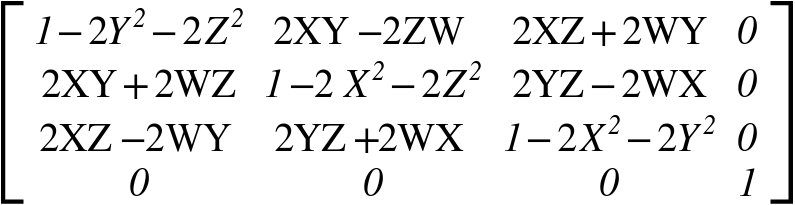

{{securecontext_header}}{{APIRef("Sensor API")}}

Phương thức **`populateMatrix()`** của giao diện {{domxref("OrientationSensor")}} điền vào ma trận mục tiêu đã cho với ma trận quay dựa trên lần đọc cảm biến mới nhất. Ma trận quay được hiển thị dưới đây.



trong đó:

- W = cos(θ/2)
- X = Vx \* sin(θ/2)
- Y = Vy \* sin(θ/2)
- Z = Vz \* sin(θ/2)

## Cú pháp

```js-nolint
populateMatrix(targetMatrix)
```

Vì {{domxref('OrientationSensor')}} là một lớp cơ sở, `populateMatrix` chỉ có thể được đọc từ một trong các lớp dẫn xuất của nó.

### Tham số

- `targetMatrix`
  - : TBD

### Giá trị trả về

Không có ({{jsxref("undefined")}}).

## Ví dụ

```js
// TBD
```

## Thông số kỹ thuật

{{Specifications}}

## Tương thích trình duyệt

{{Compat}}
