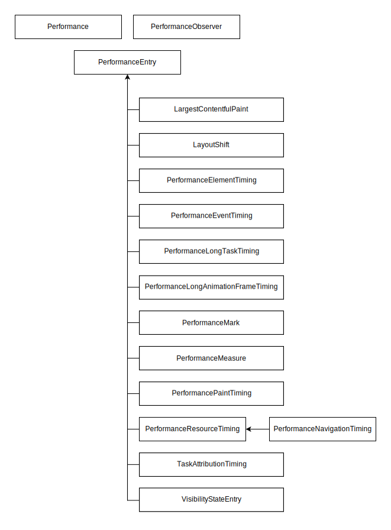

{{DefaultAPISidebar("Performance API")}}{{AvailableInWorkers}}

Performance API là một nhóm các tiêu chuẩn được dùng để đo hiệu năng của ứng dụng web.

## Khái niệm và cách dùng

Để bảo đảm ứng dụng web hoạt động nhanh, việc đo lường và phân tích nhiều chỉ số hiệu năng khác nhau là rất quan trọng. Performance API cung cấp các chỉ số tích hợp quan trọng và khả năng thêm các phép đo riêng của bạn vào performance timeline của trình duyệt. Performance timeline chứa các dấu thời gian có độ chính xác cao và có thể được hiển thị trong công cụ dành cho nhà phát triển. Bạn cũng có thể gửi dữ liệu của nó đến các điểm cuối phân tích để ghi nhận chỉ số hiệu năng theo thời gian.

Mỗi chỉ số hiệu năng được biểu diễn bởi một {{domxref("PerformanceEntry")}} duy nhất. Một mục performance entry có `name`, `duration`, `startTime` và `type`. Tất cả các chỉ số hiệu năng đều kế thừa giao diện `PerformanceEntry` và bổ sung thêm các điều kiện cụ thể.

Hầu hết các performance entry được ghi lại tự động mà bạn không cần làm gì, rồi sau đó có thể truy cập qua {{domxref("Performance.getEntries()")}} hoặc, tốt hơn, qua {{domxref("PerformanceObserver")}}. Ví dụ, các entry {{domxref("PerformanceEventTiming")}} được ghi lại cho những sự kiện vượt quá một ngưỡng nhất định. Nhưng Performance API cũng cho phép bạn định nghĩa và ghi lại các sự kiện tùy chỉnh của riêng mình bằng các giao diện {{domxref("PerformanceMark")}} và {{domxref("PerformanceMeasure")}}.

Giao diện {{domxref("Performance")}} chính có trong cả các global scope {{domxref("Window.performance", "Window")}} và {{domxref("WorkerGlobalScope.performance", "Worker")}}, đồng thời cho phép bạn thêm, xóa và truy xuất các performance entry tùy chỉnh.

Giao diện {{domxref("PerformanceObserver")}} cho phép bạn lắng nghe nhiều loại performance entry khác nhau khi chúng được ghi lại.

Để biết thêm thông tin khái niệm, xem các [hướng dẫn Performance API](#guides) bên dưới.

## Tài liệu tham khảo

Các giao diện sau có trong Performance API:

- {{domxref("EventCounts")}}
  - : Một bản đồ chỉ đọc được trả về bởi {{domxref("performance.eventCounts")}}, chứa số lượng sự kiện đã được phát ra theo từng loại sự kiện.
- {{domxref("LargestContentfulPaint")}}
  - : Đo thời gian kết xuất của hình ảnh hoặc khối văn bản lớn nhất hiển thị trong khung nhìn, được ghi từ khi trang bắt đầu tải.
- {{domxref("LayoutShift")}}
  - : Cung cấp thông tin về độ ổn định bố cục của trang web dựa trên chuyển động của các phần tử trên trang.
- {{domxref("LayoutShiftAttribution")}}
  - : Cung cấp thông tin gỡ lỗi về các phần tử đã bị dịch chuyển.
- {{domxref("NotRestoredReasonDetails")}}
  - : Đại diện cho một lý do đơn lẻ khiến một trang đã điều hướng bị chặn không cho dùng back/forward cache ({{Glossary("bfcache")}}).
- {{domxref("NotRestoredReasons")}}
  - : Cung cấp dữ liệu báo cáo chứa các lý do khiến tài liệu hiện tại bị chặn không cho dùng back/forward cache ({{Glossary("bfcache")}}) khi điều hướng.
- {{domxref("Performance")}}
  - : Giao diện chính để truy cập các phép đo hiệu năng. Có sẵn cho ngữ cảnh window và worker thông qua {{domxref("Window.performance")}} hoặc {{domxref("WorkerGlobalScope.performance")}}.
- {{domxref("PerformanceElementTiming")}}
  - : Đo dấu thời gian kết xuất của các phần tử cụ thể.
- {{domxref("PerformanceEntry")}}
  - : Một mục trên performance timeline, bao gói một chỉ số hiệu năng duy nhất. Tất cả các chỉ số hiệu năng đều kế thừa từ giao diện này.
- {{domxref("PerformanceEventTiming")}}
  - : Đo độ trễ của sự kiện và {{Glossary("Interaction to Next Paint")}} (INP).
- {{domxref("PerformanceLongAnimationFrameTiming")}}
  - : Cung cấp các chỉ số về [khung hình hoạt ảnh dài (LoAFs)](/en-US/docs/Web/API/Performance_API/Long_animation_frame_timing#what_is_a_long_animation_frame) chiếm tài nguyên kết xuất và chặn các tác vụ khác được thực thi.
- {{domxref("PerformanceLongTaskTiming")}}
  - : Cung cấp các chỉ số về [tác vụ dài](/en-US/docs/Glossary/Long_task) chiếm tài nguyên kết xuất và chặn các tác vụ khác được thực thi.
- {{domxref("PerformanceMark")}}
  - : Dấu mốc tùy chỉnh cho mục riêng của bạn trên performance timeline.
- {{domxref("PerformanceMeasure")}}
  - : Đo thời gian tùy chỉnh giữa hai performance entry.
- {{domxref("PerformanceNavigationTiming")}}
  - : Đo các sự kiện điều hướng tài liệu, chẳng hạn như mất bao lâu để tải một tài liệu.
- {{domxref("PerformanceObserver")}}
  - : Lắng nghe các performance entry mới khi chúng được ghi lại trong performance timeline.
- {{domxref("PerformanceObserverEntryList")}}
  - : Danh sách các mục đã được quan sát trong một performance observer.
- {{domxref("PerformancePaintTiming")}}
  - : Đo các thao tác kết xuất trong quá trình xây dựng trang web.
- {{domxref("PerformanceResourceTiming")}}
  - : Đo các chỉ số tải mạng như thời điểm bắt đầu và kết thúc chuyển hướng, thời điểm bắt đầu tìm nạp, thời điểm bắt đầu và kết thúc tra cứu DNS, thời điểm bắt đầu và kết thúc phản hồi cho các tài nguyên như hình ảnh, script, lời gọi fetch, v.v.
- {{domxref("PerformanceScriptTiming")}}
  - : Cung cấp các chỉ số về từng script riêng lẻ gây ra [khung hình hoạt ảnh dài (LoAFs)](/en-US/docs/Web/API/Performance_API/Long_animation_frame_timing#what_is_a_long_animation_frame).
- {{domxref("PerformanceServerTiming")}}
  - : Hiển thị các chỉ số máy chủ được gửi kèm phản hồi trong tiêu đề HTTP {{HTTPHeader("Server-Timing")}}.
- {{domxref("TaskAttributionTiming")}}
  - : Xác định loại tác vụ và container chịu trách nhiệm cho tác vụ dài.
- {{domxref("VisibilityStateEntry")}}
  - : Đo thời điểm thay đổi trạng thái hiển thị của trang, tức là khi một tab chuyển từ nền trước ra nền sau hoặc ngược lại.

## Hướng dẫn

Các hướng dẫn sau sẽ giúp bạn hiểu những khái niệm chính của Performance API và cung cấp tổng quan về khả năng của nó:

- [Performance data](/en-US/docs/Web/API/Performance_API/Performance_data): Thu thập, truy cập và làm việc với dữ liệu hiệu năng.
- [High precision timing](/en-US/docs/Web/API/Performance_API/High_precision_timing): Đo bằng độ chính xác cao và đồng hồ đơn điệu.
- [Resource timing](/en-US/docs/Web/API/Performance_API/Resource_timing): Đo thời gian mạng cho các tài nguyên được tìm nạp, chẳng hạn như hình ảnh, CSS và JavaScript.
- [Navigation timing](/en-US/docs/Web/API/Performance_API/Navigation_timing): Đo thời gian điều hướng của một tài liệu.
- [User timing](/en-US/docs/Web/API/Performance_API/User_timing): Đo lường và ghi lại dữ liệu hiệu năng riêng cho ứng dụng của bạn.
- [Server timing](/en-US/docs/Web/API/Performance_API/Server_timing): Thu thập các chỉ số phía máy chủ.
- [Long animation frame timing](/en-US/docs/Web/API/Performance_API/Long_animation_frame_timing): Thu thập các chỉ số về khung hình hoạt ảnh dài (LoAFs) và nguyên nhân của chúng.
- [Monitoring bfcache blocking reasons](/en-US/docs/Web/API/Performance_API/Monitoring_bfcache_blocking_reasons): Báo cáo lý do tài liệu hiện tại bị chặn không cho dùng back/forward cache ({{Glossary("bfcache")}}).

## Thông số kỹ thuật

{{Specifications}}

## Xem thêm

- [Web performance](/en-US/docs/Web/Performance)
- [Learn: Web performance](/en-US/docs/Learn_web_development/Extensions/Performance)
