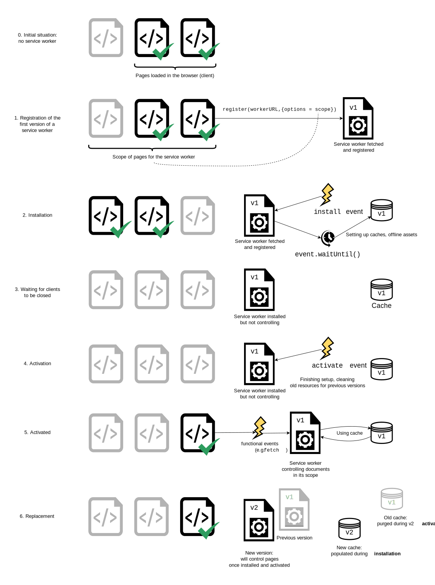
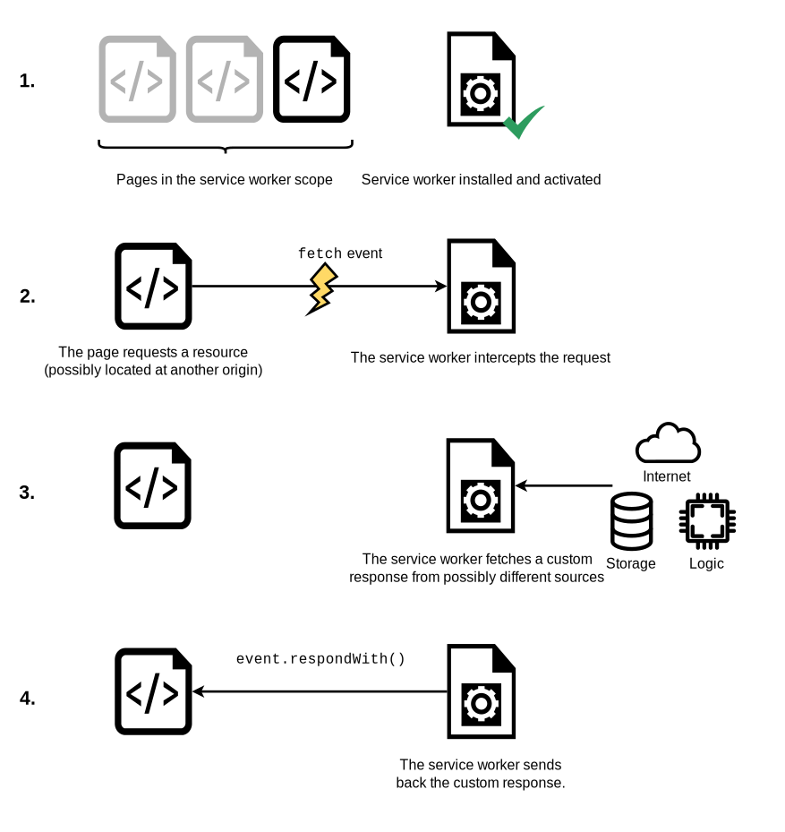

{{DefaultAPISidebar("Service Workers API")}}

Bài viết này cung cấp thông tin để bắt đầu với service worker, bao gồm kiến trúc cơ bản, đăng ký service worker, quy trình cài đặt và kích hoạt cho một service worker mới, cập nhật service worker của bạn, kiểm soát cache và phản hồi tùy chỉnh, tất cả đều đặt trong bối cảnh một ứng dụng có chức năng ngoại tuyến.

## Tiền đề của service worker

Một vấn đề lớn mà người dùng web đã phải chịu đựng trong nhiều năm là mất kết nối. Ứng dụng web tốt nhất thế giới vẫn sẽ mang lại trải nghiệm người dùng tệ nếu bạn không thể tải nó về. Đã có nhiều nỗ lực tạo ra công nghệ để giải quyết vấn đề này, và một số điểm đã được xử lý. Nhưng vấn đề tổng thể vẫn là không có một cơ chế kiểm soát chung tốt cho việc lưu đệm tài nguyên và các yêu cầu mạng tùy chỉnh.

Service worker giải quyết những vấn đề này. Khi dùng service worker, bạn có thể thiết lập ứng dụng để ưu tiên tài nguyên đã được lưu đệm trước, từ đó cung cấp một trải nghiệm mặc định ngay cả khi ngoại tuyến, rồi sau đó lấy thêm dữ liệu từ mạng (thường được gọi là "offline first"). Điều này vốn đã có sẵn với ứng dụng gốc, và đó là một trong những lý do chính khiến ứng dụng gốc thường được chọn hơn ứng dụng web.

Service worker hoạt động như một máy chủ proxy, cho phép bạn sửa đổi các request và response bằng cách thay thế chúng bằng các mục từ cache của chính nó.

## Thiết lập để thử với service worker

Service worker được bật mặc định trong tất cả trình duyệt hiện đại. Để chạy mã dùng service worker, bạn cần phục vụ mã của mình qua HTTPS - Service worker bị giới hạn chỉ chạy trên HTTPS vì lý do bảo mật. Cần có một máy chủ hỗ trợ HTTPS. Để host các thử nghiệm, bạn có thể dùng dịch vụ như GitHub, Netlify, Vercel, v.v. Để hỗ trợ phát triển cục bộ, `localhost` cũng được trình duyệt coi là một secure origin.

## Kiến trúc cơ bản

Với service worker, các bước sau thường được quan sát trong thiết lập cơ bản:

1. Mã service worker được tải về rồi đăng ký bằng [`serviceWorkerContainer.register()`](/en-US/docs/Web/API/ServiceWorkerContainer/register). Nếu thành công, service worker sẽ được thực thi trong một [`ServiceWorkerGlobalScope`](/en-US/docs/Web/API/ServiceWorkerGlobalScope); về cơ bản đây là một kiểu đặc biệt của ngữ cảnh worker, chạy tách khỏi luồng thực thi script chính và không có quyền truy cập DOM. Lúc này service worker đã sẵn sàng xử lý sự kiện.
2. Việc cài đặt diễn ra. Sự kiện `install` luôn là sự kiện đầu tiên được gửi tới service worker (điều này có thể được dùng để bắt đầu quá trình điền dữ liệu vào IndexedDB và lưu đệm tài sản của site). Trong bước này, ứng dụng đang chuẩn bị để mọi thứ sẵn sàng dùng ngoại tuyến.
3. Khi trình xử lý `install` hoàn tất, service worker được xem là đã cài đặt. Tại thời điểm này, một phiên bản trước đó của service worker có thể đang hoạt động và điều khiển các trang đang mở. Vì chúng ta không muốn hai phiên bản khác nhau của cùng một service worker chạy cùng lúc, nên phiên bản mới vẫn chưa hoạt động.
4. Khi tất cả các trang do phiên bản cũ của service worker điều khiển đã đóng, việc cho phiên bản cũ nghỉ là an toàn, và service worker mới cài đặt sẽ nhận được sự kiện `activate`. Mục đích chính của `activate` là dọn dẹp các tài nguyên được dùng trong các phiên bản trước của service worker. Service worker mới có thể gọi [`skipWaiting()`](/en-US/docs/Web/API/ServiceWorkerGlobalScope/skipWaiting) để yêu cầu được kích hoạt ngay lập tức mà không cần chờ các trang đang mở đóng lại. Khi đó service worker mới sẽ nhận `activate` ngay và tiếp quản mọi trang đang mở.
5. Sau khi kích hoạt, service worker sẽ điều khiển các trang, nhưng chỉ những trang được mở sau khi `register()` thành công. Nói cách khác, tài liệu sẽ phải tải lại mới thực sự được điều khiển, vì một tài liệu bắt đầu tồn tại với hoặc không có service worker và giữ trạng thái đó trong suốt vòng đời của nó. Để ghi đè hành vi mặc định này và nhận các trang đang mở vào quản lý, service worker có thể gọi [`clients.claim()`](/en-US/docs/Web/API/Clients/claim).
6. Mỗi khi một phiên bản mới của service worker được tải về, chu kỳ này sẽ lặp lại và phần còn lại của phiên bản trước đó sẽ được dọn trong quá trình kích hoạt của phiên bản mới.



Sau đây là tóm tắt các sự kiện service worker hiện có:

- [`install`](/en-US/docs/Web/API/ServiceWorkerGlobalScope/install_event)
- [`activate`](/en-US/docs/Web/API/ServiceWorkerGlobalScope/activate_event)
- [`message`](/en-US/docs/Web/API/ServiceWorkerGlobalScope/message_event)
- Các sự kiện chức năng
  - [`fetch`](/en-US/docs/Web/API/ServiceWorkerGlobalScope/fetch_event)
  - [`sync`](/en-US/docs/Web/API/ServiceWorkerGlobalScope/sync_event)
  - [`push`](/en-US/docs/Web/API/ServiceWorkerGlobalScope/push_event)

## Bản demo

Để minh họa những điều cơ bản nhất về việc đăng ký và cài đặt service worker, chúng tôi đã tạo một bản demo tên là [simple service worker](https://github.com/mdn/dom-examples/tree/main/service-worker/simple-service-worker), là một bộ sưu tập ảnh Star Wars Lego đơn giản. Nó sử dụng một hàm hỗ trợ bởi promise để đọc dữ liệu ảnh từ một đối tượng JSON và tải các ảnh bằng [`fetch()`](/en-US/docs/Web/API/Fetch_API/Using_Fetch), rồi hiển thị ảnh theo hàng dọc xuống trang. Chúng tôi tạm giữ mọi thứ ở trạng thái tĩnh. Nó cũng đăng ký, cài đặt và kích hoạt một service worker.


Bạn có thể xem [mã nguồn trên GitHub](https://github.com/mdn/dom-examples/tree/main/service-worker/simple-service-worker), và [bản chạy trực tiếp của simple service worker](https://bncb2v.csb.app/).

### Đăng ký worker của bạn

Khối mã đầu tiên trong tệp JavaScript của ứng dụng chúng ta - `app.js` - như sau. Đây là điểm vào để chúng ta bắt đầu dùng service worker.

```js
const registerServiceWorker = async () => {
  if ("serviceWorker" in navigator) {
    try {
      const registration = await navigator.serviceWorker.register("/sw.js", {
        scope: "/",
      });
      if (registration.installing) {
        console.log("Service worker installing");
      } else if (registration.waiting) {
        console.log("Service worker installed");
      } else if (registration.active) {
        console.log("Service worker active");
      }
    } catch (error) {
      console.error(`Registration failed with ${error}`);
    }
  }
};

// …

registerServiceWorker();
```

1. Khối `if` thực hiện kiểm tra tính năng để chắc chắn service worker được hỗ trợ trước khi cố đăng ký một cái.
2. Tiếp theo, chúng ta dùng hàm [`ServiceWorkerContainer.register()`](/en-US/docs/Web/API/ServiceWorkerContainer/register) để đăng ký service worker cho site này. Mã service worker nằm trong một tệp JavaScript tồn tại bên trong ứng dụng của chúng ta (lưu ý đây là URL của tệp tính từ origin, không phải tệp JS tham chiếu đến nó.)
3. Tham số `scope` là tùy chọn, và có thể được dùng để chỉ định tập con nội dung mà bạn muốn service worker điều khiển. Trong trường hợp này, chúng ta đã chỉ định `'/'`, nghĩa là toàn bộ nội dung dưới origin của ứng dụng. Nếu bạn bỏ qua nó, giá trị này cũng sẽ mặc định như vậy, nhưng ở đây chúng ta chỉ định để minh họa.

Điều này đăng ký một service worker, chạy trong ngữ cảnh worker, và do đó không có quyền truy cập DOM.

Một service worker đơn lẻ có thể điều khiển nhiều trang. Mỗi khi một trang trong phạm vi của bạn được tải, service worker được cài đặt cho trang đó và hoạt động trên nó. Do đó, hãy lưu ý rằng bạn cần cẩn thận với biến toàn cục trong script service worker: mỗi trang không có worker duy nhất riêng.

> [!NOTE]
> Một điều tuyệt vời của service worker là nếu bạn dùng kiểm tra tính năng như ở trên, các trình duyệt không hỗ trợ service worker vẫn có thể dùng ứng dụng của bạn trực tuyến theo cách bình thường như mong đợi.

#### Tại sao service worker của tôi không hoạt động?

Nếu bạn đang dùng service worker và thấy rằng nó không hoạt động như mong đợi, hãy kiểm tra các điểm sau:

- Bạn đang chạy mã qua một server chứ không phải file URL? Như đã nói ở trên, service worker sẽ không chạy nếu bạn chỉ mở trực tiếp từ hệ thống tệp.
- Mọi tập tin mà service worker và trang đang điều khiển cần đều phải được tải qua HTTPS, không phải HTTP.
- Bạn đang kiểm tra trên cùng một domain, cùng scope với service worker và trang? Hay có lẽ bạn đang truy cập `localhost` nhưng không phải `localhost:8000` hoặc ngược lại? Những khác biệt nhỏ như vậy rất quan trọng; hãy kiểm tra xem bạn đang tham chiếu tới đúng URL chính xác. Đối với đường dẫn tuyệt đối so với tương đối, các khai báo scope có thể ảnh hưởng lớn đến nơi service worker có quyền tác động.
- Trong Chrome, khi bật DevTools, nếu tùy chọn _Update on reload_ được chọn, service worker sẽ không cập nhật giữa các lần tải lại. Trong khi bạn kiểm tra, hãy bỏ chọn tùy chọn này.

### Cài đặt service worker của bạn

Trong phần này, chúng ta sẽ tìm hiểu cách nhận thông báo khi service worker được cài đặt, sau đó dùng nó để lưu đệm các tài nguyên cần thiết cho ứng dụng hoạt động ngoại tuyến.

Điều này được thực hiện bằng cách lắng nghe sự kiện `install` trong service worker, rồi chạy một hàm lưu các tệp mong muốn vào cache mà service worker của bạn sẽ có thể truy cập.

#### Ví dụ cài đặt service worker

Khi service worker được cài đặt, sự kiện `install` được gửi tới nó, và thường là lúc nó đã được thiết lập công cụ để lưu đệm các tài sản cần thiết.

Trong ví dụ trước, chúng ta đã sử dụng một tệp script chứa danh sách URL dưới dạng chuỗi. Dưới đây là cách viết của nó, trong tệp `image-list.js`:

```js
const imageList = [
  "/gallery/bountyHunters.jpg",
  "/gallery/myLittleVader.jpg",
  "/gallery/snowTroopers.jpg",
];
```

Tiếp theo, chúng ta sửa mã service worker để xử lý sự kiện `install` và lưu các tài nguyên trong danh sách vào cache:

```js
const addResourcesToCache = async (resources) => {
  const cache = await caches.open("v1");
  await cache.addAll(resources);
};

self.addEventListener("install", (event) => {
  event.waitUntil(addResourcesToCache(imageList));
});
```

Mã này thực hiện những việc sau:

1. Tạo một hàm `addResourcesToCache()` nhận một mảng URL làm tham số.
2. Tạo một cache mới với tên `v1` sử dụng phương thức [`CacheStorage.open()`](/en-US/docs/Web/API/CacheStorage/open), rồi dùng phương thức `cache.addAll()` để thêm toàn bộ tài sản vào đó.
3. Thêm trình lắng nghe sự kiện `install` vào service worker và gọi `event.waitUntil()` để đảm bảo quá trình cài đặt không hoàn tất cho đến khi promise `addResourcesToCache()` được giải quyết.

> [!NOTE]
> Bạn có thể tìm thêm thông tin về việc lưu đệm tài sản ở [Sử dụng cache trong service worker](/en-US/docs/Web/API/CacheStorage).

> [!NOTE]
> `addAll()` chỉ xử lý các request cùng origin, vì vậy bạn chỉ nên dùng các tài nguyên thuộc cùng origin với service worker của mình.

### Tùy chỉnh phản hồi cho request

Khi bạn đã có tài sản của site được lưu vào cache, bạn cần nói cho service worker làm gì với nội dung đã lưu. Việc này được thực hiện bằng sự kiện `fetch`.

1. Sự kiện `fetch` phát ra mỗi lần bất kỳ tài nguyên nào được service worker điều khiển được tải, bao gồm các tài liệu nằm trong scope đã chỉ định, và bất kỳ tài nguyên nào được tham chiếu trong các tài liệu đó (ví dụ nếu `index.html` tạo một request cross-origin để nhúng hình ảnh, request đó vẫn đi qua service worker của nó.)

2. Bạn có thể gắn trình lắng nghe sự kiện `fetch` vào service worker, rồi gọi phương thức `respondWith()` trên sự kiện để chặn các phản hồi HTTP và cập nhật chúng bằng nội dung của riêng bạn.

   ```js
   self.addEventListener("fetch", (event) => {
     event.respondWith(/* nội dung tùy chỉnh ở đây */);
   });
   ```

3. Chúng ta có thể bắt đầu bằng cách phản hồi bằng tài nguyên có URL khớp với request mạng, trong từng trường hợp:

   ```js
   self.addEventListener("fetch", (event) => {
     event.respondWith(caches.match(event.request));
   });
   ```

   `caches.match(event.request)` cho phép chúng ta đối sánh từng tài nguyên được request từ mạng với tài nguyên tương ứng có trong cache, nếu có mục phù hợp. Việc đối sánh được thực hiện thông qua URL và các header khác nhau, giống như với các request HTTP bình thường.



## Khôi phục các request thất bại

`caches.match(event.request)` rất hữu ích khi có mục khớp trong cache của service worker, nhưng còn những trường hợp không có khớp thì sao? Nếu chúng ta không cung cấp bất kỳ kiểu xử lý thất bại nào, promise của chúng ta sẽ được giải quyết thành `undefined` và chúng ta sẽ không nhận được gì trả về.

Sau khi kiểm tra phản hồi từ cache, chúng ta có thể quay về một request mạng bình thường:

```js
const cacheFirst = async (request) => {
  const responseFromCache = await caches.match(request);
  if (responseFromCache) {
    return responseFromCache;
  }
  return fetch(request);
};

self.addEventListener("fetch", (event) => {
  event.respondWith(cacheFirst(event.request));
});
```

Nếu tài nguyên không có trong cache, chúng sẽ được request từ mạng.

Bằng một chiến lược phức tạp hơn, chúng ta không chỉ có thể request tài nguyên từ mạng mà còn lưu nó vào cache để những request sau cho tài nguyên đó cũng có thể được lấy ngoại tuyến. Điều này có nghĩa là nếu các ảnh mới được thêm vào bộ sưu tập Star Wars, ứng dụng của chúng ta có thể tự động lấy và lưu chúng vào cache. Đoạn mã sau triển khai một chiến lược như vậy:

```js
const putInCache = async (request, response) => {
  const cache = await caches.open("v1");
  await cache.put(request, response);
};

const cacheFirst = async (request, event) => {
  const responseFromCache = await caches.match(request);
  if (responseFromCache) {
    return responseFromCache;
  }
  const responseFromNetwork = await fetch(request);
  event.waitUntil(putInCache(request, responseFromNetwork.clone()));
  return responseFromNetwork;
};

self.addEventListener("fetch", (event) => {
  event.respondWith(cacheFirst(event.request, event));
});
```

Nếu URL request không có trong cache, chúng ta request tài nguyên từ mạng bằng `await fetch(request)`. Sau đó, chúng ta đặt một bản sao của phản hồi vào cache. Hàm `putInCache()` dùng `caches.open('v1')` và `cache.put()` để thêm tài nguyên vào cache. Phản hồi gốc được trả về cho trình duyệt để đưa tới trang đã gọi nó.

Việc sao chép response là cần thiết vì luồng của request và response chỉ có thể đọc một lần. Để trả response cho trình duyệt và đưa nó vào cache, chúng ta phải clone nó. Vì thế bản gốc được trả về cho trình duyệt và bản sao được gửi vào cache. Mỗi cái sẽ được đọc một lần.

Điều có vẻ hơi lạ là promise do `putInCache()` trả về không được `await`. Lý do là chúng ta không muốn chờ đến khi bản sao response được thêm vào cache mới trả response. Tuy nhiên, chúng ta vẫn cần gọi `event.waitUntil()` trên promise đó, để đảm bảo service worker không bị kết thúc trước khi cache được điền dữ liệu.

Vấn đề duy nhất lúc này là nếu request không khớp gì trong cache, và mạng không khả dụng, request của chúng ta vẫn sẽ thất bại. Hãy cung cấp một fallback mặc định để bất kể điều gì xảy ra, người dùng ít nhất vẫn nhận được thứ gì đó:

```js
const putInCache = async (request, response) => {
  const cache = await caches.open("v1");
  await cache.put(request, response);
};

const cacheFirst = async ({ request, fallbackUrl, event }) => {
  // Trước tiên thử lấy tài nguyên từ cache
  const responseFromCache = await caches.match(request);
  if (responseFromCache) {
    return responseFromCache;
  }

  // Tiếp theo thử lấy tài nguyên từ mạng
  try {
    const responseFromNetwork = await fetch(request);
    // response chỉ có thể được dùng một lần
    // chúng ta cần lưu bản sao để đưa một bản vào cache
    // và phục vụ bản thứ hai
    event.waitUntil(putInCache(request, responseFromNetwork.clone()));
    return responseFromNetwork;
  } catch (error) {
    const fallbackResponse = await caches.match(fallbackUrl);
    if (fallbackResponse) {
      return fallbackResponse;
    }
    // khi ngay cả phản hồi fallback cũng không có,
    // chúng ta không thể làm gì, nhưng luôn phải
    // trả về một đối tượng Response
    return new Response("Network error happened", {
      status: 408,
      headers: { "Content-Type": "text/plain" },
    });
  }
};

self.addEventListener("fetch", (event) => {
  event.respondWith(
    cacheFirst({
      request: event.request,
      fallbackUrl: "/gallery/myLittleVader.jpg",
      event,
    }),
  );
});
```

Chúng ta chọn ảnh fallback này vì những cập nhật có khả năng thất bại nhất là ảnh mới, do mọi thứ khác đều đã được phụ thuộc để cài đặt trong trình lắng nghe sự kiện `install` mà ta đã xem trước đó.

## Navigation preload của Service Worker

Nếu được bật, tính năng [navigation preload](/en-US/docs/Web/API/NavigationPreloadManager) sẽ bắt đầu tải tài nguyên ngay khi request fetch được tạo, đồng thời chạy song song với quá trình kích hoạt service worker. Điều này đảm bảo việc tải bắt đầu ngay lập tức khi điều hướng tới một trang, thay vì phải chờ service worker được kích hoạt. Độ trễ đó xảy ra tương đối hiếm, nhưng không thể tránh khỏi khi nó xảy ra, và có thể đáng kể.

Trước tiên, tính năng này phải được bật trong quá trình kích hoạt service worker, bằng [`registration.navigationPreload.enable()`](/en-US/docs/Web/API/NavigationPreloadManager/enable):

```js
self.addEventListener("activate", (event) => {
  event.waitUntil(self.registration?.navigationPreload.enable());
});
```

Sau đó dùng [`event.preloadResponse`](/en-US/docs/Web/API/FetchEvent/preloadResponse) để chờ tài nguyên được preload tải xong trong trình xử lý sự kiện `fetch`.

Tiếp tục ví dụ ở các phần trước, chúng ta chèn mã để chờ tài nguyên preload sau bước kiểm tra cache, và trước khi fetch từ mạng nếu bước đó không thành công.

Quy trình mới là:

1. Kiểm tra cache
2. Chờ `event.preloadResponse`, được truyền vào hàm `cacheFirst()` dưới dạng `preloadResponsePromise`. Nếu nó trả về kết quả thì lưu nó vào cache.
3. Nếu cả hai đều không có thì đi tới mạng.

```js
const addResourcesToCache = async (resources) => {
  const cache = await caches.open("v1");
  await cache.addAll(resources);
};

const putInCache = async (request, response) => {
  const cache = await caches.open("v1");
  await cache.put(request, response);
};

const cacheFirst = async ({
  request,
  preloadResponsePromise,
  fallbackUrl,
  event,
}) => {
  // Trước tiên thử lấy tài nguyên từ cache
  const responseFromCache = await caches.match(request);
  if (responseFromCache) {
    return responseFromCache;
  }

  // Tiếp theo thử dùng (và lưu vào cache) response đã preload, nếu có
  const preloadResponse = await preloadResponsePromise;
  if (preloadResponse) {
    console.info("using preload response", preloadResponse);
    event.waitUntil(putInCache(request, preloadResponse.clone()));
    return preloadResponse;
  }

  // Tiếp theo thử lấy tài nguyên từ mạng
  try {
    const responseFromNetwork = await fetch(request);
    // response chỉ có thể được dùng một lần
    // chúng ta cần lưu bản sao để đưa một bản vào cache
    // và phục vụ bản thứ hai
    event.waitUntil(putInCache(request, responseFromNetwork.clone()));
    return responseFromNetwork;
  } catch (error) {
    const fallbackResponse = await caches.match(fallbackUrl);
    if (fallbackResponse) {
      return fallbackResponse;
    }
    // khi ngay cả phản hồi fallback cũng không có,
    // chúng ta không thể làm gì, nhưng luôn phải
    // trả về một đối tượng Response
    return new Response("Network error happened", {
      status: 408,
      headers: { "Content-Type": "text/plain" },
    });
  }
};

// Bật navigation preload
const enableNavigationPreload = async () => {
  if (self.registration.navigationPreload) {
    await self.registration.navigationPreload.enable();
  }
};

self.addEventListener("activate", (event) => {
  event.waitUntil(enableNavigationPreload());
});

self.addEventListener("install", (event) => {
  event.waitUntil(
    addResourcesToCache([
      "/",
      "/index.html",
      "/style.css",
      "/app.js",
      "/image-list.js",
      "/star-wars-logo.jpg",
      "/gallery/bountyHunters.jpg",
      "/gallery/myLittleVader.jpg",
      "/gallery/snowTroopers.jpg",
    ]),
  );
});

self.addEventListener("fetch", (event) => {
  event.respondWith(
    cacheFirst({
      request: event.request,
      preloadResponsePromise: event.preloadResponse,
      fallbackUrl: "/gallery/myLittleVader.jpg",
      event,
    }),
  );
});
```

Lưu ý rằng trong ví dụ này chúng ta tải xuống và lưu cùng một dữ liệu cho tài nguyên bất kể nó được tải xuống "bình thường" hay được preload. Thay vào đó, bạn có thể chọn tải xuống và lưu một tài nguyên khác khi preload. Để biết thêm thông tin, xem [`NavigationPreloadManager` > Custom responses](/en-US/docs/Web/API/NavigationPreloadManager#custom_responses).

## Cập nhật service worker của bạn

Nếu service worker của bạn trước đó đã được cài đặt, nhưng sau đó có một phiên bản mới của worker xuất hiện khi làm mới hoặc tải trang, phiên bản mới sẽ được cài đặt trong nền, nhưng chưa được kích hoạt. Nó chỉ được kích hoạt khi không còn trang nào đang mở vẫn dùng service worker cũ. Ngay khi không còn trang nào như vậy nữa, service worker mới sẽ kích hoạt.

> [!NOTE]
> Bạn có thể bỏ qua điều này bằng cách dùng [`Clients.claim()`](/en-US/docs/Web/API/Clients/claim).

Bạn sẽ muốn cập nhật trình lắng nghe sự kiện `install` trong service worker mới thành kiểu như sau (lưu ý số phiên bản mới):

```js
const addResourcesToCache = async (resources) => {
  const cache = await caches.open("v2");
  await cache.addAll(resources);
};

self.addEventListener("install", (event) => {
  event.waitUntil(
    addResourcesToCache([
      "/",
      "/index.html",
      "/style.css",
      "/app.js",
      "/image-list.js",

      // …

      // bao gồm các tài nguyên mới khác cho phiên bản mới…
    ]),
  );
});
```

Trong khi service worker đang được cài đặt, phiên bản trước đó vẫn chịu trách nhiệm cho các fetch. Phiên bản mới đang cài đặt trong nền. Chúng ta gọi cache mới là `v2`, nên cache `v1` trước đó không bị ảnh hưởng.

Khi không còn trang nào dùng phiên bản trước, worker mới sẽ kích hoạt và trở thành bên chịu trách nhiệm cho các fetch.

### Xóa các cache cũ

Như đã thấy ở phần trước, khi bạn cập nhật service worker lên phiên bản mới, bạn sẽ tạo một cache mới trong trình xử lý sự kiện `install`. Khi vẫn còn các trang mở đang được điều khiển bởi phiên bản worker trước đó, bạn cần giữ cả hai cache, vì phiên bản trước cần cache của riêng nó. Bạn có thể dùng sự kiện `activate` để xóa dữ liệu từ các cache trước đó.

Các promise được truyền vào `waitUntil()` sẽ chặn các sự kiện khác cho đến khi hoàn tất, nên bạn có thể yên tâm rằng thao tác dọn dẹp sẽ hoàn thành trước khi bạn nhận được sự kiện `fetch` đầu tiên trên service worker mới.

```js
const deleteCache = async (key) => {
  await caches.delete(key);
};

const deleteOldCaches = async () => {
  const cacheKeepList = ["v2"];
  const keyList = await caches.keys();
  const cachesToDelete = keyList.filter((key) => !cacheKeepList.includes(key));
  await Promise.all(cachesToDelete.map(deleteCache));
};

self.addEventListener("activate", (event) => {
  event.waitUntil(deleteOldCaches());
});
```

## Công cụ dành cho nhà phát triển

- [Chrome](https://www.chromium.org/blink/serviceworker/service-worker-faq/)
- [Firefox](https://firefox-source-docs.mozilla.org/devtools-user/application/service_workers/index.html)
  - Nút "Quên trang web này", có trong [tùy chọn tùy biến thanh công cụ của Firefox](https://support.mozilla.org/en-US/kb/customize-firefox-controls-buttons-and-toolbars), có thể dùng để xóa service worker và cache của chúng.
- [Edge](https://learn.microsoft.com/en-us/microsoft-edge/devtools/service-workers/)

## Xem thêm

- [Promises](/en-US/docs/Web/JavaScript/Reference/Global_Objects/Promise)
- [Sử dụng web workers](/en-US/docs/Web/API/Web_Workers_API/Using_web_workers)
- {{HTTPHeader("Service-Worker-Allowed")}} HTTP header
