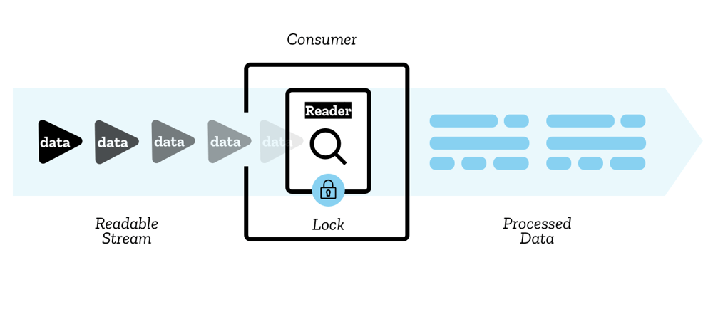
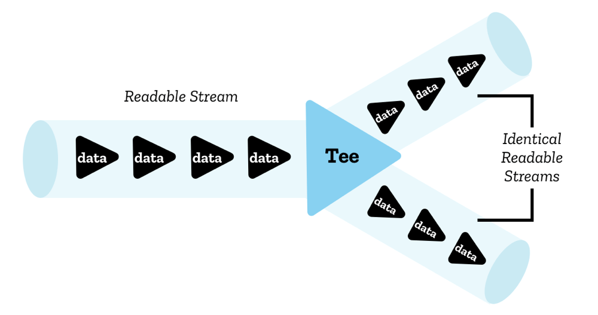
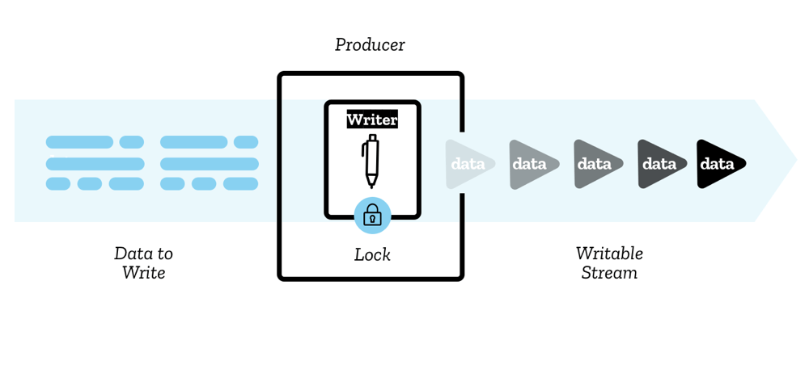
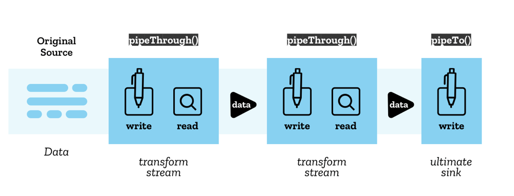

{{DefaultAPISidebar("Streams")}}

[API Streams](/en-US/docs/Web/API/Streams_API) bổ sung một bộ công cụ rất hữu ích vào nền tảng web, cung cấp các đối tượng cho phép JavaScript truy cập theo chương trình các luồng dữ liệu nhận được qua mạng và xử lý chúng theo mong muốn của nhà phát triển. Một số khái niệm và thuật ngữ liên quan đến luồng có thể mới đối với bạn — bài viết này giải thích tất cả những gì bạn cần biết.

## Luồng có thể đọc được

Luồng có thể đọc được là nguồn dữ liệu được biểu thị bằng JavaScript bởi đối tượng {{domxref("ReadableStream")}} xuất phát từ **nguồn cơ bản** — đây là tài nguyên ở đâu đó trên mạng hoặc nơi khác trên miền của bạn mà bạn muốn lấy dữ liệu từ đó.

Có hai loại nguồn cơ bản:

- **Nguồn đẩy** liên tục gửi dữ liệu về phía bạn khi bạn đã truy cập chúng và bạn có quyền bắt đầu, tạm dừng hoặc hủy quyền truy cập vào luồng. Các ví dụ bao gồm luồng video và TCP/[Web socket](/en-US/docs/Web/API/WebSockets_API).
- **Nguồn kéo** yêu cầu bạn yêu cầu rõ ràng dữ liệu từ chúng sau khi được kết nối. Ví dụ bao gồm thao tác truy cập tệp thông qua yêu cầu {{domxref("Window/fetch", "fetch()")}}.

### đoạn

Dữ liệu được đọc tuần tự thành từng phần nhỏ gọi là **khối**. Một đoạn có thể là một byte đơn hoặc có thể lớn hơn, chẳng hạn như [typed array](/en-US/docs/Web/JavaScript/Guide/Typed_arrays) có kích thước nhất định. Một luồng có thể chứa các khối có kích cỡ và loại khác nhau.

Các đoạn được đặt trong luồng được cho là **được xếp hàng** - điều này có nghĩa là chúng đang chờ trong hàng đợi sẵn sàng để đọc. **Hàng đợi nội bộ** theo dõi các đoạn chưa được đọc (xem phần Hàng đợi nội bộ và chiến lược xếp hàng bên dưới).

### Người đọc, người tiêu dùng và người kiểm soát

Các đoạn bên trong luồng được đọc bởi **trình đọc** — thao tác này xử lý từng đoạn dữ liệu một, cho phép bạn thực hiện bất kỳ loại thao tác nào bạn muốn thực hiện trên đó. Trình đọc cùng với mã xử lý khác đi kèm với nó được gọi là **người tiêu dùng**.

Ngoài ra còn có một cấu trúc mà bạn sẽ sử dụng được gọi là **bộ điều khiển** — mỗi đầu đọc có một bộ điều khiển liên quan cho phép bạn điều khiển luồng (ví dụ: đóng nó nếu muốn).

### Khóa

Mỗi lần chỉ có một người đọc có thể đọc luồng; khi một trình đọc được tạo và bắt đầu đọc một luồng (**trình đọc đang hoạt động**), chúng tôi nói rằng luồng đó **bị khóa**. Nếu bạn muốn một người đọc khác bắt đầu đọc luồng của mình, thông thường bạn cần phải hủy người đọc đầu tiên trước khi làm bất kỳ điều gì khác (mặc dù bạn có thể **tee** luồng, hãy xem phần Phát bóng bên dưới)

### Luồng và luồng byte có thể đọc được

Lưu ý rằng có hai loại luồng có thể đọc được khác nhau. Ngoài luồng có thể đọc thông thường, còn có một loại gọi là luồng byte - đây là phiên bản mở rộng của luồng thông thường để đọc các nguồn byte cơ bản. So với luồng có thể đọc được thông thường, luồng byte được phép đọc bởi trình đọc BYOB (BYOB, "mang bộ đệm của riêng bạn"). Loại trình đọc này cho phép các luồng được đọc thẳng vào bộ đệm do nhà phát triển cung cấp, giảm thiểu yêu cầu sao chép. Luồng cơ bản nào (và theo tiện ích mở rộng, trình đọc và bộ điều khiển) mà mã của bạn sẽ sử dụng tùy thuộc vào cách luồng được tạo ngay từ đầu (xem trang hàm tạo {{domxref("ReadableStream.ReadableStream","ReadableStream()")}}).

Bạn có thể sử dụng các luồng có thể đọc được tạo sẵn thông qua các cơ chế như {{domxref("Response.body")}} từ yêu cầu tìm nạp hoặc cuộn các luồng của riêng bạn bằng cách sử dụng hàm tạo {{domxref("ReadableStream.ReadableStream","ReadableStream()")}}.

## Phát bóng

Mặc dù chỉ một đầu đọc có thể đọc một luồng cùng một lúc, nhưng có thể chia luồng thành hai bản sao giống hệt nhau, sau đó hai đầu đọc riêng biệt có thể đọc được. Điều này được gọi là **phát bóng**.

Trong JavaScript, điều này đạt được thông qua phương thức {{domxref("ReadableStream.tee()")}} — nó xuất ra một mảng chứa hai bản sao giống hệt nhau của luồng có thể đọc được ban đầu, sau đó hai trình đọc riêng biệt có thể đọc độc lập.

Ví dụ: bạn có thể thực hiện việc này trong [ServiceWorker](/en-US/docs/Web/API/Service_Worker_API) nếu bạn muốn tìm nạp phản hồi từ máy chủ và truyền trực tuyến đến trình duyệt, đồng thời truyền phản hồi đó tới bộ đệm ServiceWorker. Vì nội dung phản hồi không thể được sử dụng nhiều lần và một luồng không thể được đọc bởi nhiều người đọc cùng một lúc nên bạn cần hai bản sao để thực hiện việc này.

## Luồng có thể ghi

**Luồng có thể ghi** là đích đến mà bạn có thể ghi dữ liệu vào đó, được biểu thị bằng JavaScript bằng đối tượng {{domxref("WritableStream")}}. Điều này đóng vai trò như một sự trừu tượng hóa trên đỉnh của **phần chìm bên dưới** - phần chìm I/O cấp thấp hơn để ghi dữ liệu thô vào đó.

Dữ liệu được ghi vào luồng thông qua **trình ghi**, mỗi lần một đoạn. Một đoạn có thể có vô số dạng, giống như các đoạn trong trình đọc. Bạn có thể sử dụng bất kỳ mã nào bạn thích để tạo ra các đoạn mã sẵn sàng để viết; người viết cùng với mã liên quan được gọi là **nhà sản xuất**.

Khi một trình ghi được tạo và bắt đầu ghi vào một luồng (một trình ghi đang hoạt động**), nó được cho là **bị khóa\*\* đối với luồng đó. Chỉ một người viết có thể ghi vào luồng có thể ghi cùng một lúc. Nếu bạn muốn một nhà văn khác bắt đầu ghi vào luồng của mình, thông thường bạn cần phải hủy bỏ nó trước khi đính kèm một nhà văn khác vào luồng đó.

**Hàng đợi nội bộ** theo dõi các đoạn đã được ghi vào luồng nhưng chưa được bộ xử lý bên dưới xử lý.

Ngoài ra còn có một cấu trúc mà bạn sẽ sử dụng được gọi là bộ điều khiển — mỗi trình ghi có một bộ điều khiển liên quan cho phép bạn điều khiển luồng (ví dụ: hủy bỏ luồng nếu muốn).

Bạn có thể sử dụng các luồng có thể ghi bằng cách sử dụng hàm tạo {{domxref("WritableStream.WritableStream","WritableStream()")}}. Chúng hiện có sẵn rất hạn chế trong các trình duyệt.

## Xích ống

API luồng cho phép truyền các luồng vào nhau bằng cách sử dụng cấu trúc được gọi là **chuỗi ống**.
Có hai phương pháp tạo điều kiện thuận lợi cho việc này:

- {{domxref("ReadableStream.pipeThrough()")}} — dẫn luồng qua **luồng chuyển đổi**, có khả năng chuyển đổi định dạng dữ liệu trong quá trình này.
  Điều này có thể được sử dụng, ví dụ, để mã hóa hoặc giải mã các khung hình video, nén hoặc giải nén dữ liệu hoặc chuyển đổi dữ liệu từ dạng này sang dạng khác.

  Luồng biến đổi bao gồm một cặp luồng: luồng có thể đọc được từ đó dữ liệu được đọc và luồng có thể ghi vào đó dữ liệu được ghi vào, cùng với các cơ chế thích hợp để đảm bảo rằng dữ liệu mới được cung cấp để đọc ngay khi dữ liệu được ghi.

  {{domxref("TransformStream")}} là một triển khai cụ thể của luồng biến đổi, nhưng bất kỳ đối tượng nào có cùng thuộc tính luồng có thể đọc và luồng có thể ghi đều có thể được chuyển tới `pipeThrough()`.

- {{domxref("ReadableStream.pipeTo()")}} — đường ống tới luồng có thể ghi đóng vai trò là điểm cuối của chuỗi đường ống.

Điểm bắt đầu của chuỗi ống được gọi là **nguồn ban đầu** và điểm cuối được gọi là **điểm chìm cuối cùng**.

## Áp lực ngược

Một khái niệm quan trọng trong luồng là **áp suất ngược** — đây là quá trình trong đó một luồng đơn hoặc một chuỗi ống điều chỉnh tốc độ đọc/ghi. Khi luồng sau trong chuỗi vẫn bận và chưa sẵn sàng chấp nhận nhiều khối hơn, luồng này sẽ gửi tín hiệu ngược qua chuỗi để báo cho các luồng biến đổi trước đó (hoặc nguồn ban đầu) làm chậm quá trình phân phối để bạn không gặp phải tình trạng tắc nghẽn ở bất kỳ đâu.

Để sử dụng áp suất ngược trong {{domxref("ReadableStream")}}, chúng ta có thể yêu cầu bộ điều khiển về kích thước khối mà người tiêu dùng mong muốn bằng cách truy vấn thuộc tính {{domxref("ReadableStreamDefaultController.desiredSize")}} trên bộ điều khiển. Nếu nó quá thấp, `ReadableStream` của chúng tôi có thể yêu cầu nguồn cơ bản ngừng gửi dữ liệu và chúng tôi tạo áp lực ngược dọc theo chuỗi luồng.

Nếu sau này người tiêu dùng lại muốn nhận dữ liệu, chúng tôi có thể sử dụng phương thức kéo trong quá trình tạo luồng để yêu cầu nguồn cơ bản cung cấp dữ liệu cho luồng của chúng tôi.

## Hàng đợi nội bộ và chiến lược xếp hàng

Như đã đề cập trước đó, các đoạn trong luồng chưa được xử lý và hoàn thành sẽ được hàng đợi nội bộ theo dõi.

- Trong trường hợp luồng đọc được là những đoạn đã được xếp vào hàng đợi nhưng chưa đọc được
- Trong trường hợp các luồng có thể ghi, đây là các đoạn đã được ghi nhưng chưa được xử lý bởi bộ thu bên dưới.

Hàng đợi nội bộ sử dụng **chiến lược xếp hàng**, chỉ ra cách báo hiệu áp lực ngược dựa trên **trạng thái hàng đợi nội bộ.**

Nói chung, chiến lược so sánh kích thước của các khối trong hàng đợi với một giá trị được gọi là **dấu nước cao**, là tổng kích thước khối lớn nhất mà hàng đợi muốn quản lý.

Phép tính được thực hiện là

`high water mark - total size of chunks in queue = desired size`

**Kích thước mong muốn** là số lượng đoạn mà luồng vẫn có thể chấp nhận để giữ cho luồng chảy nhưng có kích thước dưới mức mực nước cao.
Việc tạo khối sẽ được giảm tốc độ/tăng tốc khi thích hợp để giữ cho luồng phát nhanh nhất có thể trong khi vẫn giữ kích thước mong muốn trên 0.
Nếu giá trị giảm xuống 0 (hoặc thấp hơn), điều đó có nghĩa là các đoạn đang được tạo nhanh hơn khả năng xử lý của luồng, điều này có thể dẫn đến sự cố.

Ví dụ: hãy lấy kích thước khối là 1 và dấu nước cao là 3.
Điều này có nghĩa là có thể xếp tối đa 3 khối trước khi đạt đến vạch nước cao và áp suất ngược được áp dụng.
