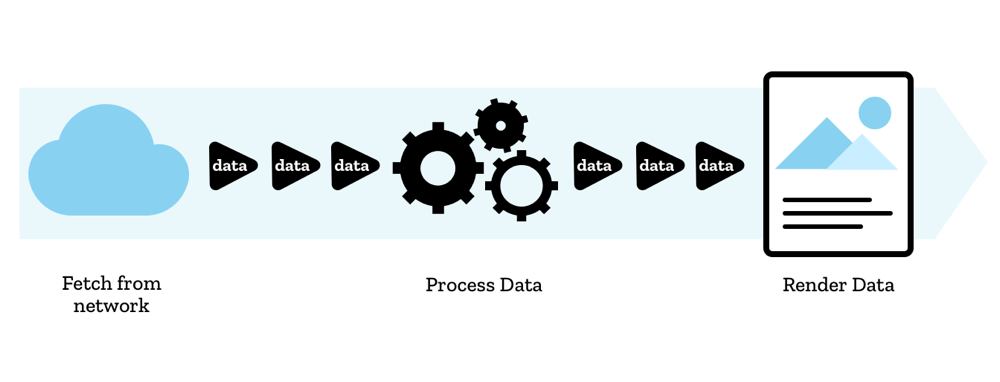

{{DefaultAPISidebar("Streams")}}{{AvailableInWorkers}}

API luồng cho phép JavaScript truy cập theo chương trình các luồng dữ liệu nhận được qua mạng và xử lý chúng theo mong muốn của nhà phát triển.

## Khái niệm và cách sử dụng

Truyền phát liên quan đến việc chia tài nguyên mà bạn muốn nhận qua mạng thành các phần nhỏ, sau đó xử lý tài nguyên đó từng chút một. Các trình duyệt đã thực hiện điều này khi nhận nội dung phương tiện - video sẽ đệm và phát khi có nhiều nội dung tải xuống hơn và đôi khi bạn sẽ thấy hình ảnh hiển thị dần dần khi có nhiều nội dung được tải hơn.

Nhưng khả năng này chưa bao giờ có sẵn cho JavaScript trước đây. Trước đây, nếu chúng tôi muốn xử lý một loại tài nguyên nào đó (video, tệp văn bản, v.v.), chúng tôi phải tải xuống toàn bộ tệp, đợi cho đến khi nó được giải tuần tự hóa thành định dạng phù hợp, sau đó xử lý tất cả dữ liệu.

Với API Luồng, bạn có thể bắt đầu xử lý dữ liệu thô bằng JavaScript từng chút một, ngay khi có sẵn mà không cần tạo bộ đệm, chuỗi hoặc blob.

Ngoài ra còn có nhiều ưu điểm hơn — bạn có thể phát hiện thời điểm bắt đầu hoặc kết thúc luồng, xâu chuỗi các luồng lại với nhau, xử lý lỗi và hủy luồng theo yêu cầu cũng như phản ứng với tốc độ đọc luồng.

Việc sử dụng Luồng phụ thuộc vào việc cung cấp phản hồi dưới dạng luồng. Ví dụ: nội dung phản hồi được trả về bởi [yêu cầu tìm nạp](/en-US/docs/Web/API/Window/fetch) thành công là {{domxref("ReadableStream")}} mà trình đọc được tạo bằng {{domxref("ReadableStream.getReader()")}} có thể đọc được.

Các cách sử dụng phức tạp hơn bao gồm việc tạo luồng của riêng bạn bằng cách sử dụng hàm tạo {{domxref("ReadableStream.ReadableStream", "ReadableStream()")}}, chẳng hạn như để xử lý dữ liệu bên trong [nhân viên dịch vụ](/en-US/docs/Web/API/Service_Worker_API).

Bạn cũng có thể ghi dữ liệu vào luồng bằng {{domxref("WritableStream")}}.

> [!LƯU Ý]
> Bạn có thể tìm thấy nhiều thông tin chi tiết hơn về lý thuyết và thực tiễn về luồng trong các bài viết của chúng tôi — [Khái niệm API luồng](/en-US/docs/Web/API/Streams_API/Concepts), [Sử dụng luồng có thể đọc được](/en-US/docs/Web/API/Streams_API/Using_readable_streams), [Sử dụng luồng byte có thể đọc được](/en-US/docs/Web/API/Streams_API/Using_readable_byte_streams) và [Sử dụng luồng có thể ghi](/en-US/docs/Web/API/Streams_API/Using_writable_streams).

## Giao diện luồng

### Luồng có thể đọc được

- {{domxref("ReadableStream")}}
  - : Biểu thị luồng dữ liệu có thể đọc được. Nó có thể được sử dụng để xử lý các luồng phản hồi của [API tìm nạp](/en-US/docs/Web/API/Fetch_API) hoặc các luồng do nhà phát triển xác định (ví dụ: hàm tạo {{domxref("ReadableStream.ReadableStream", "ReadableStream()")}} tùy chỉnh).
- {{domxref("ReadableStreamDefaultReader")}}
  - : Đại diện cho một trình đọc mặc định có thể được sử dụng để đọc dữ liệu luồng được cung cấp từ mạng (ví dụ: yêu cầu tìm nạp).
- {{domxref("ReadableStreamDefaultController")}}
  - : Đại diện cho bộ điều khiển cho phép kiểm soát trạng thái và hàng đợi nội bộ của {{domxref("ReadableStream")}}. Bộ điều khiển mặc định dành cho các luồng không phải là luồng byte.

### Luồng có thể ghi

- {{domxref("WritableStream")}}
  - : Cung cấp một bản tóm tắt tiêu chuẩn để ghi dữ liệu truyền phát đến đích, được gọi là phần chìm. Đối tượng này đi kèm với áp suất ngược và xếp hàng tích hợp.
- {{domxref("WritableStreamDefaultWriter")}}
  - : Đại diện cho trình ghi luồng có thể ghi mặc định có thể được sử dụng để ghi các khối dữ liệu vào luồng có thể ghi.
- {{domxref("WritableStreamDefaultController")}}
  - : Đại diện cho bộ điều khiển cho phép kiểm soát trạng thái của {{domxref("WritableStream")}}. Khi xây dựng `WritableStream`, phần chìm bên dưới được cung cấp một phiên bản `WritableStreamDefaultController` tương ứng để thao tác.

### Chuyển đổi luồng

- {{domxref("TransformStream")}}
  - : Thể hiện sự trừu tượng hóa cho một đối tượng luồng biến đổi dữ liệu khi nó đi qua [chuỗi ống](/en-US/docs/Web/API/Streams_API/Concepts#pipe_chains) của các đối tượng luồng.
- {{domxref("TransformStreamDefaultController")}}
  - : Cung cấp các phương thức để thao tác {{domxref("ReadableStream")}} và {{domxref("WritableStream")}} được liên kết với luồng biến đổi.

### API và hoạt động của luồng liên quan

- {{domxref("ByteLengthQueuingStrategy")}}
  - : Cung cấp chiến lược xếp hàng có độ dài byte tích hợp có thể được sử dụng khi xây dựng luồng.
- {{domxref("CountQueuingStrategy")}}
  - : Cung cấp chiến lược xếp hàng đếm đoạn tích hợp có thể được sử dụng khi xây dựng luồng.

### Tiện ích mở rộng cho các API khác

- {{domxref("Request")}}
  - : Khi một đối tượng `Request` mới được tạo, bạn có thể chuyển cho nó {{domxref("ReadableStream")}} trong thuộc tính `body` của từ điển `RequestInit` của nó. `Request` này sau đó có thể được chuyển đến {{domxref("Window/fetch", "fetch()")}} để bắt đầu tìm nạp luồng.
- {{domxref("Response.body")}}
  - : Nội dung phản hồi được trả về bởi [yêu cầu tìm nạp](/en-US/docs/Web/API/Window/fetch) theo mặc định được hiển thị dưới dạng {{domxref("ReadableStream")}} và có thể có trình đọc được đính kèm với nó, v.v.

### Các giao diện liên quan đến ByteStream

- {{domxref("ReadableStreamBYOBReader")}}
  - : Đại diện cho trình đọc BYOB ("mang bộ đệm của riêng bạn") có thể được sử dụng để đọc dữ liệu luồng do nhà phát triển cung cấp (ví dụ: hàm tạo {{domxref("ReadableStream.ReadableStream", "ReadableStream()")}} tùy chỉnh).
- {{domxref("ReadableByteStreamController")}}
  - : Đại diện cho bộ điều khiển cho phép kiểm soát trạng thái và hàng đợi nội bộ của {{domxref("ReadableStream")}}. Bộ điều khiển luồng byte dành cho luồng byte.
- {{domxref("ReadableStreamBYOBRequest")}}
  - : Thể hiện yêu cầu kéo vào trong {{domxref("ReadableByteStreamController")}}.

## Ví dụ

Chúng tôi đã tạo một thư mục gồm các ví dụ đi kèm với tài liệu API Streams — xem [mdn/dom-examples/streams](https://github.com/mdn/dom-examples/tree/main/streams). Các ví dụ như sau:

- [Bơm luồng đơn giản](https://mdn.github.io/dom-examples/streams/simple-pump/): Ví dụ này cho thấy cách sử dụng ReadableStream và truyền dữ liệu của nó sang một luồng khác.
- [Thang độ xám a PNG](https://mdn.github.io/dom-examples/streams/grayscale-png/): Ví dụ này cho thấy cách ReadableStream của PNG có thể được chuyển thành thang độ xám.
- [Luồng ngẫu nhiên đơn giản](https://mdn.github.io/dom-examples/streams/simple-random-stream/): Ví dụ này cho thấy cách sử dụng luồng tùy chỉnh để tạo các chuỗi ngẫu nhiên, xếp chúng vào hàng đợi dưới dạng các đoạn rồi đọc lại.
- [Ví dụ về phát bóng đơn giản](https://mdn.github.io/dom-examples/streams/simple-tee-example/): Ví dụ này mở rộng ví dụ về luồng ngẫu nhiên đơn giản, cho thấy cách một luồng có thể được phát bóng và cả hai luồng kết quả đều có thể được đọc độc lập.
- [Nhà văn đơn giản](https://mdn.github.io/dom-examples/streams/simple-writer/): Ví dụ này cho thấy cách ghi vào luồng có thể ghi, sau đó giải mã luồng và ghi nội dung vào giao diện người dùng.
- [Giải nén các đoạn của PNG](https://mdn.github.io/dom-examples/streams/png-transform-stream/): Ví dụ này cho thấy cách [`pipeThrough()`](/en-US/docs/Web/API/ReadableStream/pipeThrough) có thể được sử dụng để chuyển đổi ReadableStream thành luồng gồm các loại dữ liệu khác bằng cách chuyển đổi dữ liệu của tệp PNG thành luồng các đoạn PNG.

## Thông số kỹ thuật

{{Specifications}}

## Khả năng tương thích của trình duyệt

{{Compat}}

## Xem thêm

- [Khái niệm API luồng](/en-US/docs/Web/API/Streams_API/Concepts)
- [Sử dụng các luồng có thể đọc được](/en-US/docs/Web/API/Streams_API/Using_readable_streams)
- [Sử dụng luồng byte có thể đọc được](/en-US/docs/Web/API/Streams_API/Using_readable_byte_streams)
- [Sử dụng luồng có thể ghi](/en-US/docs/Web/API/Streams_API/Using_writable_streams)
