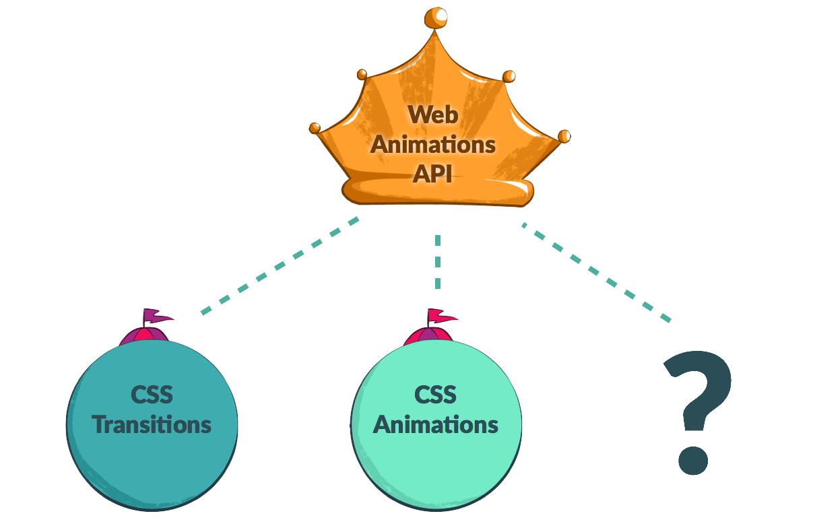
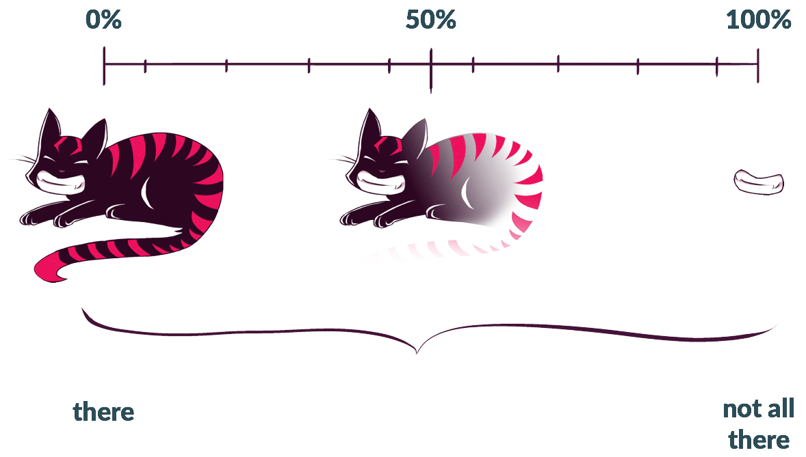
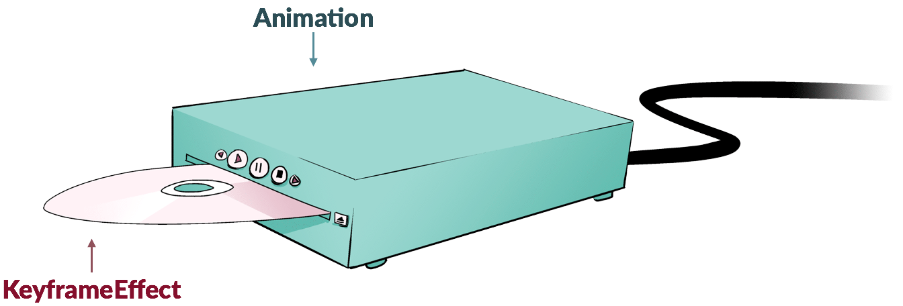

{{DefaultAPISidebar("Web Animations")}}

Web Animations API (WAAPI) cung cấp cho các nhà phát triển JavaScript quyền truy cập vào công cụ hoạt hình của trình duyệt và mô tả cách triển khai hoạt ảnh trên các trình duyệt. Bài viết này sẽ giới thiệu cho bạn những khái niệm quan trọng đằng sau WAAPI, cung cấp cho bạn sự hiểu biết lý thuyết về cách thức hoạt động của nó để bạn có thể sử dụng nó một cách hiệu quả. Để tìm hiểu cách sử dụng API, hãy xem bài viết chị em của nó, [Sử dụng Web Animations API](/en-US/docs/Web/API/Web_Animations_API/Using_the_Web_Animations_API).

Web Animations API lấp đầy khoảng trống giữa các hoạt ảnh và chuyển tiếp CSS khai báo và các hoạt ảnh JavaScript động. Điều này có nghĩa là chúng ta có thể sử dụng nó để tạo và điều khiển các hoạt ảnh giống CSS đi từ trạng thái được xác định trước này sang trạng thái khác hoặc chúng ta có thể sử dụng các biến, vòng lặp và lệnh gọi lại để tạo các hoạt ảnh tương tác thích ứng và phản ứng với các thay đổi đầu vào.

## Lịch sử

Hơn một thập kỷ trước, [Ngôn ngữ tích hợp đa phương tiện được đồng bộ hóa hoặc SMIL](/en-US/docs/Web/SVG/Guides/SVG_animation_with_SMIL) (phát âm là "nụ cười"), đã đưa hoạt hình vào SVG. Hồi đó, đây là công cụ hoạt hình duy nhất mà các trình duyệt phải lo lắng. Mặc dù bốn trong số năm trình duyệt hỗ trợ SMIL, nhưng nó chỉ hỗ trợ các phần tử SVG hoạt hình, không thể sử dụng được từ CSS và rất phức tạp — thường dẫn đến việc triển khai không nhất quán. Mười năm sau, nhóm Safari giới thiệu thông số kỹ thuật của [CSS Animations](https://drafts.csswg.org/css-animations/) và [CSS Chuyển tiếp](https://drafts.csswg.org/css-transitions/).

Nhóm Internet Explorer đã yêu cầu một hoạt ảnh API để hợp nhất và bình thường hóa chức năng hoạt ảnh trên tất cả các trình duyệt, và do đó các nhà phát triển Mozilla Firefox và Google Chrome đã bắt đầu nỗ lực một cách nghiêm túc để tạo ra một thông số hoạt ảnh thống trị tất cả: Web Animations API. Bây giờ chúng tôi đã có WAAPI dành cho các thông số kỹ thuật hoạt hình trong tương lai để áp dụng, cho phép chúng duy trì sự nhất quán và phối hợp tốt với nhau. Nó cũng cung cấp một điểm tham chiếu mà tất cả các trình duyệt có thể tuân thủ với các thông số kỹ thuật hiện có.

## Hai mô hình: Thời gian và Animation

Web Animations API chạy trên hai mô hình, một mô hình xử lý thời gian—Định giờ—và một mô hình xử lý sự thay đổi trực quan theo thời gian—Animation. Mô hình Thời gian theo dõi xem chúng ta đã đi được bao xa theo dòng thời gian đã định. Mô hình Animation xác định đối tượng hoạt hình sẽ trông như thế nào tại bất kỳ thời điểm nào.

### Thời gian

Mô hình định thời là xương sống khi làm việc với WAAPI. Mỗi tài liệu có một dòng thời gian chính, [`Document.timeline`](/en-US/docs/Web/API/Document/timeline), trải dài từ thời điểm trang được tải đến vô tận — hoặc cho đến khi cửa sổ được đóng lại. Trải dọc theo dòng thời gian đó theo thời lượng của chúng là hình ảnh động của chúng tôi. Mỗi hoạt ảnh được neo vào một điểm trong dòng thời gian bằng [`startTime`](/en-US/docs/Web/API/Animation/startTime) của nó, thể hiện thời điểm dọc theo dòng thời gian của tài liệu khi hoạt ảnh bắt đầu phát.

Tất cả hoạt động phát lại của hoạt ảnh đều dựa vào dòng thời gian này: việc tìm kiếm hoạt ảnh sẽ di chuyển vị trí của hoạt ảnh dọc theo dòng thời gian; làm chậm hoặc tăng tốc độ phát lại, cô đọng hoặc mở rộng phạm vi của nó trên dòng thời gian; việc lặp lại hoạt ảnh sẽ tạo thành các lần lặp bổ sung của hoạt ảnh đó dọc theo dòng thời gian. Trong tương lai, chúng ta có thể có các mốc thời gian dựa trên cử chỉ hoặc vị trí cuộn hoặc thậm chí là các mốc thời gian dành cho cha mẹ và con cái. Web Animations API mở ra rất nhiều khả năng!

### Animation

Mô hình hoạt ảnh có thể được coi là một loạt các ảnh chụp nhanh về hoạt ảnh trông như thế nào tại bất kỳ thời điểm nào, được xếp dọc theo thời lượng của hoạt ảnh.

## Khái niệm cốt lõi

Hoạt ảnh web bao gồm các Đối tượng Dòng thời gian, Đối tượng Animation và Đối tượng Hiệu ứng Animation làm việc cùng nhau. Bằng cách tập hợp các đối tượng khác nhau này, chúng ta có thể tạo ra hình ảnh động của riêng mình.

### Dòng thời gian

Các đối tượng dòng thời gian cung cấp thuộc tính hữu ích [`currentTime`](/en-US/docs/Web/API/AnimationTimeline/currentTime), cho phép chúng ta xem trang đã được mở trong bao lâu: đó là "thời gian hiện tại" của dòng thời gian của tài liệu, bắt đầu khi trang được mở. Theo bài viết này, chỉ có một loại đối tượng dòng thời gian: loại dựa trên [`timeline`](/en-US/docs/Web/API/Document/timeline) của tài liệu đang hoạt động. Trong tương lai chúng ta có thể thấy các đối tượng dòng thời gian tương ứng với độ dài của trang, có thể là `ScrollTimeline`, hoặc những thứ khác hoàn toàn.

### Animation

[đối tượng Animation](/en-US/docs/Web/API/Animation) có thể được hình dung như các đầu DVD: chúng được sử dụng để điều khiển việc phát lại media, nhưng không có media để phát nên chúng không làm gì cả. Các đối tượng Animation chấp nhận phương tiện ở dạng Animation Hiệu ứng, cụ thể là Hiệu ứng khung hình chính (chúng ta sẽ đề cập đến chúng ngay sau đây). Giống như một đầu DVD, chúng ta có thể sử dụng các phương thức của Đối tượng Animation để [chơi](/en-US/docs/Web/API/Animation/play), [tạm dừng](/en-US/docs/Web/API/Animation/pause), [tìm kiếm](/en-US/docs/Web/API/Animation/currentTime), và [kiểm soát hướng phát lại của hình ảnh động](/en-US/docs/Web/API/Animation/reverse) và [tốc độ](/en-US/docs/Web/API/Animation/playbackRate).

### Animation Hiệu ứng

Nếu đối tượng Animation là đầu phát DVD, chúng ta có thể nghĩ về Animation Effects, hoặc Keyframe Effects, như các đĩa DVD. Hiệu ứng khung hình chính là một gói thông tin bao gồm tối thiểu một bộ khóa và khoảng thời gian chúng cần được tạo hiệu ứng. Đối tượng Animation lấy thông tin này và sử dụng Đối tượng Dòng thời gian, tập hợp một hoạt ảnh có thể chơi được mà chúng ta có thể xem và tham khảo.

Hiện tại chúng tôi chỉ có sẵn một loại hiệu ứng hoạt hình: [`KeyframeEffect`](/en-US/docs/Web/API/KeyframeEffect). Có khả năng chúng tôi sẽ có tất cả các loại Hiệu ứng Animation trong tương lai—ví dụ: các hiệu ứng để nhóm và sắp xếp thứ tự, không khác gì các tính năng chúng tôi có trong Flash. Trên thực tế, Hiệu ứng Nhóm và Hiệu ứng Chuỗi đã được phác thảo trong thông số kỹ thuật cấp 2 hiện đang được thực hiện của Web Animations API.

### Lắp ráp Animation từ các mảnh rời rạc

Chúng ta có thể tập hợp tất cả các phần này lại với nhau để tạo ra một hình ảnh động hoạt động với [`Animation()` Trình xây dựng](/en-US/docs/Web/API/Animation/Animation) hoặc chúng ta có thể sử dụng chức năng phím tắt [`Element.animate()`](/en-US/docs/Web/API/Element/animate). (Đọc thêm về cách sử dụng `Element.animate()` trong [Sử dụng Web Animations API](/en-US/docs/Web/API/Web_Animations_API/Using_the_Web_Animations_API).)

## Công dụng

API cho phép tạo ra các hoạt ảnh động có thể được cập nhật nhanh chóng cũng như các hoạt ảnh khai báo, đơn giản hơn giống như những hoạt ảnh mà CSS tạo ra. Nó có thể được sử dụng trong các thử nghiệm tự động để đảm bảo rằng hoạt ảnh giao diện người dùng của bạn đang chạy chính xác. Nó mở công cụ kết xuất của trình duyệt để xây dựng các công cụ phát triển hoạt ảnh như dòng thời gian. Nó cũng là một cơ sở hiệu quả để xây dựng thư viện hoạt hình tùy chỉnh hoặc thương mại. (Xem [Hoạt hình như thể bạn không quan tâm với Element.animate](https://hacks.mozilla.org/2016/08/animating-like-you-just-dont-care-with-element-animate/).) Trong một số trường hợp, nó có thể phủ nhận sự cần thiết của một thư viện hoàn chỉnh giống như cách Vanilla JavaScript có thể được sử dụng mà không cần jQuery cho nhiều mục đích.

## Xem thêm

- [Web Animations API](/en-US/docs/Web/API/Web_Animations_API) — trang chính
- [Sử dụng Web Animations API](/en-US/docs/Web/API/Web_Animations_API/Using_the_Web_Animations_API) — hướng dẫn
- [bộ đầy đủ các bản demo của Alice in Wonderland](https://codepen.io/collection/nqNJvD) trên CodePen để bạn sử dụng, phân nhánh và chia sẻ
- [web-hoạt hình-js](https://github.com/web-animations/web-animations-js) — polyfill Web Animations API
