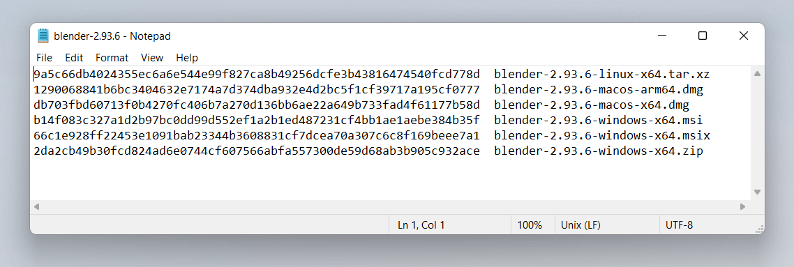

{{DefaultAPISidebar("Web Crypto API")}}

Bài viết này sẽ tập trung vào việc dùng phương thức [`digest`](/en-US/docs/Web/API/SubtleCrypto/digest) của [SubtleCrypto interface](/en-US/docs/Web/API/SubtleCrypto). Rất nhiều phương thức khác trong [Web Crypto API](/en-US/docs/Web/API/Web_Crypto_API) có các trường hợp dùng mật mã rất cụ thể, còn việc tạo hash cho nội dung (đây chính là việc phương thức digest làm) có nhiều mục đích rất hữu ích.

Bài viết này không bàn về các mục đích mật mã của [SubtleCrypto interface](/en-US/docs/Web/API/SubtleCrypto). Một điều quan trọng cần rút ra là **đừng dùng API này** cho mục đích mật mã trong môi trường sản xuất vì nó mạnh nhưng ở mức rất thấp. Để dùng đúng, bạn sẽ cần thực hiện nhiều bước phụ thuộc ngữ cảnh để hoàn thành đúng các tác vụ mật mã. Nếu làm sai bất kỳ bước nào, tệ nhất là mã của bạn không chạy; còn tệ hơn nữa là nó _vẫn_ chạy và bạn vô tình đặt người dùng vào rủi ro với một sản phẩm không an toàn.

Bạn thậm chí có thể không cần dùng [Web Crypto API](/en-US/docs/Web/API/Web_Crypto_API) chút nào. Nhiều việc mà bạn muốn dùng mật mã cho thực ra đã được giải quyết và là một phần của nền tảng web. Ví dụ, nếu bạn lo về tấn công man-in-the-middle, như điểm phát Wi-Fi đọc thông tin giữa client và server, thì điều này đã được giải quyết bằng cách dùng đúng [HTTPS](/en-US/docs/Glossary/HTTPS). Bạn muốn gửi thông tin an toàn giữa các người dùng? Khi đó bạn có thể thiết lập kết nối dữ liệu giữa họ bằng [WebRTC Data Channels](/en-US/docs/Web/API/WebRTC_API/Using_data_channels), vốn được mã hóa như một phần của tiêu chuẩn.

[SubtleCrypto interface](/en-US/docs/Web/API/SubtleCrypto) cung cấp các primitive cấp thấp để làm việc với mật mã, nhưng triển khai một hệ thống dùng các công cụ này là một nhiệm vụ phức tạp. Sai sót rất khó nhận ra và kết quả có thể khiến dữ liệu người dùng của bạn không an toàn như bạn nghĩ. Điều này có thể dẫn tới hậu quả nghiêm trọng nếu người dùng đang chia sẻ dữ liệu nhạy cảm hoặc có giá trị.

Nếu còn băn khoăn, đừng tự làm một mình; hãy thuê người có kinh nghiệm và bảo đảm phần mềm của bạn được một chuyên gia bảo mật kiểm tra.

## Băm một tệp

Đây là điều hữu ích đơn giản nhất bạn có thể làm với [Web Crypto API](/en-US/docs/Web/API/Web_Crypto_API). Nó không liên quan đến việc tạo khóa hay chứng chỉ và chỉ có một bước duy nhất.

{{glossary("Hash function", "Hashing")}} là một kỹ thuật chuyển một chuỗi byte lớn thành một chuỗi nhỏ hơn, trong đó những thay đổi nhỏ ở chuỗi dài sẽ tạo ra những thay đổi lớn ở chuỗi nhỏ. Kỹ thuật này hữu ích để xác định hai tệp giống hệt nhau mà không cần kiểm tra từng byte của cả hai tệp. Điều này rất hữu ích vì bạn có một chuỗi ngắn để so sánh. Nói rõ hơn, hashing là một thao tác **một chiều**. Bạn không thể tạo lại chuỗi byte ban đầu từ hash.

Nếu hai hash được tạo ra giống nhau, nhưng các tệp dùng để tạo chúng lại khác nhau, điều đó được gọi là _hash collision_, một hiện tượng cực kỳ khó xảy ra do ngẫu nhiên và, với một hàm băm an toàn như SHA256, gần như không thể tạo ra một cách có chủ đích. Vì vậy, nếu hai chuỗi giống nhau, bạn có thể khá yên tâm rằng hai tệp gốc cũng giống nhau.

Tại thời điểm xuất bản, SHA256 thường là lựa chọn phổ biến để băm tệp, nhưng trong SubtleCrypto interface cũng có các [hàm băm bậc cao hơn](/en-US/docs/Web/API/SubtleCrypto#supported_algorithms). Biểu diễn phổ biến nhất của một hash SHA256 là chuỗi gồm 64 chữ số thập lục phân. Thập lục phân chỉ dùng các ký tự 0-9 và a-f, đại diện cho 4 bit thông tin. Nói ngắn gọn, một hash SHA256 biến bất kỳ độ dài dữ liệu nào thành 256 bit dữ liệu gần như duy nhất.

Kỹ thuật này thường được các trang cho phép tải xuống các executable sử dụng để bảo đảm tệp đã tải khớp với bản mà tác giả dự định. Điều này giúp người dùng của bạn không cài đặt malware. Cách làm phổ biến nhất là:

1. Ghi lại tên tệp và mã kiểm SHA256 do website cung cấp.
2. Tải executable xuống.
3. Chạy `sha256sum /path/to/the/file` trong terminal để tự tạo mã của bạn. Nếu dùng Mac, bạn có thể phải [cài riêng nó](https://unix.stackexchange.com/questions/426837/no-sha256sum-in-macos).
4. So sánh hai chuỗi - chúng phải khớp trừ khi tệp đã bị can thiệp.



Phương thức [`digest()`](/en-US/docs/Web/API/SubtleCrypto/digest) của SubtleCrypto rất hữu ích cho việc này. Để tạo checksum của một tệp, bạn có thể làm như sau:

Trước tiên, ta thêm một vài phần tử HTML để tải tệp và hiển thị đầu ra SHA-256:

```html
<h3>Demonstration of hashing a file with SHA256</h3>

<label
  >Choose file(s) to hash <input type="file" id="file" name="file" multiple
/></label>
<output></output>
```

```css hidden
output {
  display: block;
  font-family: monospace;
}
```

Tiếp theo, ta dùng giao diện SubtleCrypto để xử lý chúng. Cách này hoạt động bằng cách:

- Đọc các tệp thành một {{jsxref("ArrayBuffer")}} bằng phương thức {{domxref("File")}} object's {{domxref("Blob.arrayBuffer()", "arrayBuffer()")}}.
- Dùng `crypto.subtle.digest('SHA-256', arrayBuffer)` để digest ArrayBuffer
- Chuyển hash kết quả (một ArrayBuffer khác) thành chuỗi để hiển thị

```js
const output = document.querySelector("output");
const file = document.getElementById("file");

// Chạy hàm băm khi người dùng chọn một hoặc nhiều tệp
file.addEventListener("change", hashTheseFiles);

// Hàm digest là bất đồng bộ, nó trả về một promise
// Ta dùng cú pháp async/await để đơn giản hóa mã.
async function fileHash(file) {
  const arrayBuffer = await file.arrayBuffer();

  // Dùng subtle crypto API để thực hiện SHA256 Sum của tệp
  // Array Buffer. Hash thu được sẽ được lưu trong một array buffer
  const hashAsArrayBuffer = await crypto.subtle.digest("SHA-256", arrayBuffer);

  // Để hiển thị nó dưới dạng chuỗi, ta sẽ lấy giá trị thập lục phân của
  // từng byte trong array buffer. Điều này cho ta một mảng mà mỗi byte
  // của array buffer trở thành một phần tử trong mảng
  const uint8ViewOfHash = new Uint8Array(hashAsArrayBuffer);
  if (uint8ViewOfHash.toHex) {
    // Logic bên dưới tương đương với phương thức toHex(), được giới thiệu năm 2025.
    return uint8ViewOfHash.toHex();
  }
  // Sau đó ta chuyển nó thành một mảng thường để có thể chuyển từng phần tử
  // thành chuỗi thập lục phân, trong đó các ký tự 0-9 hoặc a-f đại diện cho
  // một số từ 0 đến 15, chứa 4 bit thông tin,
  // nên 2 ký tự như vậy sẽ là 8 bit (1 byte).
  const hashAsString = Array.from(uint8ViewOfHash)
    .map((b) => b.toString(16).padStart(2, "0"))
    .join("");
  return hashAsString;
}

async function hashTheseFiles(e) {
  let outHTML = "";
  // lặp qua từng tệp trong input chọn tệp
  for (const file of this.files) {
    // tính hash của nó và liệt kê vào phần tử output.
    outHTML += `${file.name}    ${await fileHash(file)}\n`;
  }
  output.innerText = outHTML;
}
```

{{EmbedLiveSample("hashing_a_file")}}

### Bạn sẽ dùng nó ở đâu?

Lúc này có thể bạn đang nghĩ "_Mình có thể dùng cái này trên website của mình, để khi người dùng tải tệp xuống thì ta có thể bảo đảm hash khớp nhằm trấn an họ rằng bản tải xuống là an toàn_". Không may là cách này có hai vấn đề xuất hiện ngay lập tức:

- Các bản tải executable **luôn luôn** phải được thực hiện qua HTTPS. Điều này ngăn các bên trung gian thực hiện kiểu tấn công như vậy, nên việc băm ở đây là thừa.
- Nếu kẻ tấn công có thể thay thế tệp tải xuống trên máy chủ gốc, thì họ cũng có thể đơn giản thay thế luôn mã gọi SubtleCrypto interface để vượt qua kiểm tra và chỉ nói rằng mọi thứ đều ổn. Có thể họ sẽ làm gì đó rất lén lút như thay thế [strict equality](/en-US/docs/Web/JavaScript/Guide/Equality_comparisons_and_sameness#strict_equality_using), điều này khá khó phát hiện trong mã của chính bạn:

  ```diff
  --- if (checksum === correctCheckSum) return true;
  +++ if (checksum = correctCheckSum) return true;
  ```

Một nơi mà cách này có thể đáng làm là nếu bạn muốn kiểm tra một tệp từ nguồn tải xuống bên thứ ba mà bạn không kiểm soát. Điều này đúng miễn là vị trí tải xuống có bật header [CORS](/en-US/docs/Glossary/CORS) để cho phép bạn quét tệp trước khi cung cấp nó cho người dùng. Tiếc là không nhiều máy chủ bật CORS mặc định.

## "Salting the Hash" là gì?

Cụm từ bạn có thể đã nghe trước đây là _"Salting the hash"_. Nó không quá liên quan đến chủ đề hiện tại, nhưng vẫn đáng để biết.

> [!NOTE]
> Phần này nói về bảo mật mật khẩu và các hàm băm do SubtleCrypto cung cấp không phù hợp cho trường hợp này. Với mục đích đó, bạn cần các hàm băm chậm và tốn tài nguyên như `scrypt` và `bcrypt`. SHA được thiết kế để khá nhanh và hiệu quả, nên nó không phù hợp để băm mật khẩu. Phần này chỉ nhằm cung cấp thông tin thú vị — đừng dùng Web Crypto API để băm mật khẩu trên client.

Một trường hợp dùng phổ biến của hashing là mật khẩu; bạn tuyệt đối không bao giờ muốn lưu mật khẩu người dùng ở dạng văn bản thuần, đó đơn giản là một ý tưởng tồi. Thay vào đó, bạn lưu hash của mật khẩu người dùng, để không thể khôi phục mật khẩu gốc nếu hacker lấy được cơ sở dữ liệu username và password của bạn. Người tinh mắt có thể nhận ra rằng bạn vẫn có thể suy ra mật khẩu gốc bằng cách so sánh hash từ các danh sách mật khẩu đã biết với danh sách hash mật khẩu thu được. Nối thêm một chuỗi vào mật khẩu sẽ làm hash thay đổi và không còn khớp nữa. Điều này được gọi là **salting**. Một vấn đề khó khác là nếu bạn dùng cùng một salt cho mỗi mật khẩu, thì các mật khẩu có hash khớp nhau cũng sẽ là cùng một mật khẩu gốc. Vì vậy, nếu bạn biết một cái thì bạn sẽ biết tất cả các mật khẩu khớp.

Để giải quyết vấn đề này, bạn thực hiện cái gọi là _salting the hash_. Với mỗi mật khẩu, bạn tạo một salt (một chuỗi ký tự ngẫu nhiên) rồi ghép nó với chuỗi mật khẩu. Sau đó bạn lưu hash và salt trong cùng một cơ sở dữ liệu để có thể kiểm tra sự khớp khi người dùng đăng nhập sau này. Điều này có nghĩa là nếu hai người dùng dùng cùng mật khẩu thì các hash sẽ khác nhau. Đó là lý do bạn cần một hàm mật mã tốn tài nguyên, để việc dùng danh sách các mật khẩu phổ biến nhằm tìm ra mật khẩu gốc trở nên quá mất thời gian.

## Bảng băm với SHA

Bạn có thể dùng SHA1 để nhanh chóng tạo các hash không an toàn về mặt mật mã. Chúng cực kỳ hữu ích để biến một dữ liệu tùy ý thành một khóa mà bạn có thể tra cứu sau này.

Ví dụ, nếu bạn muốn có một cơ sở dữ liệu trong đó có một khối dữ liệu lớn như một trường trong một hàng. Điều này làm giảm hiệu quả của cơ sở dữ liệu vì một trong các trường phải có độ dài thay đổi, hoặc đủ lớn để chứa khối dữ liệu lớn nhất có thể. Một giải pháp thay thế là tạo hash cho khối dữ liệu đó và lưu nó trong một bảng tra cứu riêng, dùng hash làm chỉ mục. Sau đó bạn chỉ cần lưu hash trong cơ sở dữ liệu gốc, vốn có độ dài cố định rất tiện.

Các biến thể có thể của hash SHA1 là vô cùng nhiều. Đến mức việc vô tình tạo ra hai khối dữ liệu có cùng hash SHA1 gần như không thể xảy ra. Tuy nhiên, _có thể_ cố ý tạo hai tệp có cùng hash SHA1, vì SHA1 không an toàn về mặt mật mã. Do đó, một người dùng độc hại có thể về lý thuyết tạo một khối dữ liệu thay thế cho dữ liệu gốc trong cơ sở dữ liệu mà không bị phát hiện vì hash là như nhau. Đây là một vectơ tấn công cần lưu ý.

## Git lưu trữ tệp như thế nào

Git dùng hash SHA1 và đây là một ví dụ tuyệt vời ở đây; nó dùng hash theo hai cách thú vị. Khi tệp được lưu trong git, chúng được tham chiếu bằng hash SHA1 của chúng. Điều này giúp git nhanh chóng tìm dữ liệu và khôi phục tệp.

Nó không chỉ dùng nội dung tệp để tạo hash, mà còn thêm tiền tố là chuỗi UTF8 `"blob "`, tiếp theo là kích thước tệp tính bằng byte viết ở hệ thập phân, tiếp theo là ký tự null (mà trong JavaScript có thể viết là `"\0"`). Bạn có thể dùng giao diện [TextEncoder interface](/en-US/docs/Web/API/TextEncoder) của [Encoding API](/en-US/docs/Web/API/Encoding_API) để mã hóa văn bản UTF8, vì chuỗi trong JavaScript là UTF16.

Đoạn mã dưới đây, giống ví dụ SHA256 của chúng ta, có thể được dùng để tạo các hash này từ tệp. HTML để tải tệp lên vẫn giữ nguyên, nhưng chúng ta làm thêm một chút việc để thêm thông tin kích thước theo cùng cách mà git làm.

```html
<h3>Demonstration of how git uses SHA1 for files</h3>

<label
  >Choose file(s) to hash <input type="file" id="file" name="file" multiple
/></label>

<output></output>
```

```css hidden
output {
  display: block;
  font-family: monospace;
}
```

```js
const output = document.querySelector("output");
const file = document.getElementById("file");
file.addEventListener("change", hashTheseFiles);

async function fileHash(file) {
  const arrayBuffer = await file.arrayBuffer();

  // Git thêm tiền tố văn bản có null terminator 'blob 1234' trong đó 1234
  // biểu thị kích thước tệp trước khi băm, vì vậy ta sẽ tái tạo điều đó

  // trước tiên ta tính chiều dài byte của tệp
  const uint8View = new Uint8Array(arrayBuffer);
  const length = uint8View.length;

  // Git trong terminal dùng UTF8 cho chuỗi; Web dùng UTF16.
  // Ta cần dùng encoder vì biểu diễn nhị phân khác nhau
  // của các chữ cái trong thông điệp sẽ cho ra hash khác nhau
  const encoder = new TextEncoder();
  // Null-terminated nghĩa là chuỗi kết thúc bằng ký tự null, mà
  // trong JavaScript là '\0'
  const view = encoder.encode(`blob ${length}\0`);

  // Sau đó ta ghép 2 ArrayBuffer lại với nhau thành một ArrayBuffer mới.
  const newBlob = new Blob([view.buffer, arrayBuffer], {
    type: "text/plain",
  });
  const arrayBufferToHash = await newBlob.arrayBuffer();

  // Cuối cùng ta thực hiện hash, lần này là SHA1, đúng như Git dùng.
  // Rồi trả về nó dưới dạng chuỗi để hiển thị.
  return hashToString(await crypto.subtle.digest("SHA-1", arrayBufferToHash));
}

function hashToString(arrayBuffer) {
  const uint8View = new Uint8Array(arrayBuffer);
  return Array.from(uint8View)
    .map((b) => b.toString(16).padStart(2, "0"))
    .join("");
}

// như trước ta lặp qua các tệp
async function hashTheseFiles(e) {
  let outHTML = "";
  for (const file of this.files) {
    outHTML += `${file.name}    ${await fileHash(file)}\n`;
  }
  output.innerText = outHTML;
}
```

{{EmbedLiveSample("how-git-stores-files")}}

Lưu ý cách nó dùng [Encoding API](/en-US/docs/Web/API/Encoding_API) để tạo header, rồi header đó được ghép với ArrayBuffer gốc để tạo chuỗi cần băm.

## Git tạo hash commit như thế nào

Điều thú vị là git cũng tạo hash commit theo cách tương tự, dựa trên nhiều mảnh thông tin. Chúng có thể bao gồm hash của commit trước đó và thông điệp commit, rồi các thành phần này kết hợp lại tạo ra một hash mới. Cách này có thể dùng để tham chiếu các commit được xây dựng từ nhiều định danh duy nhất.

Lệnh terminal là: `(printf "commit %s\0" $(git --no-replace-objects cat-file commit HEAD | wc -c); git cat-file commit HEAD) | sha1sum`

Nguồn: [How is git commit sha1 formed](https://gist.github.com/masak/2415865)

Về bản chất, nó là chuỗi UTF8 (ký tự null được viết là `\0`):

```plain
commit [size in bytes as decimal of this info]\0tree [tree hash]
parent [parent commit hash]
author [author info] [timestamp]
committer [committer info] [timestamp]

commit message
```

Điều này rất hữu ích vì không có trường riêng lẻ nào được đảm bảo là duy nhất, nhưng khi kết hợp lại thì chúng tạo thành một con trỏ duy nhất tới một commit. Tuy nhiên, cả chuỗi này quá dài và cồng kềnh để dùng trực tiếp. Vì vậy, bằng cách băm nó, bạn có được một chuỗi duy nhất mới, đủ ngắn để chia sẻ một cách thuận tiện từ nhiều trường khác nhau.

Đó là lý do hash thay đổi nếu bạn từng amend commit, ngay cả khi bạn không thay đổi thông điệp. Timestamp của commit đã thay đổi, và chỉ một ký tự thay đổi cũng đủ để làm hash mới thay đổi hoàn toàn.

Điều rút ra là khi bạn muốn thêm một khóa cho một dữ liệu nào đó, nhưng bất kỳ thông tin đơn lẻ nào cũng chưa đủ duy nhất, thì việc ghép nhiều chuỗi lại và băm chúng là một cách tuyệt vời để tạo một khóa hữu ích.

Hy vọng những ví dụ này đã khuyến khích bạn tìm hiểu API mạnh mẽ mới này. Hãy nhớ đừng tự cố tái tạo các thứ về mật mã. Chỉ cần biết rằng các công cụ đã có sẵn, và một số trong đó như hàm [`crypto.digest()`](/en-US/docs/Web/API/SubtleCrypto/digest) là công cụ hữu ích cho công việc hằng ngày của bạn.
