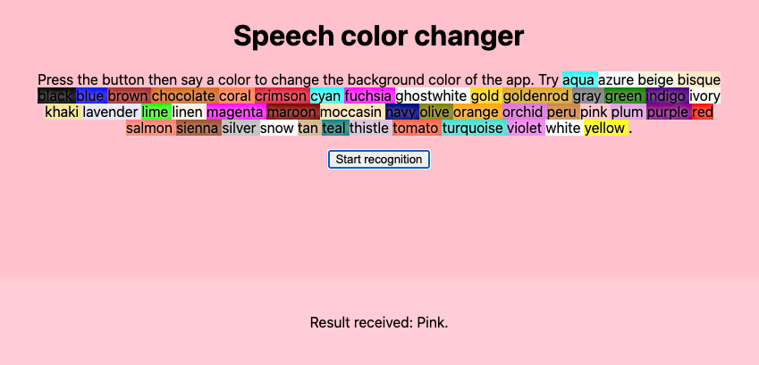
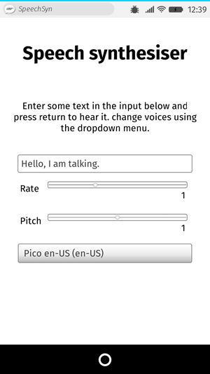

{{DefaultAPISidebar("Web Speech API")}}

Web Speech API cung cấp hai lĩnh vực chức năng riêng biệt — nhận dạng giọng nói và tổng hợp giọng nói (còn được gọi là chuyển văn bản thành giọng nói hoặc TTS) — mở ra những khả năng thú vị về khả năng tiếp cận và điều khiển. Bài viết này cung cấp phần giới thiệu về cả hai lĩnh vực, cùng với các bản demo.

## Nhận dạng giọng nói

Nhận dạng giọng nói bao gồm việc nhận âm thanh từ micrô của thiết bị (hoặc từ đoạn âm thanh), sau đó được dịch vụ nhận dạng giọng nói kiểm tra. Khi dịch vụ nhận dạng thành công một từ hoặc cụm từ, dịch vụ sẽ trả về một chuỗi văn bản (hoặc danh sách các chuỗi) mà bạn có thể sử dụng để bắt đầu các hành động tiếp theo.

Web Speech API có một giao diện điều khiển chính cho việc này — {{domxref("SpeechRecognition")}} — và một số giao diện liên quan để thể hiện kết quả.

Nói chung, hệ thống nhận dạng giọng nói có sẵn trên thiết bị của người dùng được sử dụng để nhận dạng giọng nói. Hầu hết các hệ điều hành hiện đại đều có hệ thống nhận dạng giọng nói để ra lệnh bằng giọng nói, chẳng hạn như **Dictation** trên macOS hoặc **Copilot** trên Windows.

Theo mặc định, việc sử dụng nhận dạng giọng nói trên trang web liên quan đến công cụ nhận dạng dựa trên máy chủ. Âm thanh của bạn được gửi tới dịch vụ web để xử lý nhận dạng nên âm thanh sẽ không hoạt động ngoại tuyến.

Để cải thiện quyền riêng tư và hiệu suất, bạn có thể chỉ định thực hiện nhận dạng giọng nói trên thiết bị. Điều này đảm bảo rằng cả âm thanh lẫn lời nói được chép lại đều không được gửi đến dịch vụ của bên thứ ba để xử lý. Chúng tôi đề cập đến chức năng trên thiết bị chi tiết hơn trong phần [Nhận dạng giọng nói trên thiết bị](#on-device_speech_recognition).

### Thử nghiệm

Để minh họa cách sử dụng tính năng nhận dạng giọng nói, chúng tôi đã tạo một ứng dụng mẫu có tên là [Thay đổi màu giọng nói](https://mdn.github.io/dom-examples/web-speech-api/speech-color-changer/). Sau khi bạn nhấn nút **Bắt đầu nhận dạng**, hãy nói từ khóa màu HTML. Màu nền của ứng dụng sẽ thay đổi thành màu đó.



Để chạy bản demo, hãy điều hướng đến [bản demo trực tiếp URL](https://mdn.github.io/dom-examples/web-speech-api/speech-color-changer/) trong [trình duyệt hỗ trợ](/en-US/docs/Web/API/SpeechRecognition#browser_compatibility).

### HTML và CSS

HTML và CSS cho ứng dụng này là cơ bản. Có một tiêu đề, một đoạn hướng dẫn ({{htmlelement("p")}}), một {{htmlelement("button")}} điều khiển, và một đoạn đầu ra nơi chúng tôi hiển thị các thông báo chẩn đoán, bao gồm các từ mà ứng dụng của chúng tôi đã nhận ra.

```html
<h1>Speech color changer</h1>

<p class="hints"></p>

<button>Start recognition</button>

<p class="output"><em>...diagnostic messages</em></p>
```

CSS cung cấp kiểu dáng đáp ứng cơ bản để trông ổn trên các thiết bị.

### JavaScript

Chúng ta hãy nhìn vào JavaScript chi tiết hơn một chút.

#### Thuộc tính tiền tố

Một số trình duyệt hiện hỗ trợ nhận dạng giọng nói với các thuộc tính có tiền tố. Do đó, khi bắt đầu mã, chúng tôi bao gồm các dòng này để cho phép cả thuộc tính có tiền tố và phiên bản không có tiền tố:

```js
const SpeechRecognition =
  window.SpeechRecognition || window.webkitSpeechRecognition;
const SpeechRecognitionEvent =
  window.SpeechRecognitionEvent || window.webkitSpeechRecognitionEvent;
```

#### Danh sách màu

Phần tiếp theo trong mã của chúng tôi xác định một số màu mẫu mà chúng tôi in ra giao diện người dùng để cung cấp cho người dùng ý tưởng về những gì cần nói:

```js
const colors = [
  "aqua",
  "azure",
  "beige",
  "bisque",
  "black",
  "blue",
  "brown",
  "chocolate",
  "coral",
  // …
];
```

#### Tạo một phiên bản nhận dạng giọng nói

Tiếp theo, chúng tôi xác định một phiên bản nhận dạng giọng nói để kiểm soát khả năng nhận dạng trong ứng dụng của mình. Chúng ta thực hiện điều này bằng cách sử dụng hàm tạo {{domxref("SpeechRecognition.SpeechRecognition()","SpeechRecognition()")}}.

```js
const recognition = new SpeechRecognition();
```

Sau đó, chúng tôi thiết lập một số thuộc tính của phiên bản nhận dạng:

- {{domxref("SpeechRecognition.continuous")}}: Kiểm soát xem kết quả được ghi lại liên tục (`true`) hay chỉ một lần mỗi lần quá trình nhận dạng bắt đầu (`false`).
- {{domxref("SpeechRecognition.lang")}}: Đặt ngôn ngữ nhận dạng. Đặt điều này một cách rõ ràng là cách tốt nhất được đề xuất.
- {{domxref("SpeechRecognition.interimResults")}}: Xác định liệu hệ thống nhận dạng giọng nói sẽ trả về kết quả tạm thời hay chỉ kết quả cuối cùng. Đối với bản demo này, kết quả cuối cùng là đủ tốt.
- {{domxref("SpeechRecognition.maxAlternatives")}}: Đặt số lượng kết quả phù hợp có thể thay thế sẽ được trả về cho mỗi kết quả. Điều này đôi khi có thể hữu ích, chẳng hạn như nếu kết quả không hoàn toàn rõ ràng và bạn muốn hiển thị danh sách các lựa chọn thay thế để người dùng lựa chọn. Nhưng nó không cần thiết cho bản demo này, vì vậy chúng tôi chỉ chỉ định một (dù sao thì đây cũng là mặc định).

```js
recognition.continuous = false;
recognition.lang = "en-US";
recognition.interimResults = false;
recognition.maxAlternatives = 1;
```

#### Bắt đầu nhận dạng giọng nói

Sau khi lấy các tham chiếu tới đoạn đầu ra, phần tử `<html>`, đoạn lệnh và `<button>`, chúng ta triển khai một trình xử lý `onclick`. Khi người dùng nhấn nút, dịch vụ nhận dạng giọng nói sẽ bắt đầu bằng cách gọi {{domxref("SpeechRecognition.start()")}}. Chúng tôi cũng đã sử dụng phương pháp `forEach()` để xuất ra các chỉ báo màu hiển thị những màu mà người dùng có thể thử nói.

```js
const diagnostic = document.querySelector(".output");
const bg = document.querySelector("html");
const hints = document.querySelector(".hints");
const startBtn = document.querySelector("button");

const colorHTML = colors
  .map((v) => `<span style="background-color:${v};">${v}</span>`)
  .join("");
hints.innerHTML = `Press the button then say a color to change the background color of the app. Try ${colorHTML}.`;

startBtn.onclick = () => {
  recognition.start();
  console.log("Ready to receive a color command.");
};
```

#### Tiếp nhận và xử lý kết quả

Khi quá trình nhận dạng giọng nói đã bắt đầu, một số trình xử lý sự kiện sẽ sẵn sàng, bạn có thể sử dụng chúng để truy xuất kết quả và thông tin liên quan khác (xem [Sự kiện](/en-US/docs/Web/API/SpeechRecognition#events) để biết `SpeechRecognition`). Sự kiện phổ biến nhất là sự kiện {{domxref("SpeechRecognition.result_event", "result")}}, xảy ra sau khi nhận được kết quả thành công:

```js
recognition.onresult = (event) => {
  const color = event.results[0][0].transcript;
  diagnostic.textContent = `Result received: ${color}.`;
  bg.style.backgroundColor = color;
  console.log(`Confidence: ${event.results[0][0].confidence}`);
};
```

Dòng thứ hai hơi phức tạp nên chúng tôi sẽ giải thích từng phần ở đây:

- Thuộc tính {{domxref("SpeechRecognitionEvent.results")}} trả về một đối tượng {{domxref("SpeechRecognitionResultList")}} chứa các đối tượng {{domxref("SpeechRecognitionResult")}}. Nó có một getter nên có thể được truy cập như một mảng — `[0]` đầu tiên trả về `SpeechRecognitionResult` ở vị trí `0`.
- Mỗi đối tượng `SpeechRecognitionResult` lần lượt chứa các đối tượng {{domxref("SpeechRecognitionAlternative")}}, mỗi đối tượng đại diện cho một từ được nhận dạng riêng lẻ. Chúng cũng có các getter, nên chúng có thể được truy cập như các mảng — `[0]` thứ hai trả về `SpeechRecognitionAlternative` ở vị trí `0`.
- Thuộc tính `transcript` của `SpeechRecognitionAlternative` trả về một chuỗi chứa văn bản được nhận dạng. Sau đó, giá trị này được sử dụng để đặt màu nền thành màu được nhận dạng và cũng báo cáo màu đó dưới dạng thông báo chẩn đoán trong giao diện người dùng.

Chúng tôi cũng sử dụng sự kiện {{domxref("SpeechRecognition.speechend_event", "speechend")}} để dừng dịch vụ nhận dạng giọng nói (sử dụng {{domxref("SpeechRecognition.stop()")}}) sau khi một từ đã được nhận dạng:

```js
recognition.onspeechend = () => {
  recognition.stop();
};
```

#### Xử lý lỗi và giọng nói không được nhận dạng

Hai trình xử lý cuối cùng bao gồm các trường hợp thuật ngữ nói không được nhận dạng hoặc xảy ra lỗi khi nhận dạng. Sự kiện {{domxref("SpeechRecognition.nomatch_event", "nomatch")}} được cho là sẽ xử lý trường hợp đầu tiên, mặc dù trong hầu hết các trường hợp, công cụ nhận dạng sẽ trả về một cái gì đó, ngay cả khi nó khó hiểu:

```js
recognition.onnomatch = (event) => {
  diagnostic.textContent = "I didn't recognize that color.";
};
```

Sự kiện {{domxref("SpeechRecognition.error_event", "error")}} xử lý các trường hợp khi có lỗi thực sự xảy ra trong quá trình nhận dạng — thuộc tính {{domxref("SpeechRecognitionErrorEvent.error")}} chứa lỗi được trả về:

```js
recognition.onerror = (event) => {
  diagnostic.textContent = `Error occurred in recognition: ${event.error}`;
};
```

## Nhận dạng giọng nói trên thiết bị

Nhận dạng giọng nói thường được thực hiện bằng dịch vụ trực tuyến. Điều này có nghĩa là bản ghi âm sẽ được gửi đến máy chủ để xử lý và kết quả sau đó sẽ được trả về trình duyệt. Điều này có một vài vấn đề:

- Quyền riêng tư: Nhiều người dùng không thoải mái với việc bài phát biểu của họ được gửi đến máy chủ.
- Hiệu suất: Việc gửi dữ liệu đến máy chủ để nhận dạng từng bit có thể làm chậm hiệu suất trong các ứng dụng chuyên sâu hơn và ứng dụng của bạn sẽ không hoạt động ngoại tuyến.

Để giảm thiểu những vấn đề này, Web Speech API cho phép bạn chỉ định rằng việc nhận dạng giọng nói phải được trình duyệt xử lý trên thiết bị. Điều này yêu cầu tải xuống gói ngôn ngữ một lần cho từng ngôn ngữ bạn muốn nhận dạng; sau khi cài đặt, chức năng sẽ khả dụng ngoại tuyến.

Phần này giải thích cách sử dụng tính năng nhận dạng giọng nói trên thiết bị.

### Thử nghiệm

Để chứng minh khả năng nhận dạng giọng nói trên thiết bị, chúng tôi đã tạo một ứng dụng mẫu có tên [Bộ đổi màu giọng nói trên thiết bị](https://github.com/mdn/dom-examples/tree/main/web-speech-api/on-device-speech-color-changer) ([chạy demo trực tiếp](https://mdn.github.io/dom-examples/web-speech-api/on-device-speech-color-changer/)).

Bản demo này hoạt động theo cách rất giống với bản demo thay đổi màu giọng nói trực tuyến đã thảo luận trước đó, với những khác biệt được ghi chú bên dưới.

### Chỉ định nhận dạng trên thiết bị

Để xác định rằng bạn muốn sử dụng quá trình xử lý trên thiết bị của trình duyệt, hãy đặt thuộc tính {{domxref("SpeechRecognition.processLocally")}} thành `true` trước khi bắt đầu bất kỳ nhận dạng giọng nói nào (giá trị mặc định là `false`):

```js
recognition.processLocally = true;
```

### Kiểm tra tính khả dụng và cài đặt gói ngôn ngữ

Để nhận dạng giọng nói trên thiết bị hoạt động, trình duyệt phải cài đặt gói ngôn ngữ cho ngôn ngữ bạn muốn nhận dạng. Nếu bạn chạy phương thức `start()` sau khi chỉ định `processLocally = true` nhưng gói ngôn ngữ phù hợp chưa được cài đặt, lệnh gọi hàm sẽ thất bại với lỗi [`language-not-supported`](/en-US/docs/Web/API/SpeechRecognitionErrorEvent/error#language-not-supported).

Để cài đặt đúng gói ngôn ngữ, hãy đảm bảo bạn làm theo hai bước sau:

1. Kiểm tra xem gói ngôn ngữ có sẵn trên thiết bị của người dùng hay không: Việc này được xử lý bằng phương pháp tĩnh {{domxref("SpeechRecognition.available_static", "SpeechRecognition.available()")}}. 2. Cài đặt gói ngôn ngữ nếu nó không có sẵn: Việc này được xử lý bằng phương pháp tĩnh {{domxref("SpeechRecognition.install_static", "SpeechRecognition.install()")}}.

Các bước này được xử lý trong trình xử lý sự kiện `click` sau trên điều khiển của ứng dụng `<button>`:

```js
startBtn.addEventListener("click", () => {
  // check availability of target language
  SpeechRecognition.available({ langs: ["en-US"], processLocally: true }).then(
    (result) => {
      if (result === "unavailable") {
        diagnostic.textContent = `en-US is not available to download at this time. Sorry!`;
      } else if (result === "available") {
        recognition.start();
        console.log("Ready to receive a color command.");
      } else {
        diagnostic.textContent = `en-US language pack is downloading...`;
        SpeechRecognition.install({
          langs: ["en-US"],
          processLocally: true,
        }).then((result) => {
          if (result) {
            diagnostic.textContent = `en-US language pack downloaded. Start recognition again.`;
          } else {
            diagnostic.textContent = `en-US language pack failed to download. Try again later.`;
          }
        });
      }
    },
  );
});
```

Phương thức `available()` nhận vào một đối tượng tùy chọn chứa hai thuộc tính:

- Một mảng `langs` chứa các ngôn ngữ để kiểm tra tính khả dụng.
- Một `processLocally` boolean chỉ định xem có nên kiểm tra tính khả dụng của ngôn ngữ chỉ trên thiết bị (`true`) _hoặc_ cục bộ hoặc thông qua dịch vụ nhận dạng dựa trên máy chủ (`false`, mặc định).

Khi chạy, phương thức này trả về một {{jsxref("Promise")}} phân giải với một giá trị liệt kê cho biết tính khả dụng của các ngôn ngữ được chỉ định. Trong bản demo của chúng tôi, chúng tôi kiểm tra ba điều kiện:

- Nếu giá trị kết quả là `unavailable`, điều đó có nghĩa là không có gói ngôn ngữ phù hợp để tải xuống. Chúng tôi cũng in một thông báo thích hợp ra đầu ra.
- Nếu giá trị kết quả là `available`, điều đó có nghĩa là gói ngôn ngữ có sẵn tại địa phương, do đó quá trình nhận dạng có thể bắt đầu. Trong trường hợp này, chúng tôi chạy `start()` và ghi một thông báo vào bảng điều khiển khi ứng dụng sẵn sàng nhận giọng nói.
- Nếu giá trị là khác (`downloadable` hoặc `downloading`), chúng tôi sẽ in một thông báo chẩn đoán để thông báo cho người dùng rằng quá trình tải xuống gói ngôn ngữ đang bắt đầu, sau đó chạy phương thức `install()` để xử lý việc tải xuống.

Phương thức `install()` hoạt động theo cách tương tự như phương thức `available()`, ngoại trừ đối tượng tùy chọn của nó chỉ lấy mảng `langs`. Khi chạy, nó bắt đầu tải xuống tất cả các gói ngôn ngữ cho các ngôn ngữ được chỉ ra trong `langs` và trả về một {{jsxref("Promise")}} phân giải bằng một boolean cho biết các gói ngôn ngữ đã chỉ định có được tải xuống và cài đặt thành công hay không (`true`) hay không (`false`).

Đối với bản demo này, chúng tôi in thông báo chẩn đoán để cho biết các trường hợp thành công và thất bại. Trong một ứng dụng hoàn chỉnh hơn, bạn có thể tắt các điều khiển trong quá trình tải xuống và bật lại chúng sau khi lời hứa được giải quyết.

### Tích hợp chính sách quyền

Việc sử dụng các phương pháp `available()` và `install()` được điều khiển bởi {{httpheader("Permissions-Policy/on-device-speech-recognition", "on-device-speech-recognition")}} {{httpheader("Permissions-Policy")}}. Cụ thể, khi chính sách được xác định chặn việc sử dụng, mọi nỗ lực gọi các phương thức này sẽ không thành công.

Giá trị danh sách cho phép mặc định cho `on-device-speech-recognition` là `self`. Điều này có nghĩa là bạn không cần phải lo lắng về việc điều chỉnh chính sách trừ khi bạn đang cố gắng sử dụng các phương pháp này trong các tài liệu có nguồn gốc chéo được nhúng hoặc muốn vô hiệu hóa rõ ràng việc sử dụng chúng.

### Không có tiền tố Web Speech API

Trong bản thử nghiệm thay đổi màu giọng nói ban đầu, chúng tôi đã thêm các dòng bổ sung để xử lý các trình duyệt chỉ hỗ trợ Web Speech API với các thuộc tính được nhà cung cấp đặt trước (xem phần [Thuộc tính tiền tố](#prefixed_properties) để biết thêm chi tiết).

Trong phiên bản demo trên thiết bị, mã xử lý tiền tố là không cần thiết vì việc triển khai hỗ trợ chức năng này thực hiện mà không cần tiền tố.

## Xu hướng theo ngữ cảnh trong nhận dạng giọng nói

Sẽ có lúc dịch vụ nhận dạng giọng nói không thể nhận dạng chính xác một từ hoặc cụm từ cụ thể. Điều này thường xảy ra nhất với các thuật ngữ theo miền cụ thể (chẳng hạn như từ vựng y tế hoặc khoa học), danh từ riêng, cụm từ không phổ biến hoặc những từ nghe giống với các từ khác và do đó có thể bị xác định sai.

Ví dụ, trong quá trình thử nghiệm, chúng tôi nhận thấy rằng [Bộ đổi màu giọng nói trên thiết bị](https://mdn.github.io/dom-examples/web-speech-api/speech-color-changer/) của chúng tôi gặp khó khăn khi nhận dạng màu `azure` — nó liên tục trả về kết quả như "như bạn". Các màu khác thường xuyên bị xác định sai bao gồm `khaki` ("chìa khóa xe"), `tan`, và `thistle` ("tất cả").

Để giảm thiểu những vấn đề như vậy, Web Speech API cho phép bạn cung cấp gợi ý cho công cụ nhận dạng để đánh dấu các cụm từ có nhiều khả năng được nói hơn và công cụ này nên thiên về. Điều này làm cho những từ và cụm từ đó có nhiều khả năng được nhận dạng chính xác hơn.

Bạn có thể làm điều này bằng cách thiết lập một mảng các đối tượng {{domxref("SpeechRecognitionPhrase")}} làm giá trị của thuộc tính {{domxref("SpeechRecognition.phrases")}}. Mỗi đối tượng `SpeechRecognitionPhrase` chứa:

- Thuộc tính `phrase`, là một chuỗi chứa từ hoặc cụm từ bạn muốn tăng cường.
- Thuộc tính `boost`, là số dấu phẩy động giữa `0.0` và `10.0` (bao gồm) để đặt mức tăng cường mà bạn muốn áp dụng cho từ hoặc cụm từ đó. Giá trị cao hơn làm cho từ hoặc cụm từ có nhiều khả năng được nhận dạng hơn.

Trong bản demo "Trình thay đổi màu giọng nói trên thiết bị", chúng tôi xử lý vấn đề này bằng cách tạo một loạt cụm từ để tăng cường và các giá trị tăng cường của chúng:

```js
const phraseData = [
  { phrase: "azure", boost: 5.0 },
  { phrase: "khaki", boost: 3.0 },
  { phrase: "tan", boost: 2.0 },
];
```

Chúng cần được biểu diễn dưới dạng `ObservableArray` của các đối tượng `SpeechRecognitionPhrase`. Chúng ta xử lý việc này bằng cách ánh xạ mảng ban đầu để chuyển đổi từng phần tử mảng thành đối tượng `SpeechRecognitionPhrase` bằng cách sử dụng hàm tạo {{domxref("SpeechRecognitionPhrase.SpeechRecognitionPhrase", "SpeechRecognitionPhrase()")}}:

```js
const phraseObjects = phraseData.map(
  (p) => new SpeechRecognitionPhrase(p.phrase, p.boost),
);
```

Sau khi tạo cá thể `SpeechRecognition`, chúng ta thêm các cụm từ xu hướng theo ngữ cảnh bằng cách đặt mảng `phraseObjects` làm giá trị của thuộc tính `SpeechRecognition.phrases`:

```js
recognition.phrases = phraseObjects;
```

Mảng cụm từ có thể được sửa đổi giống như mảng JavaScript thông thường, ví dụ bằng cách đẩy các cụm từ mới vào mảng đó một cách linh hoạt:

```js
recognition.phrases.push(new SpeechRecognitionPhrase("thistle", 5.0));
```

Với mã này, chúng tôi nhận thấy rằng các từ khóa màu có vấn đề đã được nhận dạng chính xác hơn trước.

## Tổng hợp giọng nói

Tổng hợp giọng nói (còn gọi là chuyển văn bản thành giọng nói hoặc TTS) liên quan đến việc nhận văn bản tổng hợp có trong ứng dụng thành giọng nói và phát văn bản đó ra khỏi kết nối đầu ra âm thanh hoặc loa của thiết bị.

Web Speech API có một giao diện điều khiển chính cho việc này — {{domxref("SpeechSynthesis")}} — cùng với một số giao diện liên quan chặt chẽ để thể hiện văn bản được tổng hợp (được gọi là các phát ngôn), các giọng nói được sử dụng cho phát âm, v.v. Một lần nữa, hầu hết các hệ điều hành đều có một số loại hệ thống tổng hợp giọng nói, sẽ được API sử dụng cho nhiệm vụ này nếu có.

### Thử nghiệm

Để minh họa cách sử dụng tính năng tổng hợp giọng nói trên web, chúng tôi đã tạo một ứng dụng mẫu có tên là [Bộ tổng hợp giọng nói](https://github.com/mdn/dom-examples/tree/main/web-speech-api/speak-easy-synthesis). Nó có một trường đầu vào để nhập văn bản cần tổng hợp. Bạn có thể điều chỉnh tốc độ và cao độ, đồng thời chọn giọng nói từ menu thả xuống để sử dụng cho văn bản được nói. Sau khi bạn nhập xong văn bản, hãy nhấn <kbd>Enter</kbd>/<kbd>Return</kbd> hoặc nhấp vào nút **Play** để nghe văn bản được đọc to.



Để chạy bản demo, hãy điều hướng đến [bản demo trực tiếp URL](https://mdn.github.io/dom-examples/web-speech-api/speak-easy-synthesis/) trong [trình duyệt hỗ trợ](/en-US/docs/Web/API/SpeechSynthesis#browser_compatibility).

### HTML và CSS

HTML và CSS cho ứng dụng này khá cơ bản. Có một tiêu đề, một số hướng dẫn sử dụng và một biểu mẫu có một số điều khiển cơ bản. Phần tử {{htmlelement("select")}} ban đầu trống; nó được điền bằng {{htmlelement("option")}} thông qua JavaScript (được đề cập sau).

```html
<h1>Speech synthesizer</h1>

<p>
  Enter some text in the input below and press return to hear it. Change voices
  using the dropdown menu.
</p>

<form>
  <input type="text" class="txt" />
  <div>
    <label for="rate">Rate</label
    ><input type="range" min="0.5" max="2" value="1" step="0.1" id="rate" />
    <div class="rate-value">1</div>
    <div class="clearfix"></div>
  </div>
  <div>
    <label for="pitch">Pitch</label
    ><input type="range" min="0" max="2" value="1" step="0.1" id="pitch" />
    <div class="pitch-value">1</div>
    <div class="clearfix"></div>
  </div>
  <select></select>
</form>
```

### JavaScript

Hãy cùng tìm hiểu JavaScript cung cấp năng lượng cho ứng dụng này.

#### Đặt biến

Trước hết, chúng tôi thu thập các tham chiếu đến tất cả các thành phần DOM liên quan đến giao diện người dùng, nhưng thú vị hơn, chúng tôi thu thập các tham chiếu đến {{domxref("Window.speechSynthesis")}}. Đây là điểm vào của API — nó trả về một thể hiện của {{domxref("SpeechSynthesis")}}, giao diện điều khiển để tổng hợp giọng nói trên web.

```js
const synth = window.speechSynthesis;

const inputForm = document.querySelector("form");
const inputTxt = document.querySelector(".txt");
const voiceSelect = document.querySelector("select");

const pitch = document.querySelector("#pitch");
const pitchValue = document.querySelector(".pitch-value");
const rate = document.querySelector("#rate");
const rateValue = document.querySelector(".rate-value");

const voices = [];
```

#### Điền phần tử đã chọn

Để đưa vào phần tử {{htmlelement("select")}} các tùy chọn giọng nói khác nhau mà thiết bị có sẵn, chúng tôi đã viết một hàm `populateVoiceList()`. Đầu tiên chúng ta gọi {{domxref("SpeechSynthesis.getVoices()")}}, nó trả về một danh sách tất cả các giọng nói có sẵn, được đại diện bởi các đối tượng {{domxref("SpeechSynthesisVoice")}}. Sau đó, chúng tôi lặp qua danh sách này — với mỗi giọng nói, chúng tôi tạo một phần tử {{htmlelement("option")}}, đặt nội dung văn bản của nó để hiển thị tên của giọng nói (lấy từ {{domxref("SpeechSynthesisVoice.name")}}), ngôn ngữ của giọng nói (lấy từ {{domxref("SpeechSynthesisVoice.lang")}}), và `-- DEFAULT` nếu giọng nói đó là giọng nói mặc định cho công cụ tổng hợp (được kiểm tra bằng cách xem liệu {{domxref("SpeechSynthesisVoice.default")}} có trả về không `true`.)

Chúng tôi cũng tạo các thuộc tính `data-` cho mỗi tùy chọn, chứa tên và ngôn ngữ của giọng nói liên quan, để chúng tôi có thể lấy chúng dễ dàng sau này và sau đó thêm các tùy chọn làm con của phần được chọn.

```js
function populateVoiceList() {
  voices = synth.getVoices();

  for (const voice of voices) {
    const option = document.createElement("option");
    option.textContent = `${voice.name} (${voice.lang})`;

    if (voice.default) {
      option.textContent += " — DEFAULT";
    }

    option.setAttribute("data-lang", voice.lang);
    option.setAttribute("data-name", voice.name);
    voiceSelect.appendChild(option);
  }
}
```

Trình duyệt cũ hơn không hỗ trợ sự kiện {{domxref("SpeechSynthesis.voiceschanged_event", "voiceschanged")}} và chỉ trả về danh sách các giọng nói khi {{domxref("SpeechSynthesis.getVoices()")}} được kích hoạt. Trong khi trên các ứng dụng khác, chẳng hạn như Chrome, bạn phải đợi sự kiện diễn ra trước khi điền danh sách. Để cho phép cả hai trường hợp, chúng tôi chạy hàm như dưới đây:

```js
populateVoiceList();
if (speechSynthesis.onvoiceschanged !== undefined) {
  speechSynthesis.onvoiceschanged = populateVoiceList;
}
```

#### Nói văn bản đã nhập

Tiếp theo, chúng ta tạo một trình xử lý sự kiện để bắt đầu đọc văn bản được nhập vào trường văn bản. Chúng tôi đang sử dụng một trình xử lý [khi gửi](/en-US/docs/Web/API/HTMLFormElement/submit_event) trên biểu mẫu để hành động xảy ra khi <kbd>Enter</kbd>/<kbd>Return</kbd> được nhấn. Đầu tiên chúng ta tạo một cá thể {{domxref("SpeechSynthesisUtterance.SpeechSynthesisUtterance()", "SpeechSynthesisUtterance()")}} mới bằng cách sử dụng hàm khởi tạo của nó — nó được truyền giá trị của phần nhập văn bản làm tham số.

Tiếp theo, chúng ta cần tìm ra giọng nói nào sẽ sử dụng. Chúng ta sử dụng thuộc tính {{domxref("HTMLSelectElement")}} `selectedOptions` để trả về phần tử {{htmlelement("option")}} hiện được chọn. Sau đó chúng tôi sử dụng thuộc tính `data-name` của phần tử này, tìm đối tượng {{domxref("SpeechSynthesisVoice")}} có tên khớp với giá trị của thuộc tính này. Chúng tôi đặt đối tượng giọng nói phù hợp là giá trị của thuộc tính {{domxref("SpeechSynthesisUtterance.voice")}}.

Cuối cùng, chúng ta đặt {{domxref("SpeechSynthesisUtterance.pitch")}} và {{domxref("SpeechSynthesisUtterance.rate")}} thành giá trị của các phần tử dạng phạm vi có liên quan. Sau đó, với tất cả sự chuẩn bị cần thiết đã được thực hiện, chúng ta bắt đầu phát biểu bằng cách gọi {{domxref("SpeechSynthesis.speak()")}}, truyền cho nó thể hiện {{domxref("SpeechSynthesisUtterance")}} làm tham số.

```js
inputForm.onsubmit = (event) => {
  event.preventDefault();

  const utterThis = new SpeechSynthesisUtterance(inputTxt.value);
  const selectedOption =
    voiceSelect.selectedOptions[0].getAttribute("data-name");
  for (const voice of voices) {
    if (voice.name === selectedOption) {
      utterThis.voice = voice;
    }
  }
  utterThis.pitch = pitch.value;
  utterThis.rate = rate.value;
  synth.speak(utterThis);
  utterThis.onpause = (event) => {
    const char = event.utterance.text.charAt(event.charIndex);
    console.log(
      `Speech paused at character ${event.charIndex} of "${event.utterance.text}", which is "${char}".`,
    );
  };
  inputTxt.blur();
};
```

Trong phần cuối cùng của trình xử lý, chúng tôi đưa vào một sự kiện {{domxref("SpeechSynthesisUtterance.pause_event", "pause")}} để minh họa cách sử dụng {{domxref("SpeechSynthesisEvent")}} một cách hiệu quả. Khi {{domxref("SpeechSynthesis.pause()")}} được gọi, nó trả về một thông báo báo cáo số ký tự và tên mà bài phát biểu đã bị tạm dừng.

Cuối cùng, chúng ta gọi [`blur()`](/en-US/docs/Web/API/HTMLElement/blur) trong phần nhập văn bản. Điều này chủ yếu là để ẩn bàn phím trên Firefox OS.

#### Cập nhật giá trị cao độ và tốc độ được hiển thị

Phần cuối cùng của mã cập nhật các giá trị `pitch`/`rate` được hiển thị trong giao diện người dùng, mỗi khi vị trí thanh trượt được di chuyển.

```js
pitch.onchange = () => {
  pitchValue.textContent = pitch.value;
};

rate.onchange = () => {
  rateValue.textContent = rate.value;
};
```
