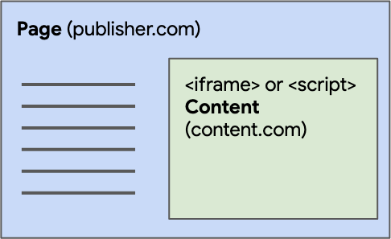

{{DefaultAPISidebar("Web Storage API")}}

**Web Storage API** cung cấp các cơ chế để trình duyệt có thể lưu trữ các cặp khóa/giá trị theo cách trực quan hơn nhiều so với việc dùng {{glossary("cookie", "cookie")}}.

## Khái niệm và cách dùng

Hai cơ chế trong Web Storage gồm:

- `sessionStorage` được phân vùng theo tab trình duyệt và theo {{glossary("origin")}}. Tài liệu chính và tất cả {{glossary("browsing context", "ngữ cảnh duyệt web")}} được nhúng, chẳng hạn iframe, được nhóm theo origin của chúng, và mỗi origin có quyền truy cập vào vùng lưu trữ riêng của mình. Đóng tab trình duyệt sẽ hủy mọi dữ liệu `sessionStorage` gắn với tab đó.
- `localStorage` chỉ được phân vùng theo {{glossary("origin")}}. Mọi tài liệu có cùng origin đều có thể truy cập cùng một vùng `localStorage`, và dữ liệu này vẫn tồn tại ngay cả khi trình duyệt bị đóng rồi mở lại.

Các cơ chế này có sẵn thông qua các thuộc tính {{domxref("Window.sessionStorage")}} và {{domxref("Window.localStorage")}}. Truy cập một trong hai thuộc tính này sẽ trả về một thể hiện của đối tượng {{domxref("Storage")}}, thông qua đó các mục dữ liệu có thể được đặt, lấy và xóa. Một đối tượng lưu trữ khác nhau được dùng cho `sessionStorage` và `localStorage` của từng origin, chúng hoạt động và được điều khiển riêng biệt.

Để tìm hiểu về dung lượng lưu trữ có sẵn khi dùng các API này, cũng như điều gì sẽ xảy ra khi vượt quá giới hạn lưu trữ, hãy xem [Hạn mức lưu trữ và tiêu chí loại bỏ dữ liệu](/en-US/docs/Web/API/Storage_API/Storage_quotas_and_eviction_criteria).

Cả `sessionStorage` và `localStorage` trong Web Storage đều có tính đồng bộ. Điều này có nghĩa là khi dữ liệu được đặt, lấy hoặc xóa khỏi các cơ chế lưu trữ này, thao tác sẽ được thực hiện đồng bộ, chặn việc thực thi các mã JavaScript khác cho đến khi thao tác hoàn tất. Hành vi đồng bộ này có thể ảnh hưởng tới hiệu năng của ứng dụng web, đặc biệt nếu có một lượng lớn dữ liệu được lưu trữ hoặc truy xuất.

Nhà phát triển nên thận trọng khi thực hiện các thao tác trên `sessionStorage` hoặc `localStorage` liên quan đến lượng dữ liệu lớn hoặc những tác vụ tốn nhiều tính toán. Việc tối ưu mã và giảm thiểu các thao tác đồng bộ là rất quan trọng để tránh chặn giao diện người dùng và gây chậm phản hồi của ứng dụng.

Các giải pháp thay thế bất đồng bộ, chẳng hạn [IndexedDB](/en-US/docs/Web/API/IndexedDB_API), có thể phù hợp hơn trong các trường hợp hiệu năng là mối quan tâm hoặc khi làm việc với bộ dữ liệu lớn hơn. Những giải pháp này cho phép thao tác không chặn, mang lại trải nghiệm mượt mà hơn và hiệu năng tốt hơn cho ứng dụng web.

> [!NOTE]
> Quyền truy cập vào Web Storage từ IFrame bên thứ ba sẽ bị từ chối nếu người dùng đã [tắt cookie của bên thứ ba](https://support.mozilla.org/en-US/kb/third-party-cookies-firefox-tracking-protection).

## Xác định quyền truy cập lưu trữ của bên thứ ba

Mỗi origin có vùng lưu trữ riêng, điều này đúng với cả web storage và [shared storage](/en-US/docs/Web/API/Shared_Storage_API). Tuy nhiên, quyền truy cập của mã bên thứ ba, tức mã được nhúng, vào shared storage phụ thuộc vào [ngữ cảnh duyệt web](/en-US/docs/Glossary/Browsing_context) của nó. Ngữ cảnh mà mã bên thứ ba từ một origin khác chạy trong đó sẽ quyết định quyền truy cập lưu trữ của mã bên thứ ba.

Mã bên thứ ba có thể được thêm vào một trang khác bằng cách chèn nó bằng phần tử {{htmlelement("script")}} hoặc bằng cách đặt nguồn của một {{htmlelement("iframe")}} thành một trang có chứa mã bên thứ ba. Phương thức dùng để tích hợp mã bên thứ ba sẽ quyết định ngữ cảnh duyệt web của mã đó.

- Nếu mã bên thứ ba của bạn được thêm vào một trang khác bằng phần tử `<script>`, mã của bạn sẽ được thực thi trong ngữ cảnh duyệt web của trang nhúng. Do đó, khi bạn gọi {{domxref("Storage.setItem()")}} hoặc {{domxref("SharedStorage.set()")}}, cặp khóa/giá trị sẽ được ghi vào vùng lưu trữ của trang nhúng. Theo góc nhìn của trình duyệt, không có sự khác biệt giữa mã bên thứ nhất và mã bên thứ ba khi dùng thẻ `<script>`.
- Khi mã bên thứ ba của bạn được thêm vào một trang khác bên trong một `<iframe>`, mã bên trong `<iframe>` sẽ được thực thi với origin của ngữ cảnh duyệt web của `<iframe>`. Nếu mã trong `<iframe>` gọi {{domxref("Storage.setItem()")}}, dữ liệu sẽ được ghi vào local storage hoặc session storage của origin thuộc `<iframe>`. Nếu mã trong `<iframe>` gọi {{domxref("SharedStorage.set()")}}, dữ liệu sẽ được ghi vào shared storage của origin thuộc `<iframe>`.

## Các giao diện Web Storage

- {{domxref("Storage")}}
  - : Cho phép bạn đặt, lấy và xóa dữ liệu cho một miền và một kiểu lưu trữ cụ thể, session hoặc local.
- {{domxref("Window")}}
  - : Web Storage API mở rộng đối tượng {{domxref("Window")}} với hai thuộc tính mới là {{domxref("Window.sessionStorage")}} và {{domxref("Window.localStorage")}}, cung cấp quyền truy cập lần lượt đến các đối tượng {{domxref("Storage")}} của phiên và cục bộ cho miền hiện tại, cùng với một trình xử lý sự kiện {{domxref("Window/storage_event", "storage")}} được kích hoạt khi vùng lưu trữ thay đổi, ví dụ khi một mục mới được lưu.
- {{domxref("StorageEvent")}}
  - : Sự kiện `storage` được kích hoạt trên đối tượng `Window` của một tài liệu khi một vùng lưu trữ thay đổi.

## Ví dụ

Để minh họa một số cách dùng điển hình của web storage, chúng tôi đã tạo một ví dụ có cái tên khá trực diện là [Web Storage Demo](https://github.com/mdn/dom-examples/tree/main/web-storage). [Trang đích](https://mdn.github.io/dom-examples/web-storage/) cung cấp các điều khiển để tùy chỉnh màu sắc, phông chữ và ảnh trang trí. Khi bạn chọn các tùy chọn khác nhau, trang sẽ được cập nhật ngay lập tức. Ngoài ra, các lựa chọn của bạn cũng được lưu trong `localStorage`, để khi bạn rời khỏi trang rồi tải lại sau đó, các lựa chọn vẫn được ghi nhớ.

Ngoài ra, chúng tôi cũng cung cấp một [trang xuất sự kiện](https://mdn.github.io/dom-examples/web-storage/event.html). Nếu bạn tải trang này ở một tab khác rồi thay đổi các lựa chọn của mình trong trang đích, bạn sẽ thấy thông tin lưu trữ được cập nhật khi {{domxref("StorageEvent")}} được kích hoạt.

## Thông số kỹ thuật

{{Specifications}}

## Tương thích trình duyệt

{{Compat}}

## Chế độ duyệt riêng tư / ẩn danh

Cửa sổ riêng tư, chế độ ẩn danh và các tùy chọn duyệt web riêng tư có tên gọi tương tự sẽ không lưu dữ liệu như lịch sử và cookie. Trong chế độ riêng tư, `localStorage` được xử lý như `sessionStorage`. Các API lưu trữ vẫn khả dụng và hoạt động đầy đủ, nhưng toàn bộ dữ liệu được lưu trong cửa sổ riêng tư sẽ bị xóa khi trình duyệt hoặc tab trình duyệt bị đóng.

## Xem thêm

- [Dùng Web Storage API](/en-US/docs/Web/API/Web_Storage_API/Using_the_Web_Storage_API)
- [Hạn mức lưu trữ của trình duyệt và tiêu chí loại bỏ dữ liệu](/en-US/docs/Web/API/Storage_API/Storage_quotas_and_eviction_criteria)
