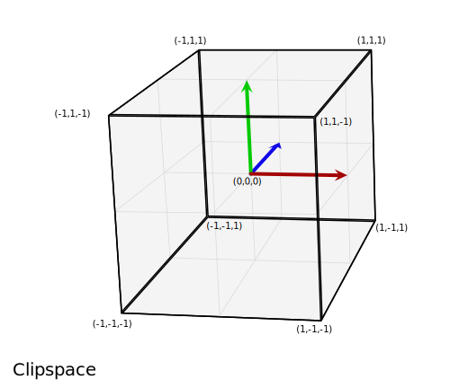
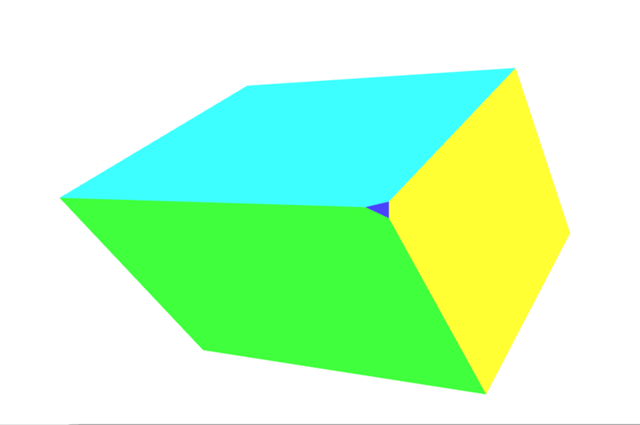

{{DefaultAPISidebar("WebGL")}}

Bài viết này khám phá cách lấy dữ liệu trong dự án [WebGL](/en-US/docs/Web/API/WebGL_API) và chiếu dữ liệu đó vào không gian thích hợp để hiển thị trên màn hình. Nó giả định kiến ​​thức về toán ma trận cơ bản bằng cách sử dụng ma trận tịnh tiến, tỷ lệ và ma trận xoay. Nó giải thích ba ma trận cốt lõi thường được sử dụng khi soạn cảnh 3D: ma trận mô hình, chế độ xem và phép chiếu.

## Ma trận mô hình, khung nhìn và phép chiếu

Các phép biến đổi riêng lẻ của điểm và đa giác trong không gian trong WebGL được xử lý bằng các ma trận biến đổi cơ bản như dịch chuyển, chia tỷ lệ và xoay. Các ma trận này có thể được kết hợp với nhau và nhóm lại theo những cách đặc biệt để làm cho chúng hữu ích trong việc hiển thị các cảnh 3D phức tạp. Các ma trận tổng hợp này cuối cùng sẽ di chuyển dữ liệu mô hình ban đầu vào một không gian tọa độ đặc biệt gọi là **không gian clip**. Đây là một khối lập phương rộng 2 đơn vị, có tâm ở (0,0,0) và có các góc nằm trong khoảng từ (-1,-1,-1) đến (1,1,1). Không gian clip này được nén thành không gian 2D và được phân loại thành hình ảnh.

Ma trận đầu tiên được thảo luận bên dưới là **ma trận mô hình**, ma trận này xác định cách bạn lấy dữ liệu mô hình ban đầu của mình và di chuyển nó trong không gian thế giới 3D. **Ma trận chiếu** được sử dụng để chuyển đổi tọa độ không gian thế giới thành tọa độ không gian clip. Ma trận chiếu thường được sử dụng, **ma trận chiếu phối cảnh**, được sử dụng để mô phỏng _hiệu ứng_ của một máy ảnh điển hình đóng vai trò thay thế cho người xem trong thế giới ảo 3D. **Ma trận khung nhìn** chịu trách nhiệm di chuyển các đối tượng trong cảnh để mô phỏng vị trí của máy ảnh đang được thay đổi, thay đổi những gì người xem hiện có thể nhìn thấy.

Các phần bên dưới cung cấp cái nhìn sâu sắc về các ý tưởng đằng sau và việc triển khai mô hình, khung nhìn và ma trận chiếu. Những ma trận này là cốt lõi để di chuyển dữ liệu xung quanh màn hình và là những khái niệm vượt qua các khung và công cụ riêng lẻ.

## Không gian clip

Trong chương trình WebGL, dữ liệu thường được tải lên GPU bằng hệ tọa độ riêng và sau đó trình đổ bóng đỉnh sẽ chuyển đổi những điểm đó thành một hệ tọa độ đặc biệt được gọi là **không gian clip**. Bất kỳ dữ liệu nào mở rộng ra ngoài không gian clip đều bị cắt bớt và không được hiển thị. Tuy nhiên, nếu một hình tam giác nằm trên đường viền của không gian này thì nó sẽ được chia thành các hình tam giác mới và chỉ các phần của hình tam giác mới nằm trong không gian clip được giữ lại.



Hình ảnh trên là hình ảnh trực quan của không gian clip mà tất cả các điểm phải vừa với. Nó là một khối lập phương có hai đơn vị mỗi cạnh, với một góc ở (-1,-1,-1) và góc đối diện ở (1,1,1). Tâm của khối lập phương là điểm (0,0,0). Hệ tọa độ 8 mét khối này được sử dụng bởi không gian clip được gọi là tọa độ thiết bị chuẩn hóa (NDC). Đôi khi bạn có thể gặp phải thuật ngữ đó khi nghiên cứu và làm việc với mã WebGL.

Đối với phần này, chúng ta sẽ đưa dữ liệu trực tiếp vào hệ tọa độ không gian clip. Thông thường, dữ liệu mô hình được sử dụng trong một số hệ tọa độ tùy ý và sau đó được chuyển đổi bằng ma trận, chuyển đổi tọa độ mô hình thành hệ tọa độ không gian clip. Trong ví dụ này, cách dễ nhất để minh họa cách hoạt động của không gian clip bằng cách sử dụng các giá trị tọa độ mô hình nằm trong khoảng từ (-1,-1,-1) đến (1,1,1). Đoạn mã dưới đây sẽ tạo ra 2 hình tam giác sẽ vẽ một hình vuông trên màn hình. Độ sâu Z trong các hình vuông xác định nội dung nào sẽ được vẽ lên trên khi các hình vuông có cùng một không gian. Các giá trị Z nhỏ hơn được hiển thị bên trên các giá trị Z lớn hơn.

<!-- Shared setup -->

```html hidden live-sample___clip_space_ex live-sample___homogenous_coordinates_ex live-sample___model_transform_ex live-sample___divide_by_w_ex live-sample___simple_projection_ex live-sample___projection_matrix_ex live-sample___view_matrix_ex
<canvas id="canvas" width="1000" height="1000"></canvas>
```

```css hidden live-sample___clip_space_ex live-sample___homogenous_coordinates_ex live-sample___model_transform_ex live-sample___divide_by_w_ex live-sample___simple_projection_ex live-sample___projection_matrix_ex live-sample___view_matrix_ex
html,
body {
  width: 100%;
  height: 100%;
  margin: 0;
  overflow: hidden;
}
canvas {
  width: 100% !important;
  height: 100% !important;
}
svg {
  width: 100%;
  height: 100%;
  position: absolute;
  top: 0;
  left: 0;
}
```

```js hidden live-sample___clip_space_ex live-sample___homogenous_coordinates_ex live-sample___model_transform_ex live-sample___divide_by_w_ex live-sample___simple_projection_ex live-sample___projection_matrix_ex live-sample___view_matrix_ex
function createShader(gl, source, type) {
  // Compiles either a shader of type gl.VERTEX_SHADER or gl.FRAGMENT_SHADER
  const shader = gl.createShader(type);
  gl.shaderSource(shader, source);
  gl.compileShader(shader);

  if (!gl.getShaderParameter(shader, gl.COMPILE_STATUS)) {
    const info = gl.getShaderInfoLog(shader);
    throw new Error(`Could not compile WebGL program.\n\n${info}`);
  }

  return shader;
}

function linkProgram(gl, vertexShader, fragmentShader) {
  const program = gl.createProgram();
  gl.attachShader(program, vertexShader);
  gl.attachShader(program, fragmentShader);
  gl.linkProgram(program);

  if (!gl.getProgramParameter(program, gl.LINK_STATUS)) {
    const info = gl.getProgramInfoLog(program);
    throw new Error(`Could not compile WebGL program.\n\n${info}`);
  }

  return program;
}

function createWebGLProgram(gl, vertexSource, fragmentSource) {
  // Combines createShader() and linkProgram()
  const vertexShader = createShader(gl, vertexSource, gl.VERTEX_SHADER);
  const fragmentShader = createShader(gl, fragmentSource, gl.FRAGMENT_SHADER);
  return linkProgram(gl, vertexShader, fragmentShader);
}

function createWebGLProgramFromIds(gl, vertexSourceId, fragmentSourceId) {
  const vertexSourceEl = document.getElementById(vertexSourceId);
  const fragmentSourceEl = document.getElementById(fragmentSourceId);

  return createWebGLProgram(
    gl,
    vertexSourceEl.innerHTML,
    fragmentSourceEl.innerHTML,
  );
}
```

```js hidden live-sample___model_transform_ex live-sample___divide_by_w_ex live-sample___simple_projection_ex live-sample___projection_matrix_ex live-sample___view_matrix_ex
// Functions below are copied from Matrix_math_for_the_web
// point • matrix
function multiplyMatrixAndPoint(matrix, point) {
  // Give a simple variable name to each part of the matrix, a column and row number
  const c0r0 = matrix[0],
    c1r0 = matrix[1],
    c2r0 = matrix[2],
    c3r0 = matrix[3];
  const c0r1 = matrix[4],
    c1r1 = matrix[5],
    c2r1 = matrix[6],
    c3r1 = matrix[7];
  const c0r2 = matrix[8],
    c1r2 = matrix[9],
    c2r2 = matrix[10],
    c3r2 = matrix[11];
  const c0r3 = matrix[12],
    c1r3 = matrix[13],
    c2r3 = matrix[14],
    c3r3 = matrix[15];

  // Now set some simple names for the point
  const x = point[0];
  const y = point[1];
  const z = point[2];
  const w = point[3];

  // Multiply the point against each part of the 1st column, then add together
  const resultX = x * c0r0 + y * c0r1 + z * c0r2 + w * c0r3;

  // Multiply the point against each part of the 2nd column, then add together
  const resultY = x * c1r0 + y * c1r1 + z * c1r2 + w * c1r3;

  // Multiply the point against each part of the 3rd column, then add together
  const resultZ = x * c2r0 + y * c2r1 + z * c2r2 + w * c2r3;

  // Multiply the point against each part of the 4th column, then add together
  const resultW = x * c3r0 + y * c3r1 + z * c3r2 + w * c3r3;

  return [resultX, resultY, resultZ, resultW];
}

// matrixB • matrixA
function multiplyMatrices(matrixA, matrixB) {
  // Slice the second matrix up into rows
  const row0 = [matrixB[0], matrixB[1], matrixB[2], matrixB[3]];
  const row1 = [matrixB[4], matrixB[5], matrixB[6], matrixB[7]];
  const row2 = [matrixB[8], matrixB[9], matrixB[10], matrixB[11]];
  const row3 = [matrixB[12], matrixB[13], matrixB[14], matrixB[15]];

  // Multiply each row by matrixA
  const result0 = multiplyMatrixAndPoint(matrixA, row0);
  const result1 = multiplyMatrixAndPoint(matrixA, row1);
  const result2 = multiplyMatrixAndPoint(matrixA, row2);
  const result3 = multiplyMatrixAndPoint(matrixA, row3);

  // Turn the result rows back into a single matrix
  // prettier-ignore
  return [
    result0[0], result0[1], result0[2], result0[3],
    result1[0], result1[1], result1[2], result1[3],
    result2[0], result2[1], result2[2], result2[3],
    result3[0], result3[1], result3[2], result3[3],
  ];
}

function multiplyArrayOfMatrices(matrices) {
  if (matrices.length === 1) {
    return matrices[0];
  }
  return matrices.reduce((result, matrix) => multiplyMatrices(result, matrix));
}

function translate(x, y, z) {
  // prettier-ignore
  return [
    1, 0, 0, 0,
    0, 1, 0, 0,
    0, 0, 1, 0,
    x, y, z, 1,
  ];
}

function scale(x, y, z) {
  // prettier-ignore
  return [
    x, 0, 0, 0,
    0, y, 0, 0,
    0, 0, z, 0,
    0, 0, 0, 1,
  ];
}

const sin = Math.sin;
const cos = Math.cos;

function rotateX(a) {
  // prettier-ignore
  return [
    1, 0, 0, 0,
    0, cos(a), -sin(a), 0,
    0, sin(a), cos(a), 0,
    0, 0, 0, 1,
  ];
}

function rotateY(a) {
  // prettier-ignore
  return [
    cos(a), 0, sin(a), 0,
    0, 1, 0, 0,
    -sin(a), 0, cos(a), 0,
    0, 0, 0, 1,
  ];
}

function rotateZ(a) {
  // prettier-ignore
  return [
    cos(a), -sin(a), 0, 0,
    sin(a), cos(a), 0, 0,
    0, 0, 1, 0,
    0, 0, 0, 1,
  ];
}

// Define the data that is needed to make a 3d cube
function createCubeData() {
  // prettier-ignore
  const positions = [
    // Front face
    -1.0, -1.0, 1.0, 1.0, -1.0, 1.0, 1.0, 1.0, 1.0, -1.0, 1.0, 1.0,
    // Back face
    -1.0, -1.0, -1.0, -1.0, 1.0, -1.0, 1.0, 1.0, -1.0, 1.0, -1.0, -1.0,
    // Top face
    -1.0, 1.0, -1.0, -1.0, 1.0, 1.0, 1.0, 1.0, 1.0, 1.0, 1.0, -1.0,
    // Bottom face
    -1.0, -1.0, -1.0, 1.0, -1.0, -1.0, 1.0, -1.0, 1.0, -1.0, -1.0, 1.0,
    // Right face
    1.0, -1.0, -1.0, 1.0, 1.0, -1.0, 1.0, 1.0, 1.0, 1.0, -1.0, 1.0,
    // Left face
    -1.0, -1.0, -1.0, -1.0, -1.0, 1.0, -1.0, 1.0, 1.0, -1.0, 1.0, -1.0,
  ];

  // prettier-ignore
  const colorsOfFaces = [
    [0.3, 1.0, 1.0, 1.0],    // Front face: cyan
    [1.0, 0.3, 0.3, 1.0],    // Back face: red
    [0.3, 1.0, 0.3, 1.0],    // Top face: green
    [0.3, 0.3, 1.0, 1.0],    // Bottom face: blue
    [1.0, 1.0, 0.3, 1.0],    // Right face: yellow
    [1.0, 0.3, 1.0, 1.0]     // Left face: purple
  ];

  let colors = [];

  for (const polygonColor of colorsOfFaces) {
    for (let i = 0; i < 4; i++) {
      colors = colors.concat(polygonColor);
    }
  }

  // prettier-ignore
  const elements = [
    0,  1,  2,   0,  2,  3,    // front
    4,  5,  6,   4,  6,  7,    // back
    8,  9,  10,  8,  10, 11,   // top
    12, 13, 14,  12, 14, 15,   // bottom
    16, 17, 18,  16, 18, 19,   // right
    20, 21, 22,  20, 22, 23,   // left
  ];

  return { positions, elements, colors };
}

// Take the data for a cube and bind the buffers for it.
// Return an object collection of the buffers
function createBuffersForCube(gl, cube) {
  const positions = gl.createBuffer();
  gl.bindBuffer(gl.ARRAY_BUFFER, positions);
  gl.bufferData(
    gl.ARRAY_BUFFER,
    new Float32Array(cube.positions),
    gl.STATIC_DRAW,
  );

  const colors = gl.createBuffer();
  gl.bindBuffer(gl.ARRAY_BUFFER, colors);
  gl.bufferData(gl.ARRAY_BUFFER, new Float32Array(cube.colors), gl.STATIC_DRAW);

  const elements = gl.createBuffer();
  gl.bindBuffer(gl.ELEMENT_ARRAY_BUFFER, elements);
  gl.bufferData(
    gl.ELEMENT_ARRAY_BUFFER,
    new Uint16Array(cube.elements),
    gl.STATIC_DRAW,
  );

  return { positions, elements, colors };
}
```

### Ví dụ về WebGLBox

Ví dụ này sẽ tạo một đối tượng `WebGLBox` tùy chỉnh để vẽ một hộp 2D trên màn hình. Nó được triển khai như một lớp, chứa hàm tạo và phương thức `draw()` để vẽ một hộp trên màn hình:

```js live-sample___clip_space_ex
class WebGLBox {
  canvas = document.getElementById("canvas");
  gl = this.canvas.getContext("webgl");
  webglProgram = createWebGLProgramFromIds(
    this.gl,
    "vertex-shader",
    "fragment-shader",
  );
  positionLocation;
  colorLocation;
  constructor() {
    const gl = this.gl;

    // Setup a WebGL program
    gl.useProgram(this.webglProgram);

    // Save the attribute and uniform locations
    this.positionLocation = gl.getAttribLocation(this.webglProgram, "position");
    this.colorLocation = gl.getUniformLocation(this.webglProgram, "vColor");

    // Tell WebGL to test the depth when drawing, so if a square is behind
    // another square it won't be drawn
    gl.enable(gl.DEPTH_TEST);
  }
  draw(settings) {
    // Create some attribute data; these are the triangles that will end being
    // drawn to the screen. There are two that form a square.

    // prettier-ignore
    const data = new Float32Array([
      // Triangle 1
      settings.left, settings.bottom, settings.depth,
      settings.right, settings.bottom, settings.depth,
      settings.left, settings.top, settings.depth,

      // Triangle 2
      settings.left, settings.top, settings.depth,
      settings.right, settings.bottom, settings.depth,
      settings.right, settings.top, settings.depth,
    ]);

    // Use WebGL to draw this onto the screen.

    // Performance Note: Creating a new array buffer for every draw call is slow.
    // This function is for illustration purposes only.

    const gl = this.gl;

    // Create a buffer and bind the data
    const buffer = gl.createBuffer();
    gl.bindBuffer(gl.ARRAY_BUFFER, buffer);
    gl.bufferData(gl.ARRAY_BUFFER, data, gl.STATIC_DRAW);

    // Setup the pointer to our attribute data (the triangles)
    gl.enableVertexAttribArray(this.positionLocation);
    gl.vertexAttribPointer(this.positionLocation, 3, gl.FLOAT, false, 0, 0);

    // Setup the color uniform that will be shared across all triangles
    gl.uniform4fv(this.colorLocation, settings.color);

    // Draw the triangles to the screen
    gl.drawArrays(gl.TRIANGLES, 0, 6);
  }
}
```

Trình đổ bóng là các đoạn mã được viết bằng GLSL lấy các điểm dữ liệu của chúng ta và cuối cùng hiển thị chúng trên màn hình. Để thuận tiện, các trình đổ bóng này được lưu trữ trong phần tử {{htmlelement("script")}} được đưa vào chương trình thông qua hàm tùy chỉnh `createWebGLProgramFromIds()`. Hàm này xử lý các vấn đề cơ bản về lấy một số mã nguồn GLSL và biên dịch nó thành chương trình WebGL. Cần có ba tham số — ngữ cảnh để hiển thị chương trình, ID của phần tử {{htmlelement("script")}} chứa trình đổ bóng đỉnh và ID của phần tử {{htmlelement("script")}} chứa trình đổ bóng phân đoạn. Chức năng này không được giải thích sâu ở đây; nếu bạn muốn xem cách triển khai nó, hãy nhấp vào "Phát" trên khối mã. Trình đổ bóng đỉnh định vị các đỉnh và trình đổ bóng mảnh tô màu từng pixel.

Trước tiên hãy xem trình đổ bóng đỉnh sẽ di chuyển các đỉnh trên màn hình:

```glsl
// The individual position vertex
attribute vec3 position;

void main() {
  // the gl_Position is the final position in clip space after the vertex shader modifies it
  gl_Position = vec4(position, 1.0);
}
```

```html hidden live-sample___clip_space_ex
<script id="vertex-shader" type="x-shader/x-vertex">
  // The individual position vertex
  attribute vec3 position;

  void main() {
    // the gl_Position is the final position in clip space after the vertex shader modifies it
    gl_Position = vec4(position, 1.0);
  }
</script>
```

Tiếp theo, để thực sự phân loại dữ liệu thành pixel, trình đổ bóng phân đoạn sẽ đánh giá mọi thứ trên cơ sở từng pixel, đặt một màu duy nhất. GPU gọi hàm đổ bóng cho từng pixel mà nó cần hiển thị; công việc của shader là trả về màu để sử dụng cho pixel đó.

```glsl
precision mediump float;
uniform vec4 vColor;

void main() {
  gl_FragColor = vColor;
}
```

```html hidden live-sample___clip_space_ex live-sample___homogenous_coordinates_ex
<script id="fragment-shader" type="x-shader/x-fragment">
  precision mediump float;
  uniform vec4 vColor;

  void main() {
    gl_FragColor = vColor;
  }
</script>
```

Với những cài đặt đó, đã đến lúc vẽ trực tiếp lên màn hình bằng tọa độ không gian clip.

```js live-sample___clip_space_ex
const box = new WebGLBox();
```

Đầu tiên vẽ một hộp màu đỏ ở giữa.

```js live-sample___clip_space_ex
box.draw({
  top: 0.5, // x
  bottom: -0.5, // x
  left: -0.5, // y
  right: 0.5, // y

  depth: 0, // z
  color: [1, 0.4, 0.4, 1], // red
});
```

Tiếp theo, vẽ một hộp màu xanh lá cây lên trên và phía sau hộp màu đỏ.

```js live-sample___clip_space_ex
box.draw({
  top: 0.9, // x
  bottom: 0, // x
  left: -0.9, // y
  right: 0.9, // y

  depth: 0.5, // z
  color: [0.4, 1, 0.4, 1], // green
});
```

Cuối cùng, để chứng minh rằng quá trình cắt đang thực sự diễn ra, hộp này không được vẽ vì nó hoàn toàn nằm ngoài không gian cắt. Độ sâu nằm ngoài phạm vi -1,0 đến 1,0.

```js live-sample___clip_space_ex
box.draw({
  top: 1, // x
  bottom: -1, // x
  left: -1, // y
  right: 1, // y

  depth: -1.5, // z
  color: [0.4, 0.4, 1, 1], // blue
});
```

#### Kết quả

```html hidden live-sample___clip_space_ex live-sample___homogenous_coordinates_ex
<!-- The SVG overlay showing clip space -->
<svg
  id="clip-space-axis"
  xmlns="http://www.w3.org/2000/svg"
  viewBox="0 0 500 500"
  preserveAspectRatio="none"></svg>

<!-- Use a separate SVG for text to avoid scaling -->
<svg id="clip-space-text" xmlns="http://www.w3.org/2000/svg"></svg>
```

```js hidden live-sample___clip_space_ex live-sample___homogenous_coordinates_ex
const axisOverlay = document.getElementById("clip-space-axis");
const xAxis = document.createElementNS("http://www.w3.org/2000/svg", "path");
const yAxis = document.createElementNS("http://www.w3.org/2000/svg", "path");
yAxis.setAttribute("fill", "none");
yAxis.setAttribute("stroke", "black");
xAxis.setAttribute("fill", "none");
xAxis.setAttribute("stroke", "black");
let yAxisPath = "M 249.5 0 L 249.5 500";
let xAxisPath = "M 0 250.5 L 500 250.5";
for (let i = -10; i <= 10; i++) {
  if (i === 0) continue;
  const length = i % 5 === 0 ? 24 : 12;
  const loc = 250 + i * 25 - 0.5;
  yAxisPath += ` M 249.5 ${loc} L ${249.5 + length} ${loc}`;
  xAxisPath += ` M ${loc} 250.5 L ${loc} ${250.5 - length}`;
}
xAxis.setAttribute("d", xAxisPath);
yAxis.setAttribute("d", yAxisPath);
axisOverlay.appendChild(xAxis);
axisOverlay.appendChild(yAxis);

const textOverlay = document.getElementById("clip-space-text");
for (const label of ["+X", "-X", "+Y", "-Y"]) {
  const textEl = document.createElementNS("http://www.w3.org/2000/svg", "text");
  let x, y;
  if (label === "+X") {
    [x, y] = ["97.5%", "53%"];
  } else if (label === "-X") {
    [x, y] = ["2.5%", "53%"];
  } else if (label === "+Y") {
    [x, y] = ["47%", "2.5%"];
  } else if (label === "-Y") {
    [x, y] = ["47%", "97.5%"];
  }
  textEl.setAttribute("x", x);
  textEl.setAttribute("y", y);
  textEl.setAttribute("text-anchor", "middle");
  textEl.setAttribute("font-family", "'Courier New'");
  textEl.setAttribute("font-size", "16");
  textEl.setAttribute("font-weight", "bold");
  textEl.textContent = label;
  textOverlay.appendChild(textEl);
}
for (let i = -1; i <= 1; i += 0.5) {
  if (i === 0) continue;
  const textEl = document.createElementNS("http://www.w3.org/2000/svg", "text");
  textEl.setAttribute("x", "58%");
  textEl.setAttribute("y", `${50 - i * 48}%`);
  textEl.setAttribute("text-anchor", "end");
  textEl.setAttribute("font-family", "'Courier New'");
  textEl.setAttribute("font-size", "11");
  textEl.textContent = i.toFixed(1);
  textOverlay.appendChild(textEl);
  const textEl2 = document.createElementNS(
    "http://www.w3.org/2000/svg",
    "text",
  );
  textEl2.setAttribute("x", `${50 + i * 50}%`);
  textEl2.setAttribute("y", "45%");
  textEl2.setAttribute("text-anchor", i > 0 ? "end" : "start");
  textEl2.setAttribute("font-family", "'Courier New'");
  textEl2.setAttribute("font-size", "11");
  textEl2.textContent = i.toFixed(1);
  textOverlay.appendChild(textEl2);
}
```

{{EmbedLiveSample("clip_space_ex", "", 600)}}

#### Bài tập

Một bài tập hữu ích vào thời điểm này là di chuyển các hộp xung quanh không gian clip bằng cách thay đổi mã để hiểu cách các điểm được cắt bớt và di chuyển xung quanh trong không gian clip. Hãy thử vẽ một bức tranh giống như một khuôn mặt cười hình hộp có nền.

## Tọa độ đồng nhất

Dòng chính của trình đổ bóng đỉnh không gian clip trước đó chứa mã này:

```glsl
gl_Position = vec4(position, 1.0);
```

Biến `position` đã được xác định trong phương thức `draw()` và được truyền vào dưới dạng thuộc tính cho trình đổ bóng. Đây là một điểm ba chiều, nhưng biến `gl_Position` cuối cùng được truyền qua đường ống thực sự là 4 chiều — thay vì `(x, y, z)` nó là `(x, y, z, w)`. Không có chữ cái nào sau `z`, vì vậy theo quy ước chiều thứ tư này được gắn nhãn `w`. Trong ví dụ trên tọa độ `w` được đặt thành 1.0.

Câu hỏi rõ ràng là "tại sao lại có chiều bổ sung?" Hóa ra sự bổ sung này cho phép thực hiện nhiều kỹ thuật hay để thao tác dữ liệu 3D. Thứ nguyên bổ sung này đưa khái niệm phối cảnh vào hệ tọa độ; với nó tại chỗ, chúng ta có thể ánh xạ tọa độ 3D vào không gian 2D—do đó cho phép hai đường thẳng song song giao nhau khi chúng lùi xa. Giá trị của `w` được sử dụng làm ước số cho các thành phần khác của tọa độ, sao cho các giá trị thực của `x`, `y` và `z` được tính là `x/w`, `y/w` và `z/w` (và `w` khi đó cũng là `w/w`, trở thành 1).

Một điểm ba chiều được xác định trong hệ tọa độ Descartes điển hình. Chiều thứ tư được thêm vào sẽ thay đổi điểm này thành [tọa độ đồng nhất](https://en.wikipedia.org/wiki/Homogeneous_coordines). Nó vẫn biểu diễn một điểm trong không gian 3D và có thể dễ dàng chứng minh cách xây dựng loại tọa độ này thông qua một cặp hàm đơn giản.

```js
function cartesianToHomogeneous(point) {
  let x = point[0];
  let y = point[1];
  let z = point[2];

  return [x, y, z, 1];
}

function homogeneousToCartesian(point) {
  let x = point[0];
  let y = point[1];
  let z = point[2];
  let w = point[3];

  return [x / w, y / w, z / w];
}
```

Như đã đề cập trước đó và được hiển thị trong các hàm trên, thành phần w chia các thành phần x, y và z. Khi thành phần w là một số thực khác 0 thì tọa độ đồng nhất dễ dàng chuyển trở lại thành một điểm bình thường trong không gian Descartes. Bây giờ điều gì xảy ra nếu thành phần w bằng 0? Trong JavaScript, giá trị được trả về sẽ như sau.

```js
homogeneousToCartesian([10, 4, 5, 0]);
```

Điều này đánh giá là: `[Vô cực, Vô cực, Vô cực]`.

Tọa độ đồng nhất này đại diện cho một số điểm ở vô cùng. Đây là một cách thuận tiện để biểu diễn một tia bắn ra từ gốc tọa độ theo một hướng cụ thể. Ngoài tia, nó còn có thể được coi là biểu diễn của vectơ định hướng. Nếu tọa độ đồng nhất này được nhân với một ma trận có bản dịch thì bản dịch sẽ bị loại bỏ một cách hiệu quả.

Khi các số cực lớn (hoặc cực nhỏ) trên máy tính, chúng bắt đầu trở nên kém chính xác hơn vì chỉ có rất nhiều số 1 và số 0 được sử dụng để biểu thị chúng. Càng thực hiện nhiều thao tác trên số lượng lớn thì kết quả càng tích lũy nhiều lỗi. Khi chia cho w, điều này có thể làm tăng độ chính xác của các số rất lớn một cách hiệu quả bằng cách thực hiện trên hai số có khả năng nhỏ hơn, ít mắc lỗi hơn.

Lợi ích cuối cùng của việc sử dụng tọa độ đồng nhất là chúng rất phù hợp để nhân với ma trận 4x4. Một đỉnh phải khớp với ít nhất một trong các kích thước của ma trận để được nhân với nó. Ma trận 4x4 có thể được sử dụng để mã hóa nhiều phép biến đổi hữu ích. Trên thực tế, ma trận chiếu phối cảnh điển hình sử dụng phép chia cho thành phần w để đạt được sự chuyển đổi của nó.

Việc cắt các điểm và đa giác khỏi không gian clip xảy ra trước khi tọa độ đồng nhất được chuyển đổi trở lại tọa độ Descartes (bằng cách chia cho w). Không gian cuối cùng này được gọi là **tọa độ thiết bị chuẩn hóa** hoặc NDC.

Để bắt đầu thực hiện ý tưởng này, ví dụ trước có thể được sửa đổi để cho phép sử dụng thành phần `w`. Ngoài việc sửa đổi `data`, hãy nhớ thay đổi `vertexAttribPointer()` để sử dụng 4 thành phần (tham số `size` thứ hai) thay vì 3.

```js
// Redefine the triangles to use the W component
// prettier-ignore
const data = new Float32Array([
  // Triangle 1
  settings.left, settings.bottom, settings.depth, settings.w,
  settings.right, settings.bottom, settings.depth, settings.w,
  settings.left, settings.top, settings.depth, settings.w,

  // Triangle 2
  settings.left, settings.top, settings.depth, settings.w,
  settings.right, settings.bottom, settings.depth, settings.w,
  settings.right, settings.top, settings.depth, settings.w,
]);
```

```js hidden live-sample___homogenous_coordinates_ex
class WebGLBox {
  canvas = document.getElementById("canvas");
  gl = this.canvas.getContext("webgl");
  webglProgram = createWebGLProgramFromIds(
    this.gl,
    "vertex-shader",
    "fragment-shader",
  );
  positionLocation;
  colorLocation;
  constructor() {
    const gl = this.gl;

    // Setup a WebGL program
    gl.useProgram(this.webglProgram);

    // Save the attribute and uniform locations
    this.positionLocation = gl.getAttribLocation(this.webglProgram, "position");
    this.colorLocation = gl.getUniformLocation(this.webglProgram, "vColor");

    // Tell WebGL to test the depth when drawing, so if a square is behind
    // another square it won't be drawn
    gl.enable(gl.DEPTH_TEST);
  }
  draw(settings) {
    // Create some attribute data; these are the triangles that will end being
    // drawn to the screen. There are two that form a square.

    // prettier-ignore
    const data = new Float32Array([
      // Triangle 1
      settings.left, settings.bottom, settings.depth, settings.w,
      settings.right, settings.bottom, settings.depth, settings.w,
      settings.left, settings.top, settings.depth, settings.w,

      // Triangle 2
      settings.left, settings.top, settings.depth, settings.w,
      settings.right, settings.bottom, settings.depth, settings.w,
      settings.right, settings.top, settings.depth, settings.w,
    ]);

    // Use WebGL to draw this onto the screen.

    // Performance Note: Creating a new array buffer for every draw call is slow.
    // This function is for illustration purposes only.

    const gl = this.gl;

    // Create a buffer and bind the data
    const buffer = gl.createBuffer();
    gl.bindBuffer(gl.ARRAY_BUFFER, buffer);
    gl.bufferData(gl.ARRAY_BUFFER, data, gl.STATIC_DRAW);

    // Setup the pointer to our attribute data (the triangles)
    gl.enableVertexAttribArray(this.positionLocation);
    gl.vertexAttribPointer(this.positionLocation, 4, gl.FLOAT, false, 0, 0);

    // Setup the color uniform that will be shared across all triangles
    gl.uniform4fv(this.colorLocation, settings.color);

    // Draw the triangles to the screen
    gl.drawArrays(gl.TRIANGLES, 0, 6);
  }
}

const box = new WebGLBox();
```

Sau đó, trình đổ bóng đỉnh sử dụng điểm 4 chiều được truyền vào.

```glsl
attribute vec4 position;

void main() {
  gl_Position = position;
}
```

```html hidden live-sample___homogenous_coordinates_ex
<script id="vertex-shader" type="x-shader/x-vertex">
  attribute vec4 position;

  void main() {
    gl_Position = position;
  }
</script>
```

Đầu tiên, chúng ta vẽ một ô màu đỏ ở giữa nhưng đặt W thành 0,7. Khi tọa độ được chia cho 0,7, tất cả chúng sẽ được phóng to.

```js live-sample___homogenous_coordinates_ex
box.draw({
  top: 0.5, // y
  bottom: -0.5, // y
  left: -0.5, // x
  right: 0.5, // x
  w: 0.7, // w - enlarge this box

  depth: 0, // z
  color: [1, 0.4, 0.4, 1], // red
});
```

Bây giờ, chúng ta vẽ một hộp màu xanh lá cây lên trên, nhưng thu nhỏ nó lại bằng cách đặt thành phần w thành 1.1

```js live-sample___homogenous_coordinates_ex
box.draw({
  top: 0.9, // y
  bottom: 0, // y
  left: -0.9, // x
  right: 0.9, // x
  w: 1.1, // w - shrink this box

  depth: 0.5, // z
  color: [0.4, 1, 0.4, 1], // green
});
```

Hộp cuối cùng này không được vẽ vì nó nằm ngoài không gian clip. Độ sâu nằm ngoài phạm vi -1,0 đến 1,0.

```js live-sample___homogenous_coordinates_ex
box.draw({
  top: 1, // y
  bottom: -1, // y
  left: -1, // x
  right: 1, // x
  w: 1.5, // w - Bring this box into range

  depth: -1.5, // z
  color: [0.4, 0.4, 1, 1], // blue
});
```

### Kết quả

{{EmbedLiveSample("homogenous_coordinates_ex", "", 600)}}

### Bài tập

- Thử nghiệm các giá trị này để xem nó ảnh hưởng như thế nào đến nội dung được hiển thị trên màn hình. Lưu ý cách hộp màu xanh đã cắt trước đó được đưa trở lại phạm vi bằng cách đặt thành phần w của nó.
- Thử tạo một hộp mới nằm ngoài không gian clip và đưa nó trở lại bằng cách chia cho w.

## Chuyển đổi mô hình

Việc đặt các điểm trực tiếp vào không gian clip có tác dụng hạn chế. Trong các ứng dụng trong thế giới thực, bạn không có sẵn tất cả tọa độ nguồn trong tọa độ không gian clip. Vì vậy, hầu hết thời gian, bạn cần chuyển đổi dữ liệu mô hình và các tọa độ khác thành không gian clip. Khối lập phương khiêm tốn là một ví dụ dễ hiểu về cách thực hiện điều này. Dữ liệu khối bao gồm các vị trí đỉnh, màu sắc của các mặt của khối và thứ tự các vị trí đỉnh tạo nên các đa giác riêng lẻ (theo nhóm 3 đỉnh để tạo thành các hình tam giác tạo thành các mặt của khối). Vị trí và màu sắc được lưu trữ trong bộ đệm GL, được gửi đến trình đổ bóng dưới dạng thuộc tính và sau đó được vận hành riêng lẻ.

Cuối cùng, một ma trận mô hình đơn được tính toán và thiết lập. Ma trận này biểu thị các phép biến đổi được thực hiện trên mọi điểm tạo nên mô hình để di chuyển nó vào không gian chính xác và để thực hiện bất kỳ phép biến đổi cần thiết nào khác trên từng điểm trong mô hình. Điều này không chỉ áp dụng cho từng đỉnh mà còn cho từng điểm trên mọi bề mặt của mô hình.

Trong trường hợp này, đối với mỗi khung hình của hoạt ảnh, một loạt ma trận tỷ lệ, xoay và dịch chuyển sẽ di chuyển dữ liệu đến vị trí mong muốn trong không gian clip. Khối có kích thước của không gian clip (-1,-1,-1) đến (1,1,1) nên nó sẽ cần được thu nhỏ lại để không lấp đầy toàn bộ không gian clip. Ma trận này được gửi trực tiếp đến trình đổ bóng, đã được nhân lên trước đó bằng JavaScript.

Mẫu mã sau đây xác định một phương thức trên đối tượng `CubeDemo` sẽ tạo ma trận mô hình. Hàm mới trông như thế này (các hàm tiện ích được giới thiệu trong chương [Ma trận toán cho web](/en-US/docs/Web/API/WebGL_API/Matrix_math_for_the_web)):

```js
function computeModelMatrix(now) {
  // Scale down by 20%
  const scaleMatrix = scale(0.2, 0.2, 0.2);
  // Rotate a slight tilt
  const rotateXMatrix = rotateX(now * 0.0003);
  // Rotate according to time
  const rotateYMatrix = rotateY(now * 0.0005);
  // Move slightly down
  const translateMatrix = translate(0, -0.1, 0);
  // Multiply together, make sure and read them in opposite order
  this.transforms.model = multiplyArrayOfMatrices([
    translateMatrix, // step 4
    rotateYMatrix, // step 3
    rotateXMatrix, // step 2
    scaleMatrix, // step 1
  ]);
}
```

Để sử dụng tính năng này trong trình đổ bóng, nó phải được đặt ở một vị trí thống nhất. Các vị trí cho đồng phục được lưu trong đối tượng `location` được hiển thị bên dưới:

```js
this.locations.model = gl.getUniformLocation(webglProgram, "model");
```

Và cuối cùng bộ đồng phục cũng được đặt ở vị trí đó. Điều này chuyển giao ma trận cho GPU.

```js
gl.uniformMatrix4fv(
  this.locations.model,
  false,
  new Float32Array(this.transforms.model),
);
```

```js hidden live-sample___model_transform_ex live-sample___divide_by_w_ex
class CubeDemo {
  canvas = document.getElementById("canvas");
  gl = this.canvas.getContext("webgl");
  webglProgram = createWebGLProgramFromIds(
    this.gl,
    "vertex-shader",
    "fragment-shader",
  );
  transforms = {}; // All of the matrix transforms
  locations = {}; // All of the shader locations
  buffers;

  constructor() {
    const gl = this.gl;
    gl.useProgram(this.webglProgram);
    this.buffers = createBuffersForCube(gl, createCubeData());

    // Save the attribute and uniform locations
    this.locations.model = gl.getUniformLocation(this.webglProgram, "model");
    this.locations.position = gl.getAttribLocation(
      this.webglProgram,
      "position",
    );
    this.locations.color = gl.getAttribLocation(this.webglProgram, "color");

    // Tell WebGL to test the depth when drawing
    gl.enable(gl.DEPTH_TEST);
  }

  computeModelMatrix(now) {
    // Scale down by 20%
    const scaleMatrix = scale(0.2, 0.2, 0.2);
    // Rotate a slight tilt
    const rotateXMatrix = rotateX(now * 0.0003);
    // Rotate according to time
    const rotateYMatrix = rotateY(now * 0.0005);
    // Move slightly down
    const translateMatrix = translate(0, -0.1, 0);
    // Multiply together, make sure and read them in opposite order
    this.transforms.model = multiplyArrayOfMatrices([
      translateMatrix, // step 4
      rotateYMatrix, // step 3
      rotateXMatrix, // step 2
      scaleMatrix, // step 1
    ]);

    // Performance caveat: in real production code it's best not to create
    // new arrays and objects in a loop. This example chooses code clarity
    // over performance.
  }

  draw() {
    const gl = this.gl;
    const now = Date.now();
    // Compute our matrices
    this.computeModelMatrix(now);
    // Update the data going to the GPU
    // Setup the color uniform that will be shared across all triangles
    gl.uniformMatrix4fv(
      this.locations.model,
      false,
      new Float32Array(this.transforms.model),
    );

    // Set the positions attribute
    gl.enableVertexAttribArray(this.locations.position);
    gl.bindBuffer(gl.ARRAY_BUFFER, this.buffers.positions);
    gl.vertexAttribPointer(this.locations.position, 3, gl.FLOAT, false, 0, 0);

    // Set the colors attribute
    gl.enableVertexAttribArray(this.locations.color);
    gl.bindBuffer(gl.ARRAY_BUFFER, this.buffers.colors);
    gl.vertexAttribPointer(this.locations.color, 4, gl.FLOAT, false, 0, 0);

    gl.bindBuffer(gl.ELEMENT_ARRAY_BUFFER, this.buffers.elements);
    // Perform the actual draw
    gl.drawElements(gl.TRIANGLES, 36, gl.UNSIGNED_SHORT, 0);
    // Run the draw as a loop
    requestAnimationFrame(() => this.draw());
  }
}

const cube = new CubeDemo();
cube.draw();
```

Trong trình đổ bóng, mỗi đỉnh vị trí trước tiên được chuyển đổi thành tọa độ đồng nhất (đối tượng `vec4`), sau đó được nhân với ma trận mô hình.

```glsl
gl_Position = model * vec4(position, 1.0);
```

> [!NOTE]
> Trong JavaScript, phép nhân ma trận yêu cầu một hàm tùy chỉnh, trong khi ở trình đổ bóng, nó được tích hợp vào ngôn ngữ với toán tử `*` đơn giản.

Mã điều phối hoàn chỉnh bị ẩn. Một lần nữa, nếu bạn quan tâm, hãy nhấp vào "Phát" trên khối mã trong phần này để kiểm tra.

```html hidden live-sample___model_transform_ex
<!-- The vertex shader operates on individual vertices in our model data by setting gl_Position -->
<script id="vertex-shader" type="x-shader/x-vertex">
  // Each point has a position and color
  attribute vec3 position;
  attribute vec4 color;

  // The transformation matrix
  uniform mat4 model;

  // Pass the color attribute down to the fragment shader
  varying vec4 vColor;

  void main() {
    // Pass the color down to the fragment shader
    vColor = color;
    gl_Position = model * vec4(position, 1.0);
  }
</script>
```

```html hidden live-sample___model_transform_ex live-sample___divide_by_w_ex live-sample___simple_projection_ex live-sample___projection_matrix_ex live-sample___view_matrix_ex
<!-- The fragment shader determines the color of the final pixel by setting gl_FragColor -->
<script id="fragment-shader" type="x-shader/x-fragment">
  precision mediump float;
  varying vec4 vColor;

  void main() {
    gl_FragColor = vColor;
  }
</script>
```

### Kết quả

{{EmbedLiveSample("model_transform_ex", "", 600)}}

Tại thời điểm này giá trị w của điểm chuyển đổi vẫn là 1,0. Khối lập phương vẫn không có bất kỳ góc nhìn nào. Phần tiếp theo sẽ thực hiện thiết lập này và sửa đổi các giá trị w để cung cấp một số góc nhìn.

### Bài tập

- Thu nhỏ hộp bằng ma trận tỷ lệ và đặt nó vào các vị trí khác nhau trong không gian clip.
- Hãy thử di chuyển nó ra ngoài không gian clip.
- Thay đổi kích thước cửa sổ và quan sát hộp bị lệch.
- Thêm ma trận `rotateZ`.

## Chia cho W

Một cách dễ dàng để bắt đầu có được một số góc nhìn về mô hình khối của chúng ta là lấy tọa độ Z và sao chép nó sang tọa độ w. Thông thường khi chuyển đổi một điểm Descartes thành đồng nhất, nó sẽ trở thành `(x,y,z,1)`, nhưng chúng ta sẽ đặt nó thành một giá trị như `(x,y,z,z)`. Trong thực tế, chúng tôi muốn đảm bảo rằng z lớn hơn 0 đối với các điểm trong chế độ xem, vì vậy chúng tôi sẽ sửa đổi nó một chút bằng cách thay đổi giá trị thành `((1.0 + z) *scaleFactor)`. Thao tác này sẽ lấy một điểm thường nằm trong không gian clip (-1 đến 1) và di chuyển điểm đó vào không gian giống (0 đến 1) hơn tùy thuộc vào hệ số tỷ lệ được đặt thành gì. Hệ số tỷ lệ thay đổi giá trị w cuối cùng thành tổng thể cao hơn hoặc thấp hơn.

Mã đổ bóng trông như thế này.

```glsl
// First transform the point
vec4 transformedPosition = model * vec4(position, 1.0);

// How much effect does the perspective have?
float scaleFactor = 0.5;

// Set w by taking the z value which is typically ranged -1 to 1, then scale
// it to be from 0 to some number, in this case 0-1.
float w = (1.0 + transformedPosition.z) * scaleFactor;

// Save the new gl_Position with the custom w component
gl_Position = vec4(transformedPosition.xyz, w);
```

```html hidden live-sample___divide_by_w_ex
<script id="vertex-shader" type="x-shader/x-vertex">
  // Each point has a position and color
  attribute vec3 position;
  attribute vec4 color;

  // The projection matrix
  uniform mat4 model;

  // Pass the color attribute down to the fragment shader
  varying vec4 vColor;

  void main() {
    // Pass the color down to the fragment shader
    vColor = color;

    // First transform the point
    vec4 transformedPosition = model * vec4(position, 1.0);

    // How much affect does the perspective have?
    float scaleFactor = 0.5;

    // Set w by taking the Z value which is typically ranged -1 to 1, then scale
    // it to be from 0 to some number, in this case 0-1.
    float w = (1.0 + transformedPosition.z) * scaleFactor;

    // Save the new gl_Position with the custom w component
    gl_Position = vec4(transformedPosition.xyz, w);
  }
</script>
```

### Kết quả

{{EmbedLiveSample("divide_by_w_ex", "", 600)}}

Bạn có thấy hình tam giác nhỏ ở góc đối diện với camera không? Đây là ảnh chụp màn hình khi nó xuất hiện:



Đó là một bề mặt bổ sung được thêm vào đối tượng của chúng ta vì việc xoay hình dạng của chúng ta đã khiến góc đó mở rộng không gian clip bên ngoài, do đó khiến góc bị cắt đi. Xem [Ma trận chiếu phối cảnh](#perspective_projection_matrix) bên dưới để biết phần giới thiệu về cách sử dụng các ma trận phức tạp hơn nhằm giúp kiểm soát và ngăn chặn việc cắt bớt.

### Bài tập

Nếu điều đó nghe có vẻ hơi trừu tượng, hãy mở trình đổ bóng đỉnh và thử nghiệm với hệ số tỷ lệ và xem cách nó thu nhỏ các đỉnh về phía bề mặt nhiều hơn. Thay đổi hoàn toàn các giá trị thành phần w để biểu diễn không gian thực sự nhanh chóng.

Trong phần tiếp theo, chúng ta sẽ thực hiện bước sao chép Z vào khe w và biến nó thành ma trận.

## Phép chiếu đơn giản

Bước cuối cùng của việc điền thành phần w thực sự có thể được thực hiện bằng một ma trận đơn giản. Bắt đầu với ma trận nhận dạng:

```js
// prettier-ignore
const identity = [
  1, 0, 0, 0,
  0, 1, 0, 0,
  0, 0, 1, 0,
  0, 0, 0, 1,
];

multiplyPoint(identity, [2, 3, 4, 1]);
// [2, 3, 4, 1]
```

Sau đó di chuyển cột cuối cùng lên 1 khoảng trắng.

```js
// prettier-ignore
const copyZ = [
  1, 0, 0, 0,
  0, 1, 0, 0,
  0, 0, 1, 1,
  0, 0, 0, 0,
];

multiplyPoint(copyZ, [2, 3, 4, 1]);
// [2, 3, 4, 4]
```

Tuy nhiên, trong ví dụ trước chúng ta đã thực hiện `(z + 1) *scaleFactor`:

```js
const scaleFactor = 0.5;

// prettier-ignore
const simpleProjection = [
  1, 0, 0, 0,
  0, 1, 0, 0,
  0, 0, 1, scaleFactor,
  0, 0, 0, scaleFactor,
];

multiplyPoint(simpleProjection, [2, 3, 4, 1]);
// [2, 3, 4, 2.5]
```

Phân tích sâu hơn một chút chúng ta có thể thấy nó hoạt động như thế nào:

```js
const x = 2 * 1 + 3 * 0 + 4 * 0 + 1 * 0;
const y = 2 * 0 + 3 * 1 + 4 * 0 + 1 * 0;
const z = 2 * 0 + 3 * 0 + 4 * 1 + 1 * 0;
const w = 2 * 0 + 3 * 0 + 4 * scaleFactor + 1 * scaleFactor;
```

Dòng cuối cùng có thể được đơn giản hóa thành:

```js
const w = 4 * scaleFactor + 1 * scaleFactor;
```

Sau đó, tính toán thang đo, chúng ta có được điều này:

```js
const w = (4 + 1) * scaleFactor;
```

Điều này hoàn toàn giống với `(z + 1) *scaleFactor` mà chúng ta đã sử dụng trong ví dụ trước.

Trong hộp demo, một phương thức `computeSimpleProjectionMatrix()` bổ sung đã được thêm vào. Cái này được gọi trong phương thức `draw()` và có hệ số tỷ lệ được truyền cho nó. Kết quả phải giống với ví dụ cuối cùng:

```js
function computeSimpleProjectionMatrix(scaleFactor) {
  // prettier-ignore
  this.transforms.projection = [
    1, 0, 0, 0,
    0, 1, 0, 0,
    0, 0, 1, scaleFactor,
    0, 0, 0, scaleFactor,
  ];
}
```

```js hidden live-sample___simple_projection_ex
class CubeDemo {
  canvas = document.getElementById("canvas");
  gl = this.canvas.getContext("webgl");
  webglProgram = createWebGLProgramFromIds(
    this.gl,
    "vertex-shader",
    "fragment-shader",
  );
  transforms = {}; // All of the matrix transforms
  locations = {}; // All of the shader locations
  buffers;

  constructor() {
    const gl = this.gl;
    gl.useProgram(this.webglProgram);
    this.buffers = createBuffersForCube(gl, createCubeData());

    // Save the attribute and uniform locations
    this.locations.model = gl.getUniformLocation(this.webglProgram, "model");
    this.locations.projection = gl.getUniformLocation(
      this.webglProgram,
      "projection",
    );
    this.locations.position = gl.getAttribLocation(
      this.webglProgram,
      "position",
    );
    this.locations.color = gl.getAttribLocation(this.webglProgram, "color");

    // Tell WebGL to test the depth when drawing
    gl.enable(gl.DEPTH_TEST);
  }

  computeModelMatrix(now) {
    // Scale down by 20%
    const scaleMatrix = scale(0.2, 0.2, 0.2);
    // Rotate a slight tilt
    const rotateXMatrix = rotateX(now * 0.0003);
    // Rotate according to time
    const rotateYMatrix = rotateY(now * 0.0005);
    // Move slightly down
    const translateMatrix = translate(0, -0.1, 0);
    // Multiply together, make sure and read them in opposite order
    this.transforms.model = multiplyArrayOfMatrices([
      translateMatrix, // step 4
      rotateYMatrix, // step 3
      rotateXMatrix, // step 2
      scaleMatrix, // step 1
    ]);

    // Performance caveat: in real production code it's best not to create
    // new arrays and objects in a loop. This example chooses code clarity
    // over performance.
  }

  computeSimpleProjectionMatrix(scaleFactor) {
    // prettier-ignore
    this.transforms.projection = [
      1, 0, 0, 0,
      0, 1, 0, 0,
      0, 0, 1, scaleFactor, // Note the extra scale factor here
      0, 0, 0, scaleFactor,
    ];

    // This matrix copies the point and sets the W component to 1 + (z * scaleFactor)
  }

  draw() {
    const gl = this.gl;
    const now = Date.now();
    // Compute our matrices
    this.computeModelMatrix(now);
    this.computeSimpleProjectionMatrix(0.5);
    // Update the data going to the GPU
    // Setup the color uniform that will be shared across all triangles
    gl.uniformMatrix4fv(
      this.locations.model,
      false,
      new Float32Array(this.transforms.model),
    );
    gl.uniformMatrix4fv(
      this.locations.projection,
      false,
      new Float32Array(this.transforms.projection),
    );

    // Set the positions attribute
    gl.enableVertexAttribArray(this.locations.position);
    gl.bindBuffer(gl.ARRAY_BUFFER, this.buffers.positions);
    gl.vertexAttribPointer(this.locations.position, 3, gl.FLOAT, false, 0, 0);

    // Set the colors attribute
    gl.enableVertexAttribArray(this.locations.color);
    gl.bindBuffer(gl.ARRAY_BUFFER, this.buffers.colors);
    gl.vertexAttribPointer(this.locations.color, 4, gl.FLOAT, false, 0, 0);

    gl.bindBuffer(gl.ELEMENT_ARRAY_BUFFER, this.buffers.elements);
    // Perform the actual draw
    gl.drawElements(gl.TRIANGLES, 36, gl.UNSIGNED_SHORT, 0);
    // Run the draw as a loop
    requestAnimationFrame(() => this.draw());
  }
}

const cube = new CubeDemo();
cube.draw();
```

Mặc dù kết quả giống hệt nhau nhưng bước quan trọng ở đây là tạo bóng đổ đỉnh. Thay vì sửa đổi đỉnh một cách trực tiếp, nó được nhân với một **[ma trận chiếu](#the_model_view_and_projection_matrices)** bổ sung, (như tên gợi ý) chiếu các điểm 3D lên bề mặt bản vẽ 2D:

```glsl
// Make sure to read the transformations in reverse order
gl_Position = projection * model * vec4(position, 1.0);
```

```html hidden live-sample___simple_projection_ex live-sample___projection_matrix_ex
<!-- The vertex shader operates on individual vertices in our model data by setting gl_Position -->
<script id="vertex-shader" type="x-shader/x-vertex">
  // Each point has a position and color
  attribute vec3 position;
  attribute vec4 color;

  // The transformation matrices
  uniform mat4 model;
  uniform mat4 projection;

  // Pass the color attribute down to the fragment shader
  varying vec4 vColor;

  void main() {
    // Pass the color down to the fragment shader
    vColor = color;

    // Read the multiplication in reverse order, the original point is moved
    // into clip space, and then projected into a perspective view by filling
    // in the W component
    gl_Position = projection * model * vec4(position, 1.0);
  }
</script>
```

### Kết quả

{{EmbedLiveSample("simple_projection_ex", "", 600)}}

## Việc xem chán nản

Trước khi chuyển sang cách tính ma trận chiếu phối cảnh, chúng ta cần giới thiệu khái niệm về **[xem sự thất vọng](https://en.wikipedia.org/wiki/Viewing_frustum)** (còn được gọi là **xem sự thất vọng**). Đây là vùng không gian có nội dung được hiển thị cho người dùng tại thời điểm hiện tại. Đó là vùng không gian 3D được xác định bởi trường nhìn và khoảng cách được chỉ định là nội dung gần nhất và xa nhất sẽ được hiển thị.

Trong khi kết xuất, chúng ta cần xác định những đa giác nào cần được hiển thị để thể hiện cảnh. Đây là những gì sự thất vọng khi xem xác định. Nhưng sự thất vọng ngay từ đầu là gì?

[Frustum](https://en.wikipedia.org/wiki/Frustum) là khối 3D được tạo ra từ việc lấy bất kỳ khối khối nào và cắt hai phần của khối đó bằng hai mặt phẳng song song. Hãy xem xét máy ảnh của chúng ta, nó đang quan sát một khu vực bắt đầu ngay trước ống kính của nó và kéo dài ra xa. Khu vực có thể xem là một kim tự tháp bốn mặt với đỉnh ở thấu kính, bốn cạnh tương ứng với phạm vi tầm nhìn ngoại vi của nó và đáy của nó ở khoảng cách xa nhất mà nó có thể nhìn thấy, như thế này:


Nếu chúng tôi sử dụng điều này để xác định các đa giác sẽ được hiển thị trong mỗi khung hình, thì trình kết xuất của chúng tôi sẽ cần hiển thị mọi đa giác trong kim tự tháp này, cho đến tận vô cực, bao gồm cả các đa giác ở rất gần ống kính—có thể quá gần để không hữu ích (và chắc chắn bao gồm cả những thứ ở quá gần đến mức con người thực sự sẽ không thể tập trung vào chúng trong cùng một khung cảnh).

Vì vậy, bước đầu tiên trong việc giảm số lượng đa giác mà chúng ta cần tính toán và hiển thị, chúng ta biến kim tự tháp này thành nơi xem khó chịu. Hai mặt phẳng chúng ta sẽ sử dụng để cắt bỏ các đỉnh nhằm giảm số lượng đa giác là **mặt phẳng cắt gần** và **mặt phẳng cắt xa**.

Trong WebGL, các mặt phẳng cắt gần và xa được xác định bằng cách chỉ định khoảng cách từ ống kính đến điểm gần nhất trên mặt phẳng vuông góc với hướng xem. Bất cứ thứ gì gần thấu kính hơn mặt phẳng cắt gần hoặc xa thấu kính hơn mặt phẳng cắt xa đều bị loại bỏ. Điều này dẫn đến cảm giác chán nản khi xem, trông như thế này:


Tập hợp các đối tượng được hiển thị cho mỗi khung hình về cơ bản được tạo bằng cách bắt đầu với tập hợp tất cả các đối tượng trong cảnh. Sau đó, bất kỳ đối tượng nào hoàn toàn nằm ngoài phạm vi quan sát sẽ bị xóa khỏi tập hợp. Tiếp theo, các đối tượng nhô ra một phần bên ngoài vùng cụt đang xem sẽ bị cắt bớt bằng cách thả bất kỳ đa giác nào nằm hoàn toàn bên ngoài vùng cụt và bằng cách cắt các đa giác vượt ra ngoài vùng cụt để chúng không thoát ra khỏi nó nữa.

Sau khi hoàn thành việc đó, chúng ta có tập hợp đa giác lớn nhất hoàn toàn nằm trong tầm nhìn chán nản. Danh sách này thường được rút gọn hơn nữa bằng cách sử dụng các quy trình như [loại bỏ mặt sau](https://en.wikipedia.org/wiki/Back-face_culling) (xóa các đa giác có mặt sau hướng về phía máy ảnh) và loại bỏ tắc bằng cách sử dụng [xác định bề mặt ẩn](https://en.wikipedia.org/wiki/Hidden-surface_determination) (xóa các đa giác không thể nhìn thấy vì chúng bị chặn hoàn toàn bởi các đa giác ở gần ống kính hơn).

## Ma trận chiếu phối cảnh

Cho đến thời điểm này, chúng tôi đã từng bước xây dựng thiết lập kết xuất 3D của riêng mình. Tuy nhiên, mã hiện tại mà chúng tôi đã xây dựng có một số vấn đề. Đầu tiên, nó bị lệch bất cứ khi nào chúng ta thay đổi kích thước cửa sổ của mình. Một điều nữa là phép chiếu đơn giản của chúng tôi không xử lý được nhiều giá trị cho dữ liệu cảnh. Hầu hết các cảnh không hoạt động trong không gian clip. Sẽ rất hữu ích nếu xác định khoảng cách nào có liên quan đến cảnh để độ chính xác không bị mất khi chuyển đổi số. Cuối cùng, sẽ rất hữu ích khi có quyền kiểm soát tinh chỉnh những điểm nào được đặt bên trong và bên ngoài không gian clip. Trong các ví dụ trước, các góc của hình lập phương đôi khi bị cắt bớt.

**Ma trận chiếu phối cảnh** là một loại ma trận chiếu đáp ứng tất cả các yêu cầu này. Toán học cũng bắt đầu phức tạp hơn một chút và sẽ không được giải thích đầy đủ trong các ví dụ này. Tóm lại, nó kết hợp phép chia cho w (như đã làm với các ví dụ trước) với một số thao tác khéo léo dựa trên [các tam giác tương tự](https://en.wikipedia.org/wiki/Similarity_%28geometry%29). Nếu bạn muốn đọc phần giải thích đầy đủ về phép toán đằng sau nó, hãy xem một số liên kết sau:

- [Ma trận chiếu OpenGL](https://www.songho.ca/opengl/gl_projectionmatrix.html)
- [Phép chiếu phối cảnh](https://ogldev.org/)
- [Cố gắng hiểu phép toán đằng sau ma trận chiếu phối cảnh trong WebGL](https://stackoverflow.com/questions/28286057/trying-to-under-the-math-behind-the-perspective-matrix-in-webgl/28301213#28301213)

Một điều quan trọng cần lưu ý về ma trận chiếu phối cảnh được sử dụng dưới đây là nó làm đảo trục z. Trong không gian clip, z+ đi xa khỏi người xem, trong khi với ma trận này, nó hướng về phía người xem.

Lý do lật trục z là vì hệ tọa độ không gian clip là hệ tọa độ thuận tay trái (trong đó trục z hướng ra xa người xem và hướng vào màn hình), trong khi quy ước trong toán học, vật lý và mô hình 3D, cũng như đối với hệ tọa độ chế độ xem/mắt trong OpenGL, là sử dụng hệ tọa độ thuận tay phải (trục z hướng ra ngoài màn hình về phía người xem). Thông tin thêm về điều đó trong các bài viết liên quan trên Wikipedia: [Hệ tọa độ Descartes](https://en.wikipedia.org/wiki/Cartesian_coordine_system#Orientation_and_handness), [Quy tắc bàn tay phải](https://en.wikipedia.org/wiki/Right-hand_rule).

Chúng ta hãy xem hàm `phối cảnh()`, hàm này tính toán ma trận chiếu phối cảnh.

```js live-sample___projection_matrix_ex live-sample___view_matrix_ex
function perspective(fieldOfViewInRadians, aspectRatio, near, far) {
  const f = 1.0 / Math.tan(fieldOfViewInRadians / 2);
  const rangeInv = 1 / (near - far);

  // prettier-ignore
  return [
    f / aspectRatio, 0, 0, 0,
    0, f, 0, 0,
    0, 0, (near + far) * rangeInv, -1,
    0, 0, near * far * rangeInv * 2, 0,
  ];
}
```

Bốn tham số trong hàm này là:

- `fieldOfViewInRadians`
- : Một góc, được tính bằng radian, cho biết mức độ mà người xem có thể nhìn thấy cùng một lúc. Con số càng lớn thì camera càng nhìn thấy rõ hơn. Hình học ở các cạnh ngày càng bị biến dạng, tương đương với một ống kính góc rộng. Khi trường nhìn lớn hơn, các vật thể thường nhỏ hơn. Khi trường nhìn nhỏ hơn, máy ảnh có thể nhìn thấy cảnh đó ngày càng ít hơn. Các vật thể ít bị biến dạng hơn nhiều theo phối cảnh và các vật thể có vẻ gần máy ảnh hơn nhiều
- `tỷ lệ khung hình`
- : Tỷ lệ khung hình của cảnh, tương đương với chiều rộng chia cho chiều cao của cảnh. Trong những ví dụ này, đó là chiều rộng của cửa sổ chia cho chiều cao của cửa sổ. Việc giới thiệu tham số này cuối cùng đã giải quyết được vấn đề trong đó mô hình bị cong vênh khi khung vẽ được thay đổi kích thước và định hình lại.
- `gầnClippingPlaneDistance`
- : Một số dương biểu thị khoảng cách từ màn hình đến mặt phẳng vuông góc với sàn, gần hơn mặt phẳng mà mọi thứ bị cắt đi. Giá trị này được ánh xạ tới -1 trong không gian clip và không được đặt thành 0.
- `farClippingPlaneDistance`
- : Một số dương biểu thị khoảng cách đến mặt phẳng mà hình học bị cắt đi. Điều này được ánh xạ tới 1 trong không gian clip. Giá trị này phải được giữ ở mức hợp lý gần với khoảng cách của hình học để tránh các lỗi chính xác xuất hiện trong khi hiển thị.

Trong phiên bản mới nhất của hộp demo, phương thức `computeSimpleProjectionMatrix()` đã được thay thế bằng phương thức `computePerspectiveMatrix()`.

```js
function computePerspectiveMatrix() {
  const fieldOfViewInRadians = Math.PI * 0.5;
  const aspectRatio = window.innerWidth / window.innerHeight;
  const nearClippingPlaneDistance = 1;
  const farClippingPlaneDistance = 50;

  this.transforms.projection = perspective(
    fieldOfViewInRadians,
    aspectRatio,
    nearClippingPlaneDistance,
    farClippingPlaneDistance,
  );
}
```

```js hidden live-sample___projection_matrix_ex
class CubeDemo {
  canvas = document.getElementById("canvas");
  gl = this.canvas.getContext("webgl");
  webglProgram = createWebGLProgramFromIds(
    this.gl,
    "vertex-shader",
    "fragment-shader",
  );
  transforms = {}; // All of the matrix transforms
  locations = {}; // All of the shader locations
  buffers;

  constructor() {
    const gl = this.gl;
    gl.useProgram(this.webglProgram);
    this.buffers = createBuffersForCube(gl, createCubeData());

    // Save the attribute and uniform locations
    this.locations.model = gl.getUniformLocation(this.webglProgram, "model");
    this.locations.projection = gl.getUniformLocation(
      this.webglProgram,
      "projection",
    );
    this.locations.position = gl.getAttribLocation(
      this.webglProgram,
      "position",
    );
    this.locations.color = gl.getAttribLocation(this.webglProgram, "color");

    // Tell WebGL to test the depth when drawing
    gl.enable(gl.DEPTH_TEST);
  }

  computeModelMatrix(now) {
    // Scale up
    const scaleMatrix = scale(5, 5, 5);
    // Rotate a slight tilt
    const rotateXMatrix = rotateX(now * 0.0003);
    // Rotate according to time
    const rotateYMatrix = rotateY(now * 0.0005);
    // Move slightly down
    const translateMatrix = translate(0, 0, -20);
    // Multiply together, make sure and read them in opposite order
    this.transforms.model = multiplyArrayOfMatrices([
      translateMatrix, // step 4
      rotateYMatrix, // step 3
      rotateXMatrix, // step 2
      scaleMatrix, // step 1
    ]);

    // Performance caveat: in real production code it's best not to create
    // new arrays and objects in a loop. This example chooses code clarity
    // over performance.
  }

  computePerspectiveMatrix(scaleFactor) {
    const fieldOfViewInRadians = Math.PI * 0.5;
    const aspectRatio = window.innerWidth / window.innerHeight;
    const nearClippingPlaneDistance = 1;
    const farClippingPlaneDistance = 50;

    this.transforms.projection = perspective(
      fieldOfViewInRadians,
      aspectRatio,
      nearClippingPlaneDistance,
      farClippingPlaneDistance,
    );
  }

  draw() {
    const gl = this.gl;
    const now = Date.now();
    // Compute our matrices
    this.computeModelMatrix(now);
    this.computePerspectiveMatrix(0.5);
    // Update the data going to the GPU
    // Setup the color uniform that will be shared across all triangles
    gl.uniformMatrix4fv(
      this.locations.model,
      false,
      new Float32Array(this.transforms.model),
    );
    gl.uniformMatrix4fv(
      this.locations.projection,
      false,
      new Float32Array(this.transforms.projection),
    );

    // Set the positions attribute
    gl.enableVertexAttribArray(this.locations.position);
    gl.bindBuffer(gl.ARRAY_BUFFER, this.buffers.positions);
    gl.vertexAttribPointer(this.locations.position, 3, gl.FLOAT, false, 0, 0);

    // Set the colors attribute
    gl.enableVertexAttribArray(this.locations.color);
    gl.bindBuffer(gl.ARRAY_BUFFER, this.buffers.colors);
    gl.vertexAttribPointer(this.locations.color, 4, gl.FLOAT, false, 0, 0);

    gl.bindBuffer(gl.ELEMENT_ARRAY_BUFFER, this.buffers.elements);
    // Perform the actual draw
    gl.drawElements(gl.TRIANGLES, 36, gl.UNSIGNED_SHORT, 0);
    // Run the draw as a loop
    requestAnimationFrame(() => this.draw());
  }
}

const cube = new CubeDemo();
cube.draw();
```

Mã đổ bóng giống hệt với ví dụ trước:

```glsl
gl_Position = projection * model * vec4(position, 1.0);
```

Ngoài ra (không hiển thị), ma trận vị trí và tỷ lệ của mô hình đã được thay đổi để đưa nó ra khỏi không gian clip và đưa vào hệ tọa độ lớn hơn.

### Kết quả

{{EmbedLiveSample("projection_matrix_ex", "", 600)}}

### Bài tập

- Thực nghiệm các tham số của ma trận chiếu phối cảnh và ma trận mô hình.
- Hoán đổi ma trận chiếu phối cảnh để sử dụng [phép chiếu chính tả](https://en.wikipedia.org/wiki/Orthographic_projection). Trong mã chia sẻ MDN WebGL, bạn sẽ tìm thấy `MDN.orthographicMatrix()`. Điều này có thể thay thế hàm `MDN.perspectiveMatrix()` trong `CubeDemo.prototype.computePerspectiveMatrix()`.

## Xem ma trận

Mặc dù một số thư viện đồ họa có camera ảo có thể được định vị và trỏ trong khi soạn cảnh, nhưng OpenGL (và phần mở rộng WebGL) thì không. Đây là lúc **ma trận khung nhìn** xuất hiện. Công việc của nó là dịch, xoay và chia tỷ lệ các đối tượng trong cảnh sao cho chúng được đặt ở đúng vị trí so với người xem dựa trên vị trí và hướng của người xem.

### Mô phỏng máy ảnh

Điều này sử dụng một trong những khía cạnh cơ bản của thuyết tương đối đặc biệt của Einstein: nguyên lý hệ quy chiếu và chuyển động tương đối nói rằng, từ góc nhìn của người xem, bạn có thể mô phỏng việc thay đổi vị trí và hướng của người xem bằng cách áp dụng thay đổi ngược lại cho các vật thể trong cảnh. Dù bằng cách nào, kết quả dường như giống hệt với người xem.

Xét một chiếc hộp đặt trên bàn và một chiếc máy ảnh đặt trên bàn cách đó một mét, hướng vào chiếc hộp, mặt trước của nó hướng về phía máy ảnh. Sau đó, hãy cân nhắc di chuyển máy ảnh ra khỏi hộp cho đến khi cách hộp hai mét (bằng cách thêm một mét vào vị trí Z của máy ảnh), sau đó trượt máy ảnh sang trái 10 cm. Hộp lùi ra khỏi máy ảnh một khoảng như vậy và hơi trượt sang phải, do đó có vẻ nhỏ hơn đối với máy ảnh và để lộ một phần nhỏ mặt trái của nó trước máy ảnh.

Bây giờ, hãy đặt lại cảnh, đặt chiếc hộp trở lại điểm bắt đầu, với camera cách đó hai mét và hướng thẳng vào chiếc hộp. Tuy nhiên, lần này máy ảnh bị khóa trên bàn và không thể di chuyển hay xoay được. Đây là cách hoạt động trong WebGL. Vậy làm thế nào để chúng ta mô phỏng việc di chuyển máy ảnh trong không gian?

Thay vì di chuyển máy ảnh về phía sau và sang trái, chúng tôi áp dụng phép biến đổi nghịch đảo cho hộp: chúng tôi di chuyển _hộp_ lùi lại một mét rồi sang bên phải 10 cm. Kết quả, từ góc nhìn của mỗi đối tượng, là giống hệt nhau.

Bước cuối cùng trong tất cả những điều này là tạo **ma trận khung nhìn**, ma trận này sẽ biến đổi các đối tượng trong cảnh để chúng được định vị nhằm mô phỏng vị trí và hướng hiện tại của máy ảnh. Mã của chúng tôi hiện tại có thể di chuyển khối lập phương xung quanh không gian thế giới và chiếu mọi thứ để có phối cảnh, nhưng chúng tôi vẫn không thể di chuyển máy ảnh.

Hãy tưởng tượng bạn đang quay một bộ phim bằng máy ảnh vật lý. Về cơ bản, bạn có quyền tự do đặt máy ảnh ở bất kỳ đâu bạn muốn và hướng máy ảnh theo bất kỳ hướng nào bạn chọn. Để mô phỏng điều này trong đồ họa 3D, chúng tôi sử dụng ma trận khung nhìn để mô phỏng vị trí và góc quay của camera vật lý đó.

Không giống như ma trận mô hình, trực tiếp biến đổi các đỉnh của mô hình, ma trận khung nhìn di chuyển một camera trừu tượng xung quanh. Trên thực tế, trình đổ bóng đỉnh vẫn chỉ di chuyển các mô hình trong khi "máy ảnh" vẫn giữ nguyên vị trí. Để điều này diễn ra chính xác, phải sử dụng nghịch đảo của ma trận biến đổi. Về cơ bản, ma trận nghịch đảo đảo ngược một phép biến đổi, vì vậy nếu chúng ta di chuyển chế độ xem camera về phía trước, ma trận nghịch đảo sẽ khiến các đối tượng trong cảnh di chuyển lùi lại.

Phương thức `computeViewMatrix()` sau đây tạo hoạt ảnh cho ma trận khung nhìn bằng cách di chuyển nó vào và ra, sang trái và sang phải.

```js
function computeViewMatrix(now) {
  const moveInAndOut = 20 * Math.sin(now * 0.002);
  const moveLeftAndRight = 15 * Math.sin(now * 0.0017);

  // Move the camera around
  const position = translate(moveLeftAndRight, 0, 50 + moveInAndOut);

  // Multiply together, make sure and read them in opposite order
  this.transforms.view = multiplyArrayOfMatrices([
    // Exercise: rotate the camera view
    position,
  ]);
}
```

```js hidden live-sample___view_matrix_ex
class CubeDemo {
  canvas = document.getElementById("canvas");
  gl = this.canvas.getContext("webgl");
  webglProgram = createWebGLProgramFromIds(
    this.gl,
    "vertex-shader",
    "fragment-shader",
  );
  transforms = {}; // All of the matrix transforms
  locations = {}; // All of the shader locations
  buffers;

  constructor() {
    const gl = this.gl;
    gl.useProgram(this.webglProgram);
    this.buffers = createBuffersForCube(gl, createCubeData());

    // Save the attribute and uniform locations
    this.locations.model = gl.getUniformLocation(this.webglProgram, "model");
    this.locations.view = gl.getUniformLocation(this.webglProgram, "view");
    this.locations.projection = gl.getUniformLocation(
      this.webglProgram,
      "projection",
    );
    this.locations.position = gl.getAttribLocation(
      this.webglProgram,
      "position",
    );
    this.locations.color = gl.getAttribLocation(this.webglProgram, "color");

    // Tell WebGL to test the depth when drawing
    gl.enable(gl.DEPTH_TEST);
  }

  computeModelMatrix(now) {
    // Scale up
    const scaleMatrix = scale(5, 5, 5);
    // Fixed rotation
    const rotateXMatrix = rotateX(Math.PI * 0.2);
    // Fixed rotation
    const rotateYMatrix = rotateY(Math.PI * 0.2);
    // Multiply together, make sure and read them in opposite order
    this.transforms.model = multiplyArrayOfMatrices([
      rotateYMatrix, // step 3
      rotateXMatrix, // step 2
      scaleMatrix, // step 1
    ]);

    // Performance caveat: in real production code it's best not to create
    // new arrays and objects in a loop. This example chooses code clarity
    // over performance.
  }

  computeViewMatrix(now) {
    const zoomInAndOut = 5 * Math.sin(now * 0.002);

    // Move slightly down
    const position = translate(0, 0, -20 + zoomInAndOut);

    // Multiply together, make sure and read them in opposite order
    this.transforms.view = multiplyArrayOfMatrices([
      // Exercise: rotate the camera view
      position,
    ]);
  }

  computePerspectiveMatrix(scaleFactor) {
    const fieldOfViewInRadians = Math.PI * 0.5;
    const aspectRatio = window.innerWidth / window.innerHeight;
    const nearClippingPlaneDistance = 1;
    const farClippingPlaneDistance = 50;

    this.transforms.projection = perspective(
      fieldOfViewInRadians,
      aspectRatio,
      nearClippingPlaneDistance,
      farClippingPlaneDistance,
    );
  }

  draw() {
    const gl = this.gl;
    const now = Date.now();
    // Compute our matrices
    this.computeModelMatrix(now);
    this.computeViewMatrix(now);
    this.computePerspectiveMatrix(0.5);
    // Update the data going to the GPU
    // Setup the color uniform that will be shared across all triangles
    gl.uniformMatrix4fv(
      this.locations.model,
      false,
      new Float32Array(this.transforms.model),
    );
    gl.uniformMatrix4fv(
      this.locations.projection,
      false,
      new Float32Array(this.transforms.projection),
    );
    gl.uniformMatrix4fv(
      this.locations.view,
      false,
      new Float32Array(this.transforms.view),
    );

    // Set the positions attribute
    gl.enableVertexAttribArray(this.locations.position);
    gl.bindBuffer(gl.ARRAY_BUFFER, this.buffers.positions);
    gl.vertexAttribPointer(this.locations.position, 3, gl.FLOAT, false, 0, 0);

    // Set the colors attribute
    gl.enableVertexAttribArray(this.locations.color);
    gl.bindBuffer(gl.ARRAY_BUFFER, this.buffers.colors);
    gl.vertexAttribPointer(this.locations.color, 4, gl.FLOAT, false, 0, 0);

    gl.bindBuffer(gl.ELEMENT_ARRAY_BUFFER, this.buffers.elements);
    // Perform the actual draw
    gl.drawElements(gl.TRIANGLES, 36, gl.UNSIGNED_SHORT, 0);
    // Run the draw as a loop
    requestAnimationFrame(() => this.draw());
  }
}

const cube = new CubeDemo();
cube.draw();
```

Trình đổ bóng hiện sử dụng ba ma trận.

```glsl
gl_Position = projection * view * model * vec4(position, 1.0);
```

```html hidden live-sample___view_matrix_ex
<!-- The vertex shader operates on individual vertices in our model data by setting gl_Position -->
<script id="vertex-shader" type="x-shader/x-vertex">
  // Each point has a position and color
  attribute vec3 position;
  attribute vec4 color;

  // The transformation matrices
  uniform mat4 model;
  uniform mat4 view;
  uniform mat4 projection;

  // Pass the color attribute down to the fragment shader
  varying vec4 vColor;

  void main() {
    // Pass the color down to the fragment shader
    vColor = color;

    // Read the multiplication in reverse order, the point is taken from
    // the original model space and moved into world space. It is then
    // projected into clip space as a homogeneous point. Generally the
    // W value will be something other than 1 at the end of it.
    gl_Position = projection * view * model * vec4(position, 1.0);
  }
</script>
```

Sau bước này, quy trình GPU sẽ cắt các đỉnh nằm ngoài phạm vi và gửi mô hình xuống trình đổ bóng phân đoạn để tạo điểm ảnh.

### Kết quả

{{EmbedLiveSample("view_matrix_ex", "", 600)}}

### Liên hệ hệ tọa độ

Tại thời điểm này, sẽ rất hữu ích nếu bạn lùi lại một bước để xem xét và gắn nhãn cho các hệ tọa độ khác nhau mà chúng ta sử dụng. Trước hết, các đỉnh của khối được xác định trong **không gian mô hình**. Để di chuyển mô hình xung quanh hiện trường. Các đỉnh này cần được chuyển đổi thành **không gian thế giới** bằng cách áp dụng ma trận mô hình.

không gian mô hình → ma trận mô hình → không gian thế giới

Camera vẫn chưa làm gì cả, các điểm cần phải di chuyển lại. Hiện tại chúng ở trong không gian thế giới, nhưng chúng cần được di chuyển đến **không gian xem** (sử dụng ma trận chế độ xem) để thể hiện vị trí đặt camera.

không gian thế giới → ma trận xem → không gian xem

Cuối cùng, một **phép chiếu** (trong trường hợp của chúng tôi là ma trận chiếu phối cảnh) cần được thêm vào để ánh xạ tọa độ thế giới thành tọa độ không gian clip.

không gian xem → ma trận chiếu → không gian clip

### Bài tập

- Di chuyển camera xung quanh hiện trường.
- Thêm một số ma trận xoay vào ma trận khung nhìn để quan sát xung quanh.
- Cuối cùng là theo dõi vị trí của chuột. Sử dụng 2 ma trận xoay để camera nhìn lên xuống dựa vào vị trí chuột của người dùng trên màn hình.

## Xem thêm

- [WebGL](/en-US/docs/Web/API/WebGL_API)
- [chiếu 3D](https://en.wikipedia.org/wiki/3D_projection)
