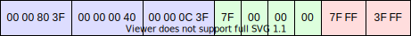

{{APIRef("WebGL")}}_TOK1__

Phương thức **`WebGLRenderingContext.vertexAttribPointer()`** của [WebGL API](/en-US/docs/Web/API/WebGL_API) liên kết bộ đệm hiện được liên kết với `gl.ARRAY_BUFFER` với thuộc tính đỉnh chung của đối tượng bộ đệm đỉnh hiện tại và chỉ định bố cục của nó.

## Cú pháp

```js-nolint
vertexAttribPointer(index, size, type, normalized, stride, offset)
```

### Thông số

- `index`
  - : A {{domxref("WebGL_API/Types", "GLuint")}} chỉ định chỉ mục của thuộc tính đỉnh sẽ được
đã sửa đổi.
- `size`
  - : A {{domxref("WebGL_API/Types", "GLint")}} chỉ định số lượng thành phần trên mỗi thuộc tính đỉnh.
Phải là 1, 2, 3 hoặc 4.
- `type`
  - : A {{domxref("WebGL_API/Types", "GLenum")}} chỉ định kiểu dữ liệu của từng thành phần trong mảng.
Các giá trị có thể:
    - `gl.BYTE`: số nguyên 8 bit có dấu, với các giá trị trong \[-128, 127]
    - `gl.SHORT`: số nguyên 16 bit có dấu, với các giá trị trong \[-32768, 32767]
    - `gl.UNSIGNED_BYTE`: số nguyên 8 bit không dấu, có giá trị trong \[0, 255]
    - `gl.UNSIGNED_SHORT`: số nguyên 16 bit không dấu, có giá trị bằng \[0,65535]
    - `gl.FLOAT`: Số dấu phẩy động IEEE 32 bit

Khi sử dụng {{domxref("WebGL2RenderingContext", "WebGL 2 context", "", 1)}}, các giá trị sau đây cũng có sẵn:
    - `gl.HALF_FLOAT`: Số dấu phẩy động IEEE 16 bit
    - `gl.INT`: Số nguyên nhị phân có dấu 32 bit
    - `gl.UNSIGNED_INT`: Số nguyên nhị phân không dấu 32-bit
    - `gl.INT_2_10_10_10_REV`: Số nguyên có dấu 32 bit có giá trị trong \[-512, 511]
    - `gl.UNSIGNED_INT_2_10_10_10_REV`: Số nguyên không dấu 32 bit có giá trị trong \[0, 1023]

- `normalized`
  - : {{domxref("WebGL_API/Types", "GLboolean")}} chỉ định liệu các giá trị dữ liệu số nguyên có phải là
được chuẩn hóa thành một phạm vi nhất định khi được truyền vào phao.
    - Đối với loại `gl.BYTE` và `gl.SHORT`, chuẩn hóa các giá trị
đến \[-1, 1] nếu đúng.
    - Đối với loại `gl.UNSIGNED_BYTE` và `gl.UNSIGNED_SHORT`,
bình thường hóa các giá trị thành \[0, 1] nếu đúng.
    - Đối với loại `gl.FLOAT` và `gl.HALF_FLOAT`, tham số này
không có tác dụng.

- `stride`
  - : A {{domxref("WebGL_API/Types", "GLsizei")}} chỉ định độ lệch tính bằng byte giữa phần đầu của
thuộc tính đỉnh liên tiếp. Không thể âm hoặc lớn hơn 255. Nếu sải bước bằng 0, thuộc tính được coi là được đóng gói chặt chẽ, nghĩa là các thuộc tính không được xen kẽ mà mỗi thuộc tính nằm trong một khối riêng biệt và thuộc tính của đỉnh tiếp theo sẽ theo sau đỉnh hiện tại.
- `offset`
  - : A {{domxref("WebGL_API/Types", "GLintptr")}} chỉ định phần bù tính bằng byte của thành phần đầu tiên trong
mảng thuộc tính đỉnh. Phải là bội số của độ dài byte của `type`.

### Giá trị trả về

Không có ({{jsxref("undefined")}}).

### Ngoại lệ

- Lỗi `gl.INVALID_VALUE` được đưa ra nếu `stride` hoặc `offset` âm.
- Lỗi `gl.INVALID_OPERATION` sẽ xuất hiện nếu `stride` và
`offset` không phải là bội số của kích thước của kiểu dữ liệu.
- Lỗi `gl.INVALID_OPERATION` được đưa ra nếu không có WebGLBuffer nào bị ràng buộc
mục tiêu ARRAY_BUFFER.
- Khi sử dụng {{domxref("WebGL2RenderingContext", "WebGL 2 context", "", 1)}},
Lỗi `gl.INVALID_OPERATION` được đưa ra nếu thuộc tính đỉnh này được xác định là số nguyên trong trình đổ bóng đỉnh (ví dụ: `uvec4` hoặc `ivec4`, thay vì `vec4`).

## Sự miêu tả

Giả sử chúng ta muốn hiển thị một số hình học 3D và để làm được điều đó, chúng ta sẽ cần cung cấp các đỉnh của mình cho Vertex Shader. Mỗi đỉnh có một vài thuộc tính, như vị trí, vectơ pháp tuyến hoặc tọa độ kết cấu, được xác định trong {{jsxref("ArrayBuffer")}} và sẽ được cung cấp cho Đối tượng bộ đệm Vertex (VBO). Trước tiên, chúng ta cần liên kết {{domxref("WebGLBuffer")}} mà chúng ta muốn sử dụng với `gl.ARRAY_BUFFER`, sau đó, với phương thức này, `gl.vertexAttribPointer()`, chúng ta chỉ định thứ tự các thuộc tính được lưu trữ và loại dữ liệu của chúng. Ngoài ra, chúng ta cần bao gồm bước tiến, là tổng độ dài byte của tất cả các thuộc tính cho một đỉnh. Ngoài ra, chúng ta phải gọi {{domxref("WebGLRenderingContext/enableVertexAttribArray", "gl.enableVertexAttribArray()")}} để thông báo cho WebGL rằng thuộc tính này phải chứa đầy dữ liệu từ bộ đệm mảng của chúng ta.

Thông thường, hình học 3D của bạn đã có định dạng nhị phân nhất định, vì vậy bạn cần đọc thông số kỹ thuật của định dạng cụ thể đó để tìm ra bố cục bộ nhớ. Tuy nhiên, nếu bạn đang tự thiết kế định dạng hoặc hình học của bạn nằm trong tệp văn bản (như [Tệp .obj của Wavefront](https://en.wikipedia.org/wiki/Wavefront_.obj_file)) và phải được chuyển đổi thành `ArrayBuffer` khi chạy, bạn có quyền lựa chọn tự do về cách cấu trúc bộ nhớ. Để có hiệu suất cao nhất, hãy [xen vào](https://en.wikipedia.org/wiki/Interleaved_memory) các thuộc tính và sử dụng loại dữ liệu nhỏ nhất mà vẫn thể hiện chính xác hình học của bạn.

Số lượng thuộc tính đỉnh tối đa tùy thuộc vào card đồ họa và bạn có thể gọi `gl.getParameter(gl.MAX_VERTEX_ATTRIBS)` để nhận giá trị này. Trên card đồ họa cao cấp thì tối đa là 16, trên card đồ họa cấp thấp hơn thì giá trị sẽ thấp hơn.

### Chỉ số thuộc tính

Đối với mỗi thuộc tính, bạn phải chỉ định chỉ mục của nó. Điều này độc lập với vị trí bên trong bộ đệm mảng, do đó các thuộc tính của bạn có thể được gửi theo thứ tự khác với cách chúng được lưu trữ trong bộ đệm mảng. Bạn có hai lựa chọn:

- Hoặc bạn tự chỉ định chỉ mục. Trong trường hợp này, bạn gọi
{{domxref("WebGLRenderingContext.bindAttribLocation()", "gl.bindAttribLocation()")}} để kết nối thuộc tính được đặt tên từ trình đổ bóng đỉnh với chỉ mục bạn muốn sử dụng. Việc này phải được thực hiện trước khi gọi {{domxref("WebGLRenderingContext.linkProgram()", "gl.linkProgram()")}}. Sau đó, bạn có thể cung cấp cùng chỉ mục này cho `gl.vertexAttribPointer()`.
- Ngoài ra, bạn sử dụng chỉ mục được gán bởi card đồ họa khi
biên dịch trình đổ bóng đỉnh. Tùy thuộc vào card đồ họa mà chỉ mục sẽ khác nhau nên bạn phải gọi {{domxref("WebGLRenderingContext.getAttribLocation()", "gl.getAttribLocation()")}} để tìm ra chỉ mục, sau đó cung cấp chỉ mục này cho `gl.vertexAttribPointer()`. Nếu bạn đang sử dụng WebGL 2, bạn có thể tự chỉ định chỉ mục trong mã trình đổ bóng đỉnh và ghi đè giá trị mặc định được cạc đồ họa sử dụng, ví dụ: `layout(location = 3) in vec4 position;` sẽ đặt thuộc tính `"position"` thành chỉ mục 3.

### Thuộc tính số nguyên

Mặc dù `ArrayBuffer` có thể chứa cả số nguyên và số float, nhưng các thuộc tính sẽ luôn được chuyển đổi thành float khi chúng được gửi đến trình đổ bóng đỉnh. Nếu bạn cần sử dụng số nguyên trong mã trình đổ bóng đỉnh của mình, bạn có thể truyền số float trở lại số nguyên trong trình đổ bóng đỉnh (ví dụ: `(int) floatNumber`) hoặc sử dụng {{domxref("WebGL2RenderingContext.vertexAttribIPointer()", "gl.vertexAttribIPointer()")}} từ WebGL2.

### Giá trị thuộc tính mặc định

Mã trình đổ bóng đỉnh có thể bao gồm một số thuộc tính nhưng chúng ta không cần chỉ định giá trị cho từng thuộc tính. Thay vào đó, chúng ta có thể cung cấp một giá trị mặc định giống hệt nhau cho tất cả các đỉnh. Chúng ta có thể gọi {{domxref("WebGLRenderingContext.disableVertexAttribArray()", "gl.disableVertexAttribArray()")}} để yêu cầu WebGL sử dụng giá trị mặc định, trong khi gọi {{domxref("WebGLRenderingContext.enableVertexAttribArray()", "gl.enableVertexAttribArray()")}} sẽ đọc các giá trị từ bộ đệm mảng như được chỉ định bằng `gl.vertexAttribPointer()`.

Tương tự, nếu trình đổ bóng đỉnh của chúng tôi mong đợi một thuộc tính 4 thành phần có `vec4` nhưng trong lệnh gọi `gl.vertexAttribPointer()`, chúng tôi đặt `size` thành `2`, thì WebGL sẽ đặt hai thành phần đầu tiên dựa trên bộ đệm mảng, trong khi thành phần thứ ba và thứ tư được lấy từ giá trị mặc định.

Giá trị mặc định là `vec4(0.0, 0.0, 0.0, 1.0)` theo mặc định nhưng chúng ta có thể chỉ định giá trị mặc định khác bằng {{domxref("WebGLRenderingContext.vertexAttrib()", "gl.vertexAttrib[1234]f[v]()")}}.

Ví dụ: trình đổ bóng đỉnh của bạn có thể đang sử dụng thuộc tính vị trí và màu sắc. Hầu hết các mắt lưới đều có màu được chỉ định ở cấp độ trên mỗi đỉnh, nhưng một số mắt lưới có màu đồng nhất. Đối với những mắt lưới đó, không cần thiết phải đặt cùng một màu cho mỗi đỉnh vào bộ đệm mảng, vì vậy bạn sử dụng `gl.vertexAttrib4fv()` để đặt màu không đổi.

### Truy vấn cài đặt hiện tại

Bạn có thể gọi {{domxref("WebGLRenderingContext.getVertexAttrib()", "gl.getVertexAttrib()")}} và {{domxref("WebGLRenderingContext.getVertexAttribOffset()", "gl.getVertexAttribOffset()")}} để nhận các tham số hiện tại cho một thuộc tính, ví dụ: loại dữ liệu hoặc thuộc tính có nên được chuẩn hóa hay không. Hãy nhớ rằng các hàm WebGL này có hiệu suất chậm và tốt hơn là bạn nên lưu trữ trạng thái bên trong ứng dụng JavaScript của mình. Tuy nhiên, những hàm này rất hữu ích để gỡ lỗi ngữ cảnh WebGL mà không cần chạm vào mã ứng dụng.

## Ví dụ

Ví dụ này cho thấy cách gửi các thuộc tính đỉnh của bạn đến chương trình đổ bóng. Chúng tôi sử dụng cấu trúc dữ liệu tưởng tượng trong đó các thuộc tính của mỗi đỉnh được lưu trữ xen kẽ với độ dài 20 byte trên mỗi đỉnh:

1. **vị trí:** Chúng ta cần lưu trữ tọa độ X, Y và Z. Để có độ chính xác cao nhất, chúng tôi sử dụng số float 32 bit; tổng cộng điều này sử dụng 12 byte. 2. **vectơ chuẩn:** Chúng ta cần lưu trữ các thành phần X, Y và Z của vectơ chuẩn, nhưng vì độ chính xác không quan trọng lắm nên chúng ta sử dụng số nguyên có dấu 8 bit. Để có hiệu suất tốt hơn, chúng tôi căn chỉnh dữ liệu thành 32 bit bằng cách lưu trữ thành phần có giá trị 0 thứ tư, nâng tổng kích thước lên 4 byte. Ngoài ra, chúng tôi yêu cầu WebGL bình thường hóa các giá trị vì các giá trị chuẩn của chúng tôi luôn nằm trong phạm vi \[-1, 1]. 3. **tọa độ kết cấu:** Chúng ta cần lưu trữ tọa độ U và V; đối với số nguyên không dấu 16 bit này cung cấp đủ độ chính xác, tổng kích thước là 4 byte. Chúng tôi cũng yêu cầu WebGL chuẩn hóa các giá trị thành \[0, 1].

Ví dụ: đỉnh sau:

```json
{
  "position": [1.0, 2.0, 1.5],
  "normal": [1.0, 0.0, 0.0],
  "texCoord": [0.5, 0.25]
}
```

Sẽ được lưu trữ trong bộ đệm mảng như sau:



### Tạo bộ đệm mảng

Đầu tiên, chúng tôi tạo động bộ đệm mảng từ dữ liệu JSON bằng {{jsxref("DataView")}}. Lưu ý việc sử dụng `true` vì WebGL mong đợi dữ liệu của chúng tôi ở dạng endian nhỏ.

```js
// Load geometry with fetch() and Response.json()
const response = await fetch("assets/geometry.json");
const vertices = await response.json();

// Create array buffer
const buffer = new ArrayBuffer(20 * vertices.length);
// Fill array buffer
const dv = new DataView(buffer);
vertices.forEach((vertex, i) => {
  dv.setFloat32(20 * i, vertex.position[0], true);
  dv.setFloat32(20 * i + 4, vertex.position[1], true);
  dv.setFloat32(20 * i + 8, vertex.position[2], true);
  dv.setInt8(20 * i + 12, vertex.normal[0] * 0x7f);
  dv.setInt8(20 * i + 13, vertex.normal[1] * 0x7f);
  dv.setInt8(20 * i + 14, vertex.normal[2] * 0x7f);
  dv.setInt8(20 * i + 15, 0);
  dv.setUint16(20 * i + 16, vertex.texCoord[0] * 0xffff, true);
  dv.setUint16(20 * i + 18, vertex.texCoord[1] * 0xffff, true);
});
```

Để có hiệu suất cao hơn, chúng tôi cũng có thể thực hiện chuyển đổi JSON sang ArrayBuffer trước đó ở phía máy chủ, ví dụ: với Node.js. Sau đó, chúng ta có thể tải tệp nhị phân và diễn giải nó dưới dạng bộ đệm mảng:

```js
const response = await fetch("assets/geometry.bin");
const buffer = await response.arrayBuffer();
```

### Sử dụng bộ đệm mảng với WebGL

Đầu tiên, chúng tôi tạo một Đối tượng bộ đệm Vertex (VBO) mới và cung cấp cho nó bộ đệm mảng của chúng tôi:

```js
// Bind array buffer to a Vertex Buffer Object
const vbo = gl.createBuffer();
gl.bindBuffer(gl.ARRAY_BUFFER, vbo);
gl.bufferData(gl.ARRAY_BUFFER, buffer, gl.STATIC_DRAW);
```

Sau đó, chúng tôi chỉ định bố cục bộ nhớ của bộ đệm mảng bằng cách tự đặt chỉ mục:

```js
// Describe the layout of the buffer:
// 1. position, not normalized
gl.vertexAttribPointer(0, 3, gl.FLOAT, false, 20, 0);
gl.enableVertexAttribArray(0);
// 2. normal vector, normalized to [-1, 1]
gl.vertexAttribPointer(1, 4, gl.BYTE, true, 20, 12);
gl.enableVertexAttribArray(1);
// 3. texture coordinates, normalized to [0, 1]
gl.vertexAttribPointer(2, 2, gl.UNSIGNED_SHORT, true, 20, 16);
gl.enableVertexAttribArray(2);

// Set the attributes in the vertex shader to the same indices
gl.bindAttribLocation(shaderProgram, 0, "position");
gl.bindAttribLocation(shaderProgram, 1, "normal");
gl.bindAttribLocation(shaderProgram, 2, "texUV");
// Since the attribute indices have changed, we must re-link the shader
// Note that this will reset all uniforms that were previously set.
gl.linkProgram(shaderProgram);
```

Hoặc chúng ta có thể sử dụng chỉ mục do card đồ họa cung cấp thay vì tự thiết lập chỉ mục; điều này tránh việc liên kết lại chương trình đổ bóng.

```js
const locPosition = gl.getAttribLocation(shaderProgram, "position");
gl.vertexAttribPointer(locPosition, 3, gl.FLOAT, false, 20, 0);
gl.enableVertexAttribArray(locPosition);

const locNormal = gl.getAttribLocation(shaderProgram, "normal");
gl.vertexAttribPointer(locNormal, 4, gl.BYTE, true, 20, 12);
gl.enableVertexAttribArray(locNormal);

const locTexUV = gl.getAttribLocation(shaderProgram, "texUV");
gl.vertexAttribPointer(locTexUV, 2, gl.UNSIGNED_SHORT, true, 20, 16);
gl.enableVertexAttribArray(locTexUV);
```

## Thông số kỹ thuật

{{Specifications}}

## Khả năng tương thích của trình duyệt

{{Compat}}

## Xem thêm

- [Đặc điểm kỹ thuật đỉnh](https://wikis.khronos.org/opengl/Vertex_Specification) trên wiki OpenGL
- {{domxref("WebGL2RenderingContext.vertexAttribIPointer()")}}
