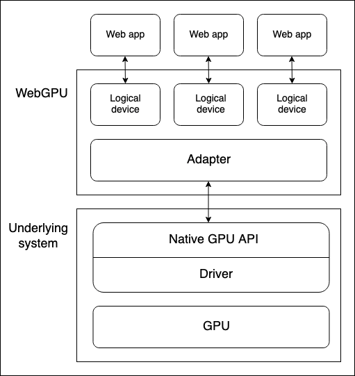

{{DefaultAPISidebar("WebGPU API")}}{{securecontext_header}}

**WebGPU API** cho phép các nhà phát triển web sử dụng GPU (Graphics Processing Unit) của hệ thống bên dưới để thực hiện các phép tính hiệu năng cao và vẽ các hình ảnh phức tạp có thể hiển thị trong trình duyệt.

WebGPU là phiên bản kế nhiệm của {{domxref("WebGL_API", "WebGL", "", "nocode")}}, mang lại khả năng tương thích tốt hơn với các GPU hiện đại, hỗ trợ tính toán GPU đa mục đích, thao tác nhanh hơn, và truy cập vào nhiều tính năng GPU nâng cao hơn.

## Khái niệm và cách dùng

Có thể nói {{domxref("WebGL_API", "WebGL", "", "nocode")}} đã tạo ra bước ngoặt cho web về mặt khả năng đồ họa khi lần đầu xuất hiện vào khoảng năm 2011. WebGL là một bản chuyển đổi sang JavaScript của thư viện đồ họa [OpenGL ES 2.0](https://registry.khronos.org/OpenGL-Refpages/es2.0/), cho phép các trang web gửi trực tiếp các phép tính kết xuất tới GPU của thiết bị để xử lý ở tốc độ rất cao, rồi hiển thị kết quả bên trong một phần tử {{htmlelement("canvas")}}.

WebGL và ngôn ngữ [GLSL](<https://wikis.khronos.org/opengl/Core_Language_(GLSL)>) dùng để viết shader cho WebGL khá phức tạp, nên đã có nhiều thư viện WebGL được tạo ra để việc viết ứng dụng WebGL dễ hơn. Các ví dụ phổ biến gồm [Three.js](https://threejs.org/), [Babylon.js](https://www.babylonjs.com/), và [PlayCanvas](https://playcanvas.com/). Các nhà phát triển đã dùng những công cụ này để xây dựng trò chơi 3D nhập vai trên web, video âm nhạc, công cụ huấn luyện và mô hình hóa, trải nghiệm VR và AR, cùng nhiều thứ khác.

Tuy nhiên, WebGL có một số vấn đề nền tảng cần được giải quyết:

- Kể từ khi WebGL ra mắt, một thế hệ mới của các API GPU gốc đã xuất hiện - phổ biến nhất là [Direct3D 12 của Microsoft](https://learn.microsoft.com/en-us/windows/win32/direct3d12/direct3d-12-graphics), [Metal của Apple](https://developer.apple.com/metal/), và [Vulkan của The Khronos Group](https://www.vulkan.org/) - mang lại rất nhiều tính năng mới. Không còn bản cập nhật nào được lên kế hoạch cho OpenGL (và vì thế là WebGL), nên nó sẽ không nhận được các tính năng mới đó. Ngược lại, WebGPU sẽ tiếp tục được bổ sung tính năng trong tương lai.
- WebGL hoàn toàn xoay quanh trường hợp sử dụng vẽ đồ họa và kết xuất chúng lên canvas. Nó không xử lý tốt các phép tính GPGPU (general-purpose GPU). Các phép tính GPGPU ngày càng trở nên quan trọng hơn cho nhiều trường hợp sử dụng khác nhau, ví dụ như những trường hợp dựa trên mô hình máy học.
- Ứng dụng đồ họa 3D ngày càng đòi hỏi cao hơn, cả về số lượng đối tượng cần được hiển thị đồng thời lẫn việc sử dụng các tính năng kết xuất mới.

WebGPU giải quyết những vấn đề này bằng một kiến trúc đa mục đích hiện đại, tương thích với các API GPU hiện đại, và mang cảm giác "web" hơn. Nó hỗ trợ kết xuất đồ họa, nhưng cũng có hỗ trợ hạng nhất cho các phép tính GPGPU. Việc kết xuất từng đối tượng riêng lẻ rẻ hơn đáng kể ở phía CPU, và nó hỗ trợ các tính năng kết xuất GPU hiện đại như hạt dựa trên compute và các bộ lọc hậu xử lý như hiệu ứng màu sắc, làm sắc nét, và mô phỏng độ sâu trường ảnh. Ngoài ra, nó có thể xử lý các phép tính tốn kém như culling và biến đổi mô hình có xương trực tiếp trên GPU.

## Mô hình tổng quát

Có nhiều lớp trừu tượng giữa GPU của thiết bị và trình duyệt web đang chạy WebGPU API. Sẽ hữu ích nếu hiểu chúng khi bạn bắt đầu học WebGPU:



- Các thiết bị vật lý có GPU. Hầu hết thiết bị chỉ có một GPU, nhưng một số có nhiều hơn một. Có nhiều loại GPU khác nhau:
  - GPU tích hợp, nằm trên cùng bo mạch với CPU và dùng chung bộ nhớ với CPU.
  - GPU rời, nằm trên bo mạch riêng, tách biệt với CPU.
  - "GPU" phần mềm, được triển khai trên CPU.

  > [!NOTE]
  > Sơ đồ trên giả định một thiết bị chỉ có một GPU.

- Một API GPU gốc, là một phần của hệ điều hành (ví dụ: Metal trên macOS), là một giao diện lập trình cho phép ứng dụng gốc sử dụng các khả năng của GPU. Các lệnh API được gửi tới GPU (và phản hồi được nhận về) thông qua driver. Một hệ thống có thể có nhiều API hệ điều hành gốc và driver khác nhau để giao tiếp với GPU, mặc dù sơ đồ ở trên giả định một thiết bị chỉ có một API/driver gốc.
- Việc triển khai WebGPU của trình duyệt xử lý giao tiếp với GPU thông qua một driver API GPU gốc. Một adapter WebGPU về cơ bản đại diện cho một GPU vật lý và driver sẵn có trên hệ thống nền bên dưới, trong mã của bạn.
- Một logical device là một lớp trừu tượng mà qua đó một ứng dụng web đơn lẻ có thể truy cập khả năng GPU theo cách được phân vùng. Logical device là cần thiết để cung cấp khả năng đa nhiệm multiplexing. GPU của một thiết bị vật lý được nhiều ứng dụng và tiến trình dùng đồng thời, bao gồm có thể là nhiều ứng dụng web. Mỗi ứng dụng web cần có thể truy cập WebGPU một cách độc lập vì lý do bảo mật và logic.

## Truy cập thiết bị

Một logical device - được đại diện bởi một thực thể {{domxref("GPUDevice")}} - là nền tảng để một ứng dụng web truy cập toàn bộ chức năng WebGPU. Việc truy cập thiết bị được thực hiện như sau:

1. Thuộc tính {{domxref("Navigator.gpu")}} (hoặc {{domxref("WorkerNavigator.gpu")}} nếu bạn dùng chức năng WebGPU bên trong worker) trả về đối tượng {{domxref("GPU")}} cho ngữ cảnh hiện tại.
2. Bạn truy cập một adapter thông qua phương thức {{domxref("GPU.requestAdapter", "GPU.requestAdapter()")}}. Phương thức này nhận một đối tượng thiết lập tùy chọn cho phép bạn yêu cầu, ví dụ, adapter hiệu năng cao hoặc tiết kiệm năng lượng. Nếu không cung cấp, thiết bị sẽ cấp quyền truy cập vào adapter mặc định, đủ tốt cho hầu hết mục đích.
3. Có thể yêu cầu một device thông qua {{domxref("GPUAdapter.requestDevice()")}}. Phương thức này cũng nhận một đối tượng tùy chọn (được gọi là descriptor), có thể dùng để chỉ định chính xác các tính năng và giới hạn mà bạn muốn logical device có. Nếu không cung cấp, device được cấp sẽ có một cấu hình đa mục đích hợp lý, đủ tốt cho hầu hết mục đích.

Kết hợp điều này với một số kiểm tra phát hiện tính năng, quá trình trên có thể được thực hiện như sau:

```js
async function init() {
  if (!navigator.gpu) {
    throw Error("WebGPU not supported.");
  }

  let adapter;
  try {
    adapter = await navigator.gpu.requestAdapter();
  } catch (error) {
    console.error(error);
  }
  if (!adapter) {
    throw Error("Couldn't request WebGPU adapter.");
  }

  const device = await adapter.requestDevice();
  // …
}
```

## Tạo shader

Mã chương trình shader trong WebGPU được viết bằng WGSL (WebGPU Shading Language). Mã shader có thể được chèn vào tài liệu dưới dạng một template literal và sau đó được truyền tới WebGPU để biên dịch, như trong ví dụ này:

```js
const shaders = `
struct VertexOut {
  @builtin(position) position: vec4f,
  @location(0) color : vec4f
}

@vertex
fn vertex_main(@location(0) position: vec4f,
               @location(1) color: vec4f) -> VertexOut
{
  var output : VertexOut;
  output.position = position;
  output.color = color;
  return output;
}

@fragment
fn fragment_main(fragData: VertexOut) -> @location(0) vec4f
{
  return fragData.color;
}
`;
```

> [!NOTE]
> Trong các demo của chúng tôi, mã shader được lưu trong một template literal, nhưng bạn có thể lưu nó ở bất kỳ đâu miễn là có thể dễ dàng truy xuất dưới dạng text để đưa vào chương trình WebGPU. Ví dụ, một thực hành phổ biến khác là lưu shader bên trong một phần tử {{htmlelement("script")}} và lấy nội dung bằng {{domxref("Node.textContent")}}. MIME type đúng để dùng cho WGSL là `text/wgsl`.

Để làm cho mã shader sẵn dùng cho WebGPU, bạn phải đặt nó vào một {{domxref("GPUShaderModule")}} thông qua lệnh gọi {{domxref("GPUDevice.createShaderModule()")}}, truyền mã shader của bạn dưới dạng một thuộc tính trong đối tượng descriptor. Ví dụ:

```js
const shaderModule = device.createShaderModule({
  code: shaders,
});
```

### Lấy và cấu hình canvas context

Trong một render pipeline, chúng ta cần chỉ định nơi để kết xuất đồ họa. Trong trường hợp này, chúng ta lấy tham chiếu đến một phần tử `<canvas>` hiển thị trên màn hình rồi gọi {{domxref("HTMLCanvasElement.getContext()")}} với tham số `webgpu` để trả về GPU context của nó, tức một thực thể {{domxref("GPUCanvasContext")}}.

Từ đó, chúng ta cấu hình context bằng lệnh gọi {{domxref("GPUCanvasContext.configure()")}}, truyền vào một đối tượng tùy chọn chứa {{domxref("GPUDevice")}} mà thông tin kết xuất sẽ đến từ đó, định dạng mà textures sẽ có, và alpha mode cần dùng khi kết xuất các texture bán trong suốt.

```js
const canvas = document.querySelector("#gpuCanvas");
const context = canvas.getContext("webgpu");

context.configure({
  device,
  format: navigator.gpu.getPreferredCanvasFormat(),
  alphaMode: "premultiplied",
});
```

> [!NOTE]
> Thực hành tốt nhất để xác định texture format là dùng phương thức {{domxref("GPU.getPreferredCanvasFormat()")}}; phương thức này chọn định dạng hiệu quả nhất (hoặc `bgra8unorm` hoặc `rgba8unorm`) cho thiết bị của người dùng.

### Tạo một buffer và ghi dữ liệu tam giác của chúng ta vào đó

Tiếp theo chúng ta sẽ cung cấp cho chương trình WebGPU dữ liệu của mình ở dạng mà nó có thể dùng. Dữ liệu ban đầu được cung cấp trong một {{jsxref("Float32Array")}}, chứa 8 điểm dữ liệu cho mỗi đỉnh tam giác - X, Y, Z, W cho vị trí, và R, G, B, A cho màu.

```js
const vertices = new Float32Array([
  0.0, 0.6, 0, 1, 1, 0, 0, 1, -0.5, -0.6, 0, 1, 0, 1, 0, 1, 0.5, -0.6, 0, 1, 0,
  0, 1, 1,
]);
```

Tuy nhiên, ở đây có một vấn đề. Chúng ta cần đưa dữ liệu vào một {{domxref("GPUBuffer")}}. Về mặt bên trong, kiểu buffer này được lưu trong bộ nhớ gắn rất chặt với các lõi của GPU để cho phép xử lý hiệu năng cao như mong muốn. Do đó, bộ nhớ này không thể được truy cập bởi các tiến trình đang chạy trên hệ thống host, như trình duyệt.

{{domxref("GPUBuffer")}} được tạo thông qua lệnh gọi {{domxref("GPUDevice.createBuffer()")}}. Chúng ta cho nó một kích thước bằng độ dài của mảng `vertices` để nó có thể chứa toàn bộ dữ liệu, cùng các cờ sử dụng `VERTEX` và `COPY_DST` để chỉ ra rằng buffer sẽ được dùng như một vertex buffer và là đích của các thao tác sao chép.

```js
const vertexBuffer = device.createBuffer({
  size: vertices.byteLength, // đủ lớn để lưu các vertex
  usage: GPUBufferUsage.VERTEX | GPUBufferUsage.COPY_DST,
});
```

Chúng ta có thể đưa dữ liệu vào `GPUBuffer` bằng một thao tác mapping, như trong ví dụ [compute pipeline example](#basic_compute_pipeline) để đọc dữ liệu từ GPU trở lại JavaScript. Tuy nhiên, trong trường hợp này chúng ta sẽ dùng phương thức tiện lợi {{domxref("GPUQueue.writeBuffer()")}}, nhận tham số là buffer cần ghi tới, nguồn dữ liệu cần ghi từ đâu, giá trị offset cho mỗi bên, và kích thước dữ liệu cần ghi (chúng ta đã chỉ định toàn bộ độ dài của mảng). Trình duyệt sau đó sẽ tự xác định cách xử lý việc ghi dữ liệu hiệu quả nhất.

```js
device.queue.writeBuffer(vertexBuffer, 0, vertices, 0, vertices.length);
```

### Định nghĩa và tạo render pipeline

Bây giờ chúng ta đã đưa dữ liệu vào buffer, phần tiếp theo của quá trình thiết lập là thực sự tạo pipeline, sẵn sàng để dùng cho việc kết xuất.

Trước hết, chúng ta tạo một đối tượng mô tả bố cục cần thiết của dữ liệu vertex. Nó mô tả chính xác những gì chúng ta đã thấy trước đó trong mảng `vertices` và giai đoạn vertex shader - mỗi vertex có dữ liệu vị trí và màu. Cả hai đều được định dạng ở kiểu `float32x4` (ánh xạ sang kiểu WGSL `vec4<f32>`), và dữ liệu màu bắt đầu tại offset 16 byte trong mỗi vertex. `arrayStride` chỉ ra stride, tức số byte tạo thành mỗi vertex, và `stepMode` chỉ ra rằng dữ liệu nên được lấy theo từng vertex.

```js
const vertexBuffers = [
  {
    attributes: [
      {
        shaderLocation: 0, // position
        offset: 0,
        format: "float32x4",
      },
      {
        shaderLocation: 1, // color
        offset: 16,
        format: "float32x4",
      },
    ],
    arrayStride: 32,
    stepMode: "vertex",
  },
];
```

Tiếp theo, chúng ta tạo một đối tượng descriptor chỉ định cấu hình cho các giai đoạn của render pipeline. Với cả hai giai đoạn shader, chúng ta chỉ định {{domxref("GPUShaderModule")}} chứa đoạn mã liên quan (`shaderModule`), và tên hàm đóng vai trò điểm vào cho mỗi giai đoạn.

Ngoài ra, với giai đoạn vertex shader chúng ta cung cấp đối tượng `vertexBuffers` để mô tả trạng thái dữ liệu vertex mong đợi. Còn với giai đoạn fragment shader, chúng ta cung cấp một mảng các color target state chỉ ra định dạng kết xuất được chỉ định (định dạng này khớp với định dạng đã được chỉ định trong cấu hình canvas context trước đó).

Chúng ta cũng chỉ định một đối tượng `primitive`, mà trong trường hợp này chỉ nêu kiểu primitive sẽ vẽ, và một `layout` là `auto`. Thuộc tính `layout` định nghĩa bố cục (cấu trúc, mục đích, và loại) của tất cả tài nguyên GPU (buffer, texture, v.v.) được dùng trong quá trình thực thi pipeline. Với các ứng dụng phức tạp hơn, điều này sẽ có dạng một đối tượng {{domxref("GPUPipelineLayout")}}, được tạo bằng {{domxref("GPUDevice.createPipelineLayout()")}} (bạn có thể xem ví dụ trong [Basic compute pipeline](#basic_compute_pipeline)), cho phép GPU xác định cách chạy pipeline hiệu quả nhất trước thời gian. Tuy nhiên, ở đây chúng ta chỉ định giá trị `auto`, khiến pipeline tạo ra một bind group layout ngầm định dựa trên mọi binding được định nghĩa trong mã shader.

```js
const pipelineDescriptor = {
  vertex: {
    module: shaderModule,
    entryPoint: "vertex_main",
    buffers: vertexBuffers,
  },
  fragment: {
    module: shaderModule,
    entryPoint: "fragment_main",
```
