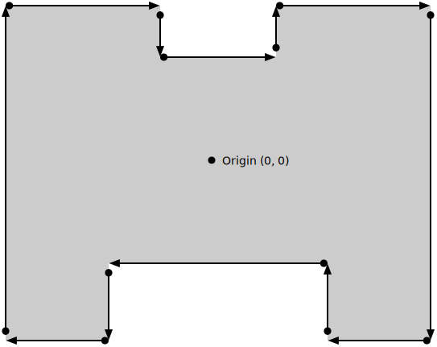

{{DefaultAPISidebar("WebXR Device API")}}

Trong số các không gian tham chiếu khác nhau có sẵn trong bộ WebXR của API, không gian tham chiếu **`bounded-floor`** có phần độc đáo. Nó không chỉ được đại diện bởi một lớp con duy nhất, {{domxref("XRBoundedReferenceSpace")}}, mà còn là lớp duy nhất hạn chế chuyển động không dựa trên những hạn chế ảo mà dựa trên những hạn chế do thế giới thực áp đặt. Bài viết này xem xét các không gian tham chiếu bị chặn được biểu diễn bởi `XRBoundedReferenceSpace`, mô tả chúng là gì và chúng được sử dụng như thế nào.

Có nhiều cách sử dụng không gian tham chiếu giới hạn, bao gồm các dự án như xưởng vẽ ảo hoặc hệ thống xây dựng, mô hình hóa hoặc điêu khắc 3D; mô phỏng đào tạo hoặc kịch bản bài học; khiêu vũ hoặc các trò chơi dựa trên biểu diễn khác; hoặc xem trước các vật thể 3D trong thế giới thực bằng cách sử dụng thực tế tăng cường.

## Giới thiệu

Không gian tham chiếu giới hạn là không gian đại diện cho môi trường XR trong đó người dùng có thể di chuyển xung quanh trong thế giới thực trong khi được phần cứng XR theo dõi, sau đó chuyển động của họ sẽ được chuyển sang mô phỏng. Sau đó, các ranh giới được thiết lập bởi không gian tham chiếu giới hạn thể hiện các cạnh của không gian được theo dõi, có thể đi qua một cách an toàn trong môi trường thế giới thực của người dùng có sẵn cho chuyển động của họ trong khi mô phỏng.

### Yêu cầu

Bởi vì không gian tham chiếu giới hạn thiết lập một khu vực giới hạn mà người dùng có thể di chuyển, nên nó tự nhiên áp đặt giới hạn về mức độ lớn của môi trường mô phỏng. Thật khó (và có thể khá khó hiểu) để tạo ra một thế giới ảo lớn hơn không gian vật lý có sẵn cho người dùng nếu bạn ánh xạ chuyển động trong thế giới thực của họ vào môi trường ảo. Hãy tưởng tượng bạn sẽ cảm thấy khó chịu như thế nào nếu mỗi lần bạn bước một bước, bạn phải di chuyển 100 mét!

Khi đó, các yêu cầu đối với một không gian tham chiếu bị chặn là:

- Phần cứng XR có thể theo dõi chuyển động của người dùng trong thế giới thực, chẳng hạn như hệ thống dựa trên camera.
- Một không gian vật lý có đủ chỗ để di chuyển an toàn.

### Khái niệm cơ bản

Kiểu không gian tham chiếu của tất cả các không gian tham chiếu bị chặn là `bounded-floor`. Đây là loại không gian tham chiếu giới hạn duy nhất hiện có; ở tất cả những người khác, nếu bạn cần ranh giới, bạn sẽ phải tự mình quản lý chúng.

Bởi vì `bounded-floor` là một không gian tham chiếu giới hạn theo tầng, người dùng bắt đầu từ tầng của không gian, điều này hợp lý nếu xét đến những hàm ý trong thế giới thực. Do đó, gốc tọa độ của không gian tham chiếu bị chặn luôn đặt mặt phẳng Y=0 ở mức sàn. Sau đó, ranh giới được xác định bằng cách sử dụng một mảng tọa độ 2D, chỉ xác định thành phần X và Z vì Y luôn bằng 0. Những điểm này đi quanh phòng theo chiều kim đồng hồ.

Lưu ý rằng nếu nền tảng cơ bản xác định điểm gốc và ranh giới quy mô phòng cố định, thì nó có thể khởi tạo bất kỳ giá trị chưa được khởi tạo nào để khớp với thông tin được xác định trước đó; đây không phải là hành vi bất ngờ đối với người dùng các nền tảng này.

Không gian bên trong ranh giới khi đó là khu vực di chuyển an toàn của người dùng, trong đó họ được theo dõi và chuyển động của họ được sao chép vào thế giới ảo. Mặc dù hệ thống XR của người dùng có thể cung cấp khả năng phát hiện và bảo vệ tự động khỏi việc thoát khỏi khu vực an toàn, nhưng bạn nên tự mình xử lý vấn đề này, theo dõi các va chạm giữa vị trí của người dùng và ranh giới của thế giới, đồng thời cung cấp hướng dẫn để quay trở lại điểm xuất phát hoặc ít nhất là ở trong vùng an toàn.

Phần cứng XR không có ranh giới vốn có được xác định có thể hỗ trợ hoặc không hỗ trợ không gian tham chiếu bị chặn. Nếu đúng như vậy, nó có thể có sẵn một hệ thống để cho phép người dùng chỉ định hoặc chọn các ranh giới để áp dụng nếu sử dụng không gian giới hạn. Tuy nhiên, hoàn toàn có khả năng thiết bị sẽ từ chối hỗ trợ các không gian giới hạn, vì vậy bạn nên chuẩn bị quay lại một số loại không gian tham chiếu khác.

## Hiểu ranh giới

Như đã đề cập trước đó, ranh giới được xác định là một mảng các điểm nằm ở mức sàn, mỗi điểm xác định một góc của khu vực ranh giới, đi xung quanh điểm gốc theo chiều kim đồng hồ. Điều này được thể hiện trong sơ đồ dưới đây.



Sơ đồ này xác định ranh giới của căn phòng có gốc ở trung tâm, theo yêu cầu và một tập hợp gồm 12 điểm đại diện cho các đỉnh của không gian vật lý có sẵn. Có hai khu vực được cắt rời trong phòng, có thể tượng trưng cho một chiếc ghế dài, ghế sofa hoặc ghế dài phía sau người dùng và một giá đỡ hoặc bàn đặt máy tính hoặc phần cứng khác. Như điều này gợi ý, vùng an toàn không bắt buộc phải lồi, nhưng có thể có bất kỳ số vết lõm hoặc nhô ra nào, miễn là nó là hình liền kề,

Lưu ý rằng tọa độ gốc ở đây, (0, 0), biểu thị thực tế rằng ranh giới được xác định ở mức sàn và về cơ bản là hình dạng 2D trên sàn, giống như một hàng rào vô hình được sử dụng để ngăn thú cưng rời khỏi nhà. Tọa độ đầy đủ ở đây sẽ là (0, 0, 0).

Ranh giới này được duy trì trong {{domxref("XRBoundedReferenceSpace")}} trong thuộc tính {{domxref("XRBoundedReferenceSpace")}} {{domxref("XRBoundedReferenceSpace.boundsGeometry", "boundsGeometry")}}. Thuộc tính này chứa một mảng các đối tượng {{domxref("DOMPointReadOnly")}}, mỗi đối tượng xác định một trong các điểm tạo nên đường viền của không gian, di chuyển quanh phòng theo thứ tự chiều kim đồng hồ. Mỗi đỉnh trong mảng có tọa độ `y` bằng 0 do toàn bộ ranh giới được xác định ở mức sàn, kéo dài lên tới trần nhà hoặc vô tận. `w` của mỗi điểm cũng luôn bằng 1.

Phần bên trong của khu vực giới hạn luôn được coi là ở _bên phải_ của ranh giới. Bằng cách liệt kê các điểm theo thứ tự chiều kim đồng hồ, ranh giới được đặt bên trong hình đã xác định. Nếu các điểm được liệt kê ngược chiều kim đồng hồ, điều đó cho thấy vùng an toàn nằm _ngoài_ ranh giới, có thể dẫn đến kết quả không mong muốn.

Bạn nên cân nhắc việc bao gồm việc kiểm tra chủ động đối với người dùng đang tiếp cận ranh giới. Điều này hữu ích cho cả sự an toàn của họ (trong trường hợp ranh giới đại diện cho một trở ngại vật lý nào đó) và để tránh các điều kiện có thể xảy ra làm giảm độ chính xác ở gần các ranh giới. Nó cũng hữu ích vì người dùng có thể mải mê chơi trò chơi hoặc hoạt động khác mà không nhận ra rằng họ đang tiến gần đến ranh giới và có thể trở nên bối rối hoặc đau khổ nếu họ đi ra khỏi phạm vi theo dõi (đặc biệt nếu làm như vậy khiến họ thua trò chơi).

Giải pháp đơn giản nhất là chỉ xử lý từng phân đoạn ranh giới như thể nó là một đối tượng để kiểm tra. Khi người dùng tiến gần đến ranh giới, bạn có thể cảnh báo họ bằng cách hiển thị thông báo, nhấp nháy chỉ báo cảnh báo, phát cảnh báo âm thanh hoặc tương tự. Và nếu người dùng thực sự va chạm với ranh giới, đừng để họ tiếp tục vượt qua ranh giới đó.

## Tạo một không gian tham chiếu giới hạn

Trước khi tạo dự án dựa trên không gian tham chiếu giới hạn, điều quan trọng cần lưu ý là không phải tất cả thiết bị XR đều có khả năng tạo chúng. Về bản chất, các không gian tham chiếu giới hạn có các yêu cầu phần cứng đặc biệt, vì chúng cần cho phép người dùng di chuyển vật lý trong không gian trong khi chuyển động của họ được theo dõi. Trong phần này, chúng ta sẽ xem xét cách tạo một phiên hoạt động một cách an toàn cho dù không gian giới hạn có được hỗ trợ hay không.

### Tạo một không gian ưu tiên có giới hạn một cách an toàn

Trước khi thực sự cố gắng tạo một không gian tham chiếu giới hạn, bạn cần tạo một phiên hỗ trợ chúng. Vì không phải tất cả phần cứng đều hỗ trợ các không gian tham chiếu giới hạn nên bạn phải đảm bảo hỗ trợ các không gian tham chiếu giới hạn dưới dạng tùy chọn thay vì như một tính năng bắt buộc trừ khi bạn có kiến ​​thức đặc biệt về môi trường mà mã của bạn sẽ chạy. Bạn có thể tạo một phiên hỗ trợ không gian tham chiếu `bounded-floor` nếu có bằng cách sử dụng mã như sau:

```js
async function onActivateXRButton(event) {
  if (!xrSession) {
    navigator.xr
      .requestSession("immersive-vr", {
        requiredFeatures: ["local-floor"],
        optionalFeatures: ["bounded-floor"],
      })
      .then((session) => {
        xrSession = session;
        startSessionAnimation();
      });
  }
}
```

Chức năng này, được gọi khi người dùng nhấp vào nút để bắt đầu trải nghiệm XR, hoạt động như bình thường, thoát ngay lập tức nếu đã có phiên, sau đó yêu cầu phiên mới sử dụng chế độ `immersive-vr`. Các tùy chọn được chỉ định khi yêu cầu phiên chỉ ra rằng ở mức tối thiểu, phiên phải tương thích với không gian tham chiếu `local-floor`, nhưng sẽ tốt hơn nếu không gian `bounded-floor` cũng được hỗ trợ.

Khi phiên đã được tạo, hàm `startSessionAnimation()` của chúng ta có thể cố gắng thiết lập một không gian tham chiếu `bounded-floor`, và nếu không thực hiện được thì nó có thể quay lại yêu cầu một không gian tham chiếu `local-floor` (trong đó chúng ta sẽ phải tự mình xử lý các ranh giới).

Bằng cách này, phiên của chúng tôi sẽ bắt đầu bất kể nền tảng của người dùng có thể cung cấp không gian tham chiếu bị giới hạn hay không.

### Tạo không gian tham chiếu

Requesting support for `bounded-floor` when calling the {{domxref("XRSystem")}} method {{domxref("XRSystem.requestSession", "requestSession()")}} isn't enough to get a bounded space. Bạn cũng cần phải yêu cầu một cái khi gọi {{domxref("XRSession.requestReferenceSpace", "requestReferenceSpace()")}}. Điều đó có nghĩa là bạn cần thay đổi mã gọi `requestReferenceSpace()` để yêu cầu một không gian tham chiếu giới hạn, sau đó nếu điều đó không thành công thì bạn sẽ quay lại lựa chọn dự phòng, như thế này:

```js
let xrSession = null;
let xrReferenceSpace = null;
let spaceType = null;

function onSessionStarted(session) {
  xrSession = session;

  spaceType = "bounded-floor";
  xrSession
    .requestReferenceSpace(spaceType)
    .then(onRefSpaceCreated)
    .catch(() => {
      spaceType = "local-floor";
      xrSession
        .requestReferenceSpace(spaceType)
        .then(onRefSpaceCreated)
        .catch(handleError);
    });
}

function onRefSpaceCreated(refSpace) {
  xrSession.updateRenderState({
    baseLayer: new XRWebGLLayer(xrSession, gl),
  });

  // Now set up matrices, create a secondary reference space to
  // transform the viewer's pose, and so forth.

  xrSession.requestAnimationFrame(onDrawFrame);
}
```

Nếu bạn so sánh mã này với mã được sử dụng trong các ví dụ sử dụng không gian tham chiếu không giới hạn, bạn sẽ xác nhận rằng, thực sự, sự khác biệt lớn nhất là loại không gian tham chiếu `bounded-floor`.

Mã bắt đầu bằng việc cố gắng lấy một không gian tham chiếu `bounded-floor`, nhưng nếu thất bại, nó sẽ yêu cầu một không gian `local-floor`. Trong cả hai trường hợp, việc lấy thành công một không gian tham chiếu sẽ chuyển không gian mới vào hàm `onRefSpaceCreated()`. Nếu không thể tạo được loại không gian nào, trình xử lý lỗi sẽ được gọi (`handleError()`).

Trong cả hai trường hợp, khi một không gian tham chiếu đã được tạo, nó sẽ được chuyển cho một hàm gọi là `onRefSpaceCreated()`, chức năng này đảm nhận quá trình thiết lập không gian để sử dụng.

Tuy nhiên, điều quan trọng cần ghi nhớ là mặc dù không gian `local-floor` cung cấp không gian tương đối trên sàn và luôn có sẵn cho các phiên nhập vai, nhưng nó cũng có những khác biệt đáng kể so với `bounded-floor`, vì vậy bạn cần chuẩn bị để xử lý những khác biệt này. Đây là lý do tại sao đoạn mã trên ghi lại không gian tham chiếu đang được sử dụng trong biến `spaceType`. Sự khác biệt rõ ràng nhất là các không gian `local-floor` không cung cấp ranh giới và chủ yếu được sử dụng trong các tình huống mà người dùng ở một nơi trong suốt thời gian của phiên.

Nếu khi cố gắng tạo không gian tham chiếu `local-floor`, thiết bị XR của người dùng không có hỗ trợ tích hợp để xác định mức sàn, thì lớp WebXR vẫn sẽ tạo không gian `local-floor`. Tuy nhiên, mức sàn sẽ được mô phỏng bằng cách chọn và mô phỏng mức sàn và dịch chuyển chế độ xem lên trên một lượng cố định để đảm bảo rằng nội dung của cảnh hiển thị ở đúng vị trí.

Hãy nhớ rằng theo mặc định, vị trí của người xem được đặt _ngay lập tức_ phía trên sàn nhà, giống như một chiếc máy ảnh nằm trên mặt đất. Nếu bạn muốn mô phỏng góc nhìn của con người trong khung cảnh, bạn có thể muốn di chuyển điểm nhìn lên trên một khoảng gần bằng tầm mắt con người bằng cách biến đổi nó bằng cách cung cấp một ma trận biến đổi thích hợp cho phương pháp {{domxref("XRReferenceSpace")}} {{domxref("XRReferenceSpace.getOffsetReferenceSpace", "getOffsetReferenceSpace()")}}.

Điều này sẽ thay đổi phương thức `onRefSpaceCreated()` từ đoạn mã trên thành:

```js
function onRefSpaceCreated(refSpace) {
  xrSession.updateRenderState({
    baseLayer: new XRWebGLLayer(xrSession, gl),
  });

  let startPosition = vec3.fromValues(0, 1.5, 0);
  const startOrientation = vec3.fromValues(0, 0, 1.0);
  xrReferenceSpace = xrReferenceSpace.getOffsetReferenceSpace(
    new XRRigidTransform(startPosition, startOrientation),
  );

  xrSession.requestAnimationFrame(onDrawFrame);
}
```

Trong mã này, được thực thi sau khi không gian tham chiếu được tạo, chúng ta tạo một {{domxref("XRRigidTransform")}} đại diện cho phép biến đổi sẽ di chuyển điểm nhìn lên trên 1,5 mét. Giá trị này xấp xỉ chiều cao của con người, mặc dù nó giả định rằng trước đây chúng ta đã chuyển đổi hệ tọa độ sao cho giá trị của mỗi tọa độ không còn bị giới hạn ở -1 đến 1, trong khi vẫn duy trì định nghĩa rằng giá trị 1 đại diện cho một mét).

Biến đổi mới được chuyển vào `getOffsetReferenceSpace()` để có được không gian tham chiếu ánh xạ tọa độ giữa hệ tọa độ cơ sở và hệ tọa độ của hình ảnh được hiển thị. Không gian tham chiếu mới thay thế không gian tham chiếu ban đầu. Cuối cùng, quá trình vẽ bắt đầu bằng cách gọi phương thức {{domxref("XRSession")}} là {{domxref("XRSession.requestAnimationFrame", "requestAnimationFrame()")}}.

## Xem thêm

- [WebXR Device API](/en-US/docs/Web/API/WebXR_Device_API)
- [Hình học và không gian tham chiếu](/en-US/docs/Web/API/WebXR_Device_API/Geometry)
- [Theo dõi không gian trong WebXR](/en-US/docs/Web/API/WebXR_Device_API/Spatial_tracking)
- [Chuyển động, định hướng và chuyển động](/en-US/docs/Web/API/WebXR_Device_API/Movement_and_motion)
- [Đầu vào và nguồn đầu vào](/en-US/docs/Web/API/WebXR_Device_API/Inputs)
- [Hỗ trợ gamepad trong ứng dụng WebXR](/en-US/docs/Web/API/WebXR_Device_API/Gamepads)
